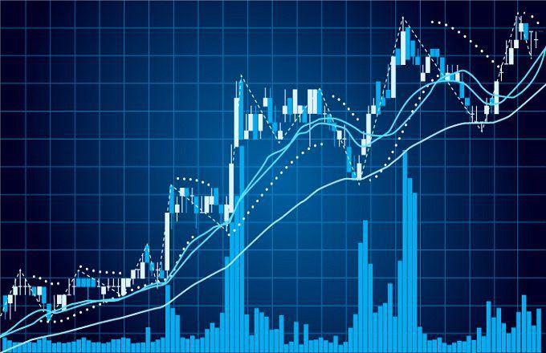

In today's rapidly evolving financial markets, the ability to interpret stock charts and apply comprehensive financial analysis techniques is essential for both traders and investors. Analyzing these charts involves understanding patterns that represent price movements over time, providing insights into market trends and helping individuals make informed decisions. 

Algorithmic trading, a technology-driven approach to trading, has introduced a novel aspect to market data analysis. By employing sophisticated algorithms, traders can process large volumes of data and execute trades with speed and precision that far surpass human capabilities. This technology not only enhances efficiency but also offers opportunities to capitalize on market movements that may not be apparent through traditional trading methods.



Incorporating these methods, this article examines key strategies for analyzing stock charts and understanding financial data to improve trading outcomes. Through the integration of algorithmic trading, traders and investors can refine their market strategies and potentially enhance their financial success. The continuous advancement in trading technologies highlights the importance of staying abreast of new developments to maintain a competitive edge in the financial markets.

## Table of Contents

## Understanding Stock Charts

Stock charts are essential tools in the financial markets, providing visual representations of market data that are indispensable for traders and investors in making informed decisions. These charts translate complex data into accessible visuals, thereby facilitating the assessment of price movements and trends over various time frames. There are several types of stock charts, each offering unique insights that can be leveraged to meet specific analysis goals.

Line charts are perhaps the simplest form of stock charts, providing a straightforward depiction of a security's price over time. They plot a single closing price at each point in time, creating an easy-to-understand trend line that can quickly convey an asset's historical performance.

Bar charts are more complex, showcasing additional information for each time interval, including the opening, closing, high, and low prices. Each bar consists of a vertical line with two smaller horizontal lines on either side representing the opening and closing prices, facilitating a more detailed examination of market behavior.

Candlestick charts, originally developed by Japanese rice traders in the 18th century, are now widely used in the analysis of financial markets. They offer even more granularity by representing four key data points: the open, high, low, and close prices for a specific period. The body of the candlestick captures the difference between the opening and closing prices, with different colors indicating whether the period ended bullish (closing higher than opening) or bearish (closing lower than opening). The lines, or wicks, extending from the body illustrate the high and low prices, providing a comprehensive view of price action.

Selecting the appropriate chart type is a fundamental step in technical analysis and varies based on the specific analysis objectives. For instance, line charts might be sufficient for identifying long-term trends, while candlestick charts might be more suitable for traders seeking to identify potential reversal patterns or entry points. The choice of chart type depends also on the complexity of the information needed by the analyst; more intricate chart types, like the candlestick chart, may illuminate patterns and market sentiment that simpler charts might obscure.

In conclusion, understanding the various stock chart types and selecting the appropriate one for the given analysis goal is crucial. Each chart type has its advantages, tailored to specific analysis contexts and user preferences, playing a pivotal role in the strategic approach to market observation and decision-making.

## Essential Financial Analysis Techniques

Financial analysis of stocks and market trends is a multi-faceted discipline essential for investors seeking to make informed decisions. This section explores three key techniques: Fundamental Analysis, Technical Analysis, and Quantitative Analysis—each offering unique insights into market conditions and financial health.

**Fundamental Analysis**

Fundamental Analysis assesses a company's intrinsic value by examining related economic, financial, and other qualitative and quantitative factors. This method involves analyzing financial statements, such as balance sheets, income statements, and cash flow statements, to evaluate a company's performance and potential. Key metrics include earnings per share (EPS), price-to-earnings (P/E) ratio, return on equity (ROE), and dividend yield. Macro-economic indicators, industry conditions, and management quality are also examined to forecast future performance. By understanding a company's fundamentals, investors can determine whether a stock is over or undervalued relative to its market price.

**Technical Analysis**

Technical Analysis focuses on statistical trends derived from historical market activity, such as price movement and [volume](/wiki/volume-trading-strategy). This technique uses stock charts and technical indicators to identify patterns and predict future market behavior. Common tools include moving averages, relative strength index (RSI), and Bollinger Bands, which help traders identify trends, [momentum](/wiki/momentum), and potential reversals. Technical Analysis rests on the belief that past trading activity and price changes are reliable indicators of future price movements, enabling investors to make informed buying and selling decisions based on observed patterns.

**Quantitative Analysis**

Quantitative Analysis employs mathematical models and statistical techniques to analyze financial metrics and predict market behavior. This method involves the use of complex algorithms and data sets to derive trading strategies and assess risk. Quantitative analysts, or "quants," utilize programming languages such as Python or R to process large data sets, backtest trading models, and optimize investment portfolios. For instance, they might use Monte Carlo simulations to model the probability of different outcomes in uncertain scenarios or employ linear regression to understand the relationships between different market variables. By leveraging data and statistical models, Quantitative Analysis provides a scientific approach to market predictions and investment strategies.

Each of these financial analysis techniques offers distinct insights that aid in understanding and navigating the complex dynamics of financial markets. Investors and traders often utilize a combination of these methods to develop a comprehensive view of market conditions and make well-informed investment decisions.

## Algorithmic Trading: Revolutionizing Market Analysis

Algorithmic trading leverages computer programs to automate the process of buying and selling securities based on a predefined set of rules. This method of trading has revolutionized market analysis by facilitating rapid decision-making, minimizing human error, and enabling the execution of complex strategies across various market conditions.

One of the primary advantages of [algorithmic trading](/wiki/algorithmic-trading) is its speed. Algorithms can process vast amounts of data and execute trades in fractions of a second, far quicker than any human trader could accomplish. For instance, high-frequency trading ([HFT](/wiki/high-frequency-trading-strategies)) employs algorithms to capitalize on minute market discrepancies that occur over very short timeframes, often executing thousands of trades in microseconds.

Another benefit is accuracy. By adhering strictly to predefined rules, algorithms eliminate the potential pitfalls of human emotion and indecisiveness. This precision ensures consistent application of trading strategies, leading to more reliable outcomes. Additionally, algorithmic trading enhances the ability to manage complex datasets. Modern financial markets produce an enormous volume of data, encompassing various asset types and geographic locations. Algorithms can efficiently parse this data, identify patterns, and adjust strategies accordingly.

Developing and implementing trading algorithms require a thorough understanding of both financial markets and programming. Traders typically use languages such as Python, C++, or Java to write programs that execute specific strategies. For instance, a basic mean-reversion strategy can be implemented in Python as follows:

```python
import numpy as np

def mean_reversion_strategy(prices, window=20):
    moving_average = np.mean(prices[-window:])
    if prices[-1] < moving_average:
        return "Buy"
    elif prices[-1] > moving_average:
        return "Sell"
    else:
        return "Hold"

prices = [100, 102, 101, 105, 106, 107, 104]  # example price data
action = mean_reversion_strategy(prices)
print(action)
```

The implementation of such algorithms allows traders to backtest strategies against historical data to evaluate their effectiveness before risking capital. This process entails running simulations to determine how a strategy would have performed in past market conditions, and adjusting parameters to optimize performance.

As the financial markets continue to evolve, the integration of [artificial intelligence](/wiki/ai-artificial-intelligence) and [machine learning](/wiki/machine-learning) into algorithmic trading systems is expected to further enhance their capabilities. These technologies can analyze complex patterns and nonlinear relationships within the data, offering predictive insights that traditional models may overlook.

Algorithmic trading fundamentally changes the landscape of market analysis by enhancing trading efficiency and efficacy. As traders and institutions continue to adopt increasingly sophisticated algorithms, a deep knowledge of both market mechanics and technological tools will be crucial for success in this field.

## Technical Indicators for Stock Charts

Technical indicators are essential tools for traders and investors analyzing stock charts. They help in interpreting market trends, identifying momentum shifts, and predicting potential price reversals. Among the most prominent technical indicators are Moving Averages, the Moving Average Convergence Divergence (MACD), the Relative Strength Index (RSI), and Bollinger Bands.

### Moving Averages

Moving Averages smooth price data by creating a constantly updated average price. They are primarily used to identify trend direction and to determine levels of support and resistance. The two most common types are the Simple Moving Average (SMA) and the Exponential Moving Average (EMA).

- **Simple Moving Average (SMA)** is calculated by taking the arithmetic mean of a given set of prices over a specific number of periods. The formula is given by:
$$
  \text{SMA} = \frac{P_1 + P_2 + \cdots + P_n}{n}

$$

  where $P_1, P_2, \ldots, P_n$ are the prices in each period and $n$ is the number of periods.

- **Exponential Moving Average (EMA)** gives more weight to recent prices, therefore reacting more quickly to price changes than the SMA. The formula is:
$$
  \text{EMA}_t = \text{EMA}_{t-1} + \alpha (P_t - \text{EMA}_{t-1})

$$

  where $\alpha = \frac{2}{n+1}$.

### Moving Average Convergence Divergence (MACD)

MACD is a momentum oscillator that follows trends and calculates the difference between a 26-period EMA and a 12-period EMA. The result of this calculation is the MACD line. A nine-day EMA of the MACD is called the "signal line," which is plotted on top of the MACD line to indicate buy or sell signals.

### Relative Strength Index (RSI)

RSI is a momentum oscillator that measures the speed and change of price movements. It oscillates between 0 and 100 and is typically used to identify overbought or oversold conditions. An RSI above 70 is considered overbought, while an RSI below 30 is considered oversold. The formula used is:

$$
\text{RSI} = 100 - \left( \frac{100}{1 + \frac{\text{Average Gain}}{\text{Average Loss}}} \right)
$$

### Bollinger Bands

Developed by John Bollinger, Bollinger Bands consist of a Middle Band (SMA), an Upper Band, and a Lower Band. The Upper Band is calculated by: 

$$
\text{Upper Band} = \text{SMA} + (k \times \text{standard deviation})
$$

and the Lower Band is:

$$
\text{Lower Band} = \text{SMA} - (k \times \text{standard deviation})
$$

where $k$ is a constant typically set to 2. Bollinger Bands help determine if stock prices are high or low on a relative basis.

### Combining Indicators

Employing a combination of these indicators can offer more robust trading signals. For instance, combining the MACD and RSI with Moving Averages can provide clearer insights into market trends and potential price reversals, allowing traders to make more informed decisions. By using multiple indicators, investors can cross-verify signals, thus increasing the reliability of technical analysis.

## Best Practices for Chart Analysis

Customizing the features of stock charts is a critical practice that aids in enhancing the clarity of analysis and easing interpretation. Users can adjust chart colors to highlight significant data points, making it easier to differentiate between various market signals. For example, using contrasting colors for bullish and bearish trends can help quickly identify market directions. The layout customization allows analysts to prioritize the display of specific datasets or indicators, aligning with their analytical goals.

Utilizing multiple monitors and organized workspaces is another essential practice for effective chart analysis. This setup allows traders and analysts to view multiple charts and data streams simultaneously, enabling real-time comparison and comprehensive market tracking. Having an organized workspace reduces cognitive overload and enhances focus, which is crucial when making time-sensitive trading decisions.

Incorporating trendlines, support, and resistance levels are foundational elements in chart analysis. Trendlines are drawn to connect price points and indicate the general direction of price movements, acting as visual guides for understanding market trends. Support and resistance levels are horizontal lines that indicate historical price points where the security's price tends to reverse direction. They are essential for identifying potential entry and [exit](/wiki/exit-strategy) points. Trendlines can be added programmatically using Python libraries like Matplotlib:

```python
import matplotlib.pyplot as plt
import numpy as np

# Sample data
dates = np.arange(10)
prices = np.array([10, 12, 11, 13, 15, 14, 16, 18, 17, 19])

# Plotting the price data
plt.plot(dates, prices, label='Price')

# Drawing a trendline
z = np.polyfit(dates, prices, 1)
p = np.poly1d(z)
plt.plot(dates, p(dates), linestyle='--', label='Trendline')

# Adding support and resistance lines
plt.axhline(y=12, color='r', linestyle='-', label='Support Level')
plt.axhline(y=18, color='g', linestyle='-', label='Resistance Level')

# Customizing chart
plt.title('Stock Price Analysis')
plt.xlabel('Time')
plt.ylabel('Price')
plt.legend()
plt.show()
```

Implementing these best practices offers a strategic enhancement to chart analysis capabilities, ultimately leading to more informed trading decisions. By combining these techniques, traders can construct a comprehensive analytical framework that maximizes their ability to interpret the market with precision and speed.

## Conclusion

In the ever-evolving landscape of financial markets, the ability to efficiently analyze stock charts and implement comprehensive financial analysis techniques is crucial for gaining insights into market dynamics. The integration of algorithmic trading has significantly transformed the approach to market analysis, providing an advantage through speed and precision. As algorithmic strategies become more sophisticated, mastering the associated tools proves essential in gaining a competitive edge. Understanding the intricacies of algorithmic trading, which encompasses data-driven decision-making and the execution of trades through predefined criteria, enhances a trader's or investor's capability to respond swiftly to market fluctuations.

Continuous education and adaptability to emerging technologies and methodologies are paramount for sustaining success in financial markets. The rapid pace of technological advancements necessitates ongoing learning, particularly in areas such as machine learning and data analysis, which are increasingly influential in shaping market strategies. Therefore, embracing a mindset of innovation and responsiveness to new developments is pivotal for long-term achievement in trading and investing.

In summary, attaining proficiency in stock chart analysis alongside financial analysis techniques equips traders and investors with the necessary tools to interpret market signals effectively. Coupled with a commitment to continuous growth and adaptation to technological progress, these skills serve as the foundation for navigating the complexities of modern financial markets successfully.

## References & Further Reading

[1]: Bergstra, J., Bardenet, R., Bengio, Y., & Kégl, B. (2011). ["Algorithms for Hyper-Parameter Optimization."](https://papers.nips.cc/paper/4443-algorithms-for-hyper-parameter-optimization) Advances in Neural Information Processing Systems 24.

[2]: ["Advances in Financial Machine Learning"](https://www.amazon.com/Advances-Financial-Machine-Learning-Marcos/dp/1119482089) by Marcos Lopez de Prado

[3]: ["Evidence-Based Technical Analysis: Applying the Scientific Method and Statistical Inference to Trading Signals"](https://www.amazon.com/Evidence-Based-Technical-Analysis-Scientific-Statistical/dp/0470008741) by David Aronson

[4]: ["Machine Learning for Algorithmic Trading"](https://github.com/stefan-jansen/machine-learning-for-trading) by Stefan Jansen

[5]: ["Quantitative Trading: How to Build Your Own Algorithmic Trading Business"](https://www.amazon.com/Quantitative-Trading-Build-Algorithmic-Business/dp/1119800064) by Ernest P. Chan