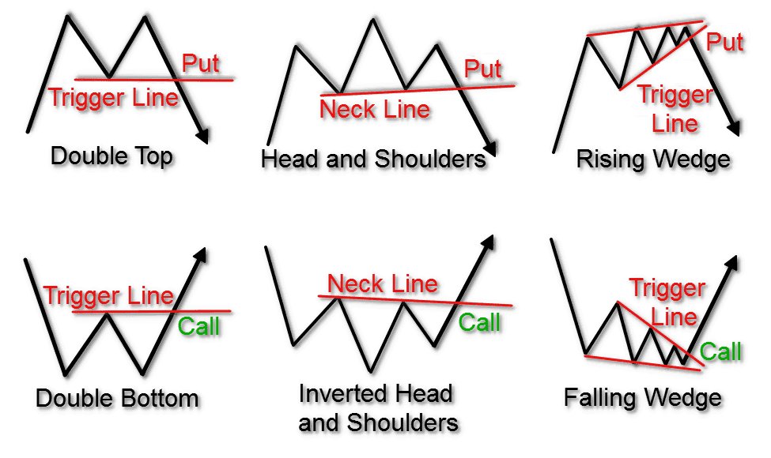

## Table of Contents

## What are the basic elements of a stock chart?

A stock chart is a visual tool that helps people see how a stock's price changes over time. The main part of the chart is the price line or bar, which shows the stock's price at different times. The horizontal axis, or x-axis, represents time, like days, weeks, or months. The vertical axis, or y-axis, shows the price of the stock. You might also see volume, which is how many shares were traded, shown as a bar at the bottom of the chart.

There are different types of stock charts, but the most common ones are line charts, bar charts, and candlestick charts. A line chart connects the closing prices of the stock with a line, making it easy to see the overall trend. A bar chart uses vertical bars to show the high, low, open, and close prices for each period. A candlestick chart is similar to a bar chart but uses a wider body to show the difference between the open and close prices, making it easier to see if the stock went up or down in that period.

These charts can also include other helpful information like moving averages, which smooth out price changes over time to show trends more clearly, and indicators like the Relative Strength Index (RSI) that help predict future price movements. By looking at all these elements together, investors can make better decisions about buying or selling stocks.

## How can beginners identify trends on a stock chart?

Beginners can start identifying trends on a stock chart by looking at the overall direction of the price line or the pattern of the bars or candlesticks. If the line or the tops of the bars are going up over time, it's an uptrend, which means the stock's price is increasing. If the line or the bottoms of the bars are going down, it's a downtrend, meaning the price is decreasing. A sideways trend happens when the price moves up and down but stays around the same level, showing that the stock's price isn't changing much.

To make it easier to spot these trends, beginners can use a tool called a moving average. A moving average is a line that shows the average price of the stock over a certain number of days, like 50 or 200 days. If the price line is above the moving average, it can confirm an uptrend. If it's below, it can confirm a downtrend. Watching how the price line interacts with the moving average can help beginners see the trend more clearly and make better decisions about when to buy or sell a stock.

## What are moving averages and how do they help in chart analysis?

Moving averages are tools used on stock charts to help smooth out the ups and downs of a stock's price. They do this by taking the average price of a stock over a certain number of days. For example, a 50-day moving average calculates the average price of the stock over the last 50 days. This average is then plotted on the chart as a line, which makes it easier to see the overall trend of the stock's price without getting distracted by small, day-to-day changes.

In chart analysis, moving averages help in several ways. First, they can confirm trends. If the price of a stock is above its moving average, it suggests an uptrend, meaning the stock's price is generally going up. If the price is below the moving average, it suggests a downtrend, meaning the price is going down. Second, moving averages can act as support or resistance levels. When the price of a stock gets close to the moving average, it might bounce off it, helping traders decide when to buy or sell. By using moving averages, beginners can better understand the direction of a stock's price and make more informed decisions.

## How can volume be used to confirm trends in stock charts?

Volume is the number of shares traded in a stock on a given day. It's shown at the bottom of a stock chart as a bar. When you look at [volume](/wiki/volume-trading-strategy), you can see if more people are buying or selling the stock. If the volume is high when the stock price is going up, it means a lot of people are buying, which can confirm that the uptrend is strong. On the other hand, if the volume is high when the stock price is going down, it means a lot of people are selling, which can confirm that the downtrend is strong.

Volume can also help you spot when a trend might be changing. If the stock price is going up but the volume is low, it might mean that not many people are interested in buying, and the uptrend could be weak. Similarly, if the stock price is going down but the volume is low, it might mean that not many people are selling, and the downtrend could be weak. By looking at volume along with the price, you can get a better idea of how strong a trend is and whether it might continue or change direction.

## What are support and resistance levels and how do they affect trading decisions?

Support and resistance levels are like invisible lines on a stock chart that show where the price of a stock might stop going down or up. Support is the price level where a stock often stops falling and starts to go back up. It's like a floor that the price bounces off of. Resistance is the opposite; it's the price level where a stock often stops rising and starts to go back down. It's like a ceiling that the price hits and can't go through easily.

These levels are important for trading because they help traders decide when to buy or sell a stock. If a stock's price gets close to the support level, a trader might see it as a good time to buy because they think the price will bounce back up. On the other hand, if the price gets close to the resistance level, a trader might see it as a good time to sell because they think the price will start to go down. By watching these levels, traders can make better decisions about when to enter or [exit](/wiki/exit-strategy) a trade.

## How can candlestick patterns improve stock chart analysis?

Candlestick patterns make it easier to understand what's happening with a stock's price. Each candlestick on a chart shows the open, high, low, and close prices for a certain time, like a day. The body of the candlestick is the part between the open and close prices. If the close is higher than the open, the body is usually white or green, showing the price went up. If the close is lower than the open, the body is usually black or red, showing the price went down. The lines above and below the body, called wicks or shadows, show the highest and lowest prices during that time.

By looking at these patterns, you can see if buyers or sellers are in control. For example, a "bullish engulfing" pattern happens when a small red candlestick is followed by a larger green one that covers it completely. This can mean that buyers are taking over and the price might go up. On the other hand, a "bearish engulfing" pattern is when a small green candlestick is followed by a larger red one, suggesting sellers are in control and the price might go down. By recognizing these patterns, you can make better guesses about where the stock's price might go next and make smarter trading decisions.

## What are the key technical indicators beginners should start with?

For beginners, a good place to start with technical indicators is the Moving Average. A moving average smooths out the price of a stock over a certain number of days, like 50 or 200 days. It helps you see the overall trend of the stock's price without getting confused by small ups and downs. When the price of the stock is above the moving average, it suggests that the stock is in an uptrend, which means it's going up. When the price is below the moving average, it suggests a downtrend, meaning the stock's price is going down. By watching where the price is compared to the moving average, beginners can get a better idea of the stock's direction.

Another helpful indicator for beginners is the Relative Strength Index (RSI). The RSI measures how fast and how much a stock's price is changing. It gives you a number between 0 and 100. If the RSI is over 70, it might mean the stock is overbought, which means it could be a good time to sell because the price might go down soon. If the RSI is below 30, it might mean the stock is oversold, which could be a good time to buy because the price might go up soon. By using the RSI, beginners can see if a stock might be ready for a price change and make better decisions about when to buy or sell.

## How do advanced traders use Fibonacci retracement levels in chart analysis?

Advanced traders use Fibonacci retracement levels to find possible support and resistance levels on a stock chart. These levels are based on the Fibonacci sequence, a set of numbers where each number is the sum of the two before it. Traders draw lines on the chart between the highest and lowest points of a stock's price movement. These lines show where the price might pause or reverse, based on certain percentages like 23.6%, 38.2%, 50%, 61.8%, and 78.6%. If the stock's price hits one of these levels, it might bounce back up or start going down, helping traders decide when to buy or sell.

By watching these Fibonacci levels, advanced traders can make better guesses about where the stock's price might go next. For example, if a stock's price goes up and then starts to fall, traders might look at the Fibonacci levels to see where the price might stop falling and start going up again. If the price hits the 61.8% level and then starts to go up, that could be a good time to buy. Traders also use these levels along with other tools like moving averages and RSI to get a fuller picture of what's happening with the stock's price.

## What role do Bollinger Bands play in analyzing stock volatility?

Bollinger Bands help traders see how much a stock's price is moving around. They are made up of three lines on a chart: a middle line, which is a moving average of the stock's price, and two outer lines that show how far the price usually moves away from the middle line. These outer lines are called the upper and lower bands. When the stock's price is moving a lot, the bands get wider, showing more [volatility](/wiki/volatility-trading-strategies). When the price isn't moving much, the bands get closer together, showing less volatility.

Traders use Bollinger Bands to make decisions about buying and selling stocks. If the price touches the upper band, it might mean the stock is getting too expensive and could start to go down soon. This could be a good time to sell. On the other hand, if the price touches the lower band, it might mean the stock is getting too cheap and could start to go up soon. This could be a good time to buy. By watching how the price moves in relation to the Bollinger Bands, traders can get a better idea of when to make their moves.

## How can traders use the Relative Strength Index (RSI) to identify overbought or oversold conditions?

The Relative Strength Index (RSI) is a tool that helps traders see if a stock's price is moving too fast or too slow. It gives a number between 0 and 100. When the RSI number goes over 70, it means the stock might be overbought. This means a lot of people have bought the stock, and the price might be too high. It could be a good time to sell because the price might start to go down soon. On the other hand, when the RSI number goes below 30, it means the stock might be oversold. This means a lot of people have sold the stock, and the price might be too low. It could be a good time to buy because the price might start to go up soon.

Traders use the RSI to make better guesses about when to buy or sell a stock. If the RSI is over 70 and the stock's price starts to go down, it can confirm that the stock is overbought and might keep going down. If the RSI is below 30 and the stock's price starts to go up, it can confirm that the stock is oversold and might keep going up. By watching the RSI along with the stock's price, traders can get a better idea of when to make their moves.

## What are the benefits and limitations of using automated chart analysis tools?

Automated chart analysis tools can help traders a lot. They can look at a lot of data very fast and find patterns that might be hard for people to see. These tools can use things like moving averages, RSI, and Bollinger Bands to make guesses about where a stock's price might go next. They can also work all the time, even when you're not watching, and they don't get tired or make mistakes like people can. This can save traders time and help them make better decisions about when to buy or sell a stock.

But, these tools also have some problems. They can't think for themselves like people can, so they might miss important things that don't show up in the data. Sometimes, they can give wrong signals because the market can be unpredictable. Also, if a lot of traders use the same tools, they might all make the same moves at the same time, which can make the market move in ways that the tools don't expect. So, while automated tools can be very helpful, traders should still use their own thinking and not rely on them too much.

## How can expert traders integrate multiple technical analysis techniques to enhance their stock chart analysis?

Expert traders often use more than one technical analysis technique to get a better understanding of a stock's price movement. They might start by looking at moving averages to see the overall trend of the stock. If the price is above the moving average, it suggests an uptrend, and if it's below, it suggests a downtrend. Then, they might use the Relative Strength Index (RSI) to see if the stock is overbought or oversold. If the RSI is over 70, it might be a good time to sell because the price could go down soon. If it's below 30, it might be a good time to buy because the price could go up soon. By combining these tools, traders can confirm trends and make better guesses about where the price might go next.

Another way expert traders enhance their analysis is by using Bollinger Bands to understand the stock's volatility. If the bands are wide, it means the stock's price is moving a lot, and if they're narrow, it means the price isn't moving much. They might also use Fibonacci retracement levels to find possible support and resistance points. If the price hits one of these levels and starts to go the other way, it could be a good time to buy or sell. By looking at all these things together, traders can get a fuller picture of what's happening with the stock's price and make smarter trading decisions.

## What are Technical Indicators for Stock Charts?

Technical indicators are essential tools for traders and investors analyzing stock charts. They help in interpreting market trends, identifying [momentum](/wiki/momentum) shifts, and predicting potential price reversals. Among the most prominent technical indicators are Moving Averages, the Moving Average Convergence Divergence (MACD), the Relative Strength Index (RSI), and Bollinger Bands.

### Moving Averages

Moving Averages smooth price data by creating a constantly updated average price. They are primarily used to identify trend direction and to determine levels of support and resistance. The two most common types are the Simple Moving Average (SMA) and the Exponential Moving Average (EMA).

- **Simple Moving Average (SMA)** is calculated by taking the arithmetic mean of a given set of prices over a specific number of periods. The formula is given by:
$$
  \text{SMA} = \frac{P_1 + P_2 + \cdots + P_n}{n}

$$

  where $P_1, P_2, \ldots, P_n$ are the prices in each period and $n$ is the number of periods.

- **Exponential Moving Average (EMA)** gives more weight to recent prices, therefore reacting more quickly to price changes than the SMA. The formula is:
$$
  \text{EMA}_t = \text{EMA}_{t-1} + \alpha (P_t - \text{EMA}_{t-1})

$$

  where $\alpha = \frac{2}{n+1}$.

### Moving Average Convergence Divergence (MACD)

MACD is a momentum oscillator that follows trends and calculates the difference between a 26-period EMA and a 12-period EMA. The result of this calculation is the MACD line. A nine-day EMA of the MACD is called the "signal line," which is plotted on top of the MACD line to indicate buy or sell signals.

### Relative Strength Index (RSI)

RSI is a momentum oscillator that measures the speed and change of price movements. It oscillates between 0 and 100 and is typically used to identify overbought or oversold conditions. An RSI above 70 is considered overbought, while an RSI below 30 is considered oversold. The formula used is:

$$
\text{RSI} = 100 - \left( \frac{100}{1 + \frac{\text{Average Gain}}{\text{Average Loss}}} \right)
$$

### Bollinger Bands

Developed by John Bollinger, Bollinger Bands consist of a Middle Band (SMA), an Upper Band, and a Lower Band. The Upper Band is calculated by: 

$$
\text{Upper Band} = \text{SMA} + (k \times \text{standard deviation})
$$

and the Lower Band is:

$$
\text{Lower Band} = \text{SMA} - (k \times \text{standard deviation})
$$

where $k$ is a constant typically set to 2. Bollinger Bands help determine if stock prices are high or low on a relative basis.

### Combining Indicators

Employing a combination of these indicators can offer more robust trading signals. For instance, combining the MACD and RSI with Moving Averages can provide clearer insights into market trends and potential price reversals, allowing traders to make more informed decisions. By using multiple indicators, investors can cross-verify signals, thus increasing the reliability of technical analysis.

## References & Further Reading

[1]: Bergstra, J., Bardenet, R., Bengio, Y., & Kégl, B. (2011). ["Algorithms for Hyper-Parameter Optimization."](https://papers.nips.cc/paper/4443-algorithms-for-hyper-parameter-optimization) Advances in Neural Information Processing Systems 24.

[2]: ["Advances in Financial Machine Learning"](https://www.amazon.com/Advances-Financial-Machine-Learning-Marcos/dp/1119482089) by Marcos Lopez de Prado

[3]: ["Evidence-Based Technical Analysis: Applying the Scientific Method and Statistical Inference to Trading Signals"](https://www.amazon.com/Evidence-Based-Technical-Analysis-Scientific-Statistical/dp/0470008741) by David Aronson

[4]: ["Machine Learning for Algorithmic Trading"](https://github.com/stefan-jansen/machine-learning-for-trading) by Stefan Jansen

[5]: ["Quantitative Trading: How to Build Your Own Algorithmic Trading Business"](https://www.amazon.com/Quantitative-Trading-Build-Algorithmic-Business/dp/1119800064) by Ernest P. Chan