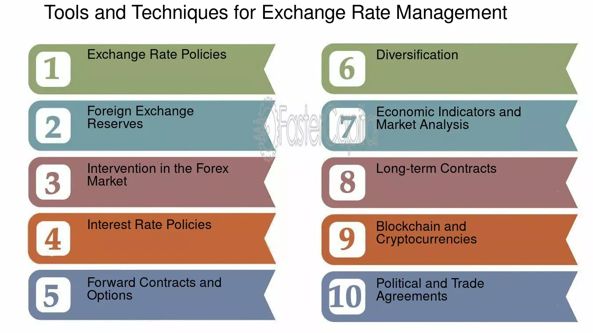

## Table of Contents

## What is an exchange rate and why is it important?

An exchange rate is the price of one country's money in terms of another country's money. For example, if you want to buy something from another country, you need to exchange your money for their money. The exchange rate tells you how much of your money you need to give to get one unit of their money.

Exchange rates are important because they affect how much things cost when you buy from other countries. If the exchange rate changes, it can make things cheaper or more expensive. This can affect businesses that sell things in different countries and people who travel or buy things from other countries. Understanding exchange rates helps people and businesses make better decisions about buying and selling things around the world.

## What are the basic risks associated with exchange rate fluctuations?

Exchange rate fluctuations can create risks for businesses and individuals. One main risk is that the value of money can change. If you have money in another country's currency and that currency loses value, your money will be worth less when you change it back to your own currency. This can happen quickly and without warning, which can be a problem for people and companies that do business in different countries.

Another risk is that the cost of goods and services can change. If a company buys materials from another country and the exchange rate changes, the cost of those materials can go up or down. This can affect how much it costs to make things and can change the prices that companies charge for their products. For people, if they are planning a trip to another country, a change in the exchange rate can make the trip more expensive or cheaper.

These risks can make it harder for businesses to plan and for people to manage their money. To deal with these risks, some people and companies use financial tools like forward contracts to lock in exchange rates ahead of time. But even with these tools, exchange rate fluctuations can still be unpredictable and challenging.

## How can individuals protect themselves from exchange rate risks?

Individuals can protect themselves from exchange rate risks by planning ahead. If you know you will need to use another country's money in the future, you can buy that currency now and keep it until you need it. This way, if the exchange rate changes and the other currency becomes more expensive, you will already have it at the old, cheaper rate. Another way is to use a forward contract, which is a deal with a bank to exchange money at a set rate in the future. This can help you know exactly how much money you will get, even if the exchange rate changes.

Another strategy is to spread out your money across different currencies. This is called diversification. If one currency loses value, you won't lose all your money because you have some in other currencies that might be doing better. Also, you can use credit or debit cards that don't charge extra fees for using them in other countries. These cards often use the exchange rate at the time of the transaction, which can be better than the rate you get at a bank or money changer. By using these methods, individuals can better manage the risks that come with exchange rate fluctuations.

## What are the common financial instruments used to hedge against exchange rate changes?

One common financial instrument used to hedge against exchange rate changes is a forward contract. A forward contract is an agreement between you and a bank to exchange money at a set rate in the future. This means you can lock in today's exchange rate for a transaction that will happen later. This can be helpful if you know you will need to pay for something in another currency, like a trip or buying goods from another country. By using a forward contract, you can avoid the risk of the exchange rate changing and making your costs go up.

Another tool is an option contract. An option contract gives you the right, but not the obligation, to exchange money at a set rate in the future. This can be useful if you want to protect yourself from a bad exchange rate but still want the chance to use a better rate if it comes along. You pay a fee for this option, but it can give you more flexibility than a forward contract. Both forward and option contracts can help you manage the risk of exchange rate changes and plan your finances more confidently.

A third instrument is a currency swap. A currency swap involves exchanging one currency for another at the start and then swapping back at the end of the agreement. This can be useful for businesses that need to manage cash flows in different currencies over time. By using a currency swap, a company can protect itself from exchange rate fluctuations and ensure that it has the right amount of money in the right currency when it needs it. These instruments help individuals and businesses reduce the uncertainty that comes with changing exchange rates.

## How do forward contracts work in securing an exchange rate?

A forward contract is like a promise between you and a bank. You agree to exchange money at a certain rate in the future. Let's say you need to buy something from another country in six months. You can use a forward contract to lock in today's exchange rate for that future purchase. This means no matter what happens to the exchange rate in the next six months, you will still get the rate you agreed on with the bank. This can be really helpful if you're worried that the exchange rate might get worse and make your purchase more expensive.

To set up a forward contract, you talk to a bank and tell them how much money you need to exchange and when you need it. The bank will then give you a rate based on what they think the exchange rate will be in the future. Once you agree on the rate, you sign the contract. When the time comes, you give the bank your money, and they give you the other currency at the rate you locked in. This way, you don't have to worry about the exchange rate changing and can plan your finances better.

## What are the advantages and disadvantages of using options for exchange rate security?

Options give you the right, but not the obligation, to exchange money at a set rate in the future. This means you can protect yourself from a bad exchange rate but still take advantage of a better rate if it comes along. You pay a fee for this option, which is like an insurance policy. If the exchange rate gets worse, you can use your option and exchange money at the better rate you locked in. But if the rate gets better, you can just let the option expire and use the new, better rate. This flexibility can be really helpful if you're not sure what the exchange rate will do.

However, options also have some downsides. The main one is the cost. You have to pay a fee for the option, and if you don't end up using it, you lose that money. This can be a waste if the exchange rate stays the same or gets better. Also, options can be a bit more complicated to understand and use than forward contracts. You need to know when to buy them and when to let them expire. If you make the wrong choice, you might not get the protection you need or you might pay more than you should. So, while options can give you more choices, they also come with more risks and costs.

## How can currency swaps be utilized to manage exchange rate exposure?

Currency swaps are a way for businesses to manage their exchange rate exposure over time. Imagine a company that needs to pay for things in another country's money every month. They can use a currency swap to exchange their money for the other currency at the start, and then swap it back at the end. This helps them know exactly how much money they will have in the other currency, even if the exchange rate changes. By doing this, the company can plan its finances better and avoid surprises from sudden changes in the exchange rate.

Using a currency swap can be really helpful for businesses that do a lot of trading in different countries. It's like locking in the exchange rate for a long time, which can make it easier to budget and plan. But, setting up a currency swap can be a bit complicated and might need help from a bank or a financial expert. Still, for companies that need to manage money in different currencies, currency swaps can be a good way to reduce the risk of exchange rate changes and keep their finances stable.

## What role do central banks play in stabilizing exchange rates?

Central banks help keep exchange rates stable by doing things like buying and selling their own country's money. If their money is getting too weak, they might sell other currencies and buy their own to make it stronger. If their money is getting too strong, they might do the opposite. This can help keep the exchange rate from changing too much and too fast, which is good for businesses and people who need to use money from other countries.

Another way central banks help is by setting interest rates. If they make interest rates higher, it can make their money more attractive to people from other countries, which can make their money stronger. If they make interest rates lower, it can have the opposite effect. By changing interest rates, central banks can influence how much people want their money, which can help keep the exchange rate stable. This is important because big changes in exchange rates can cause problems for the economy.

## How do multinational corporations implement exchange rate risk management strategies?

Multinational corporations use different ways to manage the risks that come from changing exchange rates. One way is by using forward contracts. This means they agree with a bank to exchange money at a set rate in the future. This helps them know exactly how much money they will get or need to pay, even if the exchange rate changes. Another way is by using options. Options give them the right, but not the obligation, to exchange money at a set rate. This can be helpful if they want to protect themselves from a bad exchange rate but still want the chance to use a better rate if it comes along.

Another strategy is called currency swaps. This is when a company exchanges one currency for another at the start and then swaps back at the end of the agreement. This can help them manage cash flows in different currencies over time. Multinational corporations also try to spread out their money across different currencies, which is called diversification. If one currency loses value, they won't lose all their money because they have some in other currencies that might be doing better. By using these strategies, multinational corporations can better manage the risks that come with exchange rate fluctuations and keep their finances stable.

## What are the advanced techniques used by financial institutions to secure exchange rates?

Financial institutions use advanced techniques like currency hedging to secure exchange rates. One common method is using currency futures. These are like forward contracts but are traded on an exchange. This means they can be bought and sold easily, and their prices are set by the market. Financial institutions can use currency futures to lock in an exchange rate for a future date, which helps them manage the risk of the exchange rate changing. Another technique is using currency options, which give them the right, but not the obligation, to exchange money at a set rate. This can be useful if they want to protect themselves from a bad exchange rate but still want the chance to use a better rate if it comes along.

Another advanced technique is using currency swaps. This is when two parties agree to exchange one currency for another at the start and then swap back at the end of the agreement. This can help financial institutions manage cash flows in different currencies over time. They can also use [algorithmic trading](/wiki/algorithmic-trading), which uses computer programs to buy and sell currencies based on certain rules. This can help them take advantage of small changes in exchange rates quickly. By using these advanced techniques, financial institutions can better manage the risks that come with exchange rate fluctuations and keep their finances stable.

## How do macroeconomic indicators influence exchange rate security strategies?

Macroeconomic indicators like inflation rates, interest rates, and economic growth can really affect how financial institutions and businesses plan their exchange rate security strategies. If a country's inflation rate goes up, its money might lose value compared to other countries' money. This can make people and businesses want to use other currencies instead. To protect themselves, they might use forward contracts or options to lock in a better exchange rate before it changes. Interest rates also play a big role. If a country raises its interest rates, its money can become more attractive to people from other countries, making it stronger. This can influence businesses to adjust their strategies to take advantage of the stronger currency.

Economic growth is another important indicator. If a country's economy is growing fast, its money might get stronger because more people want to invest there. This can make businesses think about using currency swaps or diversification to manage their money in different currencies. By keeping an eye on these indicators, financial institutions and businesses can make smarter choices about when to use different exchange rate security tools. Understanding how these indicators work helps them plan better and protect their money from sudden changes in exchange rates.

## What are the emerging trends and technologies in exchange rate risk management?

New trends and technologies are changing how people and businesses manage exchange rate risks. One big trend is the use of [artificial intelligence](/wiki/ai-artificial-intelligence) (AI) and [machine learning](/wiki/machine-learning). These technologies can look at a lot of data quickly and find patterns that humans might miss. They can help predict how exchange rates might change in the future. This can make it easier for businesses to decide when to use tools like forward contracts or options to protect their money. Another trend is the use of blockchain technology. Blockchain can make exchanging money faster and cheaper, which can help businesses manage their money in different currencies more easily.

Another emerging technology is the use of big data analytics. This means using a lot of information to understand what's happening with exchange rates. By looking at this data, businesses can see what might affect exchange rates and plan their strategies better. For example, they might use this information to decide when to buy or sell currencies. Also, more businesses are using automated trading systems. These systems use computer programs to buy and sell currencies based on certain rules. This can help them take advantage of small changes in exchange rates quickly. By using these new trends and technologies, businesses can manage exchange rate risks better and keep their finances stable.

## References & Further Reading

[1]: Bank for International Settlements. (2016). [Triennial Central Bank Survey: Foreign exchange turnover in April 2016.](https://www.bis.org/publ/rpfx16fx.pdf) Bank for International Settlements.

[2]: Cuthbertson, K., & Nitzsche, D. (2001). ["Derivatives: A Guide to Exchange Traded Derivatives"](https://www.semanticscholar.org/paper/Financial-Engineering%3A-Derivatives-and-Risk-Cuthbertson-Nitzsche/25f50b3d599c0266a2773388ead301282dbe5587) Wiley.

[3]: Hull, J. C. (2018). ["Options, Futures, and Other Derivatives"](https://www.semanticscholar.org/paper/Options%2C-Futures%2C-and-Other-Derivatives-Hull/89bdee500c8623864fc9eb7a471546aa713acc44) Pearson.

[4]: Lopez de Prado, M. (2018). ["Advances in Financial Machine Learning"](https://www.amazon.com/Advances-Financial-Machine-Learning-Marcos/dp/1119482089) Wiley.

[5]: Narang, R. K. (2013). ["Inside the Black Box: A Simple Guide to Quantitative and High-Frequency Trading"](https://onlinelibrary.wiley.com/doi/book/10.1002/9781118662717) Wiley.

[6]: Shadab, H. B. (2014). "Regulating Blockchain for a Better Future." [Journal of Internet Law](https://papers.ssrn.com/sol3/papers.cfm?abstract_id=2508707), 18(3).

[7]: World Economic Forum. (2020). ["Blockchain for Supply Chains: Unlocking the Potential of Blockchain Technology in Supply Chains"](https://www3.weforum.org/docs/WEF_C4IR_Case_Study_Blockchain_for_Supply_Chains_2020.pdf) World Economic Forum.