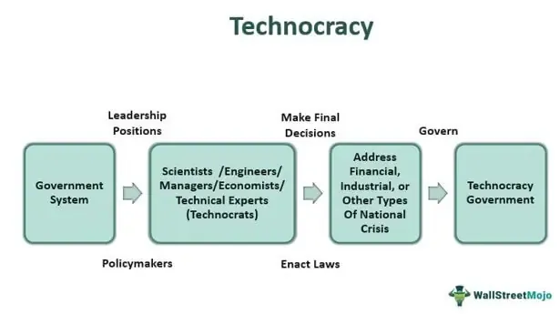

The rise of technocracy as a governance model has sparked considerable debate regarding its efficacy and implications. At the essence of technocracy is the belief in decision-making grounded in expertise and data-driven analysis, marking a significant departure from traditional democratic processes that emphasize popular consensus and political representation. This shift towards an expertise-focused governance system aims to enhance operational efficiency and ensure that policies are informed by solid scientific and technical insights.

In a parallel development, algorithmic trading has gained prominence as a formidable tool within the financial markets, leveraging advanced computational strategies to make rapid and data-informed trading decisions. Algorithmic trading, characterized by the use of sophisticated mathematical models and high-frequency transactions, aligns closely with the principles of technocracy by prioritizing data and quantitative metrics over human intuition and experience.



As technocracy in governance and algorithmic trading in the financial sector continue to evolve, their intersections and tensions become increasingly apparent. Both models advocate for a form of decision-making that relies heavily on objective data and specialized knowledge, yet they raise important discussions around transparency, accountability, and the role of human judgment. Through this article, we will explore these pathways and critically examine the potential benefits and pitfalls associated with technocracy. Our focus will particularly be on how these principles impact governance and economic decision-making, highlighting the challenges and opportunities they present.

## Table of Contents

## Understanding Technocracy and its Governance

Technocracy represents a governance model where decision-making is steered predominantly by individuals possessing specialized knowledge and expertise rather than those elected through traditionally democratic processes. This approach is grounded in the belief that experts, due to their technical proficiency and understanding, can guide policies more effectively than politicians who may lack such technical backgrounds. It advocates for a data-driven decision-making process, emphasizing the need for empirical evidence and analytical methods in crafting policies.

At the core of technocracy lies the selection of technocrats—professionals with profound expertise in specific fields. Their inclusion in governmental processes is intended to align policy outcomes with scientific and technical realities, thereby enhancing the efficacy and applicability of public policies. This model undeniably brings certain advantages, like streamlining processes and facilitating timely responses to nuanced and multifaceted issues, often visible during crisis situations such as pandemics or financial crises. For instance, in the early stages of the COVID-19 pandemic, countries that relied heavily on the advice of health experts and scientists were, in many cases, able to implement effective strategies that significantly mitigated the impact of the virus.

However, the technocratic model is not without its critics. A persistent critique revolves around its potential to marginalize public opinion and democratic values. By prioritizing technical expertise, technocracy may skew governance towards elitism, where decisions are made by a select few who might not necessarily represent the broader populace's needs and aspirations. This can lead to a disconnect between policies and the public, raising concerns about transparency and accountability. Furthermore, an over-reliance on data-driven approaches may risk neglecting qualitative aspects, such as ethical considerations and human welfare, which are inherently subjective and difficult to quantify yet crucial in holistic decision-making.

Technocracy's challenge, therefore, lies in maintaining a delicate balance between leveraging expert knowledge and preserving democratic ideals. Effective technocratic governance should incorporate mechanisms that allow for public engagement and deliberation, ensuring that policies remain equitable, inclusive, and reflective of diverse societal values. By integrating these elements, technocracies can potentially fulfill their promise of informed and innovative governance while safeguarding the foundational principles of democracy.

## Algorithmic Trading: A Technocratic Tool in Finance

Algorithmic trading involves the use of automated systems to execute trading orders with exceptional speed and frequency, leveraging advanced mathematical models and computational algorithms. This method of trading finds its foundations in technocratic principles, emphasizing data-driven and quantitative analysis to enhance market operations.

A primary advantage of [algorithmic trading](/wiki/algorithmic-trading) is its ability to significantly improve market [liquidity](/wiki/liquidity-risk-premium) and efficiency. By facilitating rapid trade executions and minimizing the bid-ask spread, algorithmic trading contributes to a smoother and more dynamic marketplace. High-frequency trading ([HFT](/wiki/high-frequency-trading-strategies)), a subset of algorithmic trading, exemplifies this by executing trades in microseconds, allowing traders to capitalize on minute price differences.

Mathematically, algorithmic trading strategies often involve statistical [arbitrage](/wiki/arbitrage), where traders exploit price differentials between correlated assets. This can be modeled using techniques like pairs trading, which is based on the mean-reversion principle. By identifying stocks whose prices have diverged from their historical correlation, traders can short the outperforming stock and buy the underperforming one, expecting them to revert to their mean ratio.

```python
import numpy as np

# Example of a simple pairs trading strategy
def pairs_trading(prices_A, prices_B):
    spread = prices_A - prices_B
    mean_spread = np.mean(spread)
    std_spread = np.std(spread)

    # Entry and exit signals
    entry_signal = spread > mean_spread + std_spread
    exit_signal = spread < mean_spread

    return entry_signal, exit_signal

# Sample price data
prices_A = np.array([100, 102, 101, 105, 107])
prices_B = np.array([99, 101, 100, 103, 106])

entry, exit = pairs_trading(prices_A, prices_B)
print("Entry Signals:", entry)
print("Exit Signals:", exit)
```

Despite these efficiencies, algorithmic trading is not without its challenges. The opacity and complexity of algorithms can lead to transparency issues, with market participants often unaware of the rationale behind certain trades. Moreover, concerns about market manipulation arise, particularly with practices like spoofing, where traders place large orders they intend to cancel to move prices favorably.

The growing prominence of algorithmic trading highlights a shift towards technocratic governance in financial markets, where decisions and strategies are increasingly dominated by data and algorithmic precision. This transformation necessitates vigilant regulatory oversight to prevent systemic risks and ensure fair market practices. The balance between leveraging the technological advances of algorithmic trading and maintaining market integrity remains a key area of focus for regulators and market participants alike.

## Critiques and Challenges of Technocracy in Governance

Technocracy, with its foundation in expertise and data-driven analysis, is often championed for its potential to deliver efficient and informed policy decisions. However, critics of this governance model argue that it can sometimes lead to a concentration of decision-making power in the hands of a few experts, potentially at the expense of wider democratic engagement and accountability. One main critique is that technocratic systems may obscure the democratic process, as decisions are made based on technical knowledge without necessarily involving broader public discourse. This can result in policies that are efficient but may not always reflect the diverse values and needs of the entire population.

A significant concern is the prioritization of efficiency over ethical considerations and public welfare. In the quest for scientifically optimal solutions, technocratic approaches might overlook the ethical dimensions and the potential human impact of decision-making. For instance, when faced with a public health crisis, a technocratic approach might prioritize resource allocation based on statistical models of efficacy, potentially disregarding the more complex social and moral contexts in which these decisions play out. This tension can lead to policies that, while technically sound, are viewed by the public as lacking compassion or fairness.

Furthermore, technocratic systems [carry](/wiki/carry-trading) the risk of underrepresenting diverse perspectives. By valuing technical expertise above other forms of knowledge, these systems might marginalize the voices of minority groups or those less represented in the technical fields. This underrepresentation can exacerbate existing social inequalities, as policies may reflect the biases or blind spots of the technical elites rather than the lived experiences of a diverse populace.

Balancing expert-driven governance with democratic principles remains a significant challenge for technocracies. While the involvement of experts can provide a level of rigor and knowledge essential for managing complex modern societies, it is crucial to ensure that such governance structures also incorporate mechanisms for public participation and accountability. This includes fostering transparency in decision-making processes, ensuring that expert recommendations are open to public scrutiny, and creating pathways for civic engagement that allow for a diverse range of voices to contribute to policy discussions.

In summary, while technocracy offers a model of governance that can effectively address complex technical issues, it must be carefully managed to avoid undermining democratic norms and values. Building a governance framework that marries the strengths of technocracy with a commitment to inclusivity, transparency, and ethical deliberation is essential to address the critiques and challenges it faces.

## Algorithmic Governance: Beyond Finance

Algorithmic governance has expanded its reach far beyond the financial sector, significantly impacting areas such as law enforcement, public policy, and social media regulation. This expansion reflects a broader trend toward employing sophisticated algorithms to manage and optimize complex systems. In law enforcement, predictive policing algorithms analyze vast datasets to forecast potential criminal activity, ostensibly allowing for more efficient resource allocation and crime prevention. However, these systems have been criticized for perpetuating existing biases, as they often rely on historical data that may reflect discriminatory patterns. A lack of transparency in algorithmic processes complicates accountability and raises concerns over civil liberties.

In public policy, algorithmic tools support decision-making by modeling outcomes based on various data inputs, potentially enhancing the precision and effectiveness of policy measures. Nonetheless, questions about bias and ethical considerations remain, particularly when algorithms are used to allocate public resources or influence social services. The potential for error or oversight can lead to significant social consequences, emphasizing the need for meticulous design and continuous evaluation of these systems.

Social media regulation presents another domain where algorithmic governance has a substantial impact. Algorithms determine the content's visibility and dissemination, influencing public discourse and societal trends. Major technology companies operating these platforms effectively function as regulators, controlling the flow of information without the checks and balances typically associated with governmental bodies. Consequently, these companies wield considerable influence over public opinion and access to information, prompting debates over power concentration and the responsibility of corporate entities in maintaining free and fair communication.

These advancements necessitate robust oversight mechanisms and ethical frameworks to ensure that algorithmic governance can be integrated into society equitably and justly. Regulatory bodies, governments, and independent organizations must collaborate to develop guidelines that promote transparency, address biases, and foster accountability. Ethical frameworks should provide clear standards for the deployment and impact assessment of algorithmic systems, while continuous monitoring and public discourse can help align these technologies with societal values and democratic principles. The challenge lies in balancing innovation with vigilance to mitigate the risks associated with algorithmic decision-making and ensure technology serves the broader public interest.

## Conclusion: Navigating the Future of Technocracy and Algorithms

The fusion of technocratic governance with algorithmic trading is emblematic of a wider trend towards data-driven decision-making across various sectors. This integration reflects an era where empirical analysis and computational power increasingly guide policy and economic strategies. However, the primary challenge is crafting governance structures that effectively leverage the advantages of technocracy while maintaining the core tenets of democratic values, such as public participation and accountability.

To successfully navigate this landscape, it is crucial to maintain transparency, accountability, and inclusivity as algorithms continue to shape significant societal outcomes. Transparency in algorithmic decisions is essential to ensure that stakeholders understand not only the results but also the processes leading to these outcomes. This requires robust mechanisms for oversight and explanation, so decisions made by algorithms can be tracked and justified.

Moreover, accountability is critical to prevent malfeasance or errors that could disproportionately affect certain groups. Decision-makers need to ensure that there are clear lines of responsibility and that affected parties have avenues for questioning or challenging algorithmic outcomes. Inclusivity also plays a vital role, prioritizing diverse perspectives to avoid systemic biases that can arise in algorithmic design and application. 

The evolution of both technocracy and algorithmic governance will heavily rely on continuous dialogue among technologists, policymakers, and the public. Engaging stakeholders in discussions about the implications and demands of such systems is vital. The development and refinement of algorithms should be a collaborative process, incorporating insights from various fields to address ethical concerns and implement effective regulations.

Technology is progressing rapidly, and governance frameworks must evolve concurrently to harness the opportunities and mitigate the risks associated with this shift toward data-driven decision-making. As we move forward, the focus should remain on sustaining a balanced approach, where technological innovation coexists with democratic integrity and societal welfare.

## References & Further Reading

[1]: Aydinonat, N. E. (2007). ["Models, conjectures and exploration: An analysis of Schelling's checkerboard model of residential segregation."](https://www.tandfonline.com/doi/full/10.1080/13501780701718680) Synthese, 160(1), 39-59.

[2]: Lazonick, W., & O'Sullivan, M. (2000). ["Maximizing shareholder value: a new ideology for corporate governance."](https://www.tandfonline.com/doi/abs/10.1080/030851400360541) Oxford Review of Economic Policy, 15(3), 61-78.

[3]: Risse, M. (2012). ["Global Justice: A Cosmopolitan Perspective."](https://www.degruyter.com/document/doi/10.1515/9781400845507/html?lang=de) Princeton University Press.

[4]: ["The Rise of Financial Machines: Algorithmic Trading in the Spotlight"](https://papers.ssrn.com/sol3/papers.cfm?abstract_id=4203738) - Investors Chronicle

[5]: Pasquale, F. (2015). ["The Black Box Society: The Secret Algorithms That Control Money and Information."](https://www.jstor.org/stable/j.ctt13x0hch) Harvard University Press.