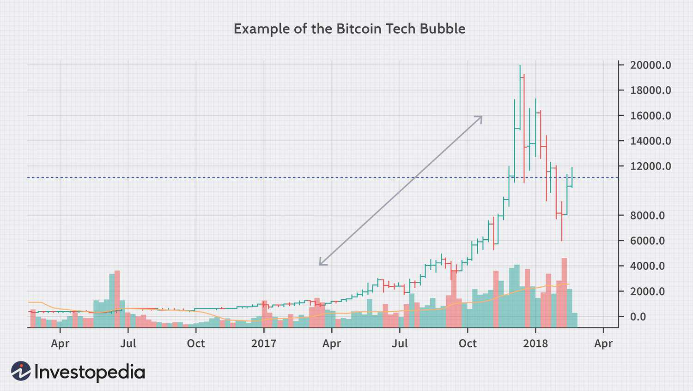

In the modern economic landscape, grasping the intricacies of economic and technology bubbles is essential for investors, analysts, and policymakers. Economic bubbles are marked by swift surges in asset prices, eventually followed by sharp contractions, which can have significant global repercussions on markets and economies. Technology bubbles, in particular, display distinct characteristics attributable to the rapid pace of innovation and market speculation. This article explores various facets of these bubbles, utilizing historical examples to underscore key characteristics and warning signs. Additionally, it highlights the role of algorithmic trading, an increasingly influential factor in these market phenomena.

Understanding these bubbles' core dynamics can provide critical insights into their formation and potential implications. Economic bubbles often arise when market exuberance pushes asset prices far beyond their intrinsic values. Such scenarios can lead to dangerous environments ripe for abrupt market corrections. Conversely, technology bubbles arise from the allure of breakthrough technologies and the exaggerated potential attributed to tech companies, as evidenced by significant IPO activities and irrational valuations.

As we examine these bubbles, past incidences such as the Dotcom Bubble and the Bitcoin Bubble reveal characteristic patterns and development stages. The Dotcom Bubble, for instance, serves as a poignant reminder of the risks associated with unbridled optimism in internet companies. Similarly, the dramatic rise and fall of Bitcoin and other cryptocurrencies in 2017 and beyond highlights the susceptibility of tech-driven speculative bubbles in today's economy.

Algorithmic trading, utilizing automated systems for trade execution, figures prominently in modern markets and can amplify volatility during bubble conditions. These systems are capable of triggering large trade volumes in response to market trends or anomalies, thereby intensifying price movements.

In addressing economic and tech bubbles, vigilance, critical analysis, and comprehension of market dynamics are essential for investors. A focus on fundamental analysis over speculative hype is imperative to safeguarding portfolios. Awareness of historical patterns, coupled with knowledge of algorithmic trading, positions stakeholders to better navigate the modern economic landscape and mitigate risks associated with bubble conditions.

## Table of Contents

## Understanding Economic Bubbles

Economic bubbles emerge when the prices of assets escalate significantly beyond their fundamental value, propelled by irrational exuberance and market speculation. This phenomenon initiates with a notable surge in asset prices, often driven by speculative trading, groundbreaking innovations, or favorable external economic conditions.

During the initial stages of a bubble, there is an influx of investors attracted by the rapid appreciation of asset values. This period is marked by increased market participation, where enthusiasm for quick returns overshadows caution and [fundamental analysis](/wiki/fundamental-analysis). Typically, external factors such as low interest rates, government policies, or technological breakthroughs catalyze this speculation, leading to a self-reinforcing cycle of price increases.

As the bubble expands, it creates an unstable economic environment prone to severe corrections. The mismatch between the inflated asset prices and their intrinsic values grows, heightening the risk of a market downturn. Historical economic bubbles provide salient examples of these dynamics, notably the housing market bubble of 2007-2008, rooted in subprime mortgage lending and securitization, and the Dutch Tulip Mania of the 17th century.

The housing market bubble is a quintessential example of an economic bubble driven by credit expansion and financial innovation. In this case, lenient lending standards and complex financial derivatives allowed an unsustainable increase in housing prices, which ultimately culminated in a significant market collapse, leading to a global financial crisis.

The Dutch Tulip Mania, occurring between 1636 and 1637, was one of the first recorded speculative bubbles. Tulip bulb prices soared to extraordinary levels before collapsing precipitously, illustrating the drastic price [volatility](/wiki/volatility-trading-strategies) characteristic of speculative mania.

Understanding these phenomena involves recognizing the warning signs and underlying causes of asset price inflation. This knowledge encourages stakeholders to exercise caution, emphasizing the importance of fundamental financial metrics over fleeting market trends. Recognizing these indicators helps in mitigating risks and preparing for potential market corrections that inevitably follow speculative excesses.

## The Characteristics of Tech Bubbles

Tech bubbles are distinguished by a sharp rise in technology stock prices and elevated valuations when compared to traditional financial metrics. These phenomena are not isolated events but rather the culmination of several interrelated factors. One primary driver is the inherent allure of new, cutting-edge technologies that promise substantial returns. Investors often become captivated by the perceived limitless potential of tech companies, leading to an influx of capital that drives prices to unsustainable levels.

The Dotcom Bubble of the late 1990s stands as a classic example. During this period, the widespread excitement over internet technologies resulted in excessive speculation. Companies related to the internet saw their stock prices skyrocket, many of which lacked solid business plans or revenue models to justify such valuations. This speculative fervor was accompanied by a surge in Initial Public Offerings (IPOs), with numerous tech firms going public at extraordinary valuations.

Similarly, the Bitcoin Bubble in 2017 provides another instructive case. The [cryptocurrency](/wiki/cryptocurrency) experienced an unprecedented increase in value, driven partly by the belief that blockchain technology would revolutionize various sectors. The rapid price surge attracted a massive influx of both retail and institutional investors, further inflating the bubble. Many investors overlooked traditional valuation metrics, fueled instead by speculative enthusiasm for the potential applications of cryptocurrencies.

Significant IPO activity is a hallmark of tech bubbles. When large numbers of tech firms seek to go public, often at inflated valuations, it can signal a burgeoning bubble. These IPOs usually attract significant market interest, contributing to a frenzy that further elevates stock prices beyond their intrinsic worth. This scenario creates an environment where irrational valuations become commonplace, as traditional financial analysis is overshadowed by hype and speculation.

Understanding these characteristics is crucial for recognizing and assessing the risks associated with tech bubbles. They often culminate in abrupt corrections, as market sentiment shifts and the speculative inflows that once fueled the bubble dissipate. Recognizing the warning signs—rapid price increases, elevated valuations, excessive IPO activity, and widespread market speculation—can aid investors and policymakers in making informed decisions and developing strategies to mitigate potential adverse effects on the economy.

## Detecting Tech Bubbles: Key Indicators

Detecting tech bubbles involves identifying several key indicators that signal the potential formation or presence of a bubble in the technology sector. One prominent indicator is unjustified valuations, which occur when stock prices significantly exceed the intrinsic value of the underlying company. These valuations often stem from overly optimistic expectations about future growth and profitability, decoupled from current financial performance metrics such as earnings or revenue.

High levels of speculative activity also serve as a critical warning sign. Speculation drives prices upward as investors chase high returns based on anticipated future market movements rather than fundamental analysis. This speculative fervor is often accompanied by increased trading volumes and market volatility, signaling an unstable market environment.

A divergence between public and private valuations is another significant indicator. When private equity valuations of tech startups overshoot public market valuations, it implies a disconnect between perceived and actual value. This discrepancy can lead to inflated prices that are unsustainable in the long term, potentially collapsing once corrected by market forces.

Excessive media hype contributes to the formation of tech bubbles by creating a narrative that sustains and amplifies speculative behaviors. Media outlets often highlight successful ventures and groundbreaking technologies, which can lead to skewed perceptions of industry health and opportunity, further inflating asset prices.

The rapid expansion of market multiples, such as Price-to-Earnings (P/E) ratios, above historical norms may also suggest bubble conditions. A sharp increase in Initial Public Offerings (IPOs) and venture capital funding in the tech sector usually signals heightened investor interest and risk-taking, often at the expense of prudent financial assessment.

Anomalous increases in mergers and acquisitions, particularly those financed by debt, are typical of the peak bubble phase. Companies engage in aggressive expansion strategies to capitalize on perceived opportunities, often overlooking value and debt sustainability, which may lead to financial strain once the market corrects.

Market narrowness, where a small number of high-profile stocks drive most of the market gains, indicates underlying structural weaknesses. Such concentration implies that widespread growth is lacking, and the market's perceived strength may be overstated. This narrow leadership can hide vulnerabilities that become apparent only when investor confidence wanes.

Each of these indicators requires careful scrutiny and analysis to ascertain the presence of a tech bubble. Recognizing these patterns equips investors and analysts with the tools needed to mitigate risks associated with speculative excesses, ensuring better-informed decision-making in the volatile tech market landscape.

## The Role of Algorithmic Trading in Bubbles

Algorithmic trading refers to the use of computer algorithms to automate trading decisions, execution, and management. As these systems become more sophisticated, their impact on market dynamics, especially during bubble conditions, has garnered significant attention from investors and regulators alike.

Algorithmic trading systems can significantly amplify market volatility during economic and technology bubbles. These systems are programmed to respond instantaneously to market trends and anomalies, executing large volumes of trades at high speed. This characteristic can lead to sudden and excessive price movements, as algorithms react to the same signals or changes in the market conditions almost simultaneously. For instance, in a bubble scenario, rapid fluctuations in asset prices might trigger algorithmic responses that magnify the trading [volume](/wiki/volume-trading-strategy) and exacerbate price swings, both upward and downward.

The benefits of [algorithmic trading](/wiki/algorithmic-trading) are evident in normal market conditions. These systems enhance market efficiency by narrowing bid-ask spreads and provide [liquidity](/wiki/liquidity-risk-premium) by facilitating a higher volume of trades. This can result in more competitive pricing and improved market accessibility for a wide range of investors. However, the same attributes that contribute to efficient markets can pose risks during bubble conditions. Due to the high-speed nature of algorithmic trades, markets can experience flash crashes or abrupt downturns when algorithms simultaneously execute sell orders in response to declining prices or adverse news. A notable example is the "Flash Crash" of May 6, 2010, where algorithmic trading contributed to a rapid and severe market decline.

Understanding the impact of algorithmic trading is crucial for investors aiming to strategize effectively and manage risks during bubble periods. By recognizing the potential for algorithms to exacerbate market volatility, investors can take proactive measures such as diversifying their portfolios and implementing stop-loss orders to mitigate risks. Additionally, regulators and market participants continually assess the implications of algorithmic trading to ensure that safeguards and circuit breakers are in place to maintain orderly markets.

In the context of market bubbles, investors and market participants must remain aware of the dual-edged nature of algorithmic trading, balancing its advantages in market efficiency and liquidity with the potential risks of heightened volatility and rapid market shifts. This knowledge is essential for navigating and making informed decisions in an increasingly automated trading environment.

## Real-world Examples of Technology Bubbles

The late 1990s witnessed the Dotcom Bubble, a period marked by excessive and irrational investments in internet-based companies. This bubble was characterized by soaring stock prices of tech companies, many of which had no proven revenue models or sustainable business plans. Investors were driven by speculative fervor, spurred by the internet's perceived potential to revolutionize various sectors. The excessive enthusiasm resulted in astronomical valuations, making traditional financial metrics and fundamentals seem obsolete. As the Nasdaq Composite index surged, peaking in March 2000, the bubble began to unravel. A significant [factor](/wiki/factor-investing) was the eventual market realization that many of these companies would not generate the profits anticipated. The correction was swift, with the Nasdaq falling by almost 80% from its peak, leading to substantial financial losses and business closures. Notable companies like Pets.com, which went public in 2000 and folded within months, symbolize the era's excesses ([Cassidy, 2002](https://www.harpercollins.com/products/dotcon-john-cassidy)).

A more recent example of a technology bubble can be seen in the rise and fall of Bitcoin and other cryptocurrencies from 2017 onwards. Cryptocurrencies experienced a meteoric rise in value, with Bitcoin reaching a peak price close to USD 20,000 in December 2017. This surge was driven by various factors, including the promise of decentralized finance, media hype, and speculative investments from individuals who feared missing out on potential windfalls. The market capitalizations of numerous cryptocurrencies soared, accompanied by the emergence of initial coin offerings (ICOs) that promised groundbreaking blockchain applications. However, similar to past bubbles, this growth was not always supported by tangible utility or mass adoption. As skepticism regarding regulatory challenges and scalability issues escalated, prices began to plummet. By the end of 2018, Bitcoin's value had diminished by over 80% from its peak.

These real-world cases of the Dotcom and cryptocurrency bubbles illustrate several warning signs and characteristics of technology bubbles. Common elements include extreme valuations not grounded in fundamental analysis, herd behavior among investors, excessive media coverage, and a dramatic shift in focus toward emergent but not fully understood technologies. These patterns serve as critical lessons for investors, regulators, and policy-makers in anticipating and mitigating future bubble scenarios.

## Conclusion

Identifying and understanding economic and technology bubbles necessitates a comprehensive grasp of market dynamics and an analytical approach to investing. Investors are encouraged to emphasize fundamental analysis to avoid succumbing to speculative hype. This strategy involves evaluating a company's financial health, market position, and potential for sustainable growth, thereby safeguarding investments against abrupt market corrections.

A critical examination of historical patterns provides insights into the cyclical nature of bubbles. Events like the Dotcom Bubble reveal recurring phases—exuberance, overvaluation, and eventual correction—that manifest across different eras and technologies. By learning from past experiences, investors can recognize early signs of bubble formations, such as irrational valuations and unsustainable market enthusiasm.

Technological advancements continuously reshape market landscapes, offering both opportunities and challenges. Innovations can drive substantial economic growth but also propagate speculative bubbles if not grounded in realistic financial metrics. Therefore, staying informed about technological trends and evaluating their long-term viability is imperative for investors.

Market participants must maintain a vigilant stance and employ a multi-faceted approach to investment decisions. This includes integrating quantitative data analysis, maintaining diverse portfolios, and exercising caution during periods of market euphoria. As technology continues to influence financial markets, awareness and prudent decision-making become essential tools in navigating potential bubbles and preserving economic stability.

## References & Further Reading

[1]: Cassidy, J. (2002). ["Dot.Con: The Greatest Story Ever Sold."](https://archive.org/details/dotcongreatestst0000cass) HarperCollins.

[2]: Malkiel, B. G. (2015). ["A Random Walk Down Wall Street: The Time-Tested Strategy for Successful Investing."](https://yourknowledgedigest.org/wp-content/uploads/2020/04/a-random-walk-down-wall-street.pdf) W. W. Norton & Company.

[3]: Shiller, R. J. (2000). ["Irrational Exuberance."](https://press.princeton.edu/books/paperback/9780691173122/irrational-exuberance) Princeton University Press.

[4]: Kindleberger, C. P., & Aliber, R. Z. (2011). ["Manias, Panics, and Crashes: A History of Financial Crises."](https://link.springer.com/book/10.1057/9780230628045) Palgrave Macmillan.

[5]: Lopez de Prado, M. (2018). ["Advances in Financial Machine Learning."](https://www.amazon.com/Advances-Financial-Machine-Learning-Marcos/dp/1119482089) Wiley.

[6]: Jansen, S. (2020). ["Machine Learning for Algorithmic Trading."](https://github.com/stefan-jansen/machine-learning-for-trading) Packt Publishing.