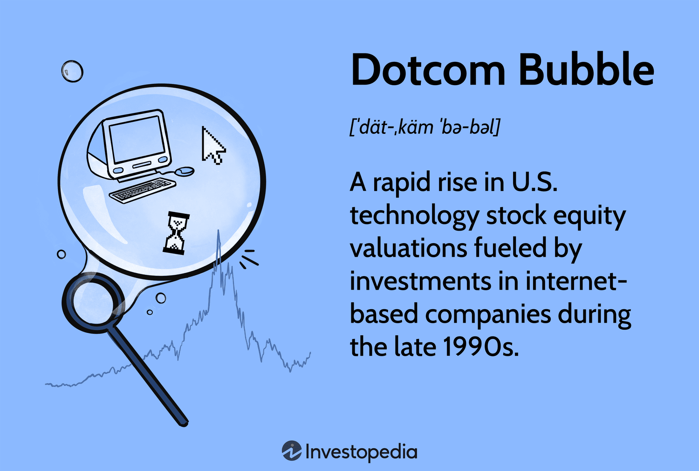

## Table of Contents

## What is a technology bubble?

A technology bubble is when people get really excited about new technology and start investing a lot of money in it. They think the technology will make them rich, so they buy stocks and invest in tech companies. This excitement makes the prices of these stocks go up a lot, even if the companies are not making much money yet. It's like a big party where everyone is having fun and spending money, but it's not based on how well the companies are actually doing.

But, like all parties, the excitement can't last forever. Eventually, people start to realize that the prices of the stocks are too high compared to what the companies are really worth. When this happens, they start selling their stocks, and the prices go down quickly. This can cause a lot of people to lose money and can even affect the whole economy. This is why a technology bubble is risky, because it's based on excitement and hope rather than solid business results.

## How does a technology bubble form?

A technology bubble forms when people get really excited about new technology. They start thinking that this new technology will change the world and make them a lot of money. So, they start buying stocks in tech companies, even if those companies are not making much money yet. This excitement makes more and more people want to invest, and the prices of the stocks keep going up. It's like a big wave of enthusiasm that keeps growing.

But this excitement is not based on how well the companies are actually doing. It's more about the hope and the hype. When too many people are buying stocks just because they think the prices will keep going up, it creates a bubble. Eventually, some people start to realize that the prices are too high and the companies are not as valuable as everyone thought. When this happens, they start selling their stocks, and the prices start to fall. This can cause a lot of people to lose money and can even affect the whole economy.

## What are the signs of a technology bubble?

One big sign of a technology bubble is when everyone is talking about a new technology and getting really excited about it. People start buying stocks in tech companies even if those companies are not making much money yet. The prices of these stocks go up a lot because so many people want to buy them. It's like everyone is at a party and having a good time, but the party is based on hope and excitement, not on how well the companies are actually doing.

Another sign is when the prices of tech stocks are much higher than what the companies are really worth. This happens because people are buying the stocks just because they think the prices will keep going up, not because the companies are making good profits. When the prices get too high and don't match the real value of the companies, it's a warning sign that a bubble might be forming. If people start to realize this and start selling their stocks, the bubble can burst, and prices can fall quickly.

## Can you explain the dot-com bubble as an example of a technology bubble?

The dot-com bubble was a big technology bubble that happened in the late 1990s and early 2000s. During this time, people got really excited about the internet and started investing a lot of money in internet companies. These companies were called "dot-coms" because their websites ended in ".com". People thought these companies would make them rich, so they bought their stocks even if the companies were not making much money yet. The excitement made the prices of these stocks go up a lot, even though many of the companies were not profitable.

But, like all bubbles, the dot-com bubble couldn't last forever. By early 2000, people started to realize that the prices of the stocks were too high compared to what the companies were really worth. When this happened, they started selling their stocks, and the prices went down quickly. Many people lost a lot of money, and some internet companies went out of business. The dot-com bubble bursting showed how dangerous it can be when people get too excited about new technology and invest based on hope rather than solid business results.

## What were the key factors that led to the bursting of the dot-com bubble?

The dot-com bubble burst because people started to see that many internet companies were not making money. These companies had high stock prices because everyone was excited about the internet, but they were spending a lot of money and not [earning](/wiki/earning-announcement) enough. When investors realized this, they began to sell their stocks. This made the stock prices go down quickly. Also, many dot-com companies were not good at managing their money. They spent too much on things like advertising and fancy offices, hoping to grow fast, but they didn't have a solid plan to make profits.

Another reason the bubble burst was that too many new internet companies were starting up. This made it hard for any one company to stand out and make money. Investors got tired of waiting for these companies to become profitable. They started to look for safer places to put their money. When big investors pulled out, it caused a chain reaction, and more people started selling their stocks. This led to a big drop in stock prices and many dot-com companies going out of business. The bursting of the dot-com bubble showed how risky it can be to invest in new technology without a clear plan for making money.

## How did the technology bubble of the late 1990s affect the global economy?

The technology bubble of the late 1990s had a big impact on the global economy. When the bubble burst in early 2000, it caused a lot of people to lose money. Many investors had put their money into internet companies hoping to get rich, but when the stock prices crashed, they lost a lot. This made people feel less confident about investing in the stock market. Companies that were part of the bubble also had to lay off workers and some even went out of business, which led to higher unemployment in some places.

The effects of the bubble bursting were felt around the world. In the United States, the economy went into a recession in 2001. This slowdown affected other countries too, because the U.S. is a big part of the global economy. Many countries that did business with the U.S. saw their economies slow down as well. It took several years for the global economy to recover from the shock of the dot-com bubble bursting. This event showed how a technology bubble can have wide-reaching effects beyond just the tech industry.

## What lessons were learned from the dot-com bubble that could prevent future technology bubbles?

One big lesson from the dot-com bubble is that it's important to look at a company's real value before investing in it. During the bubble, people were buying stocks just because they were excited about the internet, not because the companies were making money. Now, investors know they should check if a company has a good plan to make profits before they invest. This can help stop bubbles from forming because it makes people think more carefully about where they put their money.

Another lesson is the importance of good money management. Many dot-com companies spent too much money trying to grow fast, without thinking about how they would make money in the long run. Now, companies know they need to be careful with their spending and have a clear plan for making profits. This can help prevent future bubbles because it makes companies more stable and less likely to fail suddenly.

A third lesson is the need for realistic expectations. During the dot-com bubble, people thought the internet would change everything overnight, and they expected huge profits right away. Now, people understand that new technology takes time to develop and become profitable. By having more realistic expectations, investors and companies can avoid getting caught up in the excitement of a new technology and help prevent another bubble from forming.

## How do technology bubbles impact startup companies and investors?

Technology bubbles can be really exciting for startup companies because they can get a lot of attention and money from investors. When everyone is excited about new technology, startups can find it easier to raise money to grow their business. This can help them hire more people, build new products, and expand faster than they could without the bubble. But, it can also be dangerous. If a startup gets too much money too quickly, they might spend it without thinking carefully about how to make profits. When the bubble bursts, these startups can run out of money and go out of business if they haven't built a solid business.

For investors, technology bubbles can offer big rewards but also big risks. During a bubble, investors can make a lot of money if they buy stocks in the right companies at the right time. The excitement can push stock prices up, making investors feel like they are making smart choices. But, when the bubble bursts, the prices of stocks can fall quickly, and investors can lose a lot of money. This can be especially hard for people who invested all their savings hoping to get rich. After a bubble bursts, investors often become more careful and look for companies with strong business plans and real profits, not just excitement and hope.

## What role do venture capitalists play in the formation and bursting of technology bubbles?

Venture capitalists play a big role in technology bubbles because they invest a lot of money in new tech companies. When they see a new technology that they think will be popular, they give money to startups to help them grow. This can make other investors excited too, and they start investing more money in the same kind of companies. This excitement can make stock prices go up a lot, even if the companies are not making much money yet. So, venture capitalists help create the bubble by pouring money into new tech companies and making everyone feel excited about them.

But venture capitalists can also help a bubble burst. When they start to see that the companies they invested in are not doing well or not making money, they might stop giving them more money. This can make other investors nervous, and they start selling their stocks. When a lot of people start selling, the stock prices go down quickly. Venture capitalists can also pull their money out of a company if they think it's not going to be successful, which can make the bubble burst even faster. So, they play a big part in both making the bubble grow and making it pop.

## Can you discuss the role of media and public perception in inflating technology bubbles?

The media and public perception play a big role in making technology bubbles grow. When the media starts talking a lot about a new technology, it makes people excited. They write stories about how this new technology will change the world and make people rich. This makes more and more people want to invest in it. They see the news and think, "I don't want to miss out!" So, they start buying stocks in tech companies, even if those companies are not making much money yet. The more the media talks about it, the more excited people get, and the bigger the bubble grows.

Public perception also helps inflate technology bubbles. When everyone around you is talking about a new technology and how great it is, you start to believe it too. It's like a big party where everyone is having fun and spending money. People see their friends and family investing and making money, so they want to join in. This excitement makes the prices of stocks go up a lot, even if the companies are not doing well. But, when people start to realize that the excitement is not based on real value, the bubble can burst, and everyone can lose money.

## How can investors identify and mitigate risks associated with technology bubbles?

Investors can identify risks associated with technology bubbles by looking at how excited people are about a new technology. If everyone is talking about it and the media is writing a lot of stories about it, it might be a sign that a bubble is forming. Another way to spot a bubble is by checking if the prices of tech stocks are much higher than what the companies are really worth. If a company's stock price is going up a lot but the company is not making much money, that's a warning sign. Investors should also look at how much money companies are spending and if they have a good plan to make profits. If a company is spending a lot without a clear way to make money, it's risky.

To mitigate these risks, investors should be careful and not get too excited about new technology. They should do their homework and check if a company has a solid business plan before investing. It's important to look at a company's real value, not just the excitement around it. Investors can also spread their money around to different kinds of investments, not just tech stocks. This way, if a bubble bursts, they won't lose all their money. By staying calm and thinking carefully about where they put their money, investors can protect themselves from the dangers of technology bubbles.

## What are some current examples of potential technology bubbles, and what evidence supports this view?

One current example of a potential technology bubble is the [cryptocurrency](/wiki/cryptocurrency) market, especially Bitcoin and other digital currencies. A lot of people are excited about cryptocurrencies and think they will make them rich. This excitement has made the prices of cryptocurrencies go up a lot, even though they are not backed by anything solid like gold or a company's profits. Some people worry that this is like the dot-com bubble, where the prices are too high compared to what the cryptocurrencies are really worth. If everyone starts selling their cryptocurrencies at the same time, the prices could fall quickly, and a lot of people could lose money.

Another example is the [artificial intelligence](/wiki/ai-artificial-intelligence) (AI) industry. Many investors are putting a lot of money into AI companies because they think AI will change the world. This has made the stock prices of AI companies go up a lot, even if some of these companies are not making much money yet. The media is writing a lot of stories about how great AI is, which makes more people want to invest. But, like with cryptocurrencies, if the excitement is not based on real value, it could be a bubble. If people start to realize that the prices are too high, they might start selling their stocks, and the bubble could burst.

## References & Further Reading

[1]: Cassidy, J. (2002). ["Dot.Con: The Greatest Story Ever Sold."](https://archive.org/details/dotcongreatestst0000cass) HarperCollins.

[2]: Malkiel, B. G. (2015). ["A Random Walk Down Wall Street: The Time-Tested Strategy for Successful Investing."](https://yourknowledgedigest.org/wp-content/uploads/2020/04/a-random-walk-down-wall-street.pdf) W. W. Norton & Company.

[3]: Shiller, R. J. (2000). ["Irrational Exuberance."](https://press.princeton.edu/books/paperback/9780691173122/irrational-exuberance) Princeton University Press.

[4]: Kindleberger, C. P., & Aliber, R. Z. (2011). ["Manias, Panics, and Crashes: A History of Financial Crises."](https://link.springer.com/book/10.1057/9780230628045) Palgrave Macmillan.

[5]: Lopez de Prado, M. (2018). ["Advances in Financial Machine Learning."](https://www.amazon.com/Advances-Financial-Machine-Learning-Marcos/dp/1119482089) Wiley.

[6]: Jansen, S. (2020). ["Machine Learning for Algorithmic Trading."](https://github.com/stefan-jansen/machine-learning-for-trading) Packt Publishing.