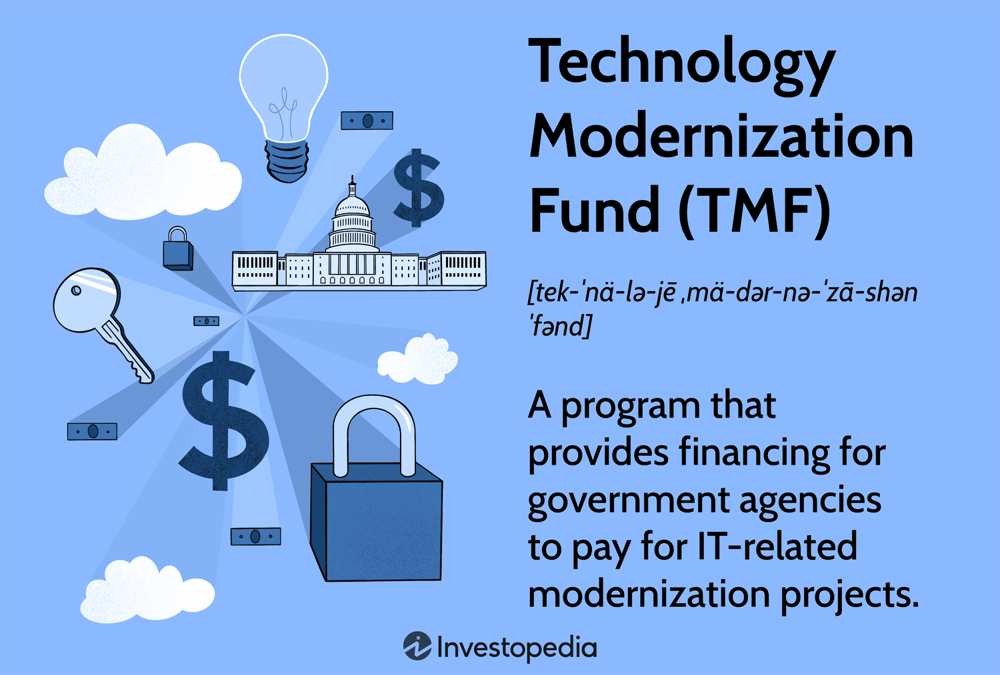

## Table of Contents

## What is the Technology Modernization Fund (TMF) and its primary purpose?

The Technology Modernization Fund (TMF) is a program created by the U.S. government to help update old technology systems used by federal agencies. It was set up in 2017 as part of the Modernizing Government Technology Act. The main goal of the TMF is to make government services easier and more secure for people to use by replacing outdated technology.

The TMF works by giving money to different government agencies so they can improve their technology. Agencies can apply for funding to help with projects that will make their services better, safer, and more efficient. This can include things like updating old computer systems, improving cybersecurity, and making websites easier to use. By doing this, the TMF helps the government work better and serve people more effectively.

## Who manages the Technology Modernization Fund?

The Technology Modernization Fund is managed by the Technology Modernization Board. This board is made up of government officials who decide which projects should get money from the fund. They look at the applications from different agencies and choose the ones that will make the biggest improvements to government services.

The board works with the General Services Administration (GSA) to run the TMF. The GSA helps with the day-to-day operations and makes sure the money is used correctly. Together, they make sure that the projects funded by the TMF are successful and help modernize government technology.

## How is the TMF funded and what is its budget?

The Technology Modernization Fund gets its money from the U.S. Congress. Congress decides how much money to give to the TMF each year. This money comes from taxpayer dollars and is set aside to help improve government technology. When agencies need money for their projects, they can ask the TMF for help.

The budget for the TMF changes every year. For example, in 2021, Congress gave the TMF $1 billion to use for projects. This money helps many different agencies update their old systems and make their services better for people. The exact amount of money the TMF gets can change, depending on what Congress decides is needed for that year.

## What types of projects does the TMF typically support?

The Technology Modernization Fund usually helps with projects that make government services easier to use and more secure. These projects often involve updating old computer systems that are slow and hard to use. For example, the TMF might help an agency replace an old system with a new one that works faster and is easier for people to understand. This can make things like applying for benefits or paying taxes much simpler.

Another type of project the TMF supports is improving cybersecurity. This means making sure that government websites and systems are safe from hackers. The TMF can give money to agencies to add better security features to their systems. This helps protect people's personal information and keeps government services running smoothly.

The TMF also supports projects that make government websites and apps easier to use. This can include making websites work better on phones and tablets, or making them easier to navigate. By doing this, the TMF helps more people access government services without trouble, no matter where they are or what device they are using.

## What are the eligibility criteria for agencies to receive TMF funding?

To get money from the Technology Modernization Fund, government agencies need to show that their project will make a big difference. They have to explain how their project will make government services better, safer, or easier to use. Agencies also need to show that they have a good plan for how they will use the money and that they can finish the project on time.

The project should also save money in the long run. This means that after the project is done, it should cost less to keep the new system running than the old one. Agencies need to prove that their project will be worth the investment. The Technology Modernization Board looks at all these things when deciding which projects to fund.

## How can federal agencies apply for TMF funding?

To apply for funding from the Technology Modernization Fund, federal agencies need to start by talking to the Technology Modernization Board. They should explain their project idea and how it will make government services better. The board will give them advice on how to make their project proposal strong. Agencies then need to fill out an application form that asks for details about the project, like what it will do, how much it will cost, and how it will save money in the future.

Once the application is ready, agencies send it to the Technology Modernization Board. The board looks at all the applications and decides which projects will get money. They think about how important the project is, how well it is planned, and if it will really make a difference. If the board likes the project, they will give the agency the money they need to start working on it.

## What is the process for evaluating and approving TMF proposals?

When federal agencies send their proposals to the Technology Modernization Fund, the Technology Modernization Board starts by looking at them closely. They check if the project will really help improve government services, make them safer, or easier to use. The board also looks at the plan the agency has to see if it makes sense and if they can finish the project on time. They want to make sure the project will be worth the money they give.

After reviewing the proposals, the board talks about which ones they think are the best. They think about how important the project is and if it will save money in the long run. If a project looks good, the board will approve it and give the agency the money they need. This way, they make sure the money goes to projects that will make a big difference for people using government services.

## Can you provide examples of successful projects funded by the TMF?

One successful project funded by the TMF was at the Department of Agriculture. They used the money to update their old computer system for managing farm loans. The new system is easier to use and helps farmers get their loans faster. This makes a big difference for farmers who need money to keep their farms running.

Another example is at the Department of Homeland Security. They got money from the TMF to improve their cybersecurity. They added better security features to their systems to keep them safe from hackers. This helps protect important information and keeps government services running smoothly for everyone.

## What impact has the TMF had on federal technology systems and services?

The Technology Modernization Fund has made a big difference in how federal agencies use technology. By giving money to update old systems, the TMF helps make government services easier and faster for people to use. For example, when the Department of Agriculture updated their farm loan system, farmers could get their loans quicker. This means they can keep their farms running without waiting a long time for money.

The TMF also helps keep government systems safe. Projects like the one at the Department of Homeland Security have added better security to protect against hackers. This keeps people's personal information safe and makes sure government services keep working well. Overall, the TMF has helped make government technology better, safer, and more helpful for everyone.

## How does the TMF ensure accountability and transparency in its operations?

The Technology Modernization Fund makes sure it is accountable and transparent by having the Technology Modernization Board look closely at every project. They check to make sure the money is used the right way and that the projects are helping the government work better. The board also works with the General Services Administration to keep track of how the money is spent and to make sure everything is done correctly.

The TMF also shares information about its projects with the public. They put reports and updates on their website so people can see what is being done with the money. This helps everyone know that the TMF is working to make government services better and safer. By being open about their work, the TMF shows that it is using taxpayer money in a responsible way.

## What challenges and criticisms has the TMF faced since its inception?

Since it started, the Technology Modernization Fund has faced some challenges and criticisms. One big challenge is that the TMF needs more money to help all the projects that need it. Sometimes, there are more good projects than the TMF can fund, so some important updates have to wait. Another challenge is making sure the projects finish on time and do what they promised. If a project takes too long or doesn't work well, it can be hard to show that the TMF is using the money wisely.

There have also been criticisms about how the TMF picks projects. Some people worry that the board might choose projects that are not the most important or that do not save as much money as they should. They think the board should be clearer about why they pick certain projects over others. Another criticism is that the TMF might not be helping all parts of the government equally. Some agencies might get more help than others, which can make it harder for the whole government to improve its technology at the same pace.

## What future developments or expansions are planned for the TMF?

The Technology Modernization Fund is looking to grow and help even more government agencies in the future. They want to get more money from Congress so they can fund more projects. This would mean more old systems could be updated and more services could be made easier and safer for people to use. The TMF also wants to make sure they are helping all parts of the government, not just a few agencies. By doing this, they hope to make the whole government work better and faster.

Another plan for the TMF is to make their process for [picking](/wiki/asset-class-picking) projects even better. They want to be very clear about why they choose certain projects and make sure they are picking the ones that will help the most people. The TMF also wants to keep working closely with agencies to make sure projects finish on time and do what they promised. By doing all these things, the TMF hopes to keep making government technology better and more helpful for everyone.

## References & Further Reading

[1]: ["Technology Modernization Fund."](https://tmf.cio.gov/) Official U.S. Government website on the Technology Modernization Fund (TMF).

[2]: ["Modernizing Government Technology Act of 2017."](https://www.congress.gov/bill/115th-congress/house-bill/2227) Text and status information on the legislation from the U.S. Congress.

[3]: ["Advances in Financial Machine Learning"](https://www.amazon.com/Advances-Financial-Machine-Learning-Marcos/dp/1119482089) by Marcos Lopez de Prado

[4]: Pardo, R. (2008). ["The Evaluation and Optimization of Trading Strategies."](https://onlinelibrary.wiley.com/doi/book/10.1002/9781119196969) Wiley.

[5]: ["Zero Trust Architecture."](https://www.nist.gov/publications/zero-trust-architecture) National Security Agency's guide on cybersecurity best practices, including zero trust architecture.

[6]: Office of Management and Budget. (2021). ["American Rescue Plan Implementation Guidance."](https://www.whitehouse.gov/omb/information-for-agencies/memoranda/) White House release detailing funding for technology modernization initiatives.

[7]: Narang, R. K. (2013). ["Inside the Black Box: A Simple Guide to Quantitative and High-Frequency Trading."](https://onlinelibrary.wiley.com/doi/book/10.1002/9781118662717) Wiley.