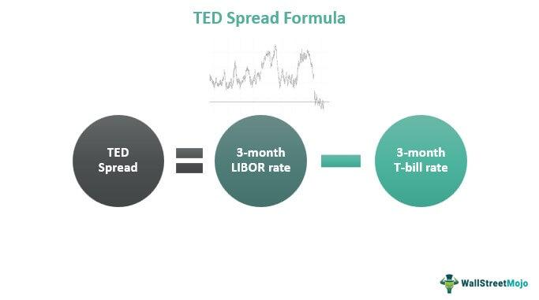

## Table of Contents

## What is the TED Spread?

The TED Spread is a financial term that shows the difference between the interest rates on three-month U.S. Treasury bills and three-month Eurodollar contracts. It is used to measure the risk in the financial markets. When the TED Spread is high, it means that banks think there is more risk, and they might be worried about lending money to each other.

This spread is important because it can tell us how safe or risky the financial system is. If the TED Spread goes up a lot, it can be a sign that people are worried about the economy. For example, during the 2008 financial crisis, the TED Spread got very high, which showed that there was a lot of fear and uncertainty in the market. By watching the TED Spread, investors and policymakers can get a sense of the overall health of the financial system.

## Why is the TED Spread important in finance?

The TED Spread is important in finance because it helps us understand how much risk there is in the market. It measures the difference between the interest rates on three-month U.S. Treasury bills and three-month Eurodollar contracts. When this difference, or spread, gets bigger, it means that banks are worried about lending money to each other. This can be a sign that the financial system is under stress.

By keeping an eye on the TED Spread, investors and people who make financial policies can get a good idea of how safe or risky the market is. For example, during the 2008 financial crisis, the TED Spread got very high, which showed that there was a lot of fear and uncertainty. So, the TED Spread acts like a warning signal, helping everyone in finance to be ready for possible problems and to make better decisions.

## How is the TED Spread calculated?

The TED Spread is calculated by finding the difference between two interest rates. The first rate is for three-month U.S. Treasury bills, which are very safe because they are backed by the U.S. government. The second rate is for three-month Eurodollar contracts, which are loans in U.S. dollars held in banks outside the U.S. To get the TED Spread, you subtract the interest rate of the U.S. Treasury bills from the interest rate of the Eurodollar contracts.

This simple calculation gives us a number that tells us about the risk in the financial markets. When the TED Spread is small, it means that banks feel safe lending to each other. But when the TED Spread gets bigger, it shows that banks are worried and think there is more risk. This can be a sign that something might be wrong in the financial system, so people in finance watch the TED Spread closely to understand how the market is doing.

## What do the components of the TED Spread represent?

The TED Spread is made up of two main parts. The first part is the interest rate on three-month U.S. Treasury bills. These are very safe investments because they are backed by the U.S. government. When people buy these bills, they are lending money to the government for three months and get a small interest in return. The rate on these bills is seen as a safe and stable benchmark because the government is very unlikely to fail to pay back the money.

The second part of the TED Spread is the interest rate on three-month Eurodollar contracts. These are loans in U.S. dollars that are held in banks outside the U.S. Because these loans are not backed by the government, they are seen as riskier than U.S. Treasury bills. The rate on Eurodollar contracts can go up if banks think there is more risk in lending money to each other. By comparing these two rates, the TED Spread shows us how much extra risk banks are seeing in the financial markets.

## What is considered a normal range for the TED Spread?

The normal range for the TED Spread is usually between 10 and 50 basis points. A basis point is just a small unit of measure for interest rates, where one basis point equals 0.01%. When the TED Spread is in this range, it means that banks feel pretty safe about lending money to each other, and the financial markets are working well.

If the TED Spread goes above 50 basis points, it can be a sign that banks are starting to worry more about risk. For example, during times like the 2008 financial crisis, the TED Spread got much higher, reaching over 400 basis points at one point. This showed that there was a lot of fear and uncertainty in the market, and it helped people understand how serious the situation was.

## How does the TED Spread indicate market stress?

The TED Spread shows how much stress there is in the market by comparing the interest rates on three-month U.S. Treasury bills and three-month Eurodollar contracts. When the TED Spread gets bigger, it means that banks are worried and think there is more risk in lending money to each other. This is because the difference between the safe U.S. Treasury bills and the riskier Eurodollar contracts grows, showing that banks want more money to take on that extra risk.

If the TED Spread is in its normal range of 10 to 50 basis points, it means that the financial markets are working well and banks feel safe. But if the TED Spread goes above 50 basis points, it can be a sign that banks are getting more worried. For example, during the 2008 financial crisis, the TED Spread got very high, which showed everyone how much fear and uncertainty there was in the market. By watching the TED Spread, people can understand how stressed the financial system is and make better decisions.

## What historical events have significantly impacted the TED Spread?

The TED Spread has been affected by many big events in the past. One of the most important times was during the 2008 financial crisis. Back then, the TED Spread got really high, going over 400 basis points. This happened because banks were very scared about lending money to each other. They thought there was a lot of risk, so they wanted more money to take on that risk. This high TED Spread showed everyone how bad the financial crisis was and how much people were worried.

Another time the TED Spread changed a lot was during the European debt crisis in the early 2010s. Countries like Greece, Spain, and Italy were having big money problems, and this made banks worried about lending money. The TED Spread went up because of this fear. It was a sign that the financial markets were under stress because of what was happening in Europe. By looking at the TED Spread, people could see how the crisis was affecting the world's banks and money markets.

## How can investors use the TED Spread to make decisions?

Investors can use the TED Spread to see how safe or risky the financial markets are. If the TED Spread is low, it means banks feel safe lending money to each other. This can be a good sign for investors because it shows that the financial system is working well. When the TED Spread is in its normal range of 10 to 50 basis points, investors might feel more confident about putting their money into the market. They can use this information to decide when to buy or sell investments, knowing that the risk is low.

On the other hand, if the TED Spread gets high, it means banks are worried and think there is more risk. This can be a warning for investors that the financial markets might be in trouble. For example, during the 2008 financial crisis, the TED Spread went over 400 basis points, showing a lot of fear and uncertainty. When investors see the TED Spread going up, they might decide to be more careful with their money. They might choose to sell some of their investments or move their money into safer places like U.S. Treasury bills to protect themselves from the extra risk in the market.

## What are the limitations of using the TED Spread as an indicator?

The TED Spread can be a good way to see how risky the financial markets are, but it has some problems. One big problem is that it only looks at the difference between U.S. Treasury bills and Eurodollar contracts. This means it doesn't tell us everything about the whole financial system. There might be other risks that the TED Spread doesn't show. Also, the TED Spread can be affected by things that have nothing to do with how safe or risky the markets are. For example, if there are big changes in the economy or in how people see the world, the TED Spread might change even if the banks are still feeling safe.

Another problem is that the TED Spread can be slow to change. Sometimes, the markets can get risky very quickly, but the TED Spread might not show this right away. This means that by the time the TED Spread goes up, the markets might already be in trouble. Also, the TED Spread can be hard to understand for people who are new to finance. It's a small number, and it can be tricky to know what it means without knowing a lot about how the financial system works. So, while the TED Spread can be helpful, it's important to use it along with other ways of looking at the markets.

## How does the TED Spread correlate with other economic indicators?

The TED Spread often moves together with other economic indicators, like the stock market and bond yields. When the TED Spread goes up, it can mean that people are worried about the economy, and this worry can also make stock prices go down. At the same time, when people are scared, they might want to buy safe investments like U.S. Treasury bonds, which can make bond yields go down. So, a high TED Spread can be a sign that other parts of the economy are feeling stress too.

Another important economic indicator that can move with the TED Spread is the yield curve. The yield curve shows the difference between short-term and long-term interest rates. When the TED Spread gets bigger, it might mean that banks are worried about short-term loans, which can make the yield curve change shape. If the yield curve gets flat or even turns upside down, it can be a sign that a recession might be coming. By looking at the TED Spread along with these other indicators, people can get a better picture of what's happening in the economy.

## What are some advanced strategies for interpreting changes in the TED Spread?

To understand changes in the TED Spread better, investors can look at how it moves with other financial signs. For example, if the TED Spread goes up at the same time as stock prices go down and bond yields go down, it might mean that people are really worried about the economy. By watching these other signs along with the TED Spread, investors can see if the high spread is just a small problem or part of a bigger worry in the market. This can help them decide if they should be careful with their money or if it's okay to keep investing.

Another good way to interpret the TED Spread is to look at how it changes over time. If the TED Spread keeps going up slowly, it might mean that banks are starting to feel more worried about lending money. But if the TED Spread jumps up suddenly, it could be a sign that something big and scary just happened in the financial markets. By looking at the history of the TED Spread, investors can see if the current change is normal or if it's something they should be really worried about. This can help them make smarter choices about when to buy or sell their investments.

## How has the methodology for calculating the TED Spread evolved over time?

The way the TED Spread is calculated has changed a bit over the years, but the basic idea is still the same. It's always been about finding the difference between the interest rates on three-month U.S. Treasury bills and three-month Eurodollar contracts. In the past, people used to look at the rates for these two things in a more simple way, often just taking the rates from the last trade of the day. But now, with better technology and more data, the way we get these rates has become more detailed and accurate.

Today, the interest rates for U.S. Treasury bills are often taken from something called the Treasury Constant Maturity Rate, which is a more exact way of figuring out the average rate over time. For Eurodollar contracts, the rates are now often based on the London Interbank Offered Rate (LIBOR) or its newer replacement, the Secured Overnight Financing Rate (SOFR). These changes make the TED Spread a more reliable tool for understanding risk in the financial markets. Even though the exact way of calculating it has gotten better, the TED Spread still helps people see how worried banks are about lending money to each other.

## What is the TED Spread and how can we explore it?

The TED Spread is a compelling financial metric that reflects the difference in interest rates between the three-month U.S. Treasury bill and the three-month London Interbank Offered Rate (LIBOR). Mathematically, it is expressed as:

$$
\text{TED Spread} = \text{LIBOR}_{3\text{m}} - \text{T-bill}_{3\text{m}}
$$

This spread serves as an indicator of credit risk and market [liquidity](/wiki/liquidity-risk-premium). A higher TED Spread generally suggests increased credit risk or economic instability, while a lower spread implies greater stability. The TED Spread has been utilized as a gauge of market confidence, primarily because it incorporates measures from both secured (T-bills) and unsecured (LIBOR) lending markets. 

Historically, the TED Spread has proven to be reliable in assessing the effectiveness of monetary policy and macroeconomic conditions. During periods of financial turbulence, such as the 2008 financial crisis, the TED Spread widened substantially, reflecting heightened market stress and credit concerns. Conversely, under stable economic environments, the spread typically remains narrow, signaling investor confidence and lower perceived risk in interbank lending markets. 

As a result, policymakers and financial analysts monitor changes in the TED Spread to gain insights into prevailing market conditions. Shifts in this spread can offer foresight into potential adjustments in monetary policy, as central banks might respond to significant increases by implementing measures aimed at enhancing liquidity and stabilizing financial markets. 

In practical terms, the TED Spread's utility extends beyond risk assessment and includes applications in trading strategies and investment decisions. Financial institutions and traders often employ the TED Spread as a benchmark when evaluating yield spreads on various instruments, allowing them to better assess risk premiums and capital allocation strategies. By interpreting the TED Spread alongside other economic indicators, stakeholders can make more informed predictions about the trajectory of economic growth and credit risk, thus enabling strategic financial planning and resource allocation.

## What are the case studies and what is their historical context?

Analyzing historical events such as the 2008 financial crisis reveals the critical role played by financial metrics like the TED Spread in interpreting market conditions and economic stress. During the 2008 crisis, the TED Spread spiked dramatically as financial instability and credit risk heightened. This surge was indicative of severe mistrust in the interbank lending market. The TED Spread, derived from the difference between the interest rates on interbank loans (LIBOR) and short-term U.S. government debt (Treasury Bills), reached unprecedented levels, symptomatic of the heightened perceived credit risk and reduced market liquidity. The following formula represents the TED Spread:

$$
\text{TED Spread} = \text{LIBOR}_{3m} - \text{T-Bill}_{3m}
$$

Historically, the TED Spread typically remains within moderate bounds, but in periods of economic uncertainty, such as during 2008, it ballooned from its usual range around 0.50 basis points to over 450 basis points. This indicates heightened risk aversion among financial institutions, as the perceived risk of default on interbank loans significantly increased compared to the risk-free rate provided by Treasury securities.

In examining financial crises, the behavior of interest rate spreads offers valuable insights. The widening of spreads often signals increasing risk, uncertainty, or liquidity constraints, prompting defensive investment strategies. For example, in times of crisis, investors may pivot towards safer assets like U.S. Treasury securities, intensifying spreads between higher-risk and lower-risk financial instruments.

Practical implications of these metrics are evident in how they guide financial planning and risk management. The spike in the TED Spread during the 2008 crisis underscored the necessity for robust liquidity management and adequate capitalization in financial institutions. Moreover, it highlighted the potential for using spread metrics as early warning indicators of financial instability.

Case studies of interest rate spread behaviors, like those from 2008, also underscore the metrics' predictive prowess regarding economic trends and potential crises. For instance, analyzing spreads can help anticipate recessionary periods by identifying shifts in credit risk sentiment and liquidity availability, which policymakers can leverage for proactive measures in stabilizing financial systems.

These historical perspectives not only shed light on the operational dynamics of financial spreads during periods of economic distress but also illustrate the importance of continuously monitoring these metrics as part of a comprehensive risk management framework. As such, interest rate spreads and the TED Spread offer indispensable data points for forecasting, strategizing, and making informed financial decisions in volatile markets.

## References & Further Reading

[1]: Acharya, V.V., Bharath, S.T., & Srinivasan, A. (2007). ["Does Industry-Wide Distress Affect Defaulted Firms? Evidence from Creditor Recoveries."](https://www.sciencedirect.com/science/article/pii/S0304405X07000645) Journal of Financial Economics.

[2]: Adrian, T., & Shin, H.S. (2009). ["The Shadow Banking System: Implications for Financial Regulation."](https://papers.ssrn.com/sol3/papers.cfm?abstract_id=1441324) Federal Reserve Bank of New York Staff Reports.

[3]: Christensen, J.H.E., Lopez, J.A., & Rudebusch, G.D. (2011). ["Extracting Deflation Probability Forecasts from Treasury Yields."](https://www.frbsf.org/wp-content/uploads/sites/4/wp11-10bk.pdf) Finance and Economics Discussion Series.

[4]: Mishkin, F.S. (2010). ["Monetary Policy Strategy: Lessons from the Crisis."](https://www.nber.org/papers/w16755) International Finance.

[5]: Taylor, J.B. (2009). ["The Financial Crisis and the Policy Responses: An Empirical Analysis of What Went Wrong."](https://www.nber.org/system/files/working_papers/w14631/w14631.pdf) National Bureau of Economic Research.