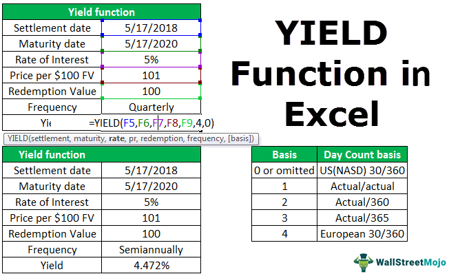

The financial markets have experienced dramatic changes over the years, particularly with the rise of technology-driven trading systems. These developments have introduced numerous concepts that have shaped modern trading strategies and market practices. Among these concepts is the 'Teenie,' a notable element in the evolution of financial pricing.

Historically, Teenie represented a small increment of price movement, crucial in an era when financial markets operated on fractional pricing systems. With the introduction of algorithms and high-frequency trading, Teenie's influence on trading methodologies has been profound. This small unit played a pivotal role during the pre-decimalization period, affecting how traders made decisions and structured their strategies.



This article examines Teenie's origins, its transformation, and its ongoing relevance in the landscape of modern algorithmic trading. By understanding how Teenie adapts and influences current trading practices, we gain insights into the progression of market dynamics. Moreover, this exploration reveals how Teenie has pushed the boundaries of trading strategies and what its implications might be for future market developments. 

As we analyze Teenie's journey through financial history and its impact on today's trading systems, we uncover critical aspects of market evolution that continue to shape the intricate world of algorithmic trading.

## Table of Contents

## Understanding Teenie in Financial Markets

A teenie, in financial markets, historically represented one-sixteenth of a dollar, specifically in the context of U.S. stock exchanges prior to the adoption of decimal pricing systems. It is crucial to differentiate this definition from the term’s later role in basis points, as a basis point is a unit of measure used in finance to describe the percentage change in the value or rate of a financial instrument. One basis point is equal to 0.01%, making one-sixteenth of a basis point approximately 0.000625%.

Before 2001, the U.S. markets operated on a fractional system rooted in practices dating back to Spanish trading methods, which adopted a system of pricing securities in fractions of eighths (⅛). As trading practices evolved, the smallest price movement recognized by exchanges was a sixteenth of a dollar, colloquially referred to as a 'teenie'. This meant that price changes could occur at increments of $0.0625, crucial for traders, as even small fluctuations could represent significant profit opportunities given high volumes.

During this pre-decimalization era, the teenie was not just a unit of price movement; it was an integral element in the framework of trading strategies. Traders often relied on these small and predictable increments to execute strategies around [arbitrage](/wiki/arbitrage), where they exploited price differentials, and [scalping](/wiki/gamma-scalping), a method focusing on small price changes over short periods. In particular, scalpers could take advantage of the frequent, albeit minor, price movements to accumulate profits on high volumes.

The significance of the teenie lay in its capacity to provide a structured and predictable environment for executing trades. With each stock movement constrained to these fractional steps, traders could formulate strategies that optimized the entry and [exit](/wiki/exit-strategy) points of trades, understanding that the next possible move was more limited and calculable than in a decimalized system.

Thus, the concept of a teenie—representing the smallest permissible price fluctuation—became ingrained in market strategies. The removal of such fractional increments with the advent of decimalization disrupted established patterns but also paved the way for more precise trading activity in modern financial markets. Understanding how the teenie functioned reveals the sophisticated mechanics of historical trading practices that laid the groundwork for current market dynamics.

## The Transition to Decimalization

In 2001, the U.S. Securities and Exchange Commission (SEC) mandated a pivotal shift in the trading landscape by enforcing decimalization. This transition to a base ten system revolutionized the way financial markets operated, altering the fundamental aspects of trading practices that had persisted for decades. Prior to decimalization, stock prices in the United States were quoted in fractions, specifically in eighths and sixteenths, which limited the smallest price movement to a fraction known as a "teenie," representing one-sixteenth.

Decimalization reduced the smallest price movement to increments of $0.01. This change fundamentally impacted trading dynamics, as it allowed for tighter bid-ask spreads and provided traders with more precision in executing their orders. The transition meant that the teenie, which had been a crucial unit for traders developing strategies based on fractional price increments, was effectively rendered obsolete.

The shift to decimal pricing necessitated a reevaluation of market data analysis. Traders and analysts who were accustomed to the fractional quoting systems had to adapt to a new framework where the granularity of price movement became significantly finer. This transition altered traditional trading strategies that relied heavily on the predictability of fractional increments. The ability to trade in finer increments facilitated increased [liquidity](/wiki/liquidity-risk-premium) and improved the efficiency of price discovery, as traders could now adjust their bids and offers to a cent rather than the previously larger fractional gaps.

Furthermore, the adoption of decimalization had broader implications on trading algorithms. Algorithms had to be recalibrated to accommodate the new decimal system, enhancing the speed and precision required in high-frequency trading environments. While the reduction to $0.01 increments streamlined market operations, it also created challenges for traders who had to swiftly adapt to the new dynamics of tighter spreads and increased competition in pricing strategies.

Overall, the move to decimalization marked a significant evolution in financial markets, reflecting a broader trend towards modernization and technological integration. This development underscored the necessity for ongoing adaptation and innovation within trading strategies and market analysis to align with changing regulatory environments and advancements in trading technologies.

## Historical Pricing Practices: From Eights to Teenies

The practice of quoting prices in eighths has its roots in Spanish trading practices that date back several centuries. This system was based on the Spanish silver dollar, which was divided into eight pieces, hence the term "pieces of eight." This method of dividing currency was practical for traders who needed to make fractional transactions and allowed for a reasonable degree of granularity in pricing. The influence of Spanish money and measures spread through commerce and eventually became embedded in financial trading practices globally.

When the New York Stock Exchange (NYSE) was established, it adopted this fractional system, primarily because it aligned with the prevalent monetary systems of the time. Quoting prices in eighths allowed traders to have enough precision in assessing the value while keeping calculations relatively simple. For example, one-eighth of a dollar equals $0.125, which is not overly complex to compute manually—a significant consideration in the pre-digital era.

This system of pricing remained dominant in U.S. financial markets until the late 20th century. However, the need for finer price increments eventually led to a shift from quoting prices in eighths to sixteenths, known as teenies. This change allowed traders to benefit from even greater precision, with one-sixteenth equating to $0.0625. The push towards more granularity was motivated by the increasing sophistication of trading strategies and the rising influence of institutions that required more accurate pricing for large-[volume](/wiki/volume-trading-strategy) trades.

The teenie system was momentarily used before the financial markets embraced decimalization in 2001. With the decimalization enforced by the U.S. Securities and Exchange Commission (SEC), the NYSE transitioned to quoting securities in one-cent increments, or $0.01. This change rendered the eighth and teenie systems obsolete, providing traders with even finer control over pricing.

The transition from eighths to sixteenths before the ultimate move to decimalization illustrates an evolution motivated by the desires for improved market efficiency, transparency, and competitiveness. While the historic Spanish system facilitated ease of calculation and sufficient precision for its time, the demands of modern trading required a transformation. This historical progression reflects the market's constant evolution towards more refined pricing mechanisms, adapting to the technological and strategic advancements in trading practices.

## The Role of Teenie in Algorithmic Trading

Algorithmic trading, leveraging automated processes and mathematical models, has undergone transformation following the introduction of decimalization. Before this shift, the financial markets operated under a fractional pricing system where a "teenie," equivalent to one-sixteenth of a dollar, provided the granular price movement essential for trading strategies. The precision offered by teenie allowed traders to develop intricate strategies exploiting small price movements to realize gains. 

With the move to decimalization in 2001, where the United States Securities and Exchange Commission (SEC) mandated price quotation in decimal format, the smallest price increment shifted to a cent ($0.01), effectively nullifying the teenie's role as the smallest tradeable increment. Algorithmic trading systems had to recalibrate, accommodating these narrower spreads and smaller price movements. This transition fundamentally changed trading algorithms, which had to be adjusted to account for the increased precision available under the decimal format.

The integration of this enhanced precision into [algorithmic trading](/wiki/algorithmic-trading) has resulted in increased trading efficiency. Algorithm developers adapted by incorporating more sophisticated models that could integrate minute market signals, allowing them to operate effectively within tighter spreads. Python, a favored language in quantitative finance, provides libraries such as NumPy and Pandas, which empower algorithm developers to handle and analyze the fine-grained market data now obtainable:

```python
import numpy as np
import pandas as pd

# Simulate a small market data set using decimal pricing
market_data = pd.DataFrame({
    'price': np.random.uniform(100, 101, 1000)  # Price variation in decimal
})

# Calculate price movement with increased precision
market_data['price_movement'] = market_data['price'].diff().fillna(0)

print(market_data.head())
```

Enhanced algorithmic models involve incorporating these precise inputs to optimize order execution strategies, such as [statistical arbitrage](/wiki/statistical-arbitrage) or market-making. For instance, tighter spreads enable algorithms to execute trades faster and more efficiently, maximizing trading opportunities and minimizing transaction costs.

In summary, while the teenie's role as a fractional unit concluded with the advent of decimalization, its conceptual legacy persists. Algorithmic trading systems have successfully adapted, embracing the fine-grained data inputs enabled by decimal pricing to enhance trading strategies' precision and efficiency. This evolution underscores the fluid nature of financial markets, where historical concepts like the teenie, though outdated, continue to influence modern algorithmic adaptations and trading methodologies.

## Current Relevance and Future of Teenie in Financial Markets

The term "Teenie," while historically rooted in financial markets, continues to influence modern trading languages, particularly in the context of algorithmic trading. Despite its origins in pre-decimalization trading practices, the conceptual framework associated with Teenie remains pertinent in today's rapidly evolving market environments.

### Influence on Modern Trading Languages

The legacy of Teenie persists in the lexicon and algorithms employed by traders and financial institutions. Trading languages and platforms often include provisions for fractional price movements to accommodate diverse financial instruments and trading strategies. For instance, although the smallest price increment in decimalized markets is now one cent, trading algorithms frequently account for finer granularity to enhance precision and flexibility in execution strategies. The Teenie, representing 1/16th of a trading unit, provides a conceptual basis for such fine adjustments, aiding traders in maximizing profit margins through minimal price variations.

### Future Potential in Financial Analytics and High-Frequency Trading

In the realm of financial analytics, the principles embodied by Teenie offer potential for improved analytical models. As high-frequency trading ([HFT](/wiki/high-frequency-trading-strategies)) seeks ever-smaller margins to capitalize on fleeting arbitrage opportunities, the historical understanding of fractional units like Teenie can inspire innovative approaches to price analysis and execution efficiency. The precision associated with teenie-sized increments supports the development of algorithms that better accommodate rapid market shifts, thereby optimizing trade outcomes.

High-frequency trading environments, which require instantaneous decision-making across numerous trades, can benefit from reincorporating the concept of fractional increments. The adaptation of Teenie's principles to modern HFT systems could enhance algorithms' sensitivity to market fluctuations, thereby leveraging micro-profit opportunities inherent in rapid trading cycles.

### Speculative Impact of a Resurgence in Fractional Systems

The potential re-emergence of similar fractional systems in niche markets could yield significant impacts on trading practices. Certain markets or specialized financial instruments may necessitate a return to fractional pricing, either due to liquidity constraints or the inherent characteristics of the traded assets. In such scenarios, adopting a fractional system akin to Teenie could offer increased resolution in pricing models, thus facilitating more competitive bidding and offering strategies.

For example, markets dealing with highly volatile or low-liquidity assets might benefit from a pricing structure that offers more granularity than current decimal-based systems allow. Such fractional systems could reduce bid-ask spreads and enhance price discovery, ultimately contributing to healthier market ecosystems.

In conclusion, while the Teenie may appear to be a relic of past trading conventions, its conceptual significance continues to influence and enhance modern trading practices. As financial markets and technologies progress, the insights drawn from historical pricing increments like Teenie can inform future developments in trading strategies and market structures.

## Conclusion

The journey of "Teenie" in the financial markets encapsulates a fascinating evolution from the historical systems of fractional pricing to the modern, technology-driven landscape of algorithmic trading. Initially, Teenie represented the smallest unit of price movement within the pre-decimalization conventional practices, originating for efficiency in calculations and communications on trading floors. Traders built strategies around these fractional units, and their understanding was crucial for making informed financial decisions when securities were quoted in fractions like eighths and sixteenths.

The broader impacts of the transition to decimalization cannot be understated. Implemented in 2001, this shift mandated that securities prices be quoted in decimals instead of fractions, reducing the smallest price movement to one cent (0.01 USD). This had significant repercussions on trading dynamics. It compressed the spreads and required market participants to recalibrate their pricing strategies and the algorithms designed to automate trades. Decimalization improved price transparency and increased market liquidity, although at the expense of some of the traditional strategies that were dependent on wider spreads offered by fractional pricing.

In reflecting upon the evolution of financial markets, Teenie exemplifies the transformative nature of financial practices over time. This transformation evidences how pricing increments determined trader behavior, impacted liquidity, and influenced competition among market participants. As technology continues to push the boundaries of trading, understanding such historical concepts remains imperative. It is through this lens that market practitioners can appreciate current market frameworks and better anticipate future developments within the financial ecosystem.

Considering the implications of historical pricing units like Teenie today informs the execution of advanced trading strategies prevalent in high-frequency trading environments. The principles forged during the fractional pricing era still resonate, highlighting the continual nature of market innovation driven by the need for efficiency and optimization.

Ultimately, the legacy of Teenie underscores the importance of historical awareness in crafting future market strategies. As the financial markets advance further into algorithmic sophistication and beyond, the knowledge of past pricing methodologies will aid in shaping future market dynamics, potentially ushering in new innovations inspired by the principles of the past.

## References & Further Reading

[1]: Harris, L. (2003). ["Trading and Exchanges: Market Microstructure for Practitioners"](https://www.amazon.com/Trading-Exchanges-Market-Microstructure-Practitioners/dp/0195144708). Oxford University Press.

[2]: O'Hara, M. (1995). ["Market Microstructure Theory"](https://www.wiley.com/en-us/Market+Microstructure+Theory-p-9781557864437). Wiley.

[3]: Hasbrouck, J. (2007). ["Empirical Market Microstructure: The Institutions, Economics, and Econometrics of Securities Trading"](https://archive.org/details/empiricalmarketm0000hasb). Oxford University Press.

[4]: SEC adopts decimal pricing in securities markets. U.S. Securities and Exchange Commission. (2000). ["Decimilization and its impact on the securities industry."](https://www.sec.gov/news/testimony/ts092000.htm)

[5]: "The Decimalization Debate." Financial Services Forum. Available at: [http://www.financialservicesforum.org](https://papers.ssrn.com/sol3/papers.cfm?abstract_id=8396)

[6]: Biais, B., & Glosten, L. (1994). ["Microstructure of Stock Markets"](https://www.semanticscholar.org/paper/The-Microstructure-of-Stock-Markets-Biais-Glosten/8607f8adfa4302d7257e9a1069d32c5e3f3c1627). European Economic Review.

[7]: Schmerken, I. (2001). ["The Big Bang: Decimalization"](https://patents.justia.com/patent/12175311). Wall Street & Technology Magazine.

[8]: Angel, J. J. (1997). ["Tick Size, Share Prices, and Stock Splits"](https://onlinelibrary.wiley.com/doi/10.1111/j.1540-6261.1997.tb04817.x). Journal of Finance, Vol. 52, No. 2, pp. 655-681.