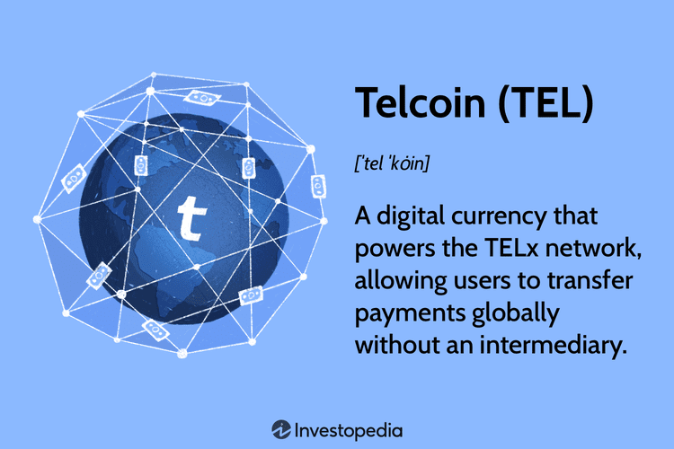

Cryptocurrencies have emerged as a pivotal component of the digital economy, increasingly influencing financial systems worldwide. Unlike traditional currencies, cryptocurrencies are decentralized digital assets that utilize blockchain technology to ensure transparency, security, and anonymity in financial transactions. Their significance is underscored by their capacity to facilitate cross-border trades, reduce transaction costs, and empower individuals in regions with limited access to traditional banking services.

Within this burgeoning digital economy, Telcoin (TEL) has carved out a niche market by integrating telecommunications with blockchain technology. Telcoin's primary function is to allow for seamless and cost-effective mobile remittances, leveraging the extensive network of telecom providers to reach users. Its unique value proposition is its potential to drive financial inclusivity by enabling lower-cost international money transfers compared to conventional methods. As a result, Telcoin occupies a distinctive position in the cryptocurrency market, poised for substantial growth due to its practical applications and wide adoption potential.



As cryptocurrencies grow in prominence, there is a burgeoning interest in algorithmic trading, an automated trading strategy that uses algorithms to execute pre-defined trading instructions. This interest stems from the volatile nature of the cryptocurrency market, where rapid price fluctuations can offer significant profit opportunities. Algorithmic trading allows traders to capitalize on these opportunities by executing large-volume trades at high speed and with minimal human intervention.

The objective of this article is to provide a comprehensive guide on utilizing algorithmic trading to purchase Telcoin. By automating the trading process, investors can enhance their trading precision, mitigate emotional biases, and execute a plethora of trades swiftly and efficiently. This method is particularly crucial in the dynamic world of cryptocurrencies, where intelligent trading strategies are paramount for maximizing returns on investments. The article will explore the steps necessary to set up and configure algorithmic trading systems geared towards Telcoin, offering insights that aim to optimize financial outcomes in crypto investments.

## Table of Contents

## What is TEL (Telcoin)?

Telcoin (TEL) is a cryptocurrency designed to bridge telecommunications networks with blockchain technology. It aims to revolutionize mobile financial services, primarily focusing on remittances and financial inclusion. Established in July 2017 by Claude Eguienta and Paul Neuner, Telcoin leverages the widespread use of mobile phones to offer instant, low-cost money transfers.

Telcoin's unique value proposition lies in its integration with mobile telecom operators to facilitate seamless international remittances. Unlike traditional remittance services, Telcoin provides users with the ability to send money globally in seconds at fractions of the cost. This efficiency is achieved by utilizing the existing mobile infrastructure and blockchain technology, bypassing intermediaries like banks that usually add time and cost to transactions. Telcoin primarily targets the unbanked and underbanked populations, allowing them to access affordable financial services through their mobile phones.

As of the latest market data, Telcoin has seen significant interest and growth potential, driven by its focus on remittances. The platform operates on the Ethereum blockchain, providing robust security and compatibility with the ecosystem. Telcoin's market status is relatively stable, but it shows potential for growth given the global remittance industry's projected expansion. The platform's roadmap includes expanding partnerships with global telecom operators and enhancing user functionality.

Compared to other cryptocurrencies, Telcoin stands out due to its specific focus on the telecommunications industry and its practical use case targeting global remittances. While most cryptocurrencies aim for broad technological implementations or focus on narrower niches, Telcoin's direct collaboration with telecom providers offers real-world utility that is both scalable and impactful. This strategic partnership model enhances Telcoin's adoption possibilities relative to other cryptocurrencies that are strictly decentralized and lack cooperative infrastructure.

Telcoin's potential to facilitate financial inclusivity is significant, particularly in emerging markets where many individuals lack access to traditional banking services. By utilizing mobile technology, Telcoin enables these users to participate in the global economy, helping to democratize financial access. Through its remittance service, it positions itself as a pivotal tool in reducing the cost and increasing the speed of cross-border money transfers, thus enhancing financial inclusion for millions worldwide.

## Algorithmic Trading in Cryptocurrency

Algorithmic trading refers to the use of computer programs and algorithms to facilitate and execute trades in financial markets. These algorithms can perform various tasks, such as identifying trading opportunities, executing trades at optimal prices, and managing risk, all without human intervention. In the context of the [cryptocurrency](/wiki/cryptocurrency) market, [algorithmic trading](/wiki/algorithmic-trading) has become increasingly significant due to the market's high [volatility](/wiki/volatility-trading-strategies) and 24/7 operational hours.

The benefits of using algorithmic trading in the cryptocurrency market are manifold. Firstly, it offers significant time efficiency by executing trades at speeds far beyond human capability. This is particularly advantageous in the fast-paced world of cryptocurrencies, where price swings can occur within seconds. Secondly, algorithmic trading minimizes emotional decision-making. By relying on pre-set algorithms, traders can avoid impulsive decisions based on fear or greed, which are common pitfalls in manual trading.

There are several popular algorithmic trading strategies employed by traders in the cryptocurrency market. These include:

1. **Trend Following:** This strategy identifies and follows the direction of current market trends. Algorithms analyze price data over a specified period to determine the momentum and execute trades aligned with the prevailing trend.

2. **Arbitrage:** This involves taking advantage of price differences of the same asset on different exchanges. Algorithms can quickly detect and execute trades to capitalize on these discrepancies.

3. **Market Making:** This strategy involves placing buy and sell orders for a currency simultaneously, profiting from the spread between the bid and ask prices.

4. **Mean Reversion:** This approach assumes that prices will revert to their historical mean or average. Algorithms identify deviations from the average price and execute trades assuming a return to the mean.

Technology plays a pivotal role in enhancing trading efficiency and decision-making. With advancements in [machine learning](/wiki/machine-learning) and [artificial intelligence](/wiki/ai-artificial-intelligence), algorithms can analyze vast volumes of market data to make informed predictions and decisions. These technologies enable traders to process real-time data, conduct [backtesting](/wiki/backtesting) of strategies, and optimize trading parameters to enhance performance.

Managing risk and extracting profits are critical components of algorithmic trading. Risk management can be achieved through techniques such as diversification, stop-loss orders, and real-time monitoring. Algorithms are designed to implement these techniques, allowing for automatic adjustments based on market movements and predefined risk tolerance levels.

In Python, for instance, one might use libraries like `Pandas` for data analysis, `NumPy` for numerical calculations, and `TA-Lib` for technical analysis. A simple code snippet for a moving average crossover strategy in Python could look like this:

```python
import pandas as pd

# hypothetical function to fetch historical price data
prices = fetch_crypto_data('TELUSD')

# calculate short-term and long-term moving averages
short_window = 40
long_window = 100

prices['short_mavg'] = prices['close'].rolling(window=short_window, min_periods=1).mean()
prices['long_mavg'] = prices['close'].rolling(window=long_window, min_periods=1).mean()

# create signals
prices['signal'] = 0
prices['signal'][short_window:] = np.where(prices['short_mavg'][short_window:] > prices['long_mavg'][short_window:], 1, 0)

# determine trading positions by taking the difference
prices['position'] = prices['signal'].diff()

```

This code identifies trading signals for a moving average crossover strategy, indicating when to buy or sell based on the relationship between short-term and long-term moving averages.

In summary, algorithmic trading enhances the ability to manage risks and extract profits efficiently. Its usage in the cryptocurrency market not only accommodates the unique attributes of digital assets but also leverages automation and technology to optimize trading outcomes.

## Steps to Purchase TEL Using Algo Trading

To purchase TEL (Telcoin) using algorithmic trading, follow these structured steps to ensure a smooth and efficient process:

### Setting Up a Cryptocurrency Trading Account for TEL

Before engaging in any trading activities, create a cryptocurrency trading account on a reputable exchange that supports Telcoin (TEL). Popular choices often include exchanges like Binance or KuCoin, given their broad altcoin offerings and advanced trading features. Ensure that the exchange complies with your country’s regulations and supports your preferred fiat or cryptocurrency deposits.

1. **Register and Verify**: Sign up on the exchange by providing necessary details and completing any required identity verification processes.
2. **Deposit Funds**: Transfer the desired amount of fiat currency or cryptocurrency into your account to fund your trading activities.

# to Algorithmic Trading Platforms Supporting Telcoin

Algorithmic trading platforms offer tools to automate strategies for buying and selling cryptocurrencies like TEL. Options include cloud-based platforms such as 3Commas, Quadency, and Cryptohopper, which integrate with exchanges to execute trades based on preset conditions.

1. **Sign Up for a Platform**: Choose a platform that fits your trading style and offers the features you need for TEL.
2. **Connect to an Exchange**: Use API keys to link your trading account with the algorithmic platform, allowing it to trade on your behalf.

### Configuring Algorithmic Trading Bots to Trade TEL Effectively

An algorithmic bot automates trading by executing buy and sell orders based on predefined rules. Configure your bot with these essential settings:

1. **Select a Trading Strategy**: Choose a strategy such as trend following, mean reversion, or arbitrage. For instance, a moving average crossover strategy might trigger a purchase when a short-term moving average crosses above a long-term moving average.

   ```python
   def moving_average(prices, period):
       return sum(prices[-period:]) / period

   short_term_ma = moving_average(prices, short_period)
   long_term_ma = moving_average(prices, long_period)

   if short_term_ma > long_term_ma:
       trigger_buy_order()
   ```

2. **Allocate Funds**: Decide on the proportion of your capital to allocate for TEL trading.
3. **Set Risk Management Parameters**: Define stop-loss and take-profit levels to protect against significant losses.

### Setting Trading Parameters and Rules for Optimal Results

Fine-tuning your trading parameters is crucial to adapting your strategy to market dynamics and enhancing profitability. Consider setting:

1. **Trade Frequency**: Decide how often the bot should analyze the market and execute trades.
2. **Volatility Filters**: Use indicators such as the Average True Range (ATR) to avoid trading during high volatility unless your strategy explicitly benefits from such conditions.

   ```python
   def calculate_atr(prices, period):
       # Calculate the average true range
       ...

   atr = calculate_atr(prices, atr_period)
   if market_condition == "high_volatility" and atr > threshold:
       pause_trading()
   ```

3. **Time Frames**: Adjust the candle periods (e.g., 5-minute, 1-hour) the bot will consider in its analysis.

### Monitoring and Adjusting Strategies Based on Market Conditions

Trading is highly dynamic, requiring continuous monitoring to ensure strategies remain effective. Incorporate a feedback loop:

1. **Performance Analysis**: Regularly review trade outcomes using analytical tools provided by your algorithmic platform.
2. **Adjustment and Optimization**: Modify parameters if strategies are underperforming. Consider market shifts, such as rising trends or bear markets, and adapt strategies like switching from momentum-based to range trading.
3. **Stay Informed**: Keep abreast of news and developments in the cryptocurrency space that may impact TEL prices or the broader market.

By systematically following these steps, traders can leverage algorithmic trading to optimize their investments in Telcoin, enhancing both efficiency and potential returns in their cryptocurrency portfolios.

## Advantages of Algo Trading for TEL

Algorithmic trading presents several advantages for trading TEL (Telcoin), particularly in terms of enhancing efficiency and improving decision-making processes. One of the primary benefits is the significant improvement in time efficiency when executing trades. Algorithmic trading systems can scan multiple markets, analyze data, and execute trades in mere seconds, far quicker than a human trader could. This speed means that traders can capitalize on even minor price discrepancies and react to market changes without delay, which is crucial in the highly volatile cryptocurrency market.

Another advantage is the reduction in emotional decision-making through automated strategies. Human traders often grapple with emotional biases, such as fear and greed, which can cloud judgment and lead to suboptimal trading decisions. Algorithms, in contrast, follow predefined rules and logic, ensuring consistent and rational trading behavior. This objectivity helps in adhering to trading plans and prevents knee-jerk reactions to market fluctuations.

Algorithmic trading also provides the ability to backtest strategies and optimize them for better performance. Traders can simulate their strategies using historical data to evaluate potential outcomes and refine their approaches based on test results. This process of backtesting allows traders to assess the viability and profitability of their strategies before deploying them in live market conditions. It essentially minimizes the risk of untested approaches causing unfavorable financial outcomes.

The capacity for massive data processing is another critical feature. Algorithmic systems can analyze large datasets to detect trends and make predictions, offering insights that might not be apparent through manual analysis. This ability to process big data enables more informed trading decisions, leveraging statistical and quantitative analysis to forecast future price movements.

Finally, algorithmic trading offers access to 24/7 trading opportunities across global markets. Unlike traditional markets, cryptocurrency markets operate continuously, meaning there are always opportunities to trade. Automated systems can take advantage of these opportunities at all hours, executing trades without the need for traders to be physically present or actively engaged. This round-the-clock functionality ensures that traders do not miss out on potential profits due to market movements occurring while they are inactive.

## Challenges and Risks of Algo Trading

Algorithmic trading in cryptocurrency markets offers numerous advantages, but it also comes with significant challenges and risks. One of the primary pitfalls is the potential impact of market volatility on trading algorithms. The cryptocurrency market is notoriously volatile, with prices that can swing dramatically within short periods. Algorithms are typically designed based on historical data and market patterns. However, unexpected news events, regulatory changes, or large buy/sell orders can lead to market conditions that the algorithm was not programmed to handle effectively. As a result, strategies that perform well under normal conditions may incur substantial losses during periods of high volatility.

Risk management and strategy adjustments are crucial for mitigating such risks. Effective risk management strategies include setting stop-loss and take-profit points, diversifying across different cryptocurrencies, and limiting exposure to any single market. It is essential for traders to continuously refine their strategies to adapt to changing market conditions. Algorithms should be tested rigorously under various scenarios to ensure robustness against unforeseen market shifts.

Continuous monitoring and fine-tuning of trading strategies are vital aspects of successful algorithmic trading. Algorithms require regular updates to reflect the latest market data and trends. This involves analyzing the performance of trading bots and adjusting their parameters to optimize results. Traders often employ backtesting, a process of testing a strategy on historical data, to evaluate the effectiveness of different parameters. Python is frequently used for backtesting in the cryptocurrency space due to its robust libraries and ease of handling financial data:

```python
import numpy as np
import pandas as pd
from backtesting import Backtest, Strategy

class MyStrategy(Strategy):
    def init(self):
        # Initialize any indicators or setup code here
        pass

    def next(self):
        # Define trading decision-making logic here
        pass

data = pd.read_csv('cryptocurrency_data.csv')

bt = Backtest(data, MyStrategy)
stats = bt.run()
bt.plot()
```

Legal considerations and regulatory compliance are also significant challenges in algorithmic crypto trading. Different jurisdictions have varying regulations concerning the use of algorithms in trading, and breaches can lead to severe penalties. For instance, some regions require registration or licensing to engage in algorithmic trading. Furthermore, regulations are constantly evolving, which necessitates traders to stay informed about legal requirements to ensure compliance. 

In conclusion, while algorithmic trading can greatly enhance trading efficiency and profitability, it necessitates a careful approach to handle potential pitfalls. Proper risk management, continuous strategy refinement, and adherence to legal frameworks are essential to navigate the complex landscape of algorithmic crypto trading successfully.

## Conclusion

Telcoin (TEL) stands as a promising digital currency with unique potential in facilitating global remittances and financial inclusivity. Its growth trajectory, combined with its practical use cases, makes it an attractive option for investors. Algorithmic trading presents a logical pathway for those seeking to maximize profits and mitigate risks in the dynamic cryptocurrency market.

The utilization of algorithmic trading to purchase Telcoin offers distinctive benefits. Automated strategies provide time efficiency, allowing for rapid execution of trades and minimizing the influence of emotional decision-making. The capacity to backtest strategies ensures that traders can optimize their approaches by analyzing past market data, while the continual advancement of machine learning and artificial intelligence enhances predictive accuracy. Furthermore, algorithmic systems can process massive datasets to make informed trading decisions, offering substantial advantages over human analysis.

Nevertheless, it is paramount for traders to embrace cautious and informed trading practices. Market volatility remains a significant risk, and even the most sophisticated algorithms require continuous assessment and adjustments to remain effective. Risk management should be a core component of any trading strategy, ensuring that potential losses are minimized.

Looking ahead, Telcoin is poised for further growth as it continues to forge strategic partnerships and expand its reach. In tandem, the evolution of algorithmic trading technologies indicates an exciting future where trading systems become even more sophisticated and accessible. This synergy between emerging cryptocurrencies and advanced trading strategies promises to reshape investment methodologies, offering enhanced profitability and security.

In conclusion, integrating Telcoin investments with algorithmic trading tools and strategies presents an innovative avenue for optimizing investment portfolios. Investors are encouraged to explore this combination, leveraging technology to not only navigate the complexities of the cryptocurrency market but also to achieve their financial objectives with greater certainty.

## References & Further Reading

[1]: Bergstra, J., Bardenet, R., Bengio, Y., & Kégl, B. (2011). ["Algorithms for Hyper-Parameter Optimization."](https://dl.acm.org/doi/10.5555/2986459.2986743) Advances in Neural Information Processing Systems 24.

[2]: ["Advances in Financial Machine Learning"](https://www.amazon.com/Advances-Financial-Machine-Learning-Marcos/dp/1119482089) by Marcos Lopez de Prado

[3]: ["Evidence-Based Technical Analysis: Applying the Scientific Method and Statistical Inference to Trading Signals"](https://www.amazon.com/Evidence-Based-Technical-Analysis-Scientific-Statistical/dp/0470008741) by David Aronson

[4]: ["Machine Learning for Algorithmic Trading"](https://github.com/stefan-jansen/machine-learning-for-trading) by Stefan Jansen

[5]: ["Quantitative Trading: How to Build Your Own Algorithmic Trading Business"](https://books.google.com/books/about/Quantitative_Trading.html?id=j70yEAAAQBAJ) by Ernest P. Chan