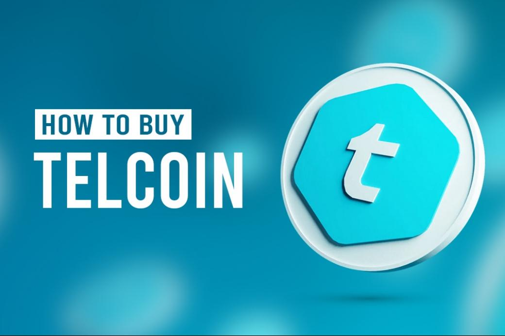

## Table of Contents

## What is Telcoin (TEL) and what is its purpose?

Telcoin (TEL) is a cryptocurrency that works on the Ethereum blockchain. It is designed to make sending money around the world easier and cheaper. Telcoin works with mobile phone companies to let people use their existing phone numbers to send and receive TEL. This means you don't need a special wallet or account to use it.

The main purpose of Telcoin is to help people who live in different countries send money to each other without high fees. For example, if someone in the United States wants to send money to their family in the Philippines, they can use Telcoin to do it quickly and cheaply. By using the existing mobile networks, Telcoin makes it easy for anyone with a phone to use cryptocurrency, even if they don't know much about it.

## How can someone acquire Telcoin (TEL) for the first time?

To get Telcoin (TEL) for the first time, you can use a cryptocurrency exchange that supports TEL. First, you need to sign up for an account on one of these exchanges, like Binance or KuCoin. After signing up, you'll need to verify your identity, which usually involves providing some personal information and maybe a photo ID. Once your account is set up and verified, you can deposit money into the exchange using a bank transfer or a credit/debit card. Then, you can use that money to buy Telcoin.

After you've bought Telcoin on the exchange, you might want to move it to a wallet where you can control it yourself. To do this, you'll need to set up a wallet that supports TEL, like Trust Wallet or MetaMask. Once your wallet is ready, you can send your Telcoin from the exchange to your wallet using your wallet's address. This way, you have full control over your Telcoin and can use it to send money to others or hold onto it as an investment.

## What are the different platforms where Telcoin (TEL) can be purchased?

You can buy Telcoin (TEL) on different platforms called [cryptocurrency](/wiki/cryptocurrency) exchanges. Some popular ones where you can get TEL are Binance, KuCoin, and Uniswap. These places let you trade your regular money or other cryptocurrencies for Telcoin. To start, you need to sign up for an account on one of these exchanges, then verify your identity, and finally, you can deposit money and buy TEL.

After you buy Telcoin on an exchange, you might want to move it to a wallet that you control. This can be done by setting up a wallet like Trust Wallet or MetaMask, which both support TEL. Once your wallet is ready, you can send your Telcoin from the exchange to your wallet using the wallet's address. This way, you have full control over your Telcoin and can use it to send money to others or keep it as an investment.

## What are the steps to set up a wallet for Telcoin (TEL)?

Setting up a wallet for Telcoin (TEL) is easy. First, you need to choose a wallet that supports TEL. Some good options are Trust Wallet and MetaMask. Trust Wallet is an app you can download on your phone, and MetaMask is a browser extension you can add to your computer. Once you've picked a wallet, download it or add it to your browser. Then, follow the instructions to set up your wallet. This usually means creating a new wallet and setting a password to keep it safe.

After setting up your wallet, you need to get your wallet address. This is like your bank account number but for cryptocurrency. In Trust Wallet, you can find your TEL address by going to the "Receive" section and choosing TEL. In MetaMask, you can see your address by clicking on your account and looking for the long string of letters and numbers. Once you have your address, you can use it to send Telcoin from an exchange to your wallet. Just copy the address and paste it into the exchange when you want to send your TEL. Now, you can control your Telcoin and use it to send money to others or keep it as an investment.

## What are the fees associated with buying and selling Telcoin (TEL)?

When you buy or sell Telcoin (TEL), you have to pay fees. These fees can come from the exchange where you're trading and from the blockchain network itself. Exchanges usually charge a fee for each trade you make. This fee can be a small percentage of the amount you're trading, like 0.1% or 0.2%. Some exchanges might have different fees for different types of trades or for using different payment methods. It's a good idea to check the fee structure of the exchange before you start trading.

On top of the exchange fees, there are also network fees when you move Telcoin from one place to another. These are called gas fees on the Ethereum network, where Telcoin is based. Gas fees can change a lot depending on how busy the network is. When a lot of people are using the network, the fees can go up. When it's not so busy, the fees can be lower. You'll need to pay these fees whenever you send Telcoin from an exchange to your wallet or from your wallet to someone else.

## How can Telcoin (TEL) be used after acquisition?

After you get Telcoin (TEL), you can use it to send money to other people easily. If you have a friend or family member in another country, you can send them TEL using their phone number. This is cheaper and faster than using a bank or other money transfer services. All you need to do is open your wallet app, enter the amount of TEL you want to send, and type in their phone number. The money will reach them quickly, and they can use it right away or change it into their local currency.

You can also keep Telcoin as an investment. Some people buy TEL because they think its value will go up over time. If you believe in the future of Telcoin and its mission to make sending money easier around the world, you might want to hold onto your TEL and see if its value grows. You can store your Telcoin in a wallet like Trust Wallet or MetaMask, where you control it and can decide when to sell it or use it.

## What are the security measures one should take when acquiring and storing Telcoin (TEL)?

When you get Telcoin (TEL), it's important to keep your money safe. Start by [picking](/wiki/asset-class-picking) a good exchange that has strong security. Look for exchanges that use two-[factor](/wiki/factor-investing) authentication (2FA), which adds an extra step to keep your account safe. When you sign up, use a strong password and turn on 2FA. Also, be careful about sharing your personal information and watch out for scams or fake websites that might try to trick you.

Once you have your Telcoin, you should move it to a wallet where you control it. This is safer than leaving it on an exchange. Choose a wallet like Trust Wallet or MetaMask, and make sure to write down your recovery phrase and keep it in a safe place. Never share your recovery phrase with anyone. Also, always double-check the wallet address before sending your Telcoin to make sure you're sending it to the right place. By taking these steps, you can help keep your Telcoin secure.

## What are the tax implications of buying and selling Telcoin (TEL)?

When you buy and sell Telcoin (TEL), you need to think about taxes. In many countries, when you make money from selling cryptocurrency like TEL, you have to pay taxes on that money. This is called capital gains tax. If you buy TEL for $100 and later sell it for $150, you made a $50 profit, and you might have to pay taxes on that $50. The exact amount of tax you pay can depend on how long you held the TEL before selling it and your country's tax laws.

You also need to be careful about keeping good records. Every time you buy or sell TEL, you should write down the date, the amount, and the price. This helps you figure out your taxes correctly at the end of the year. If you use TEL to buy things or send it to someone else, that can also have tax effects. It's a good idea to talk to a tax professional who knows about cryptocurrency to make sure you're doing everything right and not missing any important tax rules.

## How does the volatility of Telcoin (TEL) affect its acquisition strategy?

The price of Telcoin (TEL) can go up and down a lot, which is called [volatility](/wiki/volatility-trading-strategies). This can change how you decide to buy and sell it. If you think the price might go up soon, you might want to buy TEL now before it gets more expensive. But if you think the price might go down, you might wait to buy it later when it's cheaper. Volatility can make it risky to buy a lot of TEL at one time because the price could drop right after you buy it.

Because of this, some people choose to buy TEL little by little over time, instead of all at once. This way, they don't risk losing a lot of money if the price goes down suddenly. They can also buy more TEL when the price is low and less when it's high. This strategy can help them get TEL at a better average price over time. It's important to think about how much risk you're okay with and what you want to do with your TEL, like using it to send money or keeping it as an investment, when deciding how to buy it.

## What are the advanced trading strategies for Telcoin (TEL)?

One advanced trading strategy for Telcoin (TEL) is called dollar-cost averaging (DCA). This means you buy a little bit of TEL at regular times, no matter what the price is. This can help you avoid buying all your TEL when the price is really high. Instead, you spread out your buys over time. This way, you can get a better average price for your TEL. It's a good strategy if you want to invest in TEL but don't want to worry about guessing when the price will go up or down.

Another strategy is called swing trading. This is when you try to buy TEL when the price is low and sell it when the price goes up. You need to watch the price of TEL closely and look for patterns. If you see the price going down and then starting to go back up, you might buy some TEL. Then, if the price keeps going up, you can sell it for a profit. This strategy can be riskier because you need to guess when the price will change, but it can also make you more money if you guess right.

A third strategy is using technical analysis. This means you look at charts and numbers to try to predict what the price of TEL will do next. You might use things like moving averages, which show the average price of TEL over time, or the Relative Strength Index (RSI), which tells you if TEL is overbought or oversold. By studying these tools, you can make better guesses about when to buy and sell TEL. This strategy takes some learning and practice, but it can help you make smarter trading decisions.

## How can one participate in Telcoin (TEL) governance and decision-making?

Telcoin (TEL) lets its users have a say in how the project grows and changes. This is called governance, and it's important because it lets the people who use and hold TEL help decide what happens next. To participate in Telcoin's governance, you need to have some TEL in your wallet. Then, you can vote on different ideas and proposals that the Telcoin team or other users come up with. These proposals might be about new features, changes to the system, or other big decisions. By voting, you help guide Telcoin in a direction that you think is best.

To get involved, you can join the Telcoin community on social media or forums where they talk about these proposals. You can read about the different ideas, ask questions, and share your thoughts. When it's time to vote, you'll use your TEL to show which proposals you support. The more TEL you have, the more say you get in the voting. This way, everyone who cares about Telcoin can help shape its future.

## What are the future prospects and developments for Telcoin (TEL) that could impact its value?

Telcoin (TEL) has some exciting plans that could make its value go up in the future. One big thing they're working on is expanding to more countries and working with more mobile phone companies. Right now, Telcoin works with some phone companies to let people use their phone numbers to send and receive TEL. If they can work with more companies around the world, more people will be able to use Telcoin easily. This could make TEL more popular and increase its value. Another thing they're doing is adding new features, like letting people pay bills or buy things with TEL. If these features make Telcoin more useful, more people might want to use it, which could also make its value go up.

Another important development for Telcoin is improving how fast and cheap it is to send TEL. Right now, Telcoin uses the Ethereum blockchain, which can be slow and expensive sometimes. But they're working on using other blockchains that might be faster and cheaper. If they can make sending TEL quicker and less costly, more people might want to use it to send money around the world. This could make Telcoin more popular and valuable. Also, Telcoin is always looking for new ways to help people who live in different countries send money to each other easily. If they keep coming up with good ideas and making their service better, the value of TEL could keep growing.

## References & Further Reading

[1]: Bergstra, J., Bardenet, R., Bengio, Y., & Kégl, B. (2011). ["Algorithms for Hyper-Parameter Optimization."](https://dl.acm.org/doi/10.5555/2986459.2986743) Advances in Neural Information Processing Systems 24.

[2]: ["Advances in Financial Machine Learning"](https://www.amazon.com/Advances-Financial-Machine-Learning-Marcos/dp/1119482089) by Marcos Lopez de Prado

[3]: ["Evidence-Based Technical Analysis: Applying the Scientific Method and Statistical Inference to Trading Signals"](https://www.amazon.com/Evidence-Based-Technical-Analysis-Scientific-Statistical/dp/0470008741) by David Aronson

[4]: ["Machine Learning for Algorithmic Trading"](https://github.com/stefan-jansen/machine-learning-for-trading) by Stefan Jansen

[5]: ["Quantitative Trading: How to Build Your Own Algorithmic Trading Business"](https://books.google.com/books/about/Quantitative_Trading.html?id=j70yEAAAQBAJ) by Ernest P. Chan