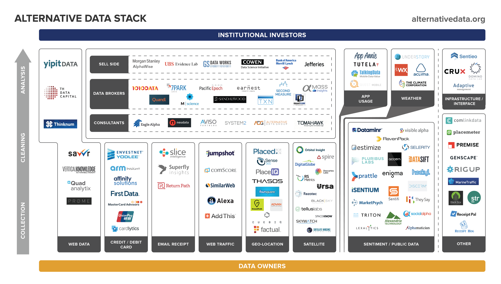

## Table of Contents

## What is telecom alternative data?

Telecom alternative data refers to information that telecom companies gather from their networks and services, which can be used for purposes other than just providing communication services. This data can include things like how much data people use, where they are when they use it, and what types of services they use most often. Companies can use this information to learn more about customer behavior and market trends, which can help them make better decisions about their business.

For example, if a telecom company sees that many people are using a lot of data in a certain area, they might decide to improve their network there or offer new services that people in that area might like. This kind of data can also be sold to other businesses, like retailers or advertisers, who can use it to understand their customers better and target their marketing more effectively. By using telecom alternative data, companies can gain valuable insights that help them stay competitive and meet their customers' needs more effectively.

## Why is telecom alternative data important for businesses?

Telecom alternative data is important for businesses because it gives them a lot of useful information about how people use their phones and the internet. This data can show where people are when they use their phones, how much data they use, and what kinds of services they like. By looking at this information, businesses can learn more about what their customers want and need. For example, if a telecom company sees that a lot of people in a certain area are using a lot of data, they might decide to improve their network there or offer new services that people in that area would like.

This data is also helpful for other businesses, like stores or companies that advertise. They can buy this data from telecom companies and use it to understand their customers better. For instance, if a store knows that many people in a certain area use a lot of data on their phones, they might decide to target their ads to those people. This can help businesses make better decisions about where to spend their money and how to reach their customers more effectively. In the end, using telecom [alternative data](/wiki/best-alternative-data) helps businesses stay ahead of their competition and meet their customers' needs better.

## What are the common sources of telecom alternative data?

Telecom alternative data comes from many places within a telecom company's network. One main source is the data usage records that show how much data people use, when they use it, and where they are when they use it. This information is collected every time someone uses their phone or the internet through the telecom's service. Another source is the call detail records, which show when and where calls are made, how long they last, and who is calling whom. These records can help businesses understand communication patterns and customer behavior.

In addition to usage and call data, telecom companies also gather information from their billing systems. This includes details about what services customers are paying for, how often they pay, and any changes they make to their plans. This billing data can show trends in what services are popular and how customers' needs change over time. Finally, telecom companies can also use data from their customer service interactions, like calls to support lines or feedback from surveys. This helps them understand what customers like or don't like about their services, which can guide future improvements and marketing strategies.

## How can telecom alternative data be used to improve marketing strategies?

Telecom alternative data can help businesses make their marketing better by showing them where people use their phones and what they like to do online. For example, if a company sees that a lot of people in a certain area use a lot of data, they might decide to put more ads there. This way, they can reach more people who are likely to be interested in what they are selling. By knowing where and when people use their phones, businesses can make sure their ads show up at the right time and place, which can make their marketing more effective.

Also, telecom alternative data can show businesses what kinds of services people use the most. If a company sees that many people are using video streaming services, they might decide to advertise their products during popular shows or movies. This helps them reach people when they are already watching something they enjoy, which can make the ads more appealing. By using this data, businesses can tailor their marketing to fit what their customers like, which can help them sell more and grow their business.

## What are the ethical considerations when using telecom alternative data?

Using telecom alternative data can help businesses a lot, but it also brings up some important ethical questions. One big concern is privacy. When telecom companies collect data about where people are and what they do online, it can feel like they are watching people too closely. People might not like it if their personal information is used to target them with ads or sold to other companies. It's important for telecom companies to be clear about what data they collect and how they use it, so people can trust them.

Another ethical issue is making sure the data is used fairly. If telecom companies use this data to decide who gets better services or higher prices, it could be unfair to some people. For example, if a company charges more for data in certain areas because they know people there use a lot of it, that could hurt people who can't afford to pay more. Telecom companies need to think about how their use of data affects different groups of people and make sure they are treating everyone fairly.

## How is telecom alternative data collected and processed?

Telecom alternative data is collected from different parts of a telecom company's network. Every time someone uses their phone or the internet, the company keeps track of how much data they use, where they are, and what services they use. This information comes from data usage records and call detail records. Data usage records show how much data people use and where they are when they use it. Call detail records show when and where calls are made, how long they last, and who is calling whom. Telecom companies also collect information from their billing systems, which shows what services customers pay for and how often they pay. All this data helps the company understand how people use their services.

Once the data is collected, it needs to be processed so it can be useful. First, the data is cleaned to make sure it is accurate and complete. This means fixing any mistakes and filling in any missing information. Then, the data is analyzed to find patterns and trends. For example, the company might look at the data to see if people in certain areas use more data or if certain services are more popular at different times of the day. After analyzing the data, it can be used to make decisions about improving services, targeting marketing, or even selling to other businesses. This whole process helps telecom companies use the data they collect to better understand and serve their customers.

## What are the challenges in analyzing telecom alternative data?

Analyzing telecom alternative data can be hard because there is so much of it. Every time someone uses their phone or the internet, the telecom company collects a lot of information. This means the company has to deal with huge amounts of data, which can be slow and difficult to manage. Also, the data can be messy. Sometimes it has mistakes or missing parts, so the company has to clean it up before they can use it. This takes a lot of time and effort.

Another challenge is making sure the data is private and safe. People might not like it if their personal information is used without their permission. Telecom companies have to be careful to follow the rules about privacy and keep the data secure. They also need to make sure they are using the data in a fair way. If they use it to treat some people differently, like charging them more for data, it could be unfair. So, they have to think carefully about how they use the data to make sure they are doing the right thing.

## How can telecom alternative data enhance customer segmentation?

Telecom alternative data can help businesses understand their customers better by showing them how people use their phones and the internet. This data includes information like where people are when they use their phones, how much data they use, and what kinds of services they like. By looking at this information, businesses can group their customers into different segments based on their habits and needs. For example, if a telecom company sees that a lot of people in a certain area use a lot of data, they might create a segment for those customers and offer them special plans or services that fit their needs.

Using telecom alternative data for customer segmentation can make marketing and services better. When businesses know more about what different groups of customers want, they can create ads and offers that are more likely to interest those groups. For instance, if the data shows that a group of customers likes to watch videos on their phones, the company might target ads for video streaming services to that group. This way, the company can reach the right people with the right message, which can help them sell more and keep their customers happy.

## What role does machine learning play in analyzing telecom alternative data?

Machine learning helps telecom companies make sense of the huge amount of data they collect. It can find patterns and trends in the data that would be hard for people to see on their own. For example, [machine learning](/wiki/machine-learning) can look at data usage records to see if people in certain areas use more data at certain times of the day. This helps the company understand how people use their services and make better decisions about where to improve their network or what new services to offer.

Machine learning also makes it easier to group customers into different segments. By looking at the data, machine learning can find groups of customers who have similar habits and needs. This helps the company create special plans or services for those groups. For example, if machine learning finds that a group of customers likes to use a lot of data for video streaming, the company can target ads and offers for video streaming services to that group. This way, the company can reach the right people with the right message, which can help them sell more and keep their customers happy.

## How does telecom alternative data contribute to predictive analytics in the telecom industry?

Telecom alternative data helps telecom companies predict what their customers will do in the future. By looking at data like how much data people use, where they use it, and what services they like, companies can see patterns and trends. For example, if a company sees that more people are using data in a certain area at certain times, they can predict that this trend will continue. This helps them plan better, like improving their network in that area or offering new services that people there might want.

Using telecom alternative data for predictive analytics also helps companies make better decisions about their business. If they can predict what services will be popular or where they need to focus their efforts, they can save money and time. For instance, if the data shows that more people will start using video streaming services, the company can prepare by making sure their network can handle the extra data and by creating special plans for those customers. This way, they can meet their customers' needs before they even ask, which makes everyone happier.

## What are the regulatory frameworks governing the use of telecom alternative data?

Using telecom alternative data is controlled by rules that make sure it is used fairly and safely. In many countries, there are laws about privacy that say telecom companies must tell people what data they collect and how they use it. These laws also say that people have the right to see their data and ask for it to be changed or deleted. For example, in the European Union, the General Data Protection Regulation (GDPR) sets strict rules about how personal data can be used. In the United States, there are rules like the Telecommunications Act and the Federal Trade Commission's guidelines that telecom companies must follow.

These rules also make sure that telecom companies use the data in a way that is fair to everyone. They cannot use the data to treat some people differently, like charging them more for services just because they use a lot of data. The rules also say that telecom companies must keep the data safe and protect it from being stolen or misused. By following these rules, telecom companies can use alternative data to help their business while also respecting their customers' rights and keeping their information safe.

## What are the future trends and innovations expected in the field of telecom alternative data?

In the future, telecom alternative data is expected to become even more important for businesses. As more people use their phones and the internet, telecom companies will collect more data about how people use their services. This will help them understand their customers better and make better decisions about what services to offer. One big trend is the use of [artificial intelligence](/wiki/ai-artificial-intelligence) and machine learning to analyze this data. These technologies can find patterns and trends in the data that would be hard for people to see on their own. This can help telecom companies predict what their customers will want in the future and plan accordingly.

Another trend is the use of telecom alternative data for more personalized services. As companies learn more about what different groups of customers like, they can create special plans and offers that fit those needs. For example, if the data shows that a group of customers likes to use a lot of data for video streaming, the company can offer them a plan that gives them more data for streaming at a good price. This can help companies keep their customers happy and attract new ones. Also, as privacy rules get stricter, telecom companies will need to find new ways to use the data while still respecting their customers' rights. This might mean using more secure ways to collect and store data, or finding new ways to get permission from customers to use their data.

## References & Further Reading

[1]: ["Using Alternative Data in Fintech: What is It and Why Does It Matter?"](https://builtin.com/articles/alternative-data) by Capco Institute

[2]: ["The Quant Revolution, Big Data, and Machine Learning"](https://www.nature.com/articles/s41467-021-22539-9) by Rich Kuseler, CFA Institute

[3]: ["Alternative Data in the Financial Industry"](https://www2.deloitte.com/us/en/pages/financial-services/articles/alternative-data-perspectives-and-insights.html) by Prithvijit Pal, ResearchGate

[4]: ["Alternative Data: Mainstream Adoption Set to Drive Further Growth"](https://www.gminsights.com/industry-analysis/alternative-data-market) by Opimas Research

[5]: ["Advances in Financial Machine Learning"](https://resources.caih.jhu.edu/textbooks/Resources/_pdfs/Advances_In_Financial_Machine_Learning.pdf) by Marcos Lopez de Prado

[6]: ["The Power of Mobile Data Analytics"](https://magenative.com/blog/mobile-app-analytics/) by Nathan Eagle, Nature 

[7]: ["Quantifying Human Mobility Patterns using Telecommunication Data"](https://www.nature.com/articles/s41598-017-13309-7) by Laura Alessandretti et al., Nature Scientific Reports