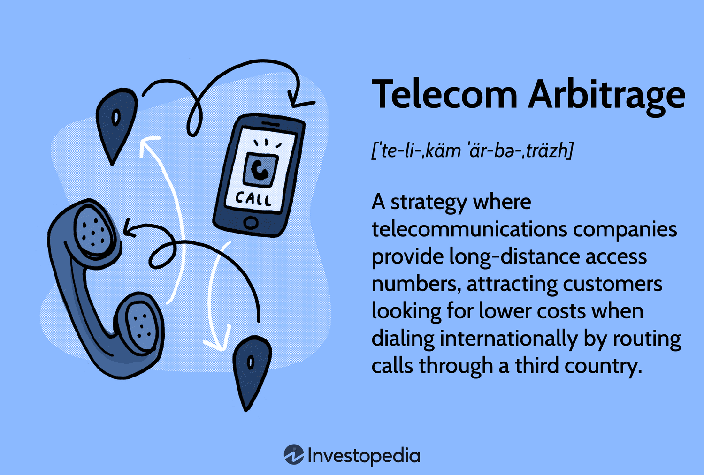

## Table of Contents

## What is telecom arbitrage?

Telecom arbitrage is a way to make money by taking advantage of differences in the cost of phone calls between different countries or companies. Imagine you have a friend in another country, and it costs less for you to call them through one company than another. If you buy the cheaper call and sell it to someone else at a higher price, you can make a profit. This is what telecom arbitrage is all about.

People who do telecom arbitrage look for these price differences and use them to their advantage. They might buy a large number of minutes from a company where calls are cheap and then sell those minutes to others who need to make calls to that country but would have to pay more through their own service provider. It's like buying something at a discount and selling it for a profit, but with phone calls.

## How does telecom arbitrage work?

Telecom arbitrage works by finding and using differences in the price of phone calls between different countries or companies. Imagine you can call a friend in another country for a low price through one company, but it's more expensive through another. If you buy a lot of these cheaper calls and then sell them to others who need to call that country, you can make money. It's like buying something cheap and selling it for more.

To do telecom arbitrage, people first look for where calls are cheaper. They might find that calling from the US to India is less expensive through Company A than through Company B. They buy a bunch of minutes from Company A, then sell those minutes to people who would normally use Company B. This way, they earn the difference between what they paid and what they sold the minutes for. It's all about spotting these price differences and using them to make a profit.

## What are the basic requirements to start telecom arbitrage?

To start telecom arbitrage, you need to know where phone calls are cheaper. This means you have to research different companies and countries to find the best deals. You'll need a good understanding of how much it costs to call different places around the world. You also need to be able to buy a lot of these cheaper minutes from one company.

Once you have the cheaper minutes, you need to find people who want to make calls but would pay more through their own service provider. You sell these minutes to them at a higher price than what you paid. This way, you make a profit from the difference. To do this successfully, you need to be good at finding customers and managing your costs and sales.

## What are the different types of telecom arbitrage?

Telecom arbitrage can be split into two main types: voice arbitrage and SMS arbitrage. Voice arbitrage is when someone finds a cheaper way to make phone calls and then sells those calls to others at a higher price. For example, if it's cheaper to call India through one company than another, someone might buy a lot of minutes from the cheaper company and sell them to people who need to call India but would pay more through their own service provider.

SMS arbitrage works in a similar way, but with text messages instead of calls. If sending a text to a certain country is cheaper through one company, someone might buy a bunch of these cheaper texts and then sell them to others at a higher price. Both types of arbitrage rely on finding price differences and using them to make a profit.

## What are the potential risks involved in telecom arbitrage?

Telecom arbitrage can be risky because it involves buying and selling phone calls or texts. One big risk is that the prices can change quickly. If the company you buy from raises their prices, you might not be able to sell your minutes or texts for a profit anymore. Another risk is that you might not find enough people to buy what you're selling. If you buy a lot of minutes or texts but can't sell them, you could lose money.

There are also legal risks to consider. Some countries have rules about buying and selling phone services. If you break these rules, you could get in trouble with the law. It's important to make sure you understand and follow all the rules in the places where you're doing business. Telecom arbitrage can be a good way to make money, but it's important to be aware of these risks and plan carefully.

## How can one identify profitable telecom arbitrage opportunities?

To find good telecom arbitrage opportunities, you need to look at the prices of phone calls and texts between different countries and companies. You can use the internet to check these prices. Look for places where it's much cheaper to call or text one country from another. For example, if it's cheaper to call India from the US through one company than another, that could be a good opportunity. You also need to keep an eye on how these prices change over time because they can go up or down quickly.

Once you find a cheaper price, you need to think about how you can buy a lot of those minutes or texts and then sell them to others who would pay more. You might need to talk to people or businesses who need to make calls or send texts to that country. It's important to make sure you can sell what you buy at a higher price to make a profit. Keep checking the prices and be ready to change your plan if the prices change.

## What are the legal and regulatory considerations for telecom arbitrage?

Telecom arbitrage involves buying and selling phone calls or texts, so you need to know the rules in the countries where you're doing business. Some places have strict laws about who can sell phone services and how they can do it. If you don't follow these rules, you could get in trouble with the law. It's important to check the laws in each country where you plan to buy or sell minutes or texts. This can help you avoid legal problems and make sure you're doing everything the right way.

Another thing to think about is that telecom companies might not like what you're doing. They might try to stop you or change their prices to make it harder for you to make a profit. You also need to be careful about how you handle customer information. If you're selling calls or texts, you might have to follow rules about keeping customer data safe. Make sure you understand all these rules before you start, so you can do telecom arbitrage without breaking any laws.

## How do technological advancements impact telecom arbitrage strategies?

Technological advancements have made it easier to find and use telecom arbitrage opportunities. With the internet, you can quickly check the prices of phone calls and texts from different companies around the world. This means you can spot good deals faster and buy and sell minutes or texts more easily. New technology also helps you keep track of your costs and sales, so you can make sure you're making a profit. For example, special software can help you see where prices are changing and help you decide when to buy or sell.

However, technology can also make telecom arbitrage more challenging. Companies use technology to watch for people doing arbitrage and might change their prices to stop it. They can also use technology to make their own services better and cheaper, which can make it harder for you to find good deals. So, while technology helps you find opportunities, it also means you have to keep learning and changing your strategies to stay ahead.

## What are the best practices for managing a telecom arbitrage operation?

To manage a telecom arbitrage operation well, you need to keep a close eye on the prices of phone calls and texts. Prices can change quickly, so you should check them often. Use the internet and special software to help you see where the best deals are. When you find a good deal, buy a lot of minutes or texts from the cheaper company. Then, find people or businesses who need to call or text that country but would pay more through their own service provider. Make sure you can sell what you buy at a higher price to make a profit.

It's also important to follow the rules in the countries where you're doing business. Some places have strict laws about selling phone services, so make sure you know and follow these rules. Keep your customers happy by giving them good service and keeping their information safe. Use technology to help you manage your costs and sales, but be ready to change your plans if prices change or if companies try to stop you from doing arbitrage. By staying on top of prices, following the rules, and using technology wisely, you can run a successful telecom arbitrage operation.

## How can data analytics be used to enhance telecom arbitrage?

Data analytics can help you find good telecom arbitrage opportunities by looking at lots of information about phone call and text prices. With data analytics, you can quickly see where the prices are lower and where they are higher. This helps you buy minutes or texts from the cheaper places and sell them to people who would pay more. You can also use data analytics to keep track of how prices change over time, so you know when to buy or sell to make the most profit. It's like having a smart helper that tells you the best times and places to do your arbitrage.

Using data analytics also helps you manage your telecom arbitrage operation better. You can use it to see how much you're spending and how much you're making, so you know if you're making a profit. It can also help you understand your customers better, so you can give them better service and sell more minutes or texts. By using data analytics, you can make smarter decisions and run your operation more smoothly, which can help you make more money from telecom arbitrage.

## What are the future trends in telecom arbitrage?

In the future, telecom arbitrage might become more difficult because companies are getting better at stopping it. They use technology to watch for people doing arbitrage and can change their prices quickly to make it harder to find good deals. But at the same time, new technology can help people doing arbitrage find new ways to make money. For example, using data analytics and artificial intelligence can help find even small price differences that can be used for arbitrage.

Another trend could be that more people start using apps and online services to make calls and send texts. This could create new opportunities for arbitrage because the prices for these services can be different from traditional phone companies. People doing arbitrage will need to keep learning and changing their strategies to stay ahead. They will need to use new tools and technology to find the best deals and manage their operations well.

## How do global economic factors influence telecom arbitrage?

Global economic factors can change how telecom arbitrage works. When countries' economies are doing well, people and businesses might spend more money on phone calls and texts. This can make it easier to find customers who want to buy cheaper minutes or texts from you. But if the economy is not doing well, people might spend less money, and it could be harder to sell what you buy. Also, changes in currency exchange rates can affect how much it costs to buy minutes or texts from different countries. If the currency of the country where you're buying from gets weaker, it might be cheaper for you to buy, but if it gets stronger, it could be more expensive.

Another way global economic factors can influence telecom arbitrage is through regulations and policies. Governments might change rules about buying and selling phone services, which can make it harder or easier to do arbitrage. For example, if a country starts to allow more companies to offer phone services, there might be more competition, and prices could go down. This could create new opportunities for arbitrage. But if a country makes stricter rules, it could be harder to do arbitrage legally. So, people doing telecom arbitrage need to keep an eye on what's happening in the global economy and be ready to change their plans.

## References & Further Reading

[1]: Nisar, T. M., & Prabhakar, G. P. (2017). ["Telecom Arbitrage in a Global Environment"](https://www.sciencedirect.com/science/article/pii/S0969698917302680). Telecommunications Policy, 41(5).

[2]: Soto, R. (2004). ["Telecom Arbitrage: Strategies for Profiting from International Telecommunications"](https://www.supermoney.com/encyclopedia/telecom-arbitrage). Artech House.

[3]: McCulloch, R. B., & PINIGAS, E. (2013). ["International Telecommunications Law and Regulation"](https://scielo.org.za/pdf/ajic/v25/07.pdf). Sweet & Maxwell.

[4]: Aldridge, I. (2013). ["High-Frequency Trading: A Practical Guide to Algorithmic Strategies and Trading Systems"](https://www.amazon.com/High-Frequency-Trading-Practical-Algorithmic-Strategies/dp/1118343506). Wiley.

[5]: Häubl, G., & Trifts, V. (2000). ["Consumer Decision Making in Online Shopping Environments: The Effects of Interactive Decision Aids"](https://www.jstor.org/stable/193256). Marketing Science, 19(1), 4-21.