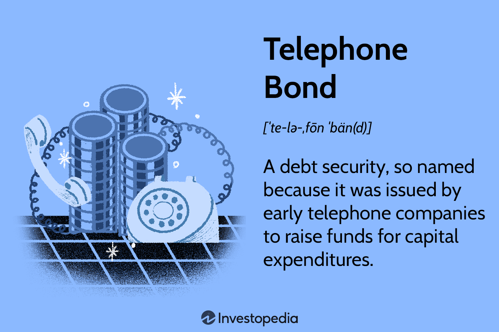

In the digital era, the landscape of finance has undergone substantial transformation powered by technological advancements. This change is especially visible in investment finance, where tools such as telephone bonds and algorithmic trading are fundamentally altering traditional methods and strategies. Grasping these components is essential for investors aiming to optimize their returns and adeptly navigate the intricate modern markets.

Telephone bonds, historically issued by large telecommunications companies, represent a vital part of the debt securities market. They provided a low-risk investment option, primarily due to the monopoly status held by these companies, which guaranteed stable revenue streams. However, with the deregulation of the telecommunications industry, these bonds have evolved, presenting both increased risk and opportunity to investors. Understanding this evolution is vital for investors looking to diversify their portfolios in the telecommunications sector.



Algorithmic trading (algo trading) represents another significant innovation, utilizing comprehensive automated systems to execute trades based on predefined criteria. In bond markets, including those for telephone bonds, algo trading enables efficient data management, optimized trade execution, and the exploitation of market inefficiencies. The rise of algorithmic platforms is driven by technological progress, enhanced data availability, and the demand for more cost-effective trading solutions.

This article provides an exploration of the intricate interaction between investment finance, telephone bonds, and algorithmic trading. By examining their roles and how they interconnect, this discussion aims to offer investors critical insights into leveraging these advancements for competitive advantage. Understanding these topics will position investors to harness technological trends for portfolio growth and sustained success in the evolving financial landscape.

## Table of Contents

## Understanding Telephone Bonds

Telephone bonds are financial instruments that have historically played a crucial role in funding the capital expenditures of telephone companies. These bonds represent a form of debt security, providing investors with a stable income through interest payments. The foundation of their stability originated from the monopoly status many telephone companies once held in their respective markets. During that period, telephone companies were often the sole providers of telecommunications services, granting them a consistent flow of revenue and making their bonds a relatively safe investment. 

The landscape of telephone bonds underwent significant changes following the deregulation of the telecommunications industry, which began in earnest with the breakup of the Bell System in the United States in the early 1980s. This deregulation introduced competition, altering the risk profile of these bonds. As new companies entered the market, telephone companies faced increased competition, impacting their revenue stability and, consequently, the perceived safety of their bonds. These changes forced investors to reconsider the risk associated with telephone bonds, factoring in the new market dynamics.

Despite these challenges, telephone bonds continue to attract investors, albeit with a redefined risk profile. Today, investors in telephone bonds must assess the creditworthiness of issuers amidst a diverse telecommunications landscape, which now includes internet and cable providers. This diversity offers investors various opportunities to tailor their portfolios to specific risk preferences and investment goals within the telecommunications sector.

Modern telephone bonds, while inherently riskier post-deregulation, provide opportunities for diversification and potential growth in sectors associated with technological advancements and telecommunications infrastructure development. As such, they remain an intriguing option for investors looking to capitalize on the evolving telecommunications market.

## The Role of Bonds in Investment Finance

Bonds play a significant role in investment finance as they offer a strategic blend of risk and return, primarily through interest payments and capital preservation. Investors include bonds in their portfolios to achieve stable returns and mitigate risk through diversity. As fixed-income securities, bonds promise regular interest payments, known as coupon payments, and the return of the bond's face value upon maturity. This characteristic makes them a more predictable investment compared to equities, which can exhibit higher [volatility](/wiki/volatility-trading-strategies).

Understanding the various types of bonds is crucial for developing effective investment strategies. Municipal bonds are issued by local government entities and often provide tax-exempt interest, making them attractive to investors in higher tax brackets. Corporate bonds are issued by companies to raise capital for expansion or operations and typically offer higher yields than government securities due to increased risk. Telephone bonds, a subset of corporate bonds historically issued by telephone companies, were once considered low-risk due to the monopolistic nature of these companies and their consistent revenue streams.

Bonds also offer essential [liquidity](/wiki/liquidity-risk-premium) and stability to an investment portfolio. They provide a counterbalance to more volatile asset classes like stocks. This balancing act is vital; if equity markets falter, the stability of bonds can mitigate losses at the portfolio level. Furthermore, during times of economic uncertainty, investors often seek refuge in bonds, as they tend to perform better than stocks due to their lower risk profile.

{
margin: 0 0 10px 0;
padding: 5px;
background-color: #f8f9fa;
border-left: 5px solid #ff7f50;
}

The role of bonds extends beyond individual portfolios to broader markets, where they serve as indicators of economic health and [interest rate](/wiki/interest-rate-trading-strategies) trends. Central banks, for example, use government bond yields to gauge inflation expectations and economic growth. Changes in interest rates directly impact bond prices, as their fixed interest payments become more or less attractive relative to newly issued bonds.

In summary, bonds are indispensable tools in investment finance, providing a stable foundation when integrated into diverse portfolios. Their capacity to offer liquidity, regular income, and risk mitigation underscores their enduring appeal among both individual and institutional investors.

## Algorithmic Trading: Transforming Bond Markets

Algorithmic trading, or algo trading, leverages automated systems to execute trades according to predefined criteria. This technique has revolutionized financial markets by enhancing the speed and accuracy of trades while reducing human error. In bond markets, [algorithmic trading](/wiki/algorithmic-trading) plays a pivotal role by efficiently handling large volumes of data, optimizing trade executions, and identifying market inefficiencies.

The shift towards algorithmic platforms in bond trading is driven by several key factors. Firstly, technological advancements, particularly in computing power and data processing, have enabled the development of sophisticated trading algorithms. These algorithms can process extensive datasets, including historical pricing, interest rates, and credit ratings, to make informed trading decisions swiftly.

Secondly, the availability of high-quality data has empowered traders to develop precise trading strategies. Data on bond prices, yields, and market conditions are now readily accessible, facilitating real-time analysis. Algorithmic trading systems can analyze this data to predict price movements or identify [arbitrage](/wiki/arbitrage) opportunities, thus allowing traders to capitalize on market inefficiencies.

Furthermore, the need for cost-effective trading solutions has propelled the adoption of algorithmic trading in the bond market. Traditional trading methods, relying heavily on human discretion, can be time-consuming and costly. Automation through algorithms reduces transaction costs by minimizing the need for manual intervention. This efficiency is particularly valuable in markets with high-[volume](/wiki/volume-trading-strategy) trading, where speed and cost-effectiveness are crucial.

To exemplify, consider a basic Python algorithm designed to evaluate potential bond trades. The script could incorporate data on interest rate changes, credit spreads, and historical bond performance. By applying pre-set trading rules, the algorithm can execute buy or sell orders when specified conditions are met, ensuring optimal trade execution without delay:

```python
import numpy as np
import pandas as pd

# Example dataset (simplified)
bond_data = pd.DataFrame({
    'interest_rate': [2.5, 2.7, 2.6, 2.8],
    'credit_spread': [1.1, 1.2, 1.0, 1.3],
    'historical_return': [5.0, 5.3, 5.1, 5.4]
})

# Define trading rules
def evaluate_trade(row):
    if row['interest_rate'] < 2.7 and row['credit_spread'] < 1.2:
        return 'BUY'
    elif row['interest_rate'] > 2.65 and row['credit_spread'] > 1.1:
        return 'SELL'
    else:
        return 'HOLD'

# Apply trading rules
bond_data['trade_action'] = bond_data.apply(evaluate_trade, axis=1)
print(bond_data[['interest_rate', 'credit_spread', 'trade_action']])
```

The script above evaluates bond data against trading rules to determine whether to buy, sell, or hold a bond. This simple example illustrates how algorithms can automate decision-making processes by applying consistent logic to market data.

In summary, algorithmic trading in bond markets enables the swift and precise execution of trades while capitalizing on technological advancements and vast data resources. It offers a cost-effective alternative to traditional trading methods by maximizing the use of available data and minimizing transaction costs, thereby transforming the bond market landscape.

## Case Study: Algorithmic Trading in Telephone Bonds

Telephone bonds, as a category, hold particular interest for financial analysts and investors due to their historical importance and unique market dynamics. The introduction of algorithmic trading into this space has prompted notable transformations, despite inherent challenges. 

Algorithms leveraged in trading telephone bonds can play a critical role in identifying credit risks. Credit risk assessment is crucial, as it determines the likelihood of a bond's issuer defaulting on payments. Through sophisticated data analysis, algorithms can evaluate vast datasets to extract indicators of financial health, or lack thereof, in issuing entities. This analysis might involve parsing financial statements, tracking credit ratings, and monitoring macroeconomic indicators that affect the telecommunications industry. These processes help create a more comprehensive picture of creditworthiness than traditional methods.

Telephone bonds also exhibit price discrepancies that algorithms can exploit for profit. Algorithms enable traders to swiftly detect and act upon price differences across markets or trading platforms, benefiting from arbitrage opportunities that would be nearly impossible to identify manually. These algorithms might employ [statistical arbitrage](/wiki/statistical-arbitrage) strategies, which analyze historical price movements and apply predictive models to forecast future price trajectories.

Another advantage lies in liquidity management. Given that telephone bonds can exhibit substantial liquidity fluctuations, particularly as the telecommunications sector adapts to technological advancements and regulatory changes, algorithms can dynamically manage portfolios to optimize liquidity risk. For example, algorithms might employ [machine learning](/wiki/machine-learning) techniques to adaptively forecast liquidity conditions and adjust trading strategies in response to anticipated changes.

The evolution of telephone companies and their infrastructure significantly affects algorithmic trading strategies for these bonds. The telecommunications sector has undergone substantial transformation due to digitalization, increased competition, and regulatory modifications. As telecom companies diversify their business models and invest in new technologies, their financial frameworks and, consequently, their credit profiles change. Algorithms must be designed to adapt to these shifts, utilizing real-time data and analytics to reassess investment strategies continuously.

In summary, the integration of algorithmic trading into telephone bonds offers significant opportunities for enhanced risk assessment, price discovery, and liquidity optimization. However, it also demands constant adjustment to telecom industry's changes, necessitating ongoing innovation in algorithm design and implementation. This integration ultimately aims to provide investors with a robust framework for navigating the complexities of trading in this specialized segment of the bond market.

## Benefits and Challenges of Algo Trading in Bonds

Algorithmic trading in bonds provides several advantages and presents unique challenges that investors must consider. The benefits of algorithmic trading primarily revolve around enhanced trading speed, accuracy, and the potential to increase profitability. This is primarily achieved through the reduction of human error and improved market insights.

Speed is a significant [factor](/wiki/factor-investing) when trading bonds algorithmically. Algorithms can execute trades within milliseconds, which is crucial in fast-moving markets where prices can change rapidly. This increase in speed helps traders capitalize on transient market opportunities that would not be captured through manual trading methods. Moreover, algorithmic systems can process vast amounts of market data, leading to more accurate decision-making by analyzing trends, pricing models, and historical data to forecast future bond prices. Enhanced market insights allow traders to optimize their trading strategies, thus improving profitability.

Despite these benefits, algorithmic trading in the bond market presents several challenges. The complexity and fragmentation of bond markets make it difficult for algorithms to achieve the levels of precision and execution observed in equity markets. Bond markets contain a diverse array of instruments, each with unique characteristics and levels of liquidity, complicating the creation of universal trading algorithms.

Regulatory requirements are another significant challenge. The bond market is heavily regulated, and maintaining compliance can be costly and time-consuming. Regulations can vary significantly between jurisdictions, adding a layer of complexity for algorithmic trading systems that operate across multiple markets.

Furthermore, developing and maintaining algorithmic trading systems requires substantial investment in technology and infrastructure. Initial setup costs are high, and there is also a need for ongoing maintenance and updates to ensure the system remains effective and compliant with regulatory standards. This can be a significant barrier for small to mid-sized investment firms.

Investors integrating algorithmic trading into their bond strategies must carefully weigh these benefits and challenges. Balancing the potential for increased efficiency and profitability against the costs and complexities of implementation is crucial for optimizing investment outcomes in the bond market.

## Conclusion

Investment finance is undergoing a significant evolution, characterized by the integration of traditional financial instruments and modern technological advancements. Telephone bonds and algorithmic trading exemplify this transformation, each contributing uniquely to the enhancement of investment strategies. For investors, these developments represent opportunities to achieve competitive advantages in portfolio management. By leveraging algorithmic trading capabilities, they can optimize trading strategies, minimize risks, and exploit market inefficiencies, particularly within the bond markets.

As technology continues to advance, the efficiency and scope of bond trading are poised for further transformation. Automated trading systems increasingly dominate the markets, offering unparalleled speed and precision that are unachievable through conventional methods. This shift not only addresses the complexity of bond markets but also fosters an environment where new trading strategies can be cultivated and refined.

The integration of traditional investment methods with modern technology facilitates a dynamic and adaptive investment environment. Savvy investors who embrace these changes can harness emerging tools and techniques to drive portfolio growth and resilience. The convergence of established assets like telephone bonds with cutting-edge trading technologies epitomizes the current trajectory of investment finance, where innovation is key to long-term success and sustainability.

## References & Further Reading

[1]: ["Advances in Financial Machine Learning"](https://www.amazon.com/Advances-Financial-Machine-Learning-Marcos/dp/1119482089) by Marcos Lopez de Prado

[2]: ["Machine Learning for Algorithmic Trading"](https://www.amazon.com/Machine-Learning-Algorithmic-Trading-alternative/dp/1839217715) by Stefan Jansen

[3]: ["Quantitative Trading: How to Build Your Own Algorithmic Trading Business"](https://www.amazon.com/Quantitative-Trading-Build-Algorithmic-Business/dp/1119800064) by Ernest P. Chan

[4]: ["Evidence-Based Technical Analysis: Applying the Scientific Method and Statistical Inference to Trading Signals"](https://www.amazon.com/Evidence-Based-Technical-Analysis-Scientific-Statistical/dp/0470008741) by David Aronson

[5]: Fabozzi, F. J. (2007). ["Fixed Income Analysis."](https://www.amazon.com/Fixed-Income-Analysis-Frank-Fabozzi/dp/047005221X) John Wiley & Sons. 

[6]: Hasbrouck, J. (2003). ["Intraday Price Formation in U.S. Equity Markets."](https://onlinelibrary.wiley.com/doi/10.1046/j.1540-6261.2003.00609.x) The Review of Financial Studies, 16(4), 1155–1187. 

[7]: BlackRock. (2021). ["2021 Global Bond Market Outlook."](https://www.orionportfoliosolutions.com/wp-content/uploads/dlm_uploads/2021/02/BR_2021_Global_Outlook_pdf_PNzLO4Tw.pdf) 