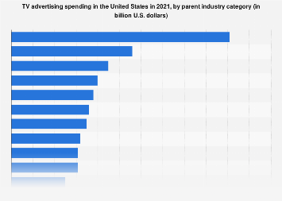

## Table of Contents

## What is television advertising?

Television advertising is when companies pay to show their ads on TV. These ads can be short commercials that play during breaks in TV shows, or they can be longer ads that are the main focus of the program. Companies use TV ads to tell people about their products or services, and to make people want to buy them. TV ads can reach a lot of people because many people watch TV every day.

Making a TV ad can be expensive, but it can also be very effective. Companies often hire special people to make their ads look good and be interesting. They choose the best times to show their ads, like during popular shows, so more people will see them. TV ads can use pictures, sounds, and even famous people to make the ads more memorable. This way, people are more likely to remember the product and want to buy it.

## How does television advertising work?

Television advertising works by companies paying to show their ads on TV. They make short commercials that play during breaks in TV shows or movies. These commercials are meant to tell people about their products or services and make them want to buy them. Companies choose the best times to show their ads, like during popular shows, so more people will see them. This way, they can reach a lot of people because many people watch TV every day.

Making a TV ad can be expensive, but it can also be very effective. Companies hire special people, like ad makers and actors, to make their ads look good and be interesting. They use pictures, sounds, and sometimes even famous people to make the ads more memorable. When people see these ads, they are more likely to remember the product and want to buy it. This is how TV advertising helps companies sell more of their products or services.

## What are the different types of TV ads?

There are several types of TV ads that companies use to show their products or services. One type is the traditional commercial, which is a short video that plays during breaks in TV shows or movies. These commercials can be anywhere from a few seconds to a few minutes long. Another type is the infomercial, which is a longer ad that can take up to half an hour or more. Infomercials give a lot of information about a product and often show how it works.

Another kind of TV ad is the product placement, where a product is shown in a TV show or movie without it being a commercial. For example, a character might drink a specific brand of soda or use a certain phone. This way, the product gets seen by viewers without them feeling like they are watching an ad. There are also sponsorships, where a company pays to have their name or logo shown during a TV show or event. This can be seen at the start of a show or during breaks, and it helps the company get more attention.

All these types of TV ads help companies reach people in different ways. Some ads are short and catchy, while others give a lot of details. By using different types of ads, companies can make sure more people see and remember their products or services.

## What are the benefits of advertising on television?

Advertising on television has many benefits. One big benefit is that TV can reach a lot of people. Many people watch TV every day, so when a company shows an ad on TV, a lot of people can see it. This means more people can learn about the company's products or services. TV ads can also be very powerful because they use pictures, sounds, and sometimes even famous people. This makes the ads more interesting and easier to remember. When people remember an ad, they are more likely to want to buy the product.

Another benefit of TV advertising is that it can target specific groups of people. Companies can choose when and where to show their ads, like during certain shows that are popular with certain groups. For example, if a company wants to reach young people, they might show their ad during a popular teen show. This way, the company can make sure their ad is seen by the people who are most likely to buy their product. TV ads can also build trust and make a brand seem more reliable. When people see a company's ad on TV, they might think the company is big and successful, which can make them more likely to trust and buy from that company.

## How much does it cost to advertise on TV?

The cost of advertising on TV can be different depending on many things. One big thing is the time of day the ad is shown. Ads that are shown during popular times, like during prime time when a lot of people are watching, can cost a lot more than ads shown at other times. Another thing that affects the cost is the channel. Ads on channels that a lot of people watch, like big sports channels or popular TV shows, can be more expensive. Also, how long the ad is can change the cost. A short 15-second ad will cost less than a longer 30-second or 60-second ad.

Another thing to think about is how often the ad is shown. If a company wants their ad to be shown a lot, it will cost more. The location where the ad is shown can also change the cost. For example, ads in big cities can be more expensive than ads in smaller towns. On average, the cost can be anywhere from a few hundred dollars to tens of thousands of dollars for just one ad. Because of all these things, companies need to plan carefully and think about what they can spend and what will work best for their product.

## How do you measure the effectiveness of TV ads?

Measuring the effectiveness of TV ads can be done in different ways. One way is to look at how many people see the ad. This is called the reach of the ad. Companies can use special tools to find out how many people watched the TV show when their ad was shown. Another way is to see if more people buy the product after seeing the ad. Companies can track sales before and after the ad runs to see if there is a change. They can also ask people if they remember seeing the ad and if it made them want to buy the product.

Another method is to use surveys and feedback. Companies can ask people directly if they saw the ad and what they thought about it. This can help them understand if the ad was clear and if it made people feel good about the product. Sometimes, companies also look at how much people talk about the ad on social media. If a lot of people are talking about the ad, it might mean the ad was effective and got people's attention. By using these different ways, companies can get a good idea of how well their TV ads are working.

## What is the target audience for TV advertising?

The target audience for TV advertising can be a lot of different people. It depends on what the company wants to do with their ad. Some companies want to reach everyone who watches TV, so they show their ads during popular shows that a lot of people watch. Other companies want to reach specific groups of people, like young people or families. They might show their ads during shows that these groups like to watch. By choosing the right time and channel, companies can make sure their ads are seen by the people they want to reach.

Companies also think about things like age, gender, and where people live when they plan their TV ads. For example, if a company is selling toys, they might show their ads during shows that kids watch. If they are selling makeup, they might show their ads during shows that women like to watch. By understanding who their target audience is, companies can make ads that these people will like and remember. This way, the ads are more likely to work and help the company sell more of their products.

## How has digital technology impacted TV advertising?

Digital technology has changed TV advertising a lot. Now, companies can use digital tools to show their ads to more people in different ways. They can put their ads on streaming services like Netflix or Hulu, where people watch shows on their computers or phones. This means ads can reach people who don't watch regular TV. Also, digital technology lets companies know more about who is watching their ads. They can use this information to show ads to the right people at the right time, making the ads more effective.

Another big change is that digital ads can be more interactive. People can click on an ad to learn more about a product or even buy it right away. This makes ads more interesting and can help companies sell more. Digital technology also lets companies change their ads quickly if they need to. If an ad isn't working well, they can fix it or try something new without waiting for the next TV season. This makes TV advertising more flexible and helps companies reach more people in better ways.

## What are the current trends in the television advertising industry?

One big trend in TV advertising is the move to digital platforms. More people are watching TV shows on streaming services like Netflix, Hulu, and YouTube. This means companies are putting their ads on these platforms to reach more people. They can use special tools to show ads to the right people at the right time. This makes the ads more effective because they are seen by people who are more likely to be interested in the product.

Another trend is the use of interactive ads. These ads let people do things like click on them to learn more about a product or even buy it right away. This makes ads more interesting and can help companies sell more. Also, companies are using more data to make their ads better. They can see who is watching their ads and change them quickly if they need to. This makes TV advertising more flexible and helps companies reach more people in better ways.

A third trend is the focus on shorter, more engaging ads. With people's attention spans getting shorter, companies are making ads that are quick and catchy. They use funny or emotional stories to grab people's attention. This way, even if people are watching TV on their phones or tablets, they are more likely to remember the ad and the product.

## How do regulations affect TV advertising?

Regulations are rules that TV stations and companies have to follow when they show ads on TV. These rules are made by the government to make sure ads are fair and honest. For example, there are rules about what you can say in an ad. You can't say things that aren't true or that might trick people. There are also rules about showing certain products, like alcohol or medicine. These rules help keep people safe and make sure they get the right information.

Another way regulations affect TV advertising is by controlling when and how often ads can be shown. For example, there might be rules about how many ads can be shown during a kids' show. This is to make sure kids don't see too many ads. There are also rules about showing ads for things like gambling or tobacco. These ads might not be allowed at certain times or on certain channels. By following these rules, companies can make sure their ads are seen by the right people and in the right way.

## What are the challenges faced by the TV advertising industry?

One big challenge for the TV advertising industry is that fewer people are watching regular TV. More people are using streaming services like Netflix and Hulu to watch shows on their computers or phones. This means companies have to find new ways to show their ads to people. They need to put their ads on these streaming services, but it can be hard to reach the same number of people as they did with regular TV. Also, streaming services often have fewer ads, so companies have to make their ads more interesting to get people's attention.

Another challenge is that people's attention spans are getting shorter. This means companies need to make ads that are quick and catchy. They use funny or emotional stories to grab people's attention. But making these kinds of ads can be expensive and hard. Companies also have to deal with a lot of rules about what they can say in their ads. They can't say things that aren't true or that might trick people. These rules help keep people safe, but they can make it harder for companies to make ads that stand out.

Lastly, the TV advertising industry faces the challenge of measuring how well their ads are working. It can be hard to know if an ad is making people want to buy a product. Companies use special tools to track how many people see their ads and if more people buy the product after seeing the ad. But these tools can be expensive and not always accurate. Companies also have to keep up with new technology and find ways to use it to make their ads better. All these challenges make it tough for the TV advertising industry to keep up with changes and stay successful.

## What future developments are expected in TV advertising?

In the future, TV advertising is expected to change a lot because of new technology. More people will watch TV on their phones and computers using streaming services like Netflix and Hulu. This means companies will show more ads on these platforms. They will use special tools to make sure their ads are seen by the right people at the right time. These tools will help companies know more about who is watching their ads and what they like. This way, they can make ads that are more interesting and effective.

Another big change will be the use of interactive ads. These ads will let people do things like click on them to learn more about a product or even buy it right away. This will make ads more fun and helpful for people. Companies will also use more data to make their ads better. They will be able to change their ads quickly if they need to, making TV advertising more flexible. With all these new developments, TV advertising will keep up with how people watch TV and what they want from ads.

## References & Further Reading

[1]: Pilkington, A. (2019). ["Streamlining TV Advertising: Programmatic Advertising"](https://www.tandfonline.com/doi/full/10.1080/02650487.2018.1461733). Warc.

[2]: "The Rise of Programmatic TV: Revolutionising the TV advertising ecosystem with automation and data-driven strategies." (2020). [Marketing Interactive](https://www.cbs.com/).

[3]: "The Future of TV Advertising Report 2021." (2021). [PwC](https://en.wikipedia.org/wiki/Big_Four_accounting_firms).

[4]: Lomax, T. (2020). ["How Machine Learning is Revolutionizing Targeted Advertising."](https://www.sciencedirect.com/science/article/pii/S0148296322001680) Towards Data Science.

[5]: ["Digital and Traditional: TV Advertising Continues to Adapt."](https://foxadvert.com/en/marketing-academy/the-evolution-of-advertising-from-traditional-to-digital/) Nielsen Insights. 

[6]: Munson, B. (2019). ["Traditional TV’s place in the modern media landscape."](https://www.cablefax.com/distribution/the-resilience-of-traditional-tv-in-a-multi-screen-world) NextTV.

[7]: “Television's Persistence Amid the Digital Deluge.” (2018). [McKinsey & Company.](https://www.mckinsey.com/featured-insights/diversity-and-inclusion/diversity-wins-how-inclusion-matters?src_trk=em67658b24d0ba25.218679111380773875)