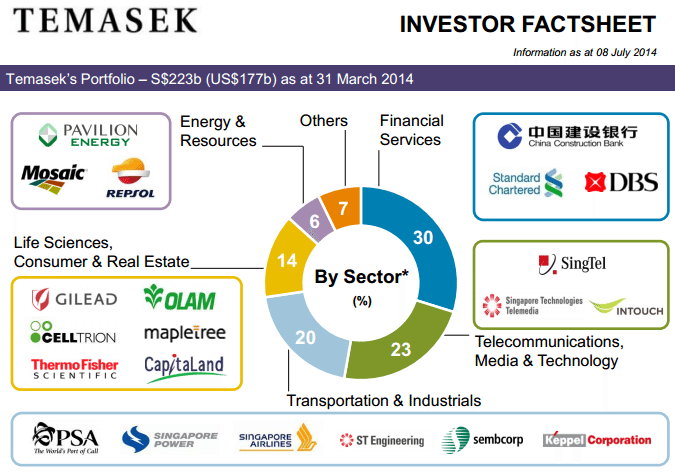

## Table of Contents

## What is Temasek Holdings?

Temasek Holdings is a company owned by the government of Singapore. It was started in 1974 to manage and grow the country's money. Temasek invests in many different businesses around the world, including banks, technology companies, and real estate. The goal is to make more money for Singapore and help its economy grow.

The company is run by a team of professionals who decide where to invest the money. They look for good opportunities that can bring high returns. Temasek is known for being smart with its investments and helping to build strong companies. It also focuses on making a positive impact on society and the environment through its investments.

## When was Temasek Holdings established?

Temasek Holdings was established in 1974. It is a company owned by the Singapore government. The main job of Temasek is to take care of and grow Singapore's money.

Temasek invests in many different types of businesses all over the world. This includes banks, technology companies, and real estate. By doing this, Temasek aims to make more money for Singapore and help its economy grow.

## What is the mission and vision of Temasek Holdings?

Temasek Holdings' mission is to make more money for Singapore and help its economy grow. They do this by investing in different businesses around the world. These businesses can be in banking, technology, or real estate. By choosing good investments, Temasek aims to increase the value of Singapore's money over time.

The vision of Temasek Holdings is to be a trusted company that not only makes money but also helps society and the environment. They want to make a positive impact through their investments. This means supporting businesses that are good for people and the planet. By doing this, Temasek hopes to build a better future for everyone.

## How does Temasek Holdings manage its portfolio?

Temasek Holdings manages its portfolio by carefully choosing where to invest its money. They look at many different businesses around the world, like banks, technology companies, and real estate. The team at Temasek decides which investments will likely bring the best returns. They use a lot of research and analysis to make these decisions. This helps them grow the value of Singapore's money over time.

In addition to making money, Temasek also focuses on making a positive impact on society and the environment. They choose investments that are good for people and the planet. This means supporting companies that help improve lives and protect the environment. By doing this, Temasek aims to build a better future for everyone while still growing Singapore's wealth.

## What are the key sectors Temasek Holdings invests in?

Temasek Holdings invests in many different types of businesses around the world. Some of the key sectors they focus on are financial services, like banks and insurance companies. They also invest a lot in technology, which includes companies that make software, hardware, and provide internet services. Another big sector for Temasek is real estate, where they buy and manage properties.

In addition to these, Temasek also puts money into the transportation and industrial sectors. This means they invest in companies that make things like cars, airplanes, and other machinery. They also have investments in healthcare, which includes hospitals, medical equipment, and pharmaceutical companies. By spreading their investments across these different sectors, Temasek aims to grow Singapore's money and help its economy.

## What is the geographic focus of Temasek Holdings' investments?

Temasek Holdings invests all over the world, but they focus a lot on Asia. They believe that Asia has many good opportunities for growth. Countries like China, India, and Southeast Asia are important places for Temasek. They invest in businesses in these countries because they think these businesses can grow a lot and make more money.

Besides Asia, Temasek also invests in other parts of the world like North America and Europe. They look for good companies in these places too. By spreading their investments around the world, Temasek tries to make sure they can grow Singapore's money no matter what is happening in one part of the world. This way, they can keep making money and help Singapore's economy grow.

## How does Temasek Holdings contribute to Singapore's economy?

Temasek Holdings helps Singapore's economy by investing the country's money in many different businesses around the world. They look for good opportunities in places like Asia, North America, and Europe. By choosing smart investments, Temasek makes more money for Singapore. This extra money can be used to improve things like schools, hospitals, and roads in Singapore. It also helps create jobs and makes the economy stronger.

Besides making money, Temasek also focuses on making a positive impact on society and the environment. They invest in companies that are good for people and the planet. This means supporting businesses that help improve lives and protect the environment. By doing this, Temasek not only grows Singapore's wealth but also helps build a better future for everyone in the country.

## What are some notable investments made by Temasek Holdings?

Temasek Holdings has made some big investments in different types of businesses. One of their notable investments is in Singapore Airlines, which is a very important company for Singapore. They also invested in DBS Bank, which is one of the biggest banks in Asia. These investments help make more money for Singapore and also help the country's economy grow.

Another big investment by Temasek is in the technology sector. They put money into companies like Alibaba, which is a huge online shopping company in China. They also invested in Tencent, which makes popular apps and games. These tech investments show that Temasek is looking for new and growing businesses that can bring a lot of money in the future.

Temasek also cares about making a positive impact on the world. They invested in companies that help the environment, like renewable energy businesses. For example, they put money into Keppel Corporation, which works on sustainable energy solutions. By choosing these kinds of investments, Temasek helps build a better future for everyone while still growing Singapore's wealth.

## How has Temasek Holdings performed financially in recent years?

Temasek Holdings has done well financially in recent years. They have made more money for Singapore by choosing good investments. In the last few years, their total portfolio value has grown. For example, in the year ending March 2023, Temasek's net portfolio value was about SGD 382 billion. This shows that they are doing a good job at growing Singapore's money.

Even though there have been some challenges, like the global health crisis and changes in the world economy, Temasek has managed to keep making money. They have been smart about where they invest, focusing on sectors like technology and healthcare that are growing fast. By spreading their investments around the world, Temasek has been able to handle these challenges and still make a profit. This helps Singapore's economy stay strong and grow.

## What is Temasek Holdings' approach to sustainability and ESG (Environmental, Social, and Governance) factors?

Temasek Holdings cares a lot about sustainability and ESG factors. They believe that making money and helping the planet and people can go together. Temasek looks for companies that are good for the environment, treat their workers well, and have strong leadership. They call this approach "positive impact investing." By choosing these kinds of businesses, Temasek wants to make a better future for everyone while still growing Singapore's money.

Temasek has set goals to reduce the bad effects their investments have on the environment. They want to lower the amount of greenhouse gases their companies produce. They also work to make sure the companies they invest in are fair to their workers and follow good rules. Temasek keeps track of how well their investments are doing in these areas and tries to make them better over time. This way, they can help build a world that is good for both people and the planet.

## How does Temasek Holdings engage with its stakeholders?

Temasek Holdings talks to many different people who care about what they do. These people include the government of Singapore, the companies they invest in, and the public. They share information about their investments and how they are doing. Temasek also listens to what these people think and want. They do this through meetings, reports, and events. By talking to everyone, Temasek makes sure they are doing what is best for Singapore and its people.

Temasek also works hard to be open and honest about their work. They tell everyone about their plans and how they are doing with their investments. They share this information in yearly reports and on their website. This helps everyone understand what Temasek is doing and why. By being clear and listening to everyone, Temasek builds trust and works better with all the people who matter to them.

## What are the future strategic plans of Temasek Holdings?

Temasek Holdings wants to keep growing Singapore's money in the future. They plan to do this by finding new and good places to invest. They will focus a lot on technology and healthcare because these areas are growing fast. Temasek also wants to invest more in Asia, especially in countries like China and India, because they see a lot of opportunities there. By spreading their investments around the world, Temasek hopes to make more money no matter what is happening in one part of the world.

Besides making money, Temasek also wants to help the planet and people. They plan to invest more in businesses that are good for the environment, like renewable energy. They also want to support companies that treat their workers well and follow good rules. Temasek will keep track of how their investments are doing in these areas and try to make them better over time. By doing this, they hope to build a better future for everyone while still growing Singapore's wealth.

## References & Further Reading

[1]: Kohl, W. (2018). ["Sovereign Wealth Fund Acquisitions and Other Foreign Government Investments in the United States: Assessing the Economic and National Security Implications"](https://www.banking.senate.gov/imo/media/doc/111407_Truman.pdf). Law and Business Review of the Americas, 14(3).

[2]: Ye, L., & Li, Z. (2018). ["Algorithmic Trading Strategies: Analysis and Performance Evaluation"](https://www.sciencedirect.com/science/article/pii/S0925838824048886). Quantitative Finance.

[3]: ["Temasek Review 2020"](https://tr20.temasekreview.com.sg/) - Published by Temasek Holdings, offers comprehensive insights on their financial activities and strategic focus.

[4]: Clark, G. L., Dixon, A. D., & Monk, A. H. B. (2013). ["Sovereign Wealth Funds: Legitimacy, Governance, and Global Power"](https://academic.oup.com/princeton-scholarship-online/book/23983) - A detailed analysis of the role and influence of sovereign wealth funds in global finance.

[5]: ["Global Investment Performance Standards (GIPS)"](https://rpc.cfainstitute.org/gips-standards) - CFA Institute program relevant for investment performance measurement, applicable to Temasek's reporting mechanisms.