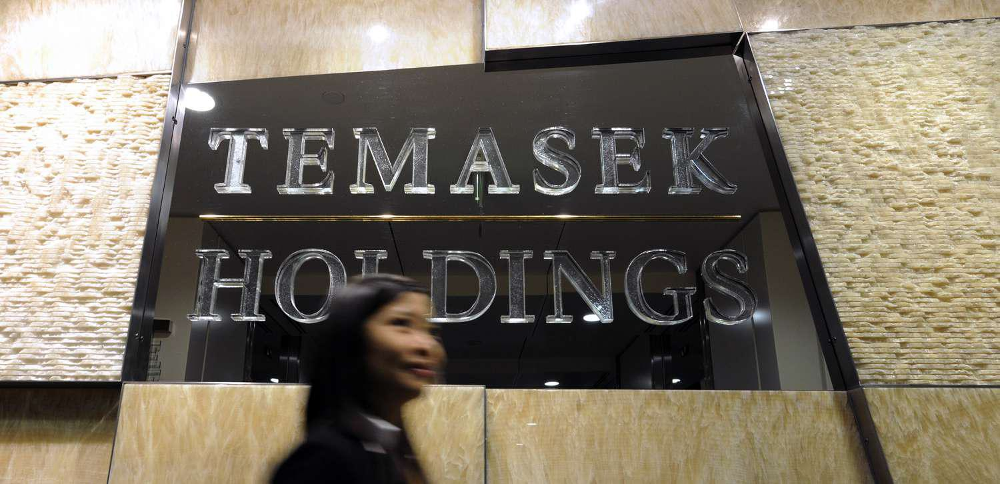

Temasek Holdings is a sovereign wealth fund established to manage a vast and varied investment portfolio on behalf of the Singapore government. Since its inception, Temasek has emerged as an influential entity in global finance, navigating diverse markets and sectors to solidify its role as a key player in both local and international spheres. As of March 2020, Temasek's portfolio was valued at SGD $306 billion, reflecting its significant impact and reach in the financial world.

Central to Temasek's strategic framework is its commitment to fostering sustainable growth and value creation. By investing across a multitude of sectors, including telecommunications, technology, transportation, and life sciences, Temasek ensures a diversified approach that mitigates risks and seizes opportunities across global markets. This diverse investment strategy not only bolsters Singapore's economic foundation but also reinforces its position in the broader economic landscape.



In recent years, Temasek has increasingly integrated algorithmic trading into its investment strategies. This modern approach leverages advanced computational technologies and data analytics to enhance trading efficiency and decision-making processes. By embracing such innovations, Temasek adapts to the fast-evolving financial environment, ensuring it remains at the forefront of investment management.

This article further elaborates on the strategic role Temasek Holdings plays in investment management, analyzing its contributions to Singapore's economy and its adoption of algorithmic trading. Through this exploration, the article highlights Temasek's importance as a contemporary leader in the global financial domain.

## Table of Contents

## Understanding Temasek Holdings

Temasek Holdings was established in 1974 under the Singapore Companies Act as a state-owned entity, serving as a cornerstone in the financial architecture of Singapore. Its inception marked a strategic move by the Singapore government to manage and grow the nation's wealth through diversified investments across multiple sectors globally. Over the years, Temasek has developed a robust investment portfolio that spans various industries, including telecommunications, media, technology, transportation, and life sciences.

Telecommunications and technology are significant components of Temasek's investment strategy. By investing in cutting-edge technology companies and global telecommunications firms, Temasek has positioned itself at the forefront of innovation and connectivity. These sectors provide substantial returns and facilitate technological advancement and communication infrastructures crucial to a globally interconnected economy.

In transportation, Temasek has made strategic investments in airlines, ports, and logistics companies. These investments ensure the seamless movement of goods and people, vital to Singapore's status as a global trade hub. The investments in life sciences demonstrate Temasek's commitment to driving advances in healthcare and biotechnology, sectors with immense potential for societal impact and financial growth.

As of March 2020, Temasek's investment portfolio was valued at approximately SGD $306 billion, underlining its significant influence in the global finance landscape. This massive portfolio not only demonstrates the efficacy of Temasek's diversification strategy but also accentuates its role as a substantial financial player with the capability to influence market trends and economic policies worldwide.

Temasek Holdings' strategy extends beyond financial returns; it focuses on investing responsibly and sustainably. This approach involves incorporating environmental, social, and governance ([ESG](/wiki/esg-investing)) considerations into its investment decisions, reflecting a commitment to ethical investment practices and long-term value creation. Through its diversified and strategic investments, Temasek continues to enhance Singapore's global economic standing while fostering sustainable development across the industries it invests in.

## Impact on the Singapore Economy

Temasek Holdings significantly impacts Singapore's economy, primarily through its strategic investment activities. By diversifying its portfolio globally, Temasek reduces Singapore's economic dependency on any single market or industry, thereby enhancing economic resilience. This diversification is crucial in mitigating risks associated with global economic fluctuations and ensuring consistent economic growth for Singapore.

Temasek's investments span various sectors including telecommunications, media, technology, transportation, and life sciences, which strengthens Singapore's industrial base. By investing in innovative sectors, Temasek promotes technological advancements and contributes to the development of high-tech industries within Singapore. This not only creates employment opportunities but also positions Singapore as a competitive player in the global market.

Moreover, Temasek plays a crucial role in public funding, as its investment profits are channeled back into the Singapore economy through dividends and taxes. The financial returns from Temasek’s investments bolster the national budget, enabling the government to allocate resources to infrastructure, healthcare, education, and other public services.

Temasek's contribution to local industries is significant. By providing capital to Singaporean enterprises, it aids in their growth and expansion, fostering a robust business environment. Additionally, Temasek’s engagement with international markets opens up global opportunities for local firms, integrating Singapore into the international economic fabric.

In conclusion, Temasek Holdings not only contributes to Singapore’s economic stability through diversified investments but also plays a pivotal role in supporting local industries and augmenting public funds. This strategic investment approach ensures sustained economic growth and development for Singapore.

## Algorithmic Trading and Its Role

Algorithmic trading involves the utilization of computer algorithms to execute trading orders based on established parameters such as timing, price, and [volume](/wiki/volume-trading-strategy). This approach significantly enhances trading efficiency and aids in more rapid decision-making processes. By automating the execution of trades, [algorithmic trading](/wiki/algorithmic-trading) reduces human intervention, which in turn minimizes errors and emotional biases that can impact market operations.

Temasek Holdings, recognizing the benefits of algorithmic trading, has integrated this approach into its portfolio management strategies. This adoption allows Temasek to navigate fast-evolving market conditions by leveraging the speed and precision offered by algorithmic tools. Algorithmic trading systems can process vast amounts of data more swiftly than manual processes, enabling Temasek to capitalize on transient market opportunities and optimize returns on their investments.

To execute trades efficiently, algorithmic systems rely on complex mathematical models and analytical tools. These can include statistical methods like time-series analysis to predict price movements, as well as [machine learning](/wiki/machine-learning) techniques to adapt to ever-changing market dynamics. For instance, a simple moving average crossover strategy can be implemented in Python as follows:

```python
import pandas as pd
import numpy as np

# Example data
data = {'price': [100, 101, 102, 101, 98, 100, 102, 103, 100, 104]}
df = pd.DataFrame(data)

# Calculate moving averages
df['short_mavg'] = df['price'].rolling(window=3, min_periods=1).mean()
df['long_mavg'] = df['price'].rolling(window=5, min_periods=1).mean()

# Generate buy/sell signals
df['signal'] = 0
df['signal'][3:] = np.where(df['short_mavg'][3:] > df['long_mavg'][3:], 1, -1)

# Display the signals and averages
print(df)
```

This code calculates the short-term and long-term moving averages of a stock price, generating buy and sell signals when the short-term average crosses above or below the long-term average, respectively.

The strategic use of algorithmic trading enables Temasek to maintain agility in its investment decisions, ensuring alignment with its broader objectives of maximizing returns and managing risks effectively. By keeping pace with technological advancements, Temasek solidifies its position as a leader in contemporary financial practices, poised to leverage emerging trends and innovations in investment management.

## The Future of Investment Management

Financial technology innovations have revolutionized investment management, progressively integrating data analytics and automation into traditional investment frameworks. Temasek Holdings exemplifies this transformation, utilizing these advancements to enhance operational efficiency and optimize investment strategies.

Data analytics plays a crucial role in deciphering vast amounts of market data to inform investment decisions. By harnessing big data, organizations like Temasek can identify patterns and trends that may not be immediately apparent through conventional analysis. This capacity for in-depth analysis enables more precise risk assessment and portfolio diversification, fostering a robust investment approach that is both reactive and proactive.

Automation, driven by algorithmic processes, complements data analytics by executing trades at high speeds and accuracy levels beyond human capability. These algorithms, based on criteria such as price, timing, or volume, allow for efficient capital deployment and flexibility in rapidly changing markets. By integrating automated trading systems, Temasek can swiftly adapt to market fluctuations, thereby maintaining a competitive edge.

A significant benefit of combining traditional investment strategies with modern algorithmic trading is the potential for enhanced portfolio management. This hybrid approach allows for a more dynamic allocation of assets, balancing long-term growth objectives with short-term market opportunities. Temasek's ability to leverage these technologies ensures a sustainable and adaptive investment strategy, positioning itself as a leader in the evolving landscape of asset management.

The future of investment management lies in the further integration of these technologies, promoting an investment environment characterized by increasingly sophisticated analytical tools and automated processes. As digital innovation advances, organizations like Temasek are setting a precedent for utilizing technology to achieve strategic investment objectives and maintain global competitiveness.

## Conclusion

Temasek Holdings stands as a significant entity within both Singaporean and international financial environments. Its adept incorporation of algorithmic trading mechanisms combined with a broad-ranging investment approach underscores its status as a front-runner in present-day investment management. By leveraging advanced computational methods, Temasek enhances its trading efficiency and decision-making, allowing it to adeptly navigate the complexities of global markets. The diversified nature of its investment portfolio reflects a strategic commitment to mitigating risk while optimizing returns, thereby contributing to economic resilience and growth. As financial technologies continue to evolve, Temasek's proactive adoption of innovative strategies ensures its sustained influence and leadership within the competitive landscape of global finance.

## References & Further Reading

[1]: Kohl, W. (2018). ["Sovereign Wealth Fund Acquisitions and Other Foreign Government Investments in the United States: Assessing the Economic and National Security Implications"](https://www.banking.senate.gov/imo/media/doc/111407_Truman.pdf). Law and Business Review of the Americas, 14(3).

[2]: Ye, L., & Li, Z. (2018). ["Algorithmic Trading Strategies: Analysis and Performance Evaluation"](https://www.sciencedirect.com/science/article/pii/S0925838824048886). Quantitative Finance.

[3]: ["Temasek Review 2020"](https://tr20.temasekreview.com.sg/) - Published by Temasek Holdings, offers comprehensive insights on their financial activities and strategic focus.

[4]: Clark, G. L., Dixon, A. D., & Monk, A. H. B. (2013). ["Sovereign Wealth Funds: Legitimacy, Governance, and Global Power"](https://academic.oup.com/princeton-scholarship-online/book/23983) - A detailed analysis of the role and influence of sovereign wealth funds in global finance.

[5]: ["Global Investment Performance Standards (GIPS)"](https://rpc.cfainstitute.org/gips-standards) - CFA Institute program relevant for investment performance measurement, applicable to Temasek's reporting mechanisms.