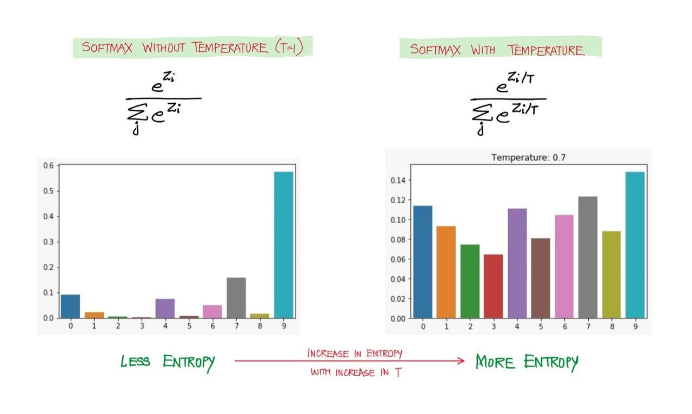

## Table of Contents

## What is temperature in the context of machine learning?

In machine learning, temperature is a concept often used in models like neural networks, especially when dealing with probability distributions over multiple classes. It's a parameter that can be adjusted to control the randomness or confidence of the model's predictions. When you use temperature in a model, it affects how the model makes its final decision by altering the softmax function, which converts raw scores into probabilities. A higher temperature makes the model's output more uniform and less confident, while a lower temperature makes the output more focused and confident.

For example, in the softmax function, temperature is used as a divisor for the input values before applying the exponential function. If you have a temperature parameter $$T$$, the formula for the softmax function becomes $$P(y_i) = \frac{\exp(z_i/T)}{\sum_{j} \exp(z_j/T)}$$, where $$z_i$$ are the input values. When $$T$$ is high, the differences between the $$z_i$$ values are reduced, leading to a more even distribution of probabilities. Conversely, when $$T$$ is low, the differences are amplified, resulting in a sharper distribution where the highest $$z_i$$ value dominates the output. This technique is particularly useful in scenarios like generating text or fine-tuning model outputs to achieve desired behavior.

## How is temperature used in neural networks?

Temperature in neural networks is a way to change how the model makes choices. It's like a dial that you can turn to make the model's guesses more or less sure. When we use temperature, we change the softmax function, which is a tool that turns the model's raw numbers into probabilities. The temperature is a number that we divide the raw numbers by before we use them in the softmax function. If the temperature is high, it makes the model's guesses more even and less sure. If the temperature is low, it makes the model's guesses more focused and more sure.

For example, in the softmax function, we use the temperature like this: $$P(y_i) = \frac{\exp(z_i/T)}{\sum_{j} \exp(z_j/T)}$$. Here, $$z_i$$ are the raw numbers from the model, and $$T$$ is the temperature. When $$T$$ is big, the differences between the $$z_i$$ numbers get smaller, so the probabilities are more spread out. When $$T$$ is small, the differences get bigger, so one number usually stands out more than the others. This is useful in things like making text or fine-tuning how a model works to get the results we want.

## What is the effect of temperature on softmax function?

Temperature changes how the softmax function works in a [neural network](/wiki/neural-network). The softmax function turns the raw numbers from the model into probabilities. When we use temperature, we divide these raw numbers by the temperature before we use them in the softmax function. This changes how spread out or focused the probabilities are. If the temperature is high, it makes the probabilities more even and less sure. If the temperature is low, it makes the probabilities more focused and more sure.

For example, in the softmax function, we use the temperature like this: $$P(y_i) = \frac{\exp(z_i/T)}{\sum_{j} \exp(z_j/T)}$$. Here, $$z_i$$ are the raw numbers from the model, and $$T$$ is the temperature. When $$T$$ is big, the differences between the $$z_i$$ numbers get smaller, so the probabilities are more spread out. When $$T$$ is small, the differences get bigger, so one number usually stands out more than the others. This is useful in things like making text or fine-tuning how a model works to get the results we want.

## How does temperature scaling affect model calibration?

Temperature scaling is a way to make a model's confidence in its predictions match how often it's actually right. When a model says it's 90% sure about something, we want it to be right about 90% of the time. Temperature scaling helps fix this by changing the model's confidence levels. It does this by using a number called temperature to adjust the model's raw numbers before turning them into probabilities. If the temperature is high, the model's confidence gets lower and more spread out. If the temperature is low, the model's confidence gets higher and more focused.

To do temperature scaling, we use the temperature in the softmax function. The formula for this is $$P(y_i) = \frac{\exp(z_i/T)}{\sum_{j} \exp(z_j/T)}$$. Here, $$z_i$$ are the raw numbers from the model, and $$T$$ is the temperature. By changing $$T$$, we can make the model's confidence match its actual performance better. For example, if a model is too confident and often wrong, we can use a higher temperature to make it less sure. If it's not confident enough, we can use a lower temperature to make it more sure. This helps the model give more reliable predictions.

## Can temperature be used to control the randomness of predictions?

Yes, temperature can be used to control the randomness of predictions in [machine learning](/wiki/machine-learning) models. When we use temperature, we change how the model turns its raw numbers into probabilities. If we make the temperature high, the model's guesses become more even and less sure. This means the model is more likely to pick different options each time it makes a prediction. On the other hand, if we make the temperature low, the model's guesses become more focused and more sure. This means the model will often pick the same option because it's very confident in one choice.

For example, in the softmax function, we use the temperature like this: $$P(y_i) = \frac{\exp(z_i/T)}{\sum_{j} \exp(z_j/T)}$$. Here, $$z_i$$ are the raw numbers from the model, and $$T$$ is the temperature. When $$T$$ is big, the differences between the $$z_i$$ numbers get smaller, so the probabilities are more spread out. When $$T$$ is small, the differences get bigger, so one number usually stands out more than the others. By adjusting the temperature, we can make the model's predictions more or less random, which can be useful in different situations, like generating text or making decisions in games.

## What are the practical applications of temperature in machine learning?

Temperature in machine learning is a tool that helps control how sure or random a model's guesses are. It's like a dial that you can turn to make the model's predictions more even or more focused. When we use temperature, we change how the model turns its raw numbers into probabilities. If we make the temperature high, the model's guesses become more spread out and less sure. This can be useful when we want the model to be more creative or to explore different options. For example, in the softmax function, we use the temperature like this: $$P(y_i) = \frac{\exp(z_i/T)}{\sum_{j} \exp(z_j/T)}$$. Here, $$z_i$$ are the raw numbers from the model, and $$T$$ is the temperature. When $$T$$ is big, the differences between the $$z_i$$ numbers get smaller, so the probabilities are more spread out.

On the other hand, if we make the temperature low, the model's guesses become more focused and more sure. This is helpful when we want the model to be very confident in its choices, like in situations where we need reliable and consistent predictions. For instance, in tasks like image classification, a lower temperature can help the model pick the right class more confidently. Temperature scaling is also used to make a model's confidence match how often it's actually right, which is called model calibration. This means if a model says it's 90% sure about something, it should be right about 90% of the time. By adjusting the temperature, we can make the model's predictions more reliable and useful in real-world applications.

## How does temperature impact the performance of a model?

Temperature can change how well a model works by changing how sure or random its guesses are. When we use a high temperature, the model's guesses become more spread out and less sure. This can be good when we want the model to be creative or to explore different options. For example, in language models, a high temperature can help generate more diverse text. However, if the temperature is too high, the model might make too many mistakes because it's not confident enough in its choices. In the softmax function, we use the temperature like this: $$P(y_i) = \frac{\exp(z_i/T)}{\sum_{j} \exp(z_j/T)}$$. Here, $$z_i$$ are the raw numbers from the model, and $$T$$ is the temperature. When $$T$$ is big, the differences between the $$z_i$$ numbers get smaller, making the probabilities more even.

On the other hand, using a low temperature makes the model's guesses more focused and more sure. This can be helpful when we need the model to be very confident in its choices, like in tasks where we need reliable and consistent predictions. For instance, in image classification, a lower temperature can help the model pick the right class more confidently. But if the temperature is too low, the model might become too sure of itself and miss out on other good options. Temperature scaling can also be used to make a model's confidence match how often it's actually right, which is called model calibration. This means if a model says it's 90% sure about something, it should be right about 90% of the time. By adjusting the temperature, we can make the model's predictions more reliable and useful in real-world applications.

## What is the relationship between temperature and entropy in machine learning?

Temperature in machine learning is like a dial that changes how spread out or focused a model's guesses are. When we use a high temperature, the model's guesses become more even and less sure. This makes the model's predictions more random, which can be good for tasks like generating creative text or exploring different options. In the softmax function, we use the temperature like this: $$P(y_i) = \frac{\exp(z_i/T)}{\sum_{j} \exp(z_j/T)}$$. Here, $$z_i$$ are the raw numbers from the model, and $$T$$ is the temperature. When $$T$$ is big, the differences between the $$z_i$$ numbers get smaller, making the probabilities more spread out. This increase in randomness means the model's output has higher entropy, which is a measure of how unpredictable or random something is.

On the other hand, using a low temperature makes the model's guesses more focused and more sure. This makes the model's predictions less random and more confident, which can be good for tasks where we need reliable and consistent guesses, like in image classification. When the temperature is low, the differences between the $$z_i$$ numbers get bigger, so one number usually stands out more than the others. This decrease in randomness means the model's output has lower entropy. By adjusting the temperature, we can control the entropy of the model's predictions, making them more or less random depending on what we need for our task.

## How can temperature be optimized in a machine learning model?

Temperature in a machine learning model can be optimized by finding the best value that makes the model's guesses work well for what we need. To do this, we can use something called validation data, which is a set of examples the model hasn't seen before. We try different temperatures and see which one makes the model's guesses match the real answers the best. For example, if we want the model to be more creative, we might try a higher temperature. If we want the model to be more sure and reliable, we might try a lower temperature. We can use a formula like this to change the model's guesses: $$P(y_i) = \frac{\exp(z_i/T)}{\sum_{j} \exp(z_j/T)}$$. Here, $$z_i$$ are the raw numbers from the model, and $$T$$ is the temperature we're trying to find the best value for.

One way to find the best temperature is by using a method called grid search. This means we pick a bunch of different temperatures and try them all to see which one works best. We can also use a smarter method called Bayesian optimization, which tries to guess the best temperature more quickly by learning from the temperatures it has already tried. Both of these methods help us find the temperature that makes the model's guesses match the real answers as closely as possible. By doing this, we can make sure the model's guesses are just right for what we need, whether it's being creative or being very sure.

## What are the challenges of using temperature in deep learning models?

Using temperature in [deep learning](/wiki/deep-learning) models can be tricky because it changes how the model makes its guesses. When we use a high temperature, the model's guesses become more spread out and less sure. This can be good for tasks like making creative text or exploring different options, but it can also make the model make more mistakes because it's not confident enough in its choices. For example, in the softmax function, we use the temperature like this: $$P(y_i) = \frac{\exp(z_i/T)}{\sum_{j} \exp(z_j/T)}$$. Here, $$z_i$$ are the raw numbers from the model, and $$T$$ is the temperature. When $$T$$ is big, the differences between the $$z_i$$ numbers get smaller, making the probabilities more even. This means the model might not pick the best answer as often as we want.

On the other hand, using a low temperature makes the model's guesses more focused and more sure. This can be helpful when we need the model to be very confident in its choices, like in tasks where we need reliable and consistent predictions. But if the temperature is too low, the model might become too sure of itself and miss out on other good options. Finding the right temperature can be hard because it depends on what we want the model to do. We might need to try a lot of different temperatures to find the one that works best for our task. This process can take a lot of time and computing power, especially if we're using methods like grid search or Bayesian optimization to find the best temperature.

## How does temperature affect the training dynamics of neural networks?

Temperature can change how a neural network learns during training. When we use a high temperature, the model's guesses become more spread out and less sure. This can help the model explore different options during training, which might be good for learning new things. But if the temperature is too high, the model might not learn well because it's not confident enough in its choices. For example, in the softmax function, we use the temperature like this: $$P(y_i) = \frac{\exp(z_i/T)}{\sum_{j} \exp(z_j/T)}$$. Here, $$z_i$$ are the raw numbers from the model, and $$T$$ is the temperature. When $$T$$ is big, the differences between the $$z_i$$ numbers get smaller, making the probabilities more even. This can make the training process slower because the model might take longer to decide what's important.

On the other hand, using a low temperature makes the model's guesses more focused and more sure. This can help the model learn faster because it's very confident in its choices. But if the temperature is too low, the model might become too sure of itself and miss out on other good options during training. Finding the right temperature can be tricky because it depends on what we want the model to learn. We might need to try a lot of different temperatures to find the one that helps the model learn the best. This process can take a lot of time and computing power, especially if we're using methods like grid search or Bayesian optimization to find the best temperature.

## What advanced techniques involve temperature for enhancing model robustness?

Temperature can be used in advanced ways to make machine learning models more robust. One technique is called temperature scaling, which helps make a model's confidence match how often it's actually right. When a model says it's 90% sure about something, we want it to be right about 90% of the time. By adjusting the temperature, we can make the model's confidence levels more accurate. For example, in the softmax function, we use the temperature like this: $$P(y_i) = \frac{\exp(z_i/T)}{\sum_{j} \exp(z_j/T)}$$. Here, $$z_i$$ are the raw numbers from the model, and $$T$$ is the temperature. If the model is too confident and often wrong, we can use a higher temperature to make it less sure. If it's not confident enough, we can use a lower temperature to make it more sure. This helps the model give more reliable predictions, especially in situations where the data might be tricky or different from what it was trained on.

Another advanced technique is using temperature to control how much the model explores different options during training. This is called temperature annealing, where we start with a high temperature and slowly lower it as the model learns. At the beginning, a high temperature helps the model look at many different possibilities and avoid getting stuck in one place. As training goes on, we lower the temperature to make the model more focused and sure about its choices. This can help the model learn better and be more robust to changes in the data. By carefully adjusting the temperature during training, we can make the model more adaptable and better at handling new or unexpected situations.