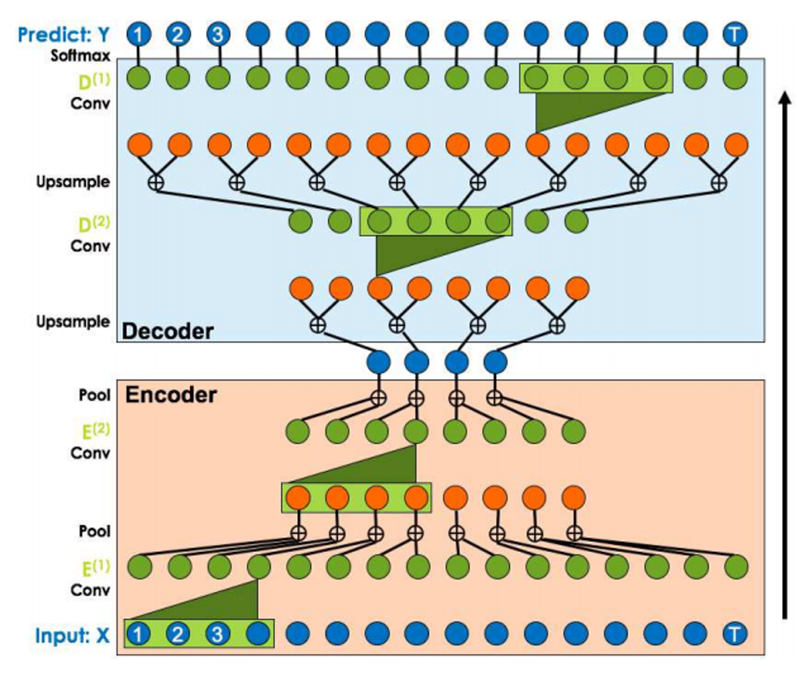

## Table of Contents

## What are Temporal Convolutions in the context of machine learning?

Temporal convolutions are a type of operation used in machine learning, especially in models that deal with time-series data or sequences, like audio or text. They are a way to process data that changes over time by applying a set of filters, called kernels, across the sequence. Imagine sliding a window over your data and at each position, performing a calculation that combines the values within that window. This helps the model understand patterns and relationships in the data over time.

In more technical terms, temporal convolutions involve convolving the input sequence with a set of learnable filters. The convolution operation can be described mathematically as $$ (f * g)(t) = \int_{-\infty}^{\infty} f(\tau) g(t - \tau) d\tau $$, where $f$ is the input sequence and $g$ is the filter. In practice, this is done discretely, and the model learns the best filters to use for the task at hand. This approach is particularly useful in models like Convolutional Neural Networks (CNNs) designed for sequence data, where it helps in capturing temporal dependencies efficiently.

## How do Temporal Convolutions differ from traditional convolutions?

Temporal convolutions and traditional convolutions both involve sliding a filter over the data to perform calculations, but they differ in how they handle the data. Traditional convolutions are often used in image processing, where the data is two-dimensional. The filter slides over the image in both the horizontal and vertical directions, capturing spatial patterns. In contrast, temporal convolutions are designed for one-dimensional data that changes over time, like audio or text. The filter slides only along the time axis, helping the model understand patterns and relationships in the sequence.

The key difference lies in the dimensionality and the type of data they process. Traditional convolutions are great for understanding spatial relationships in images, like edges and textures. Temporal convolutions, on the other hand, are better at capturing temporal dependencies, which are important for understanding sequences. For example, in a sound wave, a temporal convolution can help identify patterns that occur over time, like a melody or a spoken word. This makes temporal convolutions a powerful tool in models like Recurrent Neural Networks (RNNs) and certain types of Convolutional Neural Networks (CNNs) designed for sequence data.

## What is a Causal Convolution and why is it important in time-series data?

A causal convolution is a special type of temporal convolution used in time-series data. It's designed so that the output at any time step only depends on the inputs from that time step and earlier time steps, not on future inputs. This makes sense for many real-world applications, like predicting stock prices or weather forecasts, where you can't use future information to make decisions about the present.

The importance of causal convolutions in time-series data lies in their ability to model real-time systems accurately. For example, if you're building a model to predict tomorrow's temperature, you wouldn't want it to use next week's temperature data. Causal convolutions ensure that the model respects the flow of time, making the predictions more realistic and useful. By using this technique, the model can learn patterns and make forecasts based only on historical data, which is crucial for many applications in [machine learning](/wiki/machine-learning).

## Can you explain the concept of Dilated Causal Convolution?

Dilated causal convolutions are a special type of convolution used in time-series data. They help the model see patterns over longer periods of time without using too many layers. Imagine you're looking at a sequence of numbers, and you want to see patterns that are far apart. Instead of looking at every number, you can skip some and still get a good idea of the pattern. This is what dilated causal convolutions do. They skip some time steps when applying the filter, which is called dilation. This allows the model to capture long-term dependencies in the data without making the model too big or slow.

In more technical terms, dilation means that the filter is applied with gaps between the time steps it considers. If the dilation rate is 1, the filter looks at every time step. If the dilation rate is 2, it skips every other time step. This can be described mathematically as $$ (f * g)(t) = \sum_{\tau} f(\tau) g(t - d \cdot \tau) $$, where $d$ is the dilation rate. By increasing the dilation rate, the model can see further into the past without increasing the number of layers. This makes dilated causal convolutions very useful for tasks like audio processing or language modeling, where understanding long-term patterns is important.

## What is Gated Convolution and how does it enhance model performance?

Gated convolutions are a way to make neural networks better at understanding time-series data. They use a special trick called gating, which helps the network decide what information is important and what can be ignored. Imagine you're listening to a noisy room, and you want to focus on one person talking. Gating is like turning down the [volume](/wiki/volume-trading-strategy) on everything else so you can hear that person better. In a gated convolution, the network uses two filters: one to process the data and another to decide how much of that processed data to use. This helps the model focus on the most relevant parts of the data, making it more accurate and efficient.

The way gated convolutions work is by combining two parts: the filter output and the gate. The filter output is what you get when you apply a normal convolution to the data. The gate is another convolution that decides how much of the filter output to keep. This can be described mathematically as $$ y = \sigma(g) \odot f(x) $$, where $f(x)$ is the filter output, $g$ is the gate, $\sigma$ is the sigmoid function, and $\odot$ is element-wise multiplication. By using this method, the model can better understand complex patterns in the data, like in audio or text, and make better predictions. This makes gated convolutions a powerful tool in many machine learning tasks, improving the model's performance by allowing it to focus on what really matters.

## How does DynamicConv adapt to different input sequences?

DynamicConv, or Dynamic Convolution, is a smart way to handle different input sequences in machine learning. It changes how it looks at the data based on what it sees. Imagine you're reading a book, and you change how fast you read depending on how interesting the part is. DynamicConv does something similar. It uses different filters for different parts of the input, so it can focus on what's important at each moment. This makes the model more flexible and better at understanding different kinds of sequences, like different styles of writing or different types of music.

The way DynamicConv works is by using a special kind of attention mechanism. It looks at the input and decides which filters to use at each step. This can be described mathematically as $$ y_t = \sum_{i=1}^{k} a_{t,i} (W_i * x_t) $$, where $y_t$ is the output at time $t$, $a_{t,i}$ is the attention weight for filter $i$, $W_i$ is the $i$-th filter, and $x_t$ is the input at time $t$. By adjusting the attention weights, DynamicConv can adapt to the changing patterns in the input, making it a powerful tool for tasks like language translation or music generation.

## What are the key components of ConvTasNet and its applications?

ConvTasNet, or Convolutional Time-domain Audio Separation Network, is a model used to separate mixed audio signals into their individual sources. It works by using a series of convolutional layers to process the audio in the time domain, which means it looks at the audio as it changes over time. The key components of ConvTasNet include an encoder that turns the audio into a format the model can work with, a separator that uses convolutional layers to figure out which parts of the audio belong to different sources, and a decoder that turns the separated signals back into audio. This model is good at separating things like different instruments in a song or different speakers in a conversation.

ConvTasNet is used in many applications where you need to separate mixed audio. For example, it can help in music production by isolating the sounds of different instruments, making it easier to mix and edit them. It's also useful in speech processing, where it can separate the voices of different people talking at the same time, which is helpful for things like voice recognition or improving the quality of conference calls. By using convolutional layers, ConvTasNet can learn to recognize and separate different sounds in a way that's both accurate and efficient.

## How does Span-Based Dynamic Convolution improve efficiency in processing?

Span-Based Dynamic Convolution is a smart way to make processing faster and better. It looks at different parts of the input at the same time, instead of one part after another. Imagine you're reading a book and you want to understand a whole sentence instead of just one word at a time. Span-Based Dynamic Convolution does this by using a special kind of attention that looks at chunks of the input, called spans. This helps the model see patterns that are spread out over time, making it more efficient and accurate.

The way Span-Based Dynamic Convolution works is by using different filters for different spans of the input. It decides which filters to use based on what it sees in each span. This can be described mathematically as $$ y_t = \sum_{i=1}^{k} a_{t,i} (W_i * x_{t:t+s}) $$, where $y_t$ is the output at time $t$, $a_{t,i}$ is the attention weight for filter $i$, $W_i$ is the $i$-th filter, and $x_{t:t+s}$ is the input span from time $t$ to $t+s$. By looking at spans instead of single time steps, the model can process the data more quickly and make better predictions. This makes Span-Based Dynamic Convolution a powerful tool for tasks like language understanding or speech recognition, where understanding longer patterns is important.

## What is the TaLK Convolution and its advantages in language modeling?

TaLK Convolution, or Temporal Adaptive Linear Kernel Convolution, is a special way to look at sequences of words or sounds in language modeling. It changes how it looks at the data based on what it sees, making it smarter and more flexible. Imagine you're reading a book, and you change how fast you read depending on how interesting the part is. TaLK Convolution does something similar. It uses different filters for different parts of the input, so it can focus on what's important at each moment. This makes the model better at understanding different kinds of sentences or conversations.

The big advantage of TaLK Convolution in language modeling is that it can adapt to different styles of writing or speaking. For example, if you're reading a poem, the model can focus on the rhythm and rhyme. If you're reading a news article, it can focus on the facts and details. By using a special kind of attention mechanism, TaLK Convolution can change how it looks at the data, making it more accurate and efficient. This can be described mathematically as $$ y_t = \sum_{i=1}^{k} a_{t,i} (W_i * x_t) $$, where $y_t$ is the output at time $t$, $a_{t,i}$ is the attention weight for filter $i$, $W_i$ is the $i$-th filter, and $x_t$ is the input at time $t$. By adjusting the attention weights, TaLK Convolution can adapt to the changing patterns in the input, making it a powerful tool for language understanding.

## Can you describe the architecture and benefits of LightConv?

LightConv, or Lightweight Convolution, is a smart way to process sequences like text or sound. It uses a special kind of filter that can change how it looks at the data based on what it sees. Imagine you're reading a book, and you change how fast you read depending on how interesting the part is. LightConv does something similar. It uses different filters for different parts of the input, so it can focus on what's important at each moment. This makes the model better at understanding different kinds of sentences or conversations. The way LightConv works is by using a special kind of attention mechanism. It looks at the input and decides which filters to use at each step. This can be described mathematically as $$ y_t = \sum_{i=1}^{k} a_{t,i} (W_i * x_t) $$, where $y_t$ is the output at time $t$, $a_{t,i}$ is the attention weight for filter $i$, $W_i$ is the $i$-th filter, and $x_t$ is the input at time $t$. By adjusting the attention weights, LightConv can adapt to the changing patterns in the input, making it a powerful tool for language understanding.

The big advantage of LightConv is that it's both fast and accurate. It can process data quickly because it uses fewer parameters than other models. This means it can run on smaller computers or phones, making it useful for many different applications. LightConv is also good at understanding long sentences or conversations because it can see patterns that are spread out over time. This makes it a great choice for tasks like language translation or speech recognition, where understanding longer patterns is important. By using a special kind of attention mechanism, LightConv can focus on what's important in the data, making it more efficient and accurate.

## How do Temporal Convolutions handle long-range dependencies in data?

Temporal convolutions help models understand long-range dependencies in data by looking at patterns over time. Imagine you're reading a story, and you need to remember what happened at the beginning to understand the end. Temporal convolutions do this by using a special kind of filter that slides over the data. This filter can see patterns that are far apart in time, helping the model connect the dots between different parts of the sequence.

One way temporal convolutions handle long-range dependencies is by using something called dilation. Dilation means the filter skips some time steps when it looks at the data. If the dilation rate is 1, the filter looks at every time step. If it's 2, it skips every other time step. This can be described mathematically as $$ (f * g)(t) = \sum_{\tau} f(\tau) g(t - d \cdot \tau) $$, where $d$ is the dilation rate. By increasing the dilation rate, the model can see further into the past without needing more layers, making it easier to understand long-range patterns.

## What are some advanced techniques for optimizing Temporal Convolutions in deep learning models?

One advanced technique for optimizing temporal convolutions is using dilated convolutions. Dilated convolutions help the model see patterns over long periods of time without using too many layers. Imagine you're looking at a long sequence of numbers, and you want to see patterns that are far apart. Dilated convolutions do this by skipping some time steps when applying the filter, which is called dilation. If the dilation rate is 1, the filter looks at every time step. If it's 2, it skips every other time step. This can be described mathematically as $$ (f * g)(t) = \sum_{\tau} f(\tau) g(t - d \cdot \tau) $$, where $d$ is the dilation rate. By increasing the dilation rate, the model can see further into the past without making the model too big or slow, making it more efficient and better at understanding long-range dependencies.

Another technique is using gated convolutions. Gated convolutions help the model decide what information is important and what can be ignored. Imagine you're listening to a noisy room, and you want to focus on one person talking. Gating is like turning down the volume on everything else so you can hear that person better. In a gated convolution, the network uses two filters: one to process the data and another to decide how much of that processed data to use. This can be described mathematically as $$ y = \sigma(g) \odot f(x) $$, where $f(x)$ is the filter output, $g$ is the gate, $\sigma$ is the sigmoid function, and $\odot$ is element-wise multiplication. By using this method, the model can better understand complex patterns in the data, like in audio or text, and make better predictions, improving its performance.

## References & Further Reading

[1]: Bai, S., Kolter, Z., & Koltun, V. (2018). ["An Empirical Evaluation of Generic Convolutional and Recurrent Networks for Sequence Modeling."](https://arxiv.org/abs/1803.01271) arXiv preprint arXiv:1803.01271.

[2]: Oord, A. v. d., Dieleman, S., Zen, H., Simonyan, K., Vinyals, O., Graves, A., ... & Kavukcuoglu, K. (2016). ["WaveNet: A Generative Model for Raw Audio."](https://arxiv.org/abs/1609.03499) arXiv preprint arXiv:1609.03499.

[3]: Yu, F., & Koltun, V. (2015). ["Multi-Scale Context Aggregation by Dilated Convolutions."](https://arxiv.org/abs/1511.07122) arXiv preprint arXiv:1511.07122.

[4]: Dauphin, Y. N., Fan, A., Auli, M., & Grangier, D. (2017). ["Language Modeling with Gated Convolutional Networks."](https://arxiv.org/abs/1612.08083) arXiv preprint arXiv:1612.08083.

[5]: Gehring, J., Auli, M., Grangier, D., Yarats, D., & Dauphin, Y. N. (2017). ["Convolutional Sequence to Sequence Learning."](https://arxiv.org/abs/1705.03122) arXiv preprint arXiv:1705.03122.

[6]: Pariente, M., Cornell, S., Defossez, A., & Vincent, E. (2020). ["Filterbank design for end-to-end speech separation."](https://arxiv.org/abs/1910.10400) arXiv preprint arXiv:2008.04259.

[7]: Wu, F., Fan, A., Baevski, A., Dauphin, Y. A., & Auli, M. (2019). ["Pay Less Attention with Lightweight and Dynamic Convolutions."](https://arxiv.org/abs/1901.10430) arXiv preprint arXiv:1901.10430.