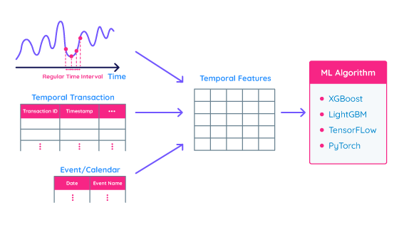

## Table of Contents

## What is temporal data in the context of machine learning?

Temporal data in machine learning refers to information that changes over time. This type of data is important because many real-world phenomena, like stock prices, weather patterns, and patient health records, depend on time. In machine learning, we use temporal data to make predictions or understand trends by looking at how things change from one moment to the next.

When working with temporal data, it's crucial to consider the order of events. For example, knowing that it rained yesterday can help predict if it will rain today. Machine learning models like time series analysis or recurrent neural networks (RNNs) are designed to handle this kind of data. These models can learn patterns from past data to forecast future events or understand sequences of events.

In practice, handling temporal data can be challenging. You need to make sure the data is aligned correctly in time, and sometimes you have to deal with missing values or different time intervals. Despite these challenges, using temporal data can greatly improve the accuracy of predictions and provide deeper insights into how systems evolve over time.

## Why is temporal data important in machine learning applications?

Temporal data is important in [machine learning](/wiki/machine-learning) because it helps us understand and predict how things change over time. Many things in the real world, like the weather, stock prices, or how sick someone is, depend on what happened before. By looking at this data, we can see patterns and use them to guess what might happen next. For example, if we know it rained a lot yesterday, we might predict it will be cloudy today.

Using temporal data can make our predictions much better. Special machine learning models, like time series models or recurrent neural networks (RNNs), are made to work with this kind of data. These models can learn from the past to help us understand the future. But working with temporal data can be tricky. We need to make sure the data is in the right order and deal with missing information or different time gaps. Even with these challenges, using temporal data helps us make smarter decisions and understand how things change over time.

## What are some common sources of temporal data?

Temporal data comes from many places around us. One common source is financial markets, where stock prices, trading volumes, and economic indicators are recorded every day, every hour, or even every minute. Another big source is weather stations, which track temperature, humidity, wind speed, and rainfall over time. These measurements help us predict the weather and understand climate patterns.

Health records are another important source of temporal data. Doctors and hospitals keep track of patients' vital signs, medication schedules, and test results, which all change over time. This helps in monitoring patient health and planning treatments. Social media and web traffic also provide a lot of temporal data. For example, the number of likes, shares, or page views on a website can change from one moment to the next, showing trends and user behavior over time.

In industries like manufacturing, sensors on machines collect data on performance, temperature, and other metrics, helping to predict when maintenance is needed. Retail businesses use temporal data from sales records to understand customer buying patterns and manage inventory. All these sources help us see how things change and make better decisions based on those changes.

## How does time series analysis relate to temporal data in machine learning?

Time series analysis is a way to study data that changes over time, which is exactly what we call temporal data. In machine learning, time series analysis helps us understand patterns and make predictions about future events based on past data. For example, if we want to predict tomorrow's weather, we look at the temperature, humidity, and other weather data from the past few days. Time series models, like ARIMA or exponential smoothing, are designed to work with this kind of data. They can find trends, seasonal patterns, and even unusual events in the data.

In machine learning, time series analysis is important because it helps us make better predictions. By using models that understand the order of events, we can forecast things like stock prices, sales numbers, or patient health more accurately. For instance, if we see that sales go up every December, a time series model can use this pattern to predict higher sales for the next December. This kind of analysis is crucial for businesses, healthcare, and many other fields where understanding how things change over time can lead to better decisions and outcomes.

## What are the key challenges in modeling temporal data?

One big challenge in modeling temporal data is dealing with the order of events. Time matters a lot, so we need to make sure our data is in the right order. If we mix up the order, our predictions can be way off. For example, if we're trying to predict tomorrow's weather, we need to look at today's data first, then yesterday's, and so on. Another challenge is handling missing data. Sometimes, we don't have all the information we need because a sensor stopped working or someone forgot to record something. We have to find ways to fill in these gaps without messing up our model's predictions.

Another issue is dealing with different time intervals. Sometimes, data comes in every minute, other times every hour or day. We need to make sure our model can handle these different time scales. For example, if we're looking at stock prices, we might have data every second, but for weather, it might be every hour. This can make it hard to compare and use the data correctly. Also, temporal data often has trends and patterns that repeat over time, like seasons or weekly cycles. Our model needs to understand these patterns to make good predictions, which can be tricky.

Lastly, we need to be careful about overfitting. This happens when our model learns too much from the past data and can't handle new, different data well. For example, if our model sees a lot of sunny days in the past, it might always predict sunny days, even if it's going to rain. We need to balance learning from the past with being able to adapt to new situations. All these challenges make working with temporal data tough, but solving them can lead to really useful predictions and insights.

## Can you explain the difference between stationary and non-stationary time series data?

A stationary time series is one where the statistical properties, like the mean and variance, stay the same over time. Imagine you're measuring the temperature in a room that's always kept at a steady 20 degrees. The average temperature doesn't change from day to day, and the ups and downs are always about the same size. This kind of data is easier to work with because the patterns don't change over time. If you want to predict the future, you can use the same methods for any part of the data.

On the other hand, a non-stationary time series is one where the statistical properties change over time. Think about the price of a stock that goes up and down a lot, and the average price keeps changing. Maybe it starts at $100, then goes up to $150 over a year. The ups and downs might also get bigger or smaller over time. This kind of data is trickier to work with because you can't use the same methods for the whole series. You might need to break it into smaller parts or use special techniques to handle the changes.

Understanding whether your time series is stationary or non-stationary is important because it affects how you build your models. If your data is non-stationary, you might need to make it stationary first by removing trends or seasonal patterns. This process, called differencing, can help make your data more predictable and easier to work with. For example, if you have a time series $$ y_t $$ that shows a clear upward trend, you can create a new series $$ \Delta y_t = y_t - y_{t-1} $$ that might be stationary and easier to model.

## What are some common algorithms used for temporal data analysis in machine learning?

One common algorithm for analyzing temporal data is the Autoregressive Integrated Moving Average (ARIMA) model. ARIMA is great for time series data because it can handle data that changes over time. It looks at past values to predict future ones. For example, if you want to predict tomorrow's temperature, ARIMA would use today's temperature and maybe even the temperature from a few days ago. It's especially useful for data that has trends or seasonal patterns. If your data isn't stationary, meaning the average and the ups and downs change over time, ARIMA can help make it stationary by using a technique called differencing. This means it looks at the difference between values over time, like $$ \Delta y_t = y_t - y_{t-1} $$, to make the data easier to work with.

Another popular algorithm is the Recurrent Neural Network (RNN), which is a type of [neural network](/wiki/neural-network) designed specifically for sequences and time series data. RNNs remember past inputs and use them to influence future outputs, making them good at understanding how things change over time. A special kind of RNN called Long Short-Term Memory (LSTM) is even better at this because it can remember information for longer periods. LSTMs are often used for more complex time series tasks, like predicting stock prices or understanding speech. They can learn long-term dependencies in the data, which means they can see patterns that happened a long time ago and still use them to make predictions.

Seasonal Decomposition of Time Series (STL) is another method used for analyzing temporal data. STL helps break down a time series into three parts: trend, seasonality, and residuals. The trend shows the overall direction of the data over time, like if it's going up or down. Seasonality shows repeating patterns, like how sales might go up every December. Residuals are what's left over, the random ups and downs that don't fit into the trend or seasonality. By understanding these parts, you can better predict future values and see what's driving changes in your data.

## How can feature engineering enhance the performance of models on temporal data?

Feature engineering can really help make models better at understanding temporal data. One way it does this is by creating new features that capture important patterns over time. For example, if you're looking at daily sales data, you might add a feature that shows the average sales over the last week. This new feature can help the model see trends that it might miss if it just looks at daily numbers. Another way is to use time-based features like the day of the week or the month of the year. These can help the model understand seasonal patterns, like how sales go up in December. By adding these features, the model can make more accurate predictions because it has more information to work with.

Another important part of feature engineering for temporal data is dealing with time lags. Time lags are when you use past values to predict future ones. For example, if you want to predict tomorrow's temperature, you might use today's temperature and maybe even the temperature from a few days ago. You can create new features like $$ \Delta y_t = y_t - y_{t-1} $$ to show how much the temperature changed from one day to the next. This can help the model see if there's a pattern in how things change over time. Also, feature engineering can help handle missing data by filling in gaps with smart guesses based on past values. By doing all this, feature engineering makes the model smarter and better at predicting what will happen next.

## What is the role of recurrent neural networks (RNNs) in handling temporal data?

Recurrent Neural Networks (RNNs) are really good at working with temporal data because they can remember things from the past. Imagine you're trying to predict tomorrow's weather. An RNN can look at today's temperature and maybe even the temperature from a few days ago to make a better guess. It does this by keeping a sort of memory that helps it understand how things change over time. This memory is what makes RNNs special because it lets them see patterns that other models might miss.

A special kind of RNN called Long Short-Term Memory (LSTM) is even better at this. LSTMs can remember information for longer periods, which is great for more complex time series tasks like predicting stock prices or understanding speech. They use a smart way to decide what to remember and what to forget, so they can learn long-term dependencies in the data. For example, if you want to predict how a patient's health will change over time, an LSTM can use data from months ago to make a better prediction. This makes them really useful for understanding how things change over time and making accurate predictions.

## How do Long Short-Term Memory (LSTM) networks improve upon traditional RNNs for temporal data?

Long Short-Term Memory (LSTM) networks are a special type of Recurrent Neural Network (RNN) that are better at handling temporal data. The main problem with traditional RNNs is that they can forget important information from the past. Imagine trying to predict tomorrow's weather based on data from a week ago. Traditional RNNs might not remember that information well enough to make a good prediction. LSTMs solve this problem by using a smart way to remember and forget things. They have special parts called "gates" that help them decide what information to keep and what to throw away. This makes them really good at understanding long-term patterns in data.

For example, if you're trying to predict how a patient's health will change over time, an LSTM can use data from months ago to make a better prediction. It does this by keeping a memory of important past events and using them to influence its future predictions. This ability to learn and remember long-term dependencies makes LSTMs much more useful than traditional RNNs for tasks like stock price prediction, speech recognition, and many other applications where understanding how things change over time is important.

## What are the best practices for validating models trained on temporal data?

When validating models trained on temporal data, it's important to use a method that respects the order of time. A common way to do this is by using time-based cross-validation. Instead of randomly splitting the data into training and testing sets like you might do with other types of data, you split it based on time. For example, you could train your model on data from the first three years and then test it on data from the fourth year. This helps make sure your model can predict future events based on what happened in the past, which is what you want it to do.

Another important practice is to use rolling window validation. This means you keep moving the training and testing windows forward in time. For example, you might train on the first year and test on the second year, then train on the first two years and test on the third year, and so on. This helps you see how well your model adapts to new data over time. It's also a good idea to check for overfitting by looking at how well your model does on both the training and testing data. If it does much better on the training data, it might be memorizing the past too well and not be good at predicting the future.

## How can advanced techniques like sequence-to-sequence models be applied to temporal data problems?

Sequence-to-sequence models, often called seq2seq models, are great for working with temporal data because they can understand and predict sequences of events. Imagine you're trying to translate a sentence from English to Spanish. A seq2seq model can take the whole English sentence and turn it into a Spanish sentence, understanding the order and meaning of each word. In the same way, if you're trying to predict future stock prices, a seq2seq model can look at past prices and other data points to predict what will happen next. It does this by using an encoder to understand the input sequence and a decoder to generate the output sequence. This makes seq2seq models really useful for tasks like weather forecasting, where you need to predict future conditions based on past data.

One popular type of seq2seq model is the one that uses Long Short-Term Memory (LSTM) networks. LSTMs are good at remembering long-term patterns in data, which is important for temporal data problems. For example, if you want to predict how a patient's health will change over time, an LSTM-based seq2seq model can use data from months ago to make a better prediction. The model can learn to understand the relationships between different time steps and use that knowledge to forecast future events. This makes seq2seq models with LSTMs a powerful tool for many applications involving temporal data, like predicting stock prices or understanding speech patterns over time.

## References & Further Reading

[1]: Hyndman, R. J., & Athanasopoulos, G. (2018). ["Forecasting: Principles and Practice,"](https://otexts.com/fpp2/) OTexts.

[2]: Gers, F. A., Schmidhuber, J., & Cummins, F. (2000). ["Learning to Forget: Continual Prediction with LSTM."](https://pubmed.ncbi.nlm.nih.gov/11032042/) Neural Computation, 12(10), 2451-2471.

[3]: Hochreiter, S., & Schmidhuber, J. (1997). ["Long Short-Term Memory,"](https://dl.acm.org/doi/10.1162/neco.1997.9.8.1735) Neural Computation, 9(8), 1735-1780.

[4]: Box, G.E.P., Jenkins, G.M., Reinsel, G.C., & Ljung, G.M. (2015). ["Time Series Analysis: Forecasting and Control,"](https://onlinelibrary.wiley.com/doi/book/10.1002/9781118619193) Wiley.

[5]: Hirano, M., & Benesty, J. (Eds.). (2003). ["A Tutorial on Hidden Markov Models and Selected Applications in Speech Recognition."](https://ieeexplore.ieee.org/document/18626/?arnumber=18626) in: Hayes, M.H., et al. Speech Processing. Springer.