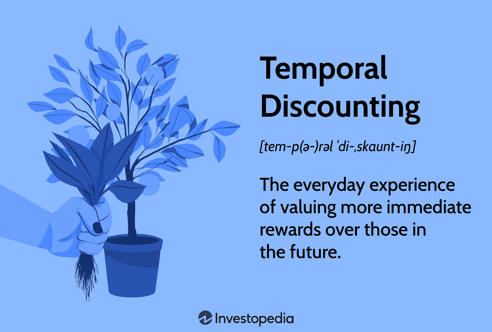

Temporal discounting refers to the tendency of individuals to prioritize smaller, immediate rewards over larger, delayed rewards. This psychological concept is significant because it illustrates how people evaluate the value of future events versus present ones. In decision-making, temporal discounting plays a crucial role; it affects judgment and choices across various contexts, from everyday decisions to complex financial strategies.

In trading, temporal discounting is especially relevant as it impacts the decisions of traders, often leading them to focus on short-term gains at the expense of long-term benefits. This behavior can result in suboptimal trading decisions, reflecting a preference for immediate satisfaction over future financial stability. The process underscores common cognitive biases, such as present bias and impulsivity, which can lead to risky trading patterns and increased susceptibility to market volatility.

The influence of temporal discounting on trading psychology manifests in a trader's propensity to react impulsively to market fluctuations. This behavior is driven by a desire to capitalize on immediate opportunities rather than adhering to a disciplined, long-term strategy. This psychological inclination can increase emotional responses to market conditions, leading to hasty trading decisions that may not align with financial goals.

Algorithmic trading emerges as a potential tool to mitigate the effects of temporal discounting. By employing computational algorithms, traders can reduce the impact of human biases on their decisions. These algorithms are programmed to evaluate data objectively and execute trades based on predefined criteria, thereby minimizing the role of emotion-driven judgments. Algorithmic trading systems are designed to account for both short-term anomalies and long-term market trends, supporting consistent trading strategies that resist the pitfalls of human psychology.

## Table of Contents

## Understanding Temporal Discounting

Temporal discounting is a fundamental concept in psychology that describes the decrease in perceived value of a reward as the temporal delay to its receipt increases. This psychological principle of future reward valuation explains why individuals often prefer immediate rewards over those that are deferred, even when the delayed rewards are larger. The tendency to discount future rewards is rooted in human nature and serves as a basis for various decision-making processes.

From an evolutionary standpoint, immediate gratification may have been advantageous for survival, leading to a prevalent human preference for immediate rewards. This preference is commonly illustrated through experiments where individuals choose between receiving a smaller amount of money today versus a larger sum in the future. Pioneering research in this field by economists, such as Richard Herrnstein's matching law, provides a quantitative description of such behaviors.

Mathematically, temporal discounting can be modeled using a hyperbolic discounting function:

$$
V = \frac{A}{1 + kD}
$$

where $V$ is the present value of the reward, $A$ is the actual reward amount, $D$ is the delay until the reward is received, and $k$ is the discount rate. The hyperbolic model reflects how immediate rewards are favored disproportionately more than future ones compared to the exponential model often used in classical economics.

Several factors influence temporal discounting, including urgency and uncertainty. Urgency pertains to situations where immediate action is required, prompting choices that prioritize the present. Uncertainty affects discounting due to the unpredictable nature of future rewards, which may lead individuals to opt for secure, immediate rewards over potentially greater long-term gains. These factors can vary significantly among individuals, influenced by personality traits, socio-economic backgrounds, and cultural differences.

Temporal discounting has profound implications for financial decisions. One key implication is the inclination to prioritize short-term financial gains over long-term benefits, which can lead to inadequate savings and poor investment choices. This behavior can be linked to several cognitive biases, such as the present bias—overemphasizing immediate outcomes at the expense of future consequences. Additionally, the optimism bias may lead individuals to underestimate future risks, further skewing decision-making towards short-term gratifications.

Understanding these cognitive biases and their connection to temporal discounting is crucial in developing strategies to improve decision-making. Raising awareness about these biases can assist individuals in making more rational financial choices, ensuring a balance between immediate needs and future objectives. Recognizing the interaction between psychological predispositions and financial behavior allows for better insights into human decision-making processes.

## The Intersection of Psychology and Trading

Cognitive biases play a significant role in trading psychology, influencing how traders make decisions and assess risks. Among these biases, temporal discounting is particularly impactful, as it highlights the human tendency to undervalue future rewards in favor of immediate gratification. This bias can lead to suboptimal trading decisions, where short-term profits are preferred over potentially larger long-term gains.

Temporal discounting, in the context of trading, often results in impulsive decision-making. For instance, a trader might sell a promising stock prematurely to secure immediate profits, rather than waiting for a projected price increase. This tendency is frequently observed in volatile markets, where the pressure to act quickly can exacerbate the bias. Additionally, temporal discounting is linked to other cognitive biases such as loss aversion, where traders are more sensitive to potential losses than equivalent gains, further skewing their decisions towards short-term outcomes.

Real-world examples underscore the influence of temporal discounting on trading errors. During the 2008 financial crisis, many investors hastily liquidated their assets to avoid further losses, only to miss out on the subsequent market recovery. This behavior was driven by the fear of immediate loss outweighing the potential for future recovery, illustrating how temporal discounting can result in poor timing and financial misjudgments.

To mitigate the effects of temporal discounting, several psychological strategies can be employed. One approach involves developing awareness and mindfulness, allowing traders to recognize and reflect on their biases before making decisions. Cognitive-behavioral techniques can also be effective, where traders are trained to reframe their thinking and emphasize long-term rewards over immediate gratification.

Implementing strict trading plans and adhering to predefined strategies also help counteract impulsive decisions. By setting clear rules for entry and [exit](/wiki/exit-strategy) points, traders can reduce emotional reactions to market fluctuations. Moreover, engaging in simulation exercises and [backtesting](/wiki/backtesting) strategies can instill discipline and promote a more structured approach to trading.

The potential of training and discipline is significant in improving trading outcomes. Regular practice and experience can help traders become more adept at recognizing cognitive biases and adjusting their behaviors accordingly. Additionally, access to education and resources on trading psychology empowers traders to make more informed and rational decisions, potentially leading to greater success in the markets.

## Algorithmic Trading as a Solution

Algorithmic trading refers to the use of computer algorithms to automate trading decisions and execute orders in financial markets. These algorithms are designed to analyze large datasets, identify trading opportunities, and execute trades at speeds and frequencies that exceed human capabilities. The primary components of [algorithmic trading](/wiki/algorithmic-trading) include data analysis, signal generation, risk management, and order execution systems. Each component works in tandem to enable a comprehensive trading strategy that aims for optimal market performance.

One of the significant advantages of algorithmic trading is its ability to minimize human biases. Cognitive biases, such as overconfidence or loss aversion, can often lead to irrational trading decisions. Algorithms, being purely data-driven and rules-based, execute trades based on predefined criteria without the emotional interference that typically affects human traders. By systematically applying statistical and mathematical models, algorithms can evaluate the potential risks and rewards of trades more objectively.

In designing algorithms to consider long-term rewards, developers often incorporate principles such as mean reversion, [momentum](/wiki/momentum) strategies, or [machine learning](/wiki/machine-learning) models trained on historical data. These models can project potential returns over extended periods by analyzing patterns and trends that might not be immediately apparent. For instance, some algorithms use discounted cash flow models to estimate the present value of future earnings, which helps in making investment decisions that are inherently aligned with long-term objectives.

However, whether algorithmic trading can fully eliminate the effects of temporal discounting is a topic of debate. Temporal discounting, the tendency to favor immediate rewards over future gains, is deeply ingrained in human psychology. While algorithms can remove the emotional aspect of this bias by sticking to long-term strategies, they are not infallible. Uncertainties in model assumptions and unforeseen market events can occasionally lead to short-term deviations from expected outcomes. Thus, while algorithms significantly reduce temporal discounting, they may not fully eliminate its effects.

There are numerous case studies highlighting the success of algorithmic trading in improving decision-making. For example, Renaissance Technologies, a firm known for its Medallion Fund, employs sophisticated algorithms to make high-frequency trades that have consistently yielded high returns. Other firms, such as Citadel LLC, leverage algorithmic strategies to assess market conditions and execute trades with precision that minimizes human error. These instances underscore the potential for algorithms to enhance efficiency and profitability in trading.

In summary, algorithmic trading represents a powerful tool in modern finance, offering a methodological approach to trading that effectively addresses some of the limitations of human cognition. While it may not completely overcome psychological biases like temporal discounting, it considerably mitigates their influence, promoting more rational and data-driven decision-making processes.

## Future Trends in Trading and Psychology

The future of trading is poised to be significantly shaped by developments in trading algorithms, particularly those addressing psychological biases. As technology advances, trading firms are increasingly integrating psychology into their algorithmic strategies, leveraging insights from behavioral finance to enhance decision-making processes. These developments are driven by the need to mitigate cognitive biases, such as temporal discounting, which can skew financial judgments.

One future trend involves the refinement of trading algorithms to better recognize and adapt to human biases. By incorporating behavioral models, these algorithms can be trained to identify irrational decision patterns and adjust strategies accordingly. This adaptation process could involve machine learning techniques capable of learning from historical trading data to anticipate human errors.

Advancements in psychology are also likely to influence trading strategies. As our understanding of cognitive processes deepens, algorithm designers can incorporate findings related to attention, perception, and emotional regulation into their systems. This might lead to algorithms that not only execute trades based on market data but also [factor](/wiki/factor-investing) in the psychological states of traders, dynamically adjusting operations to minimize impulsive behaviors.

Furthermore, the integration of behavioral psychology in advanced algorithms is an area of growing interest. Algorithms could be designed to simulate psychological experiments, testing different strategies under varied simulated conditions to understand potential outcomes. This would enable a more comprehensive risk assessment and strategy development process, offering a nuanced approach to handling market [volatility](/wiki/volatility-trading-strategies).

The rise of [artificial intelligence](/wiki/ai-artificial-intelligence) (AI) and machine learning in trading is another significant trend. These technologies are adept at analyzing large datasets to discern patterns reflective of human behavior. For example, neural networks can be employed to predict market movements by correlating them with sentiment analysis derived from news articles and social media. AI tools can help identify when traders might deviate from rational decision-making, thereby providing opportunities for correction before critical errors occur.

Ethical implications are inherent in utilizing psychology within trading algorithms. There is a concern about the potential for manipulation, where firms could exploit psychological weaknesses for profit. However, ethical considerations necessitate transparency and accountability in the development and deployment of such technologies. Ensuring that algorithms enhance market fairness rather than exploit individual biases is a critical discussion point.

In conclusion, future trends in trading point towards a collaborative convergence of psychology, machine learning, and AI, enabling the development of sophisticated trading algorithms capable of mitigating cognitive biases. As technology evolves, ethical considerations must guide the responsible implementation of these advancements, ensuring that the primary aim remains the enhancement of trading outcomes while preserving market integrity.

## Conclusion

Temporal discounting has emerged as a pivotal concept in understanding the psychology of trading and decision-making. It involves the tendency of individuals to favor immediate rewards over those that are delayed, thereby significantly influencing financial decisions and trading outcomes. This preference for immediacy often leads to cognitive biases, such as impulsive behavior and short-sighted decision-making, which can be detrimental in the trading landscape where long-term strategies are often more beneficial.

Addressing cognitive biases is critical in trading as they can distort decision-making processes and lead to suboptimal outcomes. Algorithms and advanced technologies offer promising solutions to mitigate these human biases. Algorithmic trading, for instance, reduces the subjectivity inherent in human decision-making by relying on pre-defined rules and data-driven insights. This technological approach provides a mechanism to prioritize long-term rewards and diminish the effects of temporal discounting.

Research at the intersection of psychology and trading continues to grow, presenting new opportunities for enhancing trading strategies. Scholars and practitioners are increasingly interested in how psychological theories can be applied to develop more robust trading algorithms. The potential integration of behavioral psychology into advanced algorithms promises to offer deeper insights into trader behavior and improve decision-making processes.

As advancements in technology and psychology progress, the rise of artificial intelligence (AI) and machine learning plays a crucial role in dissecting human behaviors in trading. These technologies could revolutionize our understanding and management of psychological biases in the finance sector, though ethical considerations remain regarding their application and the potential impact on human autonomy.

In conclusion, dealing with cognitive biases in trading is indispensable for making more informed and effective financial decisions. Technology, particularly algorithmic trading, serves as a valuable tool in overcoming psychological barriers. Ongoing research highlights the dynamic interplay between psychology and trading, and it is essential for traders, investors, and researchers to stay informed about emerging trends and developments in this field to enhance their strategies and outcomes.

## References & Further Reading

[1]: Ainslie, G. (2001). ["Breakdown of Will."](https://www.cambridge.org/core/books/breakdown-of-will/BEB02F8A220A92CB34F1802783ADB267) Cambridge University Press.

[2]: Laibson, D. (1997). ["Golden Eggs and Hyperbolic Discounting."](https://www.jstor.org/stable/2951242) The Quarterly Journal of Economics, 112(2), 443-477.

[3]: Mazur, J. E. (1987). ["An Adjusting Procedure for Studying Delay Discounting."](https://psycnet.apa.org/record/1986-98701-003) In M. L. Commons (Ed.), Quantitative Analyses of Behavior: Vol. 5. The Effect of Delay and of Intervening Events on Reinforcement Value (pp. 55-73). Erlbaum.

[4]: Herrnstein, R. J. (1961). ["Relative and Absolute Strength of Response as a Function of Frequency of Reinforcement."](https://pmc.ncbi.nlm.nih.gov/articles/PMC1404074/) Journal of the Experimental Analysis of Behavior, 4(3), 267-272.

[5]: Thaler, R. H. (1981). ["Some Empirical Evidence on Dynamic Inconsistency."](https://www.sciencedirect.com/science/article/pii/0165176581900677) The Quarterly Journal of Economics, 96(3), 627-654.

[6]: Kahneman, D., & Tversky, A. (1979). ["Prospect Theory: An Analysis of Decision Under Risk."](http://web.mit.edu/curhan/www/docs/Articles/15341_Readings/Behavioral_Decision_Theory/Kahneman_Tversky_1979_Prospect_theory.pdf) Econometrica, 47(2), 263-292.

[7]: Oberlechner, T., & Osler, C. L. (2008). ["Overconfidence in Currency Markets."](https://www.jstor.org/stable/41499462) Journal of Financial and Quantitative Analysis, 43(4), 1161-1197.