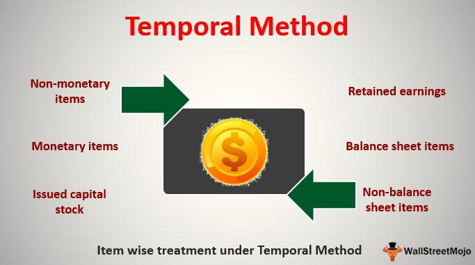

The world of finance is complex and deeply interconnected, with currency exchange serving as a fundamental component that influences global trade and investment. As businesses expand internationally, multinational companies must accurately reflect the financial performance of their overseas operations, which necessitates the use of currency translation methods. The temporal method in currency translation is a key technique used to convert foreign financial statements into the functional currency of the parent company, ensuring accurate representation of financial data across borders.

Algorithmic trading, which employs computer algorithms to execute trades at high speed and volume, increasingly relies on precise data and understanding of market dynamics. As currency exchange rates fluctuate, they can significantly impact the foreign exchange (forex) markets and trading strategies. By incorporating currency translation techniques, such as the temporal method, algorithmic traders can enhance their ability to forecast market movements and make informed decisions. This, in turn, can improve trading performance and reduce potential risks associated with currency exchange volatility.



In this article, we explore the application of the temporal method in currency translation, examining how it assists in maintaining consistency and accuracy in financial reporting of multinational operations. We will also analyze its implications for algorithmic trading in forex markets, highlighting the importance of using accurate data and methodologies to optimize trading performance and mitigate associated risks. Such insights are indispensable for maintaining competitiveness in the ever-evolving landscape of global finance.

## Table of Contents

## Understanding Currency Translation

Currency translation is a fundamental process for multinational corporations aiming to consolidate the financial statements of their foreign subsidiaries into a single, cohesive report. This process involves converting the financial statement items of foreign entities into the functional currency of the parent company. The necessity of this translation arises from the need to present an accurate and unified representation of a company's financial performance across different countries, each with potentially varying currencies.

The translation of foreign financial statements is critical for accurate financial reporting and enables stakeholders to evaluate the overall health and performance of a company's global operations. It ensures that investors and analysts can assess the consolidated financial condition of an enterprise without the distortion that may arise from fluctuating exchange rates.

The choice of translation method primarily depends on the economic environment in which the subsidiary operates and regulatory requirements set by accounting standards. Two primary methods are widely recognized for currency translation:

1. **The Temporal Method (Historical Rate Method)**: This method involves translating foreign currency financial statements by using exchange rates based on the nature of the items involved. Monetary items such as cash, receivables, and liabilities are typically translated at current exchange rates. In contrast, non-monetary items like inventory and fixed assets are translated using historical exchange rates—that is, the rates prevailing when the items were initially acquired. The temporal method is particularly useful in environments where a subsidiary operates in a hyperinflationary economy or when the functional currency differs from the reporting currency of the parent company.

2. **The Current Rate Method**: This method uses current exchange rates to translate the financial statement items of foreign subsidiaries into the parent company's currency. Unlike the temporal method, the current rate method applies the current exchange rate at the reporting date for all assets and liabilities, while income statement items are translated at average exchange rates for the period. This method is generally applied when the foreign subsidiary operates in an environment where the functional currency is the same as the local currency.

Choosing the appropriate translation method is crucial, as it affects the reported results and financial ratios, influencing managerial decisions and the perception of stakeholders. The accuracy of this process ensures the reliability of financial statements, providing a foundation for informed investment decisions, comparative financial analysis, and strategic planning.

## The Temporal Method Explained

The temporal method, or the historical rate method, is a currency translation approach utilized by multinational corporations to convert foreign financial statements into the functional currency of the parent company. This method distinguishes between monetary and non-monetary items, applying different exchange rates based on the nature of the item.

Monetary items, which include cash, receivables, and payables, are translated at the current exchange rate as of the financial statement date. This ensures that these items reflect their true current value in the parent company's currency, reflecting any fluctuations in the currency market.

On the other hand, non-monetary items such as inventory, fixed assets, and other non-monetary assets are translated using the historical exchange rates in effect when these items were initially acquired. This method assumes that the value of these items remains constant from the time of acquisition, regardless of subsequent currency fluctuations, thereby adhering to the historical cost principle in accounting.

For income statement items, the temporal method typically employs the average exchange rate for the reporting period. However, if specific transactions during the period were executed at different rates, those transactions would be translated using the respective rates at which they occurred. This approach provides a more accurate depiction of income and expenses in that it reflects the actual rates affecting transactions over the reporting period.

A significant implication of using the temporal method is the potential for translation gains or losses. These arise from the re-measurement of monetary items at different exchange rates from those applied in the prior period or at the time of incurrence. Such gains or losses directly impact the consolidated financial statements of the parent company, highlighting the importance of precise translation in financial reporting.

In practice, the temporal method can be depicted through the following processes in a simplified Python code:

```python
def translate_financials(monetary_items, non_monetary_items, current_rate, historical_rate, average_rate):
    translated_monetary = {item: value * current_rate for item, value in monetary_items.items()}
    translated_non_monetary = {item: value * historical_rate[item] for item, value in non_monetary_items.items()}

    return translated_monetary, translated_non_monetary

# Example usage
monetary_items = {'cash': 10000, 'receivables': 5000}
non_monetary_items = {'inventory': 7000, 'fixed_assets': 20000}
current_rate = 1.2  # Example current exchange rate
historical_rate = {'inventory': 1.1, 'fixed_assets': 1.0}  # Historical rates for non-monetary items

translated_monetary, translated_non_monetary = translate_financials(
    monetary_items, non_monetary_items, current_rate, historical_rate, average_rate
)

print("Translated Monetary Items:", translated_monetary)
print("Translated Non-Monetary Items:", translated_non_monetary)
```

Through careful application of the temporal method, corporations can ensure their financial statements accurately reflect their financial position and performance, taking into account the effects of currency translation.

## Implications for Algorithmic Trading

Algorithmic trading in the [forex](/wiki/forex-system) market necessitates the utilization of precise data and a thorough understanding of market conditions. The process of currency translation is integral to this, as fluctuations in exchange rates can significantly impact trading strategies and financial outcomes.

Fluctuations in exchange rates can arise from the translation of financial statements, particularly when multinational companies consolidate foreign subsidiaries’ financial results. This is where translation methods like the temporal method become pivotal. Such fluctuations need to be accurately accounted for in trading algorithms to ensure effective forecasting and decision-making. By incorporating techniques that adjust for translation effects, algorithmic traders can refine their strategy models to better anticipate market movements and optimize trade execution.

Algorithmic traders often employ hedging strategies to manage the risks associated with currency translation [volatility](/wiki/volatility-trading-strategies). For instance, traders can use derivative instruments such as options and futures to offset potential losses from adverse exchange rate movements. By engaging in such hedging practices, they can stabilize returns and reduce the risk profile of their trading portfolios.

Moreover, a deep understanding of translation effects can provide traders with a competitive advantage. As [algorithmic trading](/wiki/algorithmic-trading) systems depend on high-frequency and automated decision-making processes, incorporating comprehensive translation models allows traders to react swiftly to currency fluctuations, thereby capitalizing on emergent market opportunities. An edge in this competitive field can be achieved through continuous monitoring of exchange rate trends and the adaptive refinement of algorithmic strategies.

In conclusion, integrating currency translation techniques into algorithmic trading systems can improve the precision and robustness of trading strategies, reduce exposure to exchange rate risk, and offer a substantial competitive advantage in the rapidly evolving forex market.

## Case Study: Applying Temporal Method in Trading

Consider a scenario where a parent company based in the United States operates several subsidiaries across Europe. These subsidiaries generate financial statements in euros, but for consolidated reporting, these figures need to be translated into U.S. dollars. The temporal method of currency translation plays a pivotal role in ensuring that monetary and non-monetary items are converted accurately, influencing signals used in algorithmic trading.

### Translation of Monetary and Non-Monetary Items

Under the temporal method, monetary assets and liabilities, including cash and receivables, are translated at the current exchange rate. Suppose the exchange rate at the end of the reporting period is 1 EUR = 1.1 USD. If a European subsidiary has cash assets worth €10,000, this would convert to $11,000 in the parent company’s financial statements. Conversely, non-monetary items like inventory and fixed assets are translated at historical exchange rates. If these assets were acquired when the exchange rate was 1 EUR = 1.2 USD, they would reflect this rate, mitigating potential distortions in asset valuation.

### Aligning Trading Strategies

Algorithmic traders utilize the temporal method to align trading strategies with financial reporting, minimizing unexpected volatility impacts. By ensuring accurate translation, traders can develop more reliable signals. For example, using the temporal method helps traders accurately forecast the financial health of subsidiaries based on their operational currency conditions. This alignment allows for strategic planning and reduces the impact of sudden volatility due to misreported currency fluctuations.

Here is a simple Python algorithm to simulate this translation process:

```python
def temporal_conversion(monetary_value, non_monetary_value, current_rate, historical_rate):
    # Translate monetary items using current exchange rate
    monetary_converted = monetary_value * current_rate
    # Translate non-monetary items using historical exchange rate
    non_monetary_converted = non_monetary_value * historical_rate
    return monetary_converted, non_monetary_converted

# Example values
monetary_euros = 10000  # Cash in Euros
non_monetary_euros = 5000  # Fixed assets in Euros
current_exchange_rate = 1.1  # Current exchange rate
historical_exchange_rate = 1.2  # Historical exchange rate

mon_converted, non_mon_converted = temporal_conversion(monetary_euros, non_monetary_euros, current_exchange_rate, historical_exchange_rate)
print("Converted Monetary Value in USD:", mon_converted)
print("Converted Non-Monetary Value in USD:", non_mon_converted)
```

### Strategic Monitoring and Data Analysis

Effective algorithmic trading necessitates constant monitoring of exchange rates and leveraging historical data to make informed decisions. Traders analyze trends and patterns to predict future movements. Applying the temporal method provides insights into historical acquisition costs, aiding in refining asset valuation and investment strategies.

This case study underscores the significance of understanding and utilizing currency translation methods like the temporal method. Mastery of such financial techniques enables algorithmic traders to integrate precise financial reporting into trading algorithms, maintaining an edge in today's dynamically changing forex markets.

## Conclusion

The temporal method plays an essential role in ensuring precise currency translation within multinational financial operations. This accuracy is paramount for companies to adequately reflect their financial standing and performance when consolidating global financial statements. By translating monetary and non-monetary items at appropriate exchange rates, the temporal method allows businesses to maintain financial consistency and transparency.

Algorithmic trading, which is deeply reliant on accurate data and market predictions, stands to greatly benefit from incorporating these currency translation techniques. Algorithmic traders can enhance performance and manage risk more effectively by understanding and integrating elements of the temporal method. Fluctuations in foreign exchange rates, often stemming from translation adjustments, can impact forex market dynamics, thus having a direct influence on trading strategies and outcomes. By anticipating and accounting for these adjustments, trading algorithms become more robust and adaptive to real-world market conditions.

As the foreign exchange market expands, proficiency in currency translation will continue to be a valuable asset for traders utilizing automated systems. Mastery of these translation methods not only improves algorithmic forecasting but also strengthens hedging strategies, ultimately providing a competitive edge in the fast-paced forex environment. Staying abreast of both translation methodologies and exchange rate trends is vital for traders and companies, ensuring they remain agile and competitive on the global stage.

## References & Further Reading

[1]: FASB. (2021). ["ASC 830 - Foreign Currency Matters."](https://onlinelibrary.wiley.com/doi/10.1002/9781119736202.ch53) Financial Accounting Standards Board.

[2]: IASB. (2018). ["IAS 21 - The Effects of Changes in Foreign Exchange Rates."](https://www.ifrs.org/content/dam/ifrs/publications/pdf-standards/english/2022/issued/part-a/ias-21-the-effects-of-changes-in-foreign-exchange-rates.pdf?bypass=on) International Accounting Standards Board.

[3]: ["Principles of Group Accounting under IFRS"](https://onlinelibrary.wiley.com/doi/book/10.1002/9781119044826) by Andreas Krimpmann

[4]: ["Algorithmic Trading & DMA: An introduction to direct access trading strategies"](https://www.amazon.com/Algorithmic-Trading-DMA-introduction-strategies/dp/0956399207) by Barry Johnson

[5]: ["Trading on Corporate Earnings News: Profiting from Targeted, Short-Term Options Positions"](https://www.amazon.com/Trading-Corporate-Earnings-News-Short-Term/dp/0137084927) by John Shon and Ping Zhou