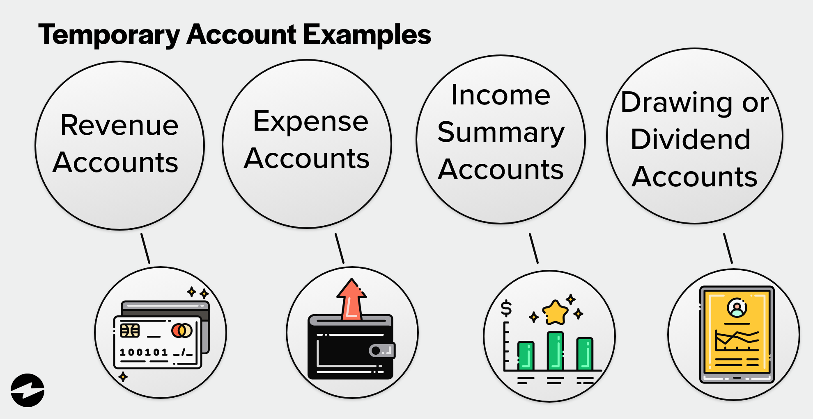

## Table of Contents

## What is a temporary account policy?

A temporary account policy is a set of rules that a company or organization uses for short-term user accounts. These accounts are usually given to people who need access to the company's systems for a limited time, like contractors or temporary workers. The policy helps make sure these accounts are used safely and correctly. It includes things like how long the account can be used, what the user can do with it, and what happens when the account is no longer needed.

The main goal of a temporary account policy is to keep the company's information safe. By setting clear rules, the company can control who has access to their systems and for how long. This helps prevent unauthorized people from getting into the system and causing problems. The policy also makes sure that when someone no longer needs access, their account is closed quickly and securely, reducing the risk of any security breaches.

## Why is a temporary account policy important for security?

A temporary account policy is important for security because it helps control who can use a company's systems and for how long. When people like contractors or temporary workers need access, the policy makes sure they only get it for the time they need it. This stops people who shouldn't be using the system from getting in and causing trouble. By setting clear rules, the company can keep its information safe and make sure only the right people can see it.

The policy also helps make sure that when someone's job is done, their account gets closed quickly and safely. If an account stays open after someone leaves, it can be a big security risk. Someone could use that old account to get into the system and steal information or cause damage. By having a good temporary account policy, the company can close these accounts fast, reducing the chance of any security problems. This keeps the company's data safe and secure.

## How does a temporary account policy differ from a permanent account policy?

A temporary account policy is for people who need to use a company's systems for a short time, like contractors or temporary workers. It sets rules about how long they can use the account, what they can do with it, and what happens when they don't need it anymore. The main goal is to keep the company's information safe by making sure these short-term users can't stay in the system longer than they should.

A permanent account policy is for people who work at the company for a long time, like full-time employees. It has rules about what they can do with their accounts, how to keep them safe, and what happens if they leave the company. The main goal is to make sure these long-term users can do their jobs well while keeping the company's information secure.

The big difference between the two is how long the accounts last and how they are managed. Temporary accounts are closed quickly after the user's job is done, while permanent accounts stay open as long as the person works at the company. Both types of policies are important for keeping the company's systems safe, but they focus on different needs and time frames.

## What are the common durations for temporary accounts?

Temporary accounts usually last for a short time, often from a few days to a few months. The exact length depends on why the account is needed. For example, a contractor working on a project might get an account that lasts for the whole project, which could be a few weeks or a few months. Someone coming in for a short training session might only need an account for a few days.

Companies decide how long these accounts should last based on what the person needs to do. They want to make sure the account is open long enough for the job but not so long that it becomes a security risk. Once the job is done, the account is closed to keep the company's information safe.

## How can a temporary account policy be implemented in a system?

To implement a temporary account policy in a system, a company first needs to decide on the rules for these accounts. They need to figure out how long the accounts should last, what the users can do with them, and how to close them when they're not needed anymore. The company can use their computer system to set up these rules. For example, they can program the system to automatically close an account after a certain date or if it hasn't been used for a while. They also need to make sure that the right people know about the policy and follow it.

Once the rules are set, the company can start creating temporary accounts. When someone needs a temporary account, the company can use their system to make one quickly. They enter the person's information and set the account to follow the temporary account policy. The system will then keep track of the account and make sure it follows the rules. When the account's time is up, the system can close it automatically, or someone from the company can do it manually. This helps keep the company's information safe and makes sure that only the right people can use the system.

## What are the key elements that should be included in a temporary account policy?

A temporary account policy should include a few key elements to make sure it works well. First, it should clearly state how long the account will last. This could be a set number of days, weeks, or months, depending on what the person needs the account for. The policy should also say what the user can do with the account, like what parts of the system they can use and what they can't do. It's important to set these limits to keep the company's information safe.

Another important part of the policy is what happens when the account is no longer needed. The policy should explain how to close the account quickly and safely. This could be done automatically by the system or by someone from the company. The policy should also say who is in charge of making sure the account is closed on time. By including these elements, the company can make sure that temporary accounts are used correctly and don't become a security risk.

## How do you manage access rights for temporary accounts?

Managing access rights for temporary accounts means deciding what parts of the company's system the user can use. When someone gets a temporary account, the company sets up the account with only the access they need for their job. For example, if a contractor is working on a project, they might only get access to the project files and not other parts of the system. This helps keep the company's information safe by making sure the temporary user can't see or change things they shouldn't.

The company's system can help manage these access rights. It can be set up to give the right access when the account is created and take it away when the account is closed. Someone from the company, like an IT person, needs to keep an eye on these accounts to make sure the access rights are correct. They should check that the temporary user only has the access they need and nothing more. When the job is done, the IT person should close the account and take away all access rights to keep the system secure.

## What are the best practices for monitoring and auditing temporary accounts?

To keep temporary accounts safe, companies should watch them closely and check them often. They can use their computer system to see what the temporary users are doing. This means looking at what files they open, what changes they make, and when they use the system. If something looks strange, like someone using the account at odd times or trying to get into parts of the system they shouldn't, the company can find out quickly and stop it. Regular checks help make sure the temporary accounts are only used for the right things and don't become a security risk.

Auditing temporary accounts is also important. This means going over the records of what the temporary users did to make sure everything was done correctly. Companies can set up rules for how often they should do these audits, like once a week or once a month. During an audit, they look at the logs to see if the temporary users followed the rules and if the accounts were closed on time. If they find any problems, they can fix them and make the temporary account policy better. This helps keep the company's information safe and makes sure the temporary accounts are managed well.

## How can organizations ensure compliance with regulations using temporary account policies?

Organizations can make sure they follow the rules by setting up a good temporary account policy. This policy should say clearly how long the accounts can be used, what the users can do, and how to close the accounts when they're not needed anymore. By following these rules, the company can keep its information safe and make sure it's doing what the law says. For example, if there are laws about how long someone can use a system, the company can set the temporary accounts to close automatically after that time. This helps the company stay in line with the rules and avoid getting in trouble.

To make sure the policy works well, the company should keep an eye on the temporary accounts and check them often. They can use their computer system to watch what the temporary users are doing and make sure they're not breaking any rules. If they see something strange, they can stop it quickly. The company should also do regular checks, called audits, to see if the temporary users followed the rules and if the accounts were closed on time. By doing these things, the company can make sure it's following the regulations and keeping its information safe.

## What are the potential risks associated with temporary accounts and how can they be mitigated?

Temporary accounts can be risky because they are used by people who are not with the company for a long time. If these accounts are not watched closely, someone could use them to get into the company's system and steal information or cause damage. Another risk is that if an account is not closed on time, it could be used by someone who shouldn't have access. This could happen if the person who had the account leaves and someone else finds out about it. Also, if the temporary user has too much access, they might see or change things they shouldn't, which could be a big problem.

To lower these risks, companies need to have a good temporary account policy. This policy should say how long the accounts can be used and what the users can do. The company should use its computer system to watch what the temporary users are doing and make sure they're not breaking any rules. If something looks strange, the company can stop it quickly. The company should also do regular checks to see if the temporary users followed the rules and if the accounts were closed on time. By doing these things, the company can keep its information safe and make sure the temporary accounts are not a problem.

## How can automation be used to enhance the management of temporary account policies?

Automation can make managing temporary account policies easier and safer. By using computer programs, companies can set up temporary accounts to close automatically when they are no longer needed. This means the company doesn't have to remember to close the accounts themselves, which helps make sure they are closed on time. Automation can also keep track of what the temporary users are doing, so if something looks strange, the company can find out quickly and stop it. This helps keep the company's information safe and makes sure the temporary accounts are used correctly.

Another way automation helps is by making it easier to set up and manage access rights for temporary accounts. The computer system can give the right access when the account is created and take it away when the account is closed. This means the temporary users only have the access they need for their job, which helps keep the company's information safe. By using automation, companies can make sure their temporary account policy works well and that they are following the rules.

## What advanced strategies can be employed to integrate temporary account policies with overall identity and access management systems?

To make temporary account policies work well with the whole identity and access management system, companies can use a single system to manage all accounts. This system can keep track of who has what kind of account, whether it's temporary or permanent. By using this system, the company can make sure that temporary accounts follow the same rules as other accounts. For example, the system can check if someone is trying to use a temporary account after it should have been closed. It can also make sure that temporary users only have the access they need for their job. This helps keep the company's information safe and makes it easier to manage all accounts in one place.

Another way to integrate temporary account policies is by using automation to make things easier. The system can be set up to create temporary accounts automatically when someone needs one, and close them when they're not needed anymore. This means the company doesn't have to remember to close the accounts themselves, which helps make sure they are closed on time. The system can also watch what the temporary users are doing and make sure they're not breaking any rules. If something looks strange, the company can find out quickly and stop it. By using automation and a single system, companies can make sure their temporary account policy works well and that they are following the rules.

## References & Further Reading

[1]: ["Global Investment Performance Standards (GIPS)"](https://rpc.cfainstitute.org/gips-standards) by CFA Institute

[2]: Narang, R. K. (2013). ["Inside the Black Box: A Simple Guide to Quantitative and High-Frequency Trading"](https://onlinelibrary.wiley.com/doi/book/10.1002/9781118662717)

[3]: Aldridge, I. (2013). ["High-Frequency Trading: A Practical Guide to Algorithmic Strategies and Trading Systems"](https://onlinelibrary.wiley.com/doi/pdf/10.1002/9781119203803.fmatter)

[4]: Hull, J. C. (2021). ["Options, Futures, and Other Derivatives"](https://elibrary.pearson.de/book/99.150005/9781292410623) 

[5]: ["Algorithmic Trading & DMA: An introduction to direct access trading strategies"](https://www.amazon.com/Algorithmic-Trading-DMA-introduction-strategies/dp/0956399207) by Barry Johnson

[6]: Hasbrouck, J. (2007). ["Empirical Market Microstructure: The Institutions, Economics, and Econometrics of Securities Trading"](https://academic.oup.com/book/52241)

[7]: ["Algorithmic and High-Frequency Trading"](https://assets.cambridge.org/97811070/91146/frontmatter/9781107091146_frontmatter.pdf) by Álvaro Cartea, Sebastian Jaimungal, and José Penalva