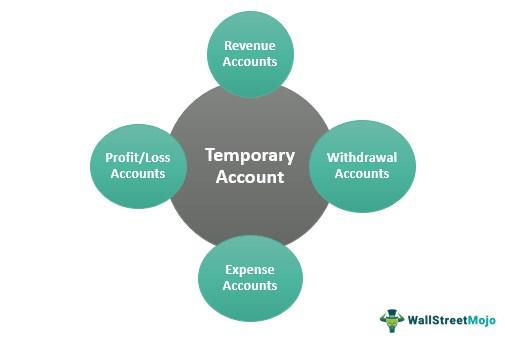

In today's rapidly evolving financial landscape, a firm grasp of banking and trading concepts is crucial for both investors and financial professionals. With the increasing complexity of financial markets, it is essential to understand various mechanisms and frameworks that underpin the industry. Temporary accounts are vital for managing cash flows within investment funds, allowing for efficient allocation of resources and minimizing the impact of significant cash movements on portfolio performance. They are recommended by the Global Investment Performance Standards (GIPS) to enhance transparency in fund accounting, thereby ensuring a clear and accurate portrayal of financial data.

Account policies form the backbone of financial institutions by providing structured guidelines for managing various account types, such as savings, checking, and temporary accounts. These policies are integral to maintaining compliance with regulatory standards, mitigating risks, and establishing a foundation for customer engagement. By understanding these policies, individuals can effectively navigate financial transactions and efficiently manage their accounts.

Algorithmic trading represents a significant advancement in trading technology, utilizing sophisticated computer programs to execute trades with unmatched speed and precision. It encompasses various strategies such as trend-following and arbitrage, offering a significant edge by automating trading processes. This enables traders to operate more efficiently, reduce emotional bias, and capitalize on diverse market conditions. As finance professionals seek to harness these technological advancements, mastering the intricacies of algorithmic trading can lead to improved trading outcomes.

In summary, grasping these key financial concepts, including temporary accounts, account policies, and algorithmic trading, is essential for optimizing performance and making informed decisions in today's financial markets.

## Table of Contents

## Understanding Temporary Accounts

A temporary account is a type of financial construct used to hold cash flows within a fund until a suitable allocation is determined. These accounts serve as essential tools for enhancing cash flow management, ensuring that inflows and outflows are appropriately categorized and distributed without immediate pressure on the main accounts of the portfolio. 

The use of temporary accounts is widely advocated by the Global Investment Performance Standards (GIPS), which emphasize their importance in promoting transparency and facilitating streamlined fund accounting processes. By temporarily holding cash in these accounts, financial institutions can delay the allocation process until an optimum decision is made about where funds should be invested or paid out, which is particularly beneficial in volatile market conditions.

Moreover, temporary accounts are instrumental in minimizing the impact that significant cash movements could have on a portfolio's performance and strategic direction. Large transfers can potentially distort performance metrics, especially in performance periods where accurate representation is crucial. With temporary accounts, these large cash flows can be managed more effectively, aligning with the overall investment strategy and reducing potential [liquidity](/wiki/liquidity-risk-premium) issues.

For instance, consider a scenario where a portfolio manager expects substantial inflows from institutional investors. By utilizing temporary accounts, the manager can hold these inflows briefly, allowing time to strategize the allocation without immediate market exposure, which can be crucial in maintaining the portfolio's target asset allocation and investment objectives. This approach also affords the manager the flexibility to take advantage of market opportunities that may arise shortly after the cash inflow.

In conclusion, temporary accounts play a strategic role in fund management, enabling financial institutions to achieve better performance management, strategic alignment, and compliance with industry standards like GIPS. Their ability to streamline cash flow processes and mitigate the implications of large cash transactions makes them a valuable asset for portfolio managers and financial professionals.

## The Role of Account Policies

Account policies serve as the backbone for the management and operation of various account types within a financial institution, including savings, checking, and temporary accounts. These policies establish standardized procedures and guidelines that govern the interaction between financial institutions and their clients. 

Firstly, account policies are fundamental for ensuring compliance with regulatory standards. Financial institutions are subject to a myriad of regulations designed to protect consumers, prevent fraudulent activities, and maintain the integrity of financial markets. Policies are crafted to adhere to these regulations, providing a safeguard against legal and financial penalties. For instance, anti-money laundering (AML) policies require institutions to monitor transactions and report suspicious activities, thereby deterring financial crime.

Secondly, account policies play a critical role in risk management. By setting clear rules for account operations, these policies help financial institutions mitigate various risks associated with banking activities, such as credit risk, operational risk, and market risk. For example, policies may dictate the limits on withdrawals or specify the criteria for offering overdrafts, thus managing the institution's exposure to financial loss.

Moreover, account policies establish an essential framework for customer interactions and service offerings. They define the terms of service, fees, interest rates, and features of different account types, ensuring transparency and consistency in how accounts are managed and serviced. This framework not only facilitates customer understanding and trust but also enhances operational efficiency by standardizing procedures across the institution.

Understanding account policies is crucial for consumers as it aids in effectively navigating their financial transactions and accounts. By familiarizing themselves with the policies, consumers can make informed decisions, avoid unnecessary fees, and take advantage of available services and benefits. For instance, knowing the policy on minimum balance requirements can help account holders avoid maintenance fees, while awareness of transfer limits can assist in planning large transactions.

In conclusion, account policies are vital for maintaining regulatory compliance, managing risks, and structuring customer interactions in financial institutions. They provide a necessary structure that supports both the operational stability of banks and the financial well-being of clients.

## Algorithmic Trading: An Overview

Algorithmic trading, commonly referred to as algo trading, leverages computer programs to execute trades based on predefined criteria and algorithms. This approach is designed to improve speed and accuracy, essential attributes in today's fast-paced financial markets. Unlike traditional trading, which relies heavily on human discretion, [algorithmic trading](/wiki/algorithmic-trading) utilizes complex mathematical models and a set of instructions to make decisions regarding the timing, price, and [volume](/wiki/volume-trading-strategy) of trades.

Types of algorithmic trading strategies include, but are not limited to, trend-following and [arbitrage](/wiki/arbitrage). Trend-following strategies seek to exploit patterns in market movements, entering trades in the direction of a prevailing trend. For instance, if a stock has been consistently rising, a trend-following algorithm might execute buy orders, predicting the trend will continue. Conversely, arbitrage strategies involve exploiting price discrepancies of the same asset across different markets or forms, aiming to profit from temporary mismatches in price – a practice that often requires rapid execution to be effective.

A distinct advantage of algorithmic trading is the automation of trading strategies, which significantly enhances efficiency. Automated systems can manage and execute multiple trades across various markets simultaneously, an unfeasible task for human traders. This scalability allows participants to capitalize on even minor market opportunities at any given time. The inherent speed of computer programs also ensures trades are executed at the best available prices, minimizing slippage.

Another crucial benefit of algorithmic trading is the mitigation of emotional bias, which can often cloud judgment in traditional trading. Algorithms remain unaffected by emotional or psychological factors, basing decisions solely on data and pre-established rules. This objective approach reduces the risk of impulsive buying or selling, fostering more consistent adherence to trading strategies.

For those involved in financial markets, a comprehensive understanding of algorithmic trading facilitates the harnessing of technology for optimized trading outcomes. By implementing these sophisticated systems, traders and institutions can enhance their decision-making processes, streamline operations, and adapt swiftly to evolving market dynamics. Thus, the integration of algorithmic trading represents a pivotal shift towards more advanced and data-driven approaches in financial trading.

## Types and Features of Algorithmic Trading

Algorithmic trading employs various strategies tailored to accommodate different market situations, each with distinct features aimed at optimizing trade execution and enhancing market participation. Among the prominent strategies are trend-following, arbitrage, [market making](/wiki/market-making), and mean reversion. Each strategy leverages the inherent characteristics of automated trading to achieve specific financial objectives.

### Trend-Following Strategies

Trend-following algorithms aim to capitalize on the [momentum](/wiki/momentum) of asset price movements, assuming that securities that have been moving in a particular direction will continue to do so. These strategies rely heavily on technical indicators such as moving averages or momentum indicators. For instance, a simple moving average crossover strategy might trigger a buy signal when a short-term moving average crosses above a long-term moving average.

### Arbitrage Strategies

Arbitrage algorithms exploit price discrepancies between correlated assets or across different markets. By simultaneously buying and selling these securities, traders can lock in risk-free profits. A common example is [statistical arbitrage](/wiki/statistical-arbitrage), which uses statistical analysis to identify price inefficiencies between related financial instruments. Such strategies require rapid execution and precise timing, characteristics inherent in automated trading systems.

### Market Making Strategies

Market making involves providing liquidity to the markets by continuously quoting both buy and sell prices for assets, profiting from the bid-ask spread. Algorithmic market makers utilize high-speed algorithms to position themselves optimally and adjust orders based on market conditions and inventory constraints. This strategy helps stabilize markets and offers the advantage of substantial transaction volumes, spread over numerous small trades.

### Mean Reversion Strategies

Mean reversion strategies are predicated on the idea that asset prices will revert to their historical mean or average over time. Algorithms executing this strategy identify when an asset has deviated significantly from its typical price range and place trades expecting a return to the mean. Statistical models like autoregressive integrated moving average (ARIMA) are often utilized to predict these mean-reverting behaviors.

### Key Features of Algorithmic Trading

1. **Automation**: Algo trading eliminates human intervention by automating decision-making processes, allowing for the consistent execution of strategies.

2. **Speed**: High-frequency trading (HFT) systems can execute trades in fractions of a second, capitalizing on fleeting market opportunities that are imperceptible to human traders.

3. **Precision**: Algorithms follow specific instructions with accuracy, minimizing execution errors associated with manual trading.

4. **Scalability**: These systems can manage immense volumes of trades across various markets simultaneously, amplifying their ability to leverage small price movements for profit.

The integration of these strategies and features allows traders to navigate volatile markets with enhanced efficiency and minimized emotional influence, thereby achieving superior trading performance. Understanding the nuances of these algorithmic approaches can equip market participants with the ability to implement more robust and diverse trading strategies.

## Challenges in Algorithmic Trading

Algorithmic trading has significantly transformed modern financial markets by offering enhanced speed and precision in executing trades. However, several challenges can hinder its effective implementation and threaten market stability.

One primary issue is technical glitches, which can occur due to software bugs, network delays, or unexpected interactions between trading algorithms. These glitches can lead to erroneous trades, resulting in significant financial losses. For example, the infamous "Flash Crash" of 2010 demonstrated how technical malfunctions in algorithmic trading systems could cause a rapid and massive drop in U.S. stock indices.

Overfitting poses another challenge, occurring when a trading model is excessively tailored to historical data, capturing noise rather than underlying patterns. This can lead to poor predictive performance in live markets, as the model fails to adapt to new data scenarios. Avoiding overfitting involves using robust statistical techniques and validating models with out-of-sample data.

Market impact is a concern when algorithms execute large orders, moving prices unfavorably and affecting the overall market. Strategies to mitigate market impact include breaking large trades into smaller, less conspicuous orders and spreading them over time.

Infrastructure and technology costs are substantial, as high-frequency trading systems require sophisticated hardware, low-latency communication networks, and continuous technological upgrades. These costs can be prohibitive, limiting access to those with significant capital.

Addressing these challenges necessitates robust systems that incorporate redundancy and fail-safes to handle technical glitches. Developing algorithms must involve careful strategy design, emphasizing simplicity and resilience over complex models prone to overfitting. Continuous monitoring of trading systems is crucial to detect and correct anomalies in real time.

Understanding these challenges is vital for individuals and institutions venturing into algorithmic trading. By addressing potential pitfalls, traders can maintain system integrity and leverage the advantages of algorithmic trading effectively within financial markets.

## Conclusion

Understanding financial concepts and tools, such as temporary accounts and algorithmic trading, is crucial for financial performance optimization and informed decision-making. Professionals in the finance sector and investors must stay updated on industry changes and adeptly use essential strategies to meet their financial goals. Financial landscapes are continually evolving with new technologies, regulations, and market dynamics. As these changes unfold, professionals and investors must commit to ongoing education and engagement to remain competitive and aware of new opportunities or challenges that may arise.

Staying informed requires actively participating in financial education programs, reading updated literature, and attending relevant seminars and workshops. This continuous learning ensures that individuals can swiftly adapt to new tools or regulations that might impact their financial operations. Moreover, engaging with these developments doesn't just involve staying current with existing knowledge but also involves understanding the practical applications of advanced technologies, like algorithmic trading systems, [machine learning](/wiki/machine-learning) integrations, and blockchain applications.

For those in trading, being adept at employing algorithmic trading strategies not only involves understanding algorithms but also mastering the art of balancing their application with fundamental insights. Meanwhile, managing temporary accounts effectively can streamline cash flows and significantly impact fund performance. Navigating these complex domains effectively equips professionals and investors alike to achieve superior financial outcomes.

In conclusion, the financial world promises opportunities and challenges for those willing to actively learn and adapt. By focusing on education and staying engaged with industry developments, financial professionals and investors can enhance their decision-making capabilities and achieve their objectives with greater efficiency and success.

## References & Further Reading

[1]: ["Global Investment Performance Standards (GIPS)"](https://rpc.cfainstitute.org/gips-standards) by CFA Institute

[2]: Narang, R. K. (2013). ["Inside the Black Box: A Simple Guide to Quantitative and High-Frequency Trading"](https://onlinelibrary.wiley.com/doi/book/10.1002/9781118662717)

[3]: Aldridge, I. (2013). ["High-Frequency Trading: A Practical Guide to Algorithmic Strategies and Trading Systems"](https://onlinelibrary.wiley.com/doi/pdf/10.1002/9781119203803.fmatter)

[4]: Hull, J. C. (2021). ["Options, Futures, and Other Derivatives"](https://elibrary.pearson.de/book/99.150005/9781292410623) 

[5]: ["Algorithmic Trading & DMA: An introduction to direct access trading strategies"](https://www.amazon.com/Algorithmic-Trading-DMA-introduction-strategies/dp/0956399207) by Barry Johnson

[6]: Hasbrouck, J. (2007). ["Empirical Market Microstructure: The Institutions, Economics, and Econometrics of Securities Trading"](https://academic.oup.com/book/52241)

[7]: ["Algorithmic and High-Frequency Trading"](https://assets.cambridge.org/97811070/91146/frontmatter/9781107091146_frontmatter.pdf) by Álvaro Cartea, Sebastian Jaimungal, and José Penalva