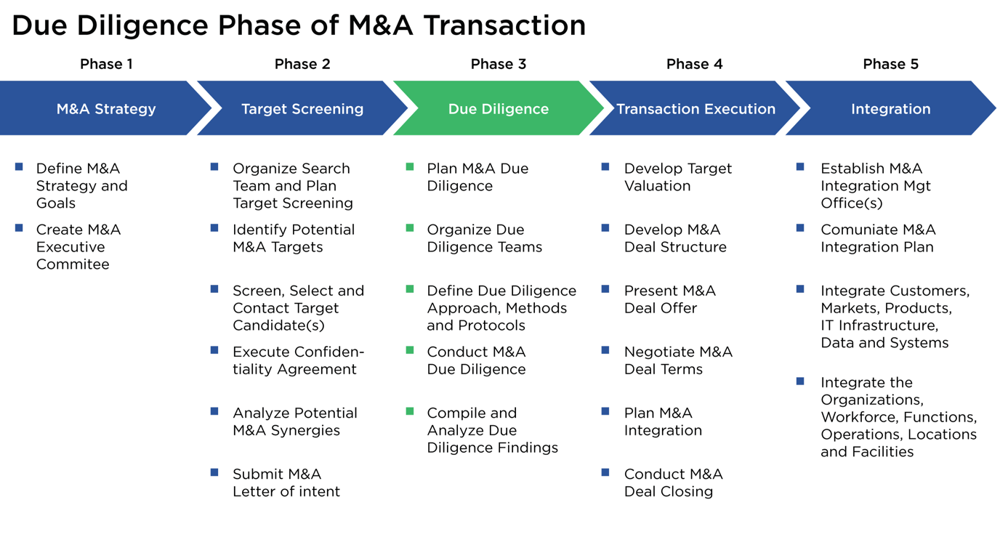

## Table of Contents

## What is due diligence and why is it important?

Due diligence is the careful research and investigation someone does before making a decision, like buying a business or investing money. It's like checking all the details and facts to make sure everything is okay and there are no surprises later. People do due diligence to understand the risks and see if the decision is a good one.

It's important because it helps people make smarter choices. By doing due diligence, you can find problems or risks that you didn't know about before. This can save you from making a bad decision that could cost you a lot of money or cause other problems. Doing your homework before deciding can give you more confidence and peace of mind.

## Who should be involved in the due diligence process?

The due diligence process should involve a team of people who have different skills and knowledge. This team usually includes the person or company making the decision, like the buyer or investor. They also need experts like lawyers, accountants, and sometimes industry specialists who can look at specific parts of the business or investment. Each person on the team has a job to do, and together they make sure all the important areas are checked.

It's also a good idea to include people who will be affected by the decision. For example, if a company is buying another company, the managers and key employees from both companies should be involved. They can give important information and help spot any problems that might not be obvious to outsiders. By having a diverse team, you can get a full picture of what you're getting into and make a better decision.

## What are the key areas to focus on during due diligence?

During due diligence, it's important to look at the financial health of the business or investment. This means checking things like the company's income, expenses, debts, and assets. You want to see if the business is making money and if it can keep doing that in the future. It's also good to look at the company's financial records to make sure they are correct and there are no hidden problems. Talking to the company's accountants can help you understand the financial situation better.

Another key area is the legal side of things. You need to check if the company has any lawsuits or legal issues that could cause trouble later. This includes looking at contracts with customers, suppliers, and employees to make sure everything is in order. It's also important to check if the company is following all the laws and regulations that apply to its business. Getting help from lawyers can make sure you don't miss any important legal details.

Lastly, you should look at the operations and management of the business. This means understanding how the company works day-to-day and who is running it. You want to know if the company has good systems in place and if the people in charge are doing a good job. It's also helpful to look at the company's market and competitors to see how it fits in the industry. Talking to the company's managers and employees can give you a better idea of what's really going on inside the business.

## How do you gather and organize information for due diligence?

To gather information for due diligence, you start by asking the company for documents like financial statements, contracts, and legal records. You might also talk to the company's managers and employees to get more details about how the business works. Sometimes, you need to do your own research, like looking at public records or industry reports. It's important to be thorough and ask a lot of questions to make sure you have all the information you need.

Once you have all the information, you need to organize it in a way that makes sense. You can use folders or a computer system to keep everything in order. It's helpful to group the information into categories like financial, legal, and operational. This makes it easier to go through everything and see if there are any problems or risks. By keeping the information well-organized, you can make better decisions and feel more confident about your due diligence process.

## What are the common documents required for due diligence?

When doing due diligence, you need to look at many different documents. Some of the most important ones are financial statements, like the income statement, balance sheet, and cash flow statement. These help you understand if the company is making money and how it is spending its money. You also need to see tax returns to make sure the company is paying its taxes correctly. Bank statements and debt agreements are important too because they show how much money the company has and how much it owes.

Another set of documents you need are legal ones. This includes contracts with customers, suppliers, and employees, which tell you about the company's relationships and obligations. You should also look at any lawsuits or legal disputes the company is involved in. It's important to check licenses and permits to make sure the company is allowed to do what it's doing. Lastly, you might need to see organizational documents like the company's articles of incorporation and bylaws, which explain how the company is set up and run.

For operational due diligence, you might need to look at business plans and market research reports to understand the company's goals and how it fits in its industry. Employee records and organizational charts can help you see who is working at the company and how it is managed. Inventory lists and asset registers are useful to know what the company owns. By looking at all these documents, you can get a full picture of the business and make a smart decision.

## How can you assess the financial health of a company during due diligence?

To assess the financial health of a company during due diligence, you start by looking at its financial statements. These include the income statement, which shows if the company is making money, the balance sheet, which lists what the company owns and owes, and the cash flow statement, which tells you how money is moving in and out of the business. You want to check if the company's income is growing and if it's making more money than it's spending. It's also important to look at the company's debts and see if it can pay them back. By going through these documents carefully, you can get a good idea of the company's financial situation.

Another way to assess financial health is by looking at the company's financial ratios. These are numbers that help you understand things like how well the company is using its money, how much profit it's making, and how easily it can pay its bills. For example, the debt-to-equity ratio tells you how much the company is borrowing compared to what it owns. The profit margin shows how much of the company's sales turn into profit. By comparing these ratios to other companies in the same industry, you can see if the company is doing well or if there are problems you need to worry about. Talking to the company's accountants can also help you understand the financial statements better and spot any issues that might not be obvious at first.

## What legal aspects should be considered in due diligence?

When doing due diligence, it's really important to look at the legal side of things. You need to check if the company has any lawsuits or legal problems that could cause trouble later. This means looking at any current or past legal disputes to see if they might affect the business. You also need to go through all the contracts the company has with customers, suppliers, and employees. These contracts tell you about the company's promises and obligations. It's important to make sure these contracts are legal and that the company is following them correctly. Checking for any licenses and permits is also key because the company needs these to do its business legally.

Another part of legal due diligence is making sure the company is following all the laws and regulations that apply to its business. This includes things like labor laws, environmental regulations, and industry-specific rules. If the company is not following these laws, it could get into big trouble and face fines or even have to shut down. You also need to look at the company's organizational documents, like its articles of incorporation and bylaws. These documents explain how the company is set up and run, and it's important to make sure everything is in order. By carefully going through all these legal aspects, you can understand the risks and make a better decision about the company.

## How do you evaluate the operational efficiency of a business?

To evaluate the operational efficiency of a business, you need to look at how well the company uses its resources to get things done. This means checking if the business is using its time, money, and people in the best way possible. You can start by looking at the company's production process to see if it's smooth and if there are any steps that could be faster or cheaper. It's also important to see how well the company manages its inventory, making sure it has enough products to sell but not so much that it's wasting money on storage. Talking to the employees can give you a good idea of how things are working day-to-day and if there are any problems that need to be fixed.

Another way to evaluate operational efficiency is by looking at the company's key performance indicators (KPIs). These are numbers that show how well the business is doing in different areas, like how quickly it can make and sell its products, how much it costs to make them, and how happy its customers are. Comparing these numbers to other companies in the same industry can help you see if the business is doing well or if it needs to improve. By looking at all these things together, you can get a full picture of how efficiently the business is running and where it might need to make changes to do better.

## What are the best practices for conducting due diligence on a potential acquisition?

When conducting due diligence on a potential acquisition, it's important to start by gathering all the necessary documents. This includes financial statements, legal contracts, and operational records. You should also talk to the company's managers and employees to get a better understanding of how the business works. It's a good idea to have a team of experts, like lawyers and accountants, to help you go through everything and make sure you don't miss any important details. By being thorough and asking a lot of questions, you can gather all the information you need to make a smart decision.

Once you have all the information, you need to organize it and look at it carefully. Check the financial health of the company by going through its income, expenses, debts, and assets. Make sure to look at any legal issues or lawsuits that could cause problems later. Also, evaluate the company's operational efficiency by looking at its production process, inventory management, and key performance indicators. By comparing these details to other companies in the same industry, you can see if the business is doing well or if there are areas that need improvement. Taking the time to do a thorough due diligence process can help you avoid surprises and make a better decision about the acquisition.

## How can technology be utilized to streamline the due diligence process?

Technology can make the due diligence process easier and faster. You can use special software to keep all the documents in one place and organize them well. This software can help you find information quickly and share it with your team. You can also use tools that let you look at financial data and see if there are any problems. These tools can do calculations and make charts to help you understand the numbers better. By using technology, you can save time and make sure you don't miss any important details.

Another way technology helps is by letting you do virtual meetings and talks. You can use video calls to talk to the company's managers and employees without having to travel. This can save you a lot of time and money. You can also use online tools to work together with your team, even if you are in different places. These tools let you share documents and ideas easily. By using technology, you can make the due diligence process smoother and more efficient.

## What are the red flags to look out for during due diligence?

During due diligence, you need to watch out for certain signs that might mean there are problems with the company. One big red flag is if the financial records look fishy or don't add up. This could mean the company is not making as much money as it says or is hiding debts. Another warning sign is if the company has a lot of lawsuits or legal issues. This can cause big trouble later and might mean the company is not following the rules. Also, be careful if the company's managers or employees seem unhappy or if there is a lot of turnover. This can show that the company is not a good place to work and might have problems with how it's run.

Another thing to watch for is if the company's products or services are not selling well or if it's losing customers. This can mean the company is not doing well in its market and might have trouble making money in the future. It's also a red flag if the company doesn't have good systems in place for making and selling its products. This can make it hard for the company to grow and be successful. By keeping an eye out for these signs, you can spot problems early and make a better decision about whether to go ahead with the acquisition.

## How do you integrate findings from due diligence into decision-making processes?

When you finish the due diligence process, you need to use what you learned to make a good decision. Start by looking at all the information you gathered about the company's money, legal issues, and how it runs. See if there are any big problems or risks that could cause trouble later. If you find red flags, like hidden debts or lawsuits, you might want to think twice about going ahead with the acquisition. On the other hand, if the company looks healthy and has good growth potential, that's a good sign. Talk to your team about what you found and get their thoughts. This helps you make sure you're not missing anything important.

Once you've gone through all the information, you can make a plan for what to do next. If the due diligence shows the company is a good fit, you might decide to move forward with the acquisition. But you might also want to negotiate a better price or ask for certain conditions to be met before you agree. If the due diligence shows too many problems, it might be better to walk away. Either way, using the findings from due diligence helps you make a smart choice and feel more confident about your decision.

## References & Further Reading

[1]: Bergstra, J., Bardenet, R., Bengio, Y., & Kégl, B. (2011). ["Algorithms for Hyper-Parameter Optimization."](https://dl.acm.org/doi/10.5555/2986459.2986743) Advances in Neural Information Processing Systems 24.

[2]: ["Advances in Financial Machine Learning"](https://www.amazon.com/Advances-Financial-Machine-Learning-Marcos/dp/1119482089) by Marcos Lopez de Prado

[3]: ["Evidence-Based Technical Analysis: Applying the Scientific Method and Statistical Inference to Trading Signals"](https://www.amazon.com/Evidence-Based-Technical-Analysis-Scientific-Statistical/dp/0470008741) by David Aronson

[4]: ["Machine Learning for Algorithmic Trading"](https://github.com/stefan-jansen/machine-learning-for-trading) by Stefan Jansen

[5]: ["Quantitative Trading: How to Build Your Own Algorithmic Trading Business"](https://www.amazon.com/Quantitative-Trading-Build-Algorithmic-Business/dp/1119800064) by Ernest P. Chan