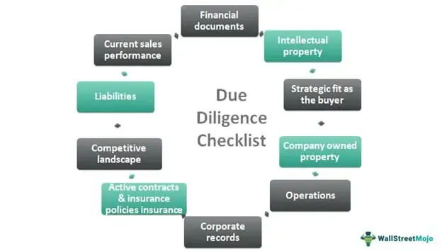

Algorithmic trading, commonly known as algo trading, has fundamentally transformed financial markets by employing sophisticated algorithms to automate trading decisions and processes. This automation facilitates unprecedented trading speeds and volume management, far surpassing the capabilities of manual trading. As a result, algorithmic trading has gained a dominant position, accounting for a significant portion of trading volumes on global financial exchanges.

However, the growing dependence on technology-driven trading introduces a complex matrix of challenges and risks that necessitate rigorous risk assessment and business process due diligence. The primary aim is to anticipate and mitigate potential disruptions that could affect automated trading operations and performance. As financial markets are characterized by volatility and rapid shifts, the imperative to balance trading efficacy with risk becomes vital to maintain stability and ensure consistent profitability.



Risk assessment involves a thorough identification and evaluation of financial, operational, and systemic risks that could impact trading outcomes. By proactively managing these risks, traders and financial institutions can limit adverse impacts and enhance trading performance. Meanwhile, business process due diligence comprises a comprehensive evaluation of trading algorithms to ensure their reliability, accuracy, and compliance with regulatory standards. This includes data validation, algorithm performance evaluation, and regular audits to adapt to evolving market conditions and technological advancements.

This article focuses on these essential processes within the framework of algorithmic trading, examining how they ensure a balance between efficacy and risk—a balance crucial for achieving success in today's volatile markets. By exploring the interplay between risk management and due diligence, the article provides insights into creating robust, resilient algorithmic trading strategies that can withstand dynamic market challenges.

## Table of Contents

## Understanding Algorithmic Trading

Algorithmic trading involves the use of computer-based algorithms for making trading decisions and executing trades in financial markets. These algorithms process vast amounts of data to identify and capitalize on trading opportunities, replacing traditional methods of manual trade execution. The automation leveraged by these algorithms allows for rapid decision-making, enabling trades to be executed in fractions of a second, far surpassing the capabilities of human traders.

One of the primary advantages of algorithmic trading is speed. Trading algorithms can react to market conditions almost instantaneously, allowing traders to benefit from [arbitrage](/wiki/arbitrage) opportunities that exist only for a split second. This speed is facilitated by high-frequency trading ([HFT](/wiki/high-frequency-trading-strategies)) strategies, which capitalize on small price changes.

Another significant benefit is accuracy. Algorithms can execute trades with precision without human error, adhering strictly to predefined criteria and rules. This reduces the likelihood of mistakes that could occur in manual trading.

Algorithmic trading also mitigates emotional bias, which can adversely affect human traders. Emotions such as fear and greed can lead to irrational decision-making, potentially resulting in suboptimal trades. Algorithms, on the other hand, operate on logic and quantitative data, maintaining consistency in executing strategies according to plan.

However, the complexity of these systems does introduce new risks. The sophistication of algorithms means that they can sometimes behave unpredictably under certain market conditions, leading to unintended market impacts. Technical failures, such as software glitches, network issues, or erroneous input data, can result in cascading issues affecting trading performance and market stability.

To integrate risk assessment and due diligence effectively in [algorithmic trading](/wiki/algorithmic-trading), understanding these dynamics is essential. It requires expertise in both trading strategy development and the technical aspects of implementing these strategies. This ensures that while the benefits of speed, accuracy, and bias reduction are maximized, the associated risks are proactively managed and minimized.

## The Importance of Risk Assessment

Risk assessment in algorithmic trading is a crucial process that involves identifying and evaluating potential threats that can adversely affect trading operations and performance. Given the intricacies and high-stakes nature of financial markets, understanding and mitigating these risks is imperative for maintaining stability and optimizing trading outcomes.

### Types of Risks

1. **Financial Risks**: These entail market risk, credit risk, and liquidity risk. Market risk is associated with changes in market conditions that can affect the pricing of assets. Credit risk involves the possibility of a trading counterparty defaulting on their financial obligations. Liquidity risk refers to the challenges in entering or exiting positions in a market without causing significant price disruptions.

2. **Operational Risks**: These involve failures in internal processes, systems, or human actions. For instance, a coding error in a trading algorithm can lead to incorrect buy/sell decisions, causing financial losses. Therefore, robust operational protocols, including thorough testing and validation of algorithms, are essential to minimize such risks.

3. **Systemic Risks**: These are critical due to the interconnected nature of financial markets where a failure in a single entity or market can propagate and lead to broader financial instability. Algorithmic trading firms must thus be aware of how their strategies might contribute to systemic risk, particularly during volatile market periods.

### Proactive Risk Management Strategies

Effective risk management requires a proactive approach to anticipate and address potential risks before they materialize. Some strategies include:

- **Stress Testing and Scenario Analysis**: These methodologies allow firms to evaluate how their trading strategies would perform under different market conditions, including adverse scenarios. This helps in identifying vulnerabilities and preparing appropriate risk mitigation tactics.

- **Real-time Monitoring and Adjustment**: Algorithms should be monitored continuously to detect any anomalies or unexpected behaviors in real-time. Machine learning and artificial intelligence tools can be employed to quickly identify patterns that may indicate potential risks.

- **Diversification**: Spreading investments across various strategies or asset classes can reduce the impact of any single risk event. Diversification helps in balancing potential losses with gains from uncorrelated assets.

- **Regulatory Compliance**: Adherence to regulatory standards is vital. Ensuring compliance not only reduces the risk of legal penalties but also strengthens market integrity. Regular audits and updates to align with regulatory changes are necessary.

In conclusion, risk assessment in algorithmic trading is indispensable for identifying threats that could compromise trading efficacy. By evaluating financial, operational, and systemic risks and implementing proactive risk management strategies, businesses can mitigate negative impacts and optimize their trading performance.

## Business Process Due Diligence

Business process due diligence in algorithmic trading entails a comprehensive examination of trading algorithms to ensure they function optimally and within predefined parameters. This practice is fundamental to maintaining the algorithms' accuracy, compliance, and performance in a constantly evolving market environment.

Key components of due diligence include validation of data integrity, which ensures that the data inputs and outputs of an algorithm remain consistent, accurate, and free from corruption. This is crucial because compromised data can lead to erroneous trading decisions. A robust example of validating data integrity is through implementing hashing techniques to detect changes in datasets. Python code to validate data integrity using a hash function such as SHA-256 might look like this:

```python
import hashlib

def calculate_hash(file_path):
    sha256_hash = hashlib.sha256()
    with open(file_path, "rb") as f:
        # Read and update hash value in blocks of 4K
        for byte_block in iter(lambda: f.read(4096), b""):
            sha256_hash.update(byte_block)
    return sha256_hash.hexdigest()

# Example usage:
# original_hash = calculate_hash('original_dataset.csv')
# current_hash = calculate_hash('current_dataset.csv')
# if original_hash != current_hash:
#     print("Data integrity issue detected!")
```

Compliance with regulatory standards is another critical component. Algorithmic trading occurs within a heavily regulated industry, and ensuring that trading systems comply with regional and international regulations is essential. This includes adhering to financial regulations like the Markets in Financial Instruments Directive (MiFID II) in the European Union, which mandates transparency and accountability in trading activities.

Evaluating algorithm performance is equally important. It involves rigorous testing under various market conditions to assess how algorithms perform in normal and stressed environments. Performance evaluation can be conducted through [backtesting](/wiki/backtesting), where historical market data is used to simulate trading operations, offering insights into potential future performance. This ensures that the algorithm not only executes trades efficiently but also adapts to varying market conditions without significant degradation of performance.

Regular audits and updates are necessary to keep algorithms aligned with dynamic market landscapes and technological advancements. These activities help detect anomalies or potential failure points that could undermine algorithmic operations. By conducting periodic audits, businesses can identify and rectify vulnerabilities, adapting algorithms to maintain competitive performance. The continual cycle of auditing and updating addresses both the ever-changing market conditions and advances in technology, preventing obsolescence and ensuring robust trading operations.

Through rigorous business process due diligence, companies can mitigate risks associated with algorithmic trading, ensuring algorithms are well-tuned to operate effectively, efficiently, and compliantly in complex, volatile markets.

## Integrating Risk Assessment with Due Diligence

Effective integration between risk assessment and due diligence is crucial for developing robust algorithmic trading strategies. These two components, while distinct, are inherently interconnected in ensuring the efficacy and safety of trading algorithms. When integrated, they provide a comprehensive approach to identifying and managing risks while confirming the reliability of trading processes.

Cross-functional teams play a pivotal role in bridging the gaps between risk management and algorithm development. These teams typically consist of data scientists, risk analysts, compliance officers, and software engineers. By working collaboratively, these professionals can ensure that risk considerations are embedded throughout the algorithm development lifecycle. For example, a data scientist might identify potential data anomalies that could lead to erroneous trading signals, while a risk analyst assesses the financial implications of these anomalies.

Continuous monitoring and adaptation are also vital for maintaining the relevance and safety of trading algorithms. Markets are dynamic entities, constantly influenced by myriad factors that can introduce new risks and opportunities. Implementing real-time monitoring systems can help detect deviations from expected performance, allowing for immediate intervention. Algorithms should be subject to periodic reviews and updates to adapt to market changes and technological advancements. This proactive approach can significantly reduce the likelihood of adverse outcomes.

Consider the implementation of a monitoring system using Python. A simple script could use APIs to fetch live market data and track algorithm performance metrics:

```python
import requests
import time

def get_market_data(api_endpoint):
    response = requests.get(api_endpoint)
    return response.json()  # Assuming the API returns data in JSON format

def monitor_algorithm_performance(threshold, api_endpoint):
    while True:
        data = get_market_data(api_endpoint)
        performance_metric = compute_performance_metric(data)  # User-defined function
        if performance_metric < threshold:
            alert_team()  # Function to notify relevant team members
        time.sleep(60)  # Check every minute

monitor_algorithm_performance(0.95, 'https://api.example.com/market_data')
```

In conclusion, integrating risk assessment with due diligence involves collaborative efforts by cross-functional teams and continuous practice of monitoring and adaptation. This integrated strategy not only helps to manage risk effectively but also ensures that algorithms perform optimally in diverse market scenarios.

## Technological Tools and Resources

In the context of algorithmic trading, the use of advanced technological tools is essential for enhancing risk assessment and due diligence processes. The integration of [machine learning](/wiki/machine-learning) and [artificial intelligence](/wiki/ai-artificial-intelligence) (AI) offers a robust framework for these activities, enabling real-time analysis and decision-making that were previously unattainable with manual methods.

Machine learning algorithms can process vast amounts of data, identify patterns, and make predictions, all of which are invaluable for assessing potential risks in trading environments. For example, these algorithms can be trained to recognize typical market behaviors and flag anomalies, potentially indicating unusual market conditions or operational errors. These capabilities allow for immediate intervention, mitigating risks before they escalate into significant issues.

Predictive analytics further complements machine learning by using historical data to forecast future market conditions or trading outcomes. This approach not only assists in identifying potential risks but also aids in the optimization of trading strategies. For instance, predictive models can evaluate the probability of various market scenarios, allowing traders to adjust their strategies accordingly.

Automated monitoring systems are another critical component. These systems continuously oversee algorithmic trading activities, ensuring adherence to regulatory standards and performance benchmarks. By automating routine checks, firms reduce the risk of human error and free up resources for more strategic tasks. Moreover, these systems often incorporate alert mechanisms that notify management of any deviations from expected performance parameters, ensuring prompt corrective actions.

To illustrate the practical implementation of these technologies, consider a Python-based algorithm designed to monitor stock price movements and detect anomalies:

```python
import numpy as np
from sklearn.ensemble import IsolationForest

# Sample data: stock price changes
data = np.array([0.5, 0.6, -0.3, 0.2, 5.0, 0.4, -0.1]).reshape(-1, 1)

# Initialize the model
clf = IsolationForest(contamination=0.1)
clf.fit(data)

# Predict anomalies (-1 indicates anomaly, 1 indicates normal)
anomalies = clf.predict(data)

print(anomalies)
```

In this example, the `IsolationForest` algorithm identifies outliers in stock price changes, highlighting potential anomalies that warrant further investigation.

The effective deployment of these technological tools ensures that algorithmic trading processes are not only optimized for efficiency but also fortified against disruptions. By leveraging machine learning, AI, predictive analytics, and automated monitoring systems, traders and firms can navigate the complexities of modern financial markets with improved precision and confidence.

## Challenges and Future Trends

Risk management in algorithmic trading faces several multifaceted challenges. One significant challenge is the evolving regulatory landscape, as financial markets worldwide continuously update their regulatory frameworks to account for technological advancements. Ensuring compliance with these dynamic regulations requires ongoing adaptations in trading algorithms and processes, which can be resource-intensive and complex. Non-compliance can lead to severe penalties, making it imperative for trading firms to stay informed about regulatory changes.

Market unpredictability adds another layer of complexity to risk management in algorithmic trading. Financial markets are inherently volatile, and events such as geopolitical tensions, economic upheavals, or unexpected market announcements can trigger rapid fluctuations. Algorithmic trading systems must be robust enough to handle such [volatility](/wiki/volatility-trading-strategies) without leading to significant financial losses. This requires the development of algorithms that not only make profitable trades but also have built-in risk management capabilities to react

## Conclusion

Risk assessment and business process due diligence are indispensable for preserving both integrity and performance in the field of algorithmic trading. As algorithmic trading increasingly depends on the precision and speed offered by technological advancements, businesses must continuously adapt their strategies. The financial markets are prone to volatility, and ignoring the potential risks associated with trading algorithms can lead to substantial losses. Thus, assessing risks effectively helps in understanding and mitigating financial, operational, and systemic threats that could undermine trading operations.

Due diligence, particularly regarding algorithmic evaluation, serves as an essential tool for assuring that trading operations align with both market conditions and regulatory requirements. Regular evaluations allow firms to verify data integrity, ensure compliance, and audit algorithm performance, which is critical for adapting to changing market dynamics and technological advancements. Maintaining rigorous standards in due diligence can uncover potential inefficiencies and pinpoint areas for improvement, ultimately enhancing the robustness of trading algorithms.

A proactive approach to integrating risk assessment with business process due diligence ensures that businesses remain resilient and competitive. Employing advanced technologies such as machine learning and AI facilitates real-time monitoring and management of risks, streamlining the entire process while guarding against disruptions. By leveraging predictive analytics and automated monitoring systems, businesses can preemptively address anomalies and potential threats.

As the regulatory landscape evolves and market conditions fluctuate, organizations must stay informed of emerging trends to maintain and strengthen their competitive edge. Innovations in AI-driven tools and regulatory adjustments will continue to shape the future landscape of algorithmic trading. Businesses that anticipate these changes and dynamically re-evaluate their strategies will be better equipped to sustain success in this fast-paced environment.

## References & Further Reading

[1]: Bergstra, J., Bardenet, R., Bengio, Y., & Kégl, B. (2011). ["Algorithms for Hyper-Parameter Optimization."](https://dl.acm.org/doi/10.5555/2986459.2986743) Advances in Neural Information Processing Systems 24.

[2]: ["Advances in Financial Machine Learning"](https://www.amazon.com/Advances-Financial-Machine-Learning-Marcos/dp/1119482089) by Marcos Lopez de Prado

[3]: ["Evidence-Based Technical Analysis: Applying the Scientific Method and Statistical Inference to Trading Signals"](https://www.amazon.com/Evidence-Based-Technical-Analysis-Scientific-Statistical/dp/0470008741) by David Aronson

[4]: ["Machine Learning for Algorithmic Trading"](https://github.com/stefan-jansen/machine-learning-for-trading) by Stefan Jansen

[5]: ["Quantitative Trading: How to Build Your Own Algorithmic Trading Business"](https://www.amazon.com/Quantitative-Trading-Build-Algorithmic-Business/dp/1119800064) by Ernest P. Chan