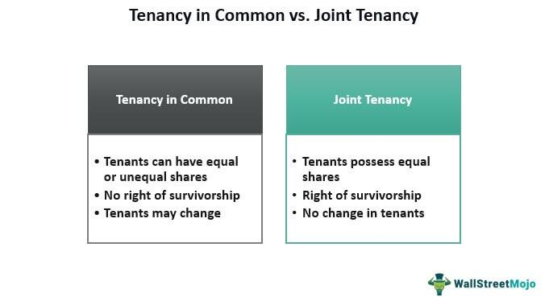

This article explores the intersection of property ownership structures, specifically tenancy in common, and algorithmic trading, two seemingly distinct areas in investment and finance. Tenancy in common (TIC) represents a form of real estate ownership where multiple parties can own a fraction of a property, each with distinct and transferable ownership rights. In contrast, algorithmic trading involves leveraging sophisticated computer programs and financial algorithms to execute trades in financial markets, such as stocks, forex, and commodities, with high efficiency and speed. Both these concepts have reshaped traditional methods of investment, offering investors innovative avenues for diversifying their portfolios and optimizing returns. By gaining a comprehensive understanding of tenancy in common and algorithmic trading, investors can better navigate the complexities of property and trading markets. This knowledge can lead to making informed decisions that align with individual financial goals and risk tolerance.

## Table of Contents



## Understanding Tenancy in Common

Tenancy in common (TIC) is a form of property ownership where multiple parties can possess distinct shares of a property. Unlike joint tenancy, where co-owners hold equal interest with survivorship rights, TIC allows each owner to maintain individual ownership rights over their specific portion. This structure provides a flexible framework, as owners can hold unequal shares according to their agreements or financial contributions. Each co-owner in a TIC has the autonomy to transfer, sell, or mortgage their share independently, without needing the consent of the other co-owners.

A notable distinction of tenancy in common is its approach to inheritance, as it lacks survivorship rights. Upon an owner's death, their share is not automatically transferred to the remaining co-owners but is instead bequeathed according to their will or state inheritance laws. This feature is particularly advantageous for investors aiming to retain control over who inherits their portion of the property, facilitating personal estate planning objectives.

The adaptability of TIC structures makes them attractive to both real estate investors and personal property buyers. Investors benefit from the opportunity to split the investment cost across multiple parties, lowering the entry barrier into competitive real estate markets. Additionally, the ability to diversify investments and share potential profits encourages varied investment opportunities.

However, investors must understand the liabilities associated with TIC arrangements. Owners are typically jointly and severally liable for property-related financial obligations, including property taxes and debts. This means if one owner fails to fulfil their financial responsibilities, the others might have to cover the shortfall. Awareness of these implications is crucial for investors who want to ensure sound financial management of their property investment.

## How Tenancy in Common Works

A Tenancy in Common (TIC) agreement is a versatile form of co-ownership that allows multiple individuals to simultaneously own interests in a single property. One distinct characteristic of TIC is the ability to add or remove owners throughout the life of the property ownership. This feature makes TIC particularly appealing as it does not disrupt the existing arrangement or ownership structure. Each owner, regardless of their ownership percentage, holds an undivided right to occupy and utilize the entire property. This means that even if an individual owns a smaller fraction of the property, they are entitled to use the entire property just as those who hold larger stakes.

Disputes within TIC arrangements can arise, leading to legal interventions. In such instances, courts have the authority to resolve the disagreements through a process known as partition. Partition can either physically divide the property among the co-owners or result in a sale of the property, after which the proceeds are divided among the owners according to their respective ownership shares.

The financial implications of TIC agreements are notable, particularly regarding tax obligations and liabilities. Owners typically engage in joint payments for expenses like property taxes and maintenance costs. However, each owner can deduct their proportionate share of these costs on their tax returns, reflecting their ownership interest—this approach balances collective responsibility with individual financial benefits, allowing each co-owner to leverage their share for tax deductions accurately.

Overall, Tenancy in Common offers a flexible and cooperative ownership model, useful for both residential and investment purposes, by accommodating changes in ownership, ensuring co-use of the property, and allowing for equitable financial management.

## Other Forms of Tenancy

In addition to tenancy in common, there are two other significant forms of property ownership that warrant consideration: joint tenancy and tenancy by the entirety. Each offers unique legal benefits and implications, making understanding these structures crucial for individuals or investors contemplating property acquisition.

Joint tenancy is characterized by its provision of survivorship rights. This means that upon the death of one joint tenant, their share in the property automatically transfers to the remaining joint tenant(s). This transfer occurs outside the probate process, providing a streamlined succession of ownership. For example, if three parties hold a property as joint tenants and one dies, the deceased's share is equally divided among the surviving owners. This form of ownership often appeals to those seeking a straightforward method of property succession. However, it necessitates that all owners hold an equal share, and the sale or transfer of a share often requires the consent of all parties involved. Additionally, joint tenants share equal responsibility for any debts associated with the property.

Tenancy by the entirety is a specialized form of joint ownership available exclusively to married couples. It offers a robust shield against individual creditors; properties held under this structure cannot generally be sold, mortgaged, or encumbered without the consent of both spouses. This means that if one spouse incurs a personal debt, creditors cannot claim a property held as tenancy by the entirety to satisfy that debt. Moreover, similar to joint tenancy, it provides automatic survivorship rights. Upon the death of one spouse, the surviving spouse automatically retains ownership of the entire property. This ownership form is beneficial for married couples seeking to protect their property from individual legal judgments and facilitate seamless transfer of property within the marital unit.

Understanding these alternatives to tenancy in common is vital, as the choice of ownership form can have significant implications for property rights, legal protection, and financial objectives. Each ownership type offers distinct advantages that align differently with the goals and circumstances of the owners.

## Pros and Cons of Tenancy in Common

Tenancy in Common (TIC) offers several advantages that appeal to a range of investors and property buyers. One of the primary benefits of TIC is that it facilitates entry into the real estate market by distributing costs and risks among multiple owners. This collective ownership model allows individuals to share the financial burden of purchasing and maintaining a property, making it an attractive option for those who may not possess the resources to acquire real estate independently.

Moreover, TIC arrangements can lead to enhanced investment potential due to the diverse backgrounds and expertise of different owners. Each co-owner may bring unique perspectives and strategies to optimize the property's use and profitability. This collaborative approach can potentially result in better decision-making and improved property value over time.

Despite these advantages, TIC does entail certain risks that require careful consideration. One significant downside is the equal responsibility for debts and liabilities associated with the property. All co-owners are jointly and severally liable, meaning each owner is responsible for the entire debt if other owners default on payments. This risk extends to property taxes, maintenance costs, and any legal obligations connected to the property.

Additionally, TIC arrangements may lead to potential conflicts among co-owners, particularly if disagreements arise regarding property management or financial contributions. Such disputes can escalate, leading to forced sales or legal actions to dissolve the ownership arrangement, thereby jeopardizing the investment.

Investors interested in TIC must weigh these advantages and disadvantages in alignment with their financial strategies and personal circumstances. It is crucial to conduct thorough due diligence and possibly consult with legal and financial advisors to ensure that a TIC arrangement aligns with one's investment objectives and risk tolerance.

 to Algorithmic Trading

Algorithmic trading, or algo trading, uses computer algorithms to automate trading strategies, allowing trades to be executed at optimal times based on predefined conditions. This methodology is widely utilized in financial markets for trading assets such as stocks, foreign exchange ([forex](/wiki/forex-system)), and commodities. The main objective is to exploit market inefficiencies by leveraging precision, speed, and a reduction in human error. Algo trading provides significant advantages over traditional methods by executing decisions at speeds impossible for human traders.

In algo trading, algorithms assess multiple market variables such as price, [volume](/wiki/volume-trading-strategy), and timing to determine the best trading opportunities. These variables are processed to generate signals based on complex mathematical models and statistical analyses. For instance, a common strategy used in [algorithmic trading](/wiki/algorithmic-trading) is high-frequency trading ([HFT](/wiki/high-frequency-trading-strategies)), which involves executing thousands of trades per second to capitalize on small price discrepancies. The formula for calculating the potential profit in such a strategy is often based on the volume of trades multiplied by the spread between bid and ask prices.

The implementation of algorithmic trading requires substantial investment in technology and computational power. Traders and firms must have access to high-speed internet, powerful computing systems, and advanced software capable of processing large volumes of data in real-time. Furthermore, expertise in programming languages such as Python is essential to develop and maintain these trading algorithms. Below is a basic example of a strategy coded in Python, utilizing the simple moving average (SMA) crossover method:

```python
import pandas as pd

# Assuming 'data' is a DataFrame with historical price data
# Calculate simple moving averages
data['SMA_50'] = data['Close'].rolling(window=50).mean()
data['SMA_200'] = data['Close'].rolling(window=200).mean()

# Generate signals: 1 for buy, -1 for sell
data['Signal'] = 0
data.loc[data['SMA_50'] > data['SMA_200'], 'Signal'] = 1
data.loc[data['SMA_50'] < data['SMA_200'], 'Signal'] = -1

# Execute trades based on signals
data['Trade'] = data['Signal'].diff()
```

This code calculates the 50-day and 200-day simple moving averages of stock prices and generates trading signals where the shorter moving average crosses the longer one. While simplistic, this example illustrates the fundamental principle behind algorithmic trading: executing systematic and consistent strategies based on quantitative analysis.

The advent of more sophisticated algorithms, including [machine learning](/wiki/machine-learning) and [artificial intelligence](/wiki/ai-artificial-intelligence), continues to push the boundaries of what is achievable with algo trading. These advanced methods can analyze complex patterns and trends, continuously learning and adapting to improve their performance. As such, algorithmic trading represents a significant evolution in financial markets, necessitating a deep understanding of both technological capabilities and financial market dynamics.

## Interplay Between Tenancy in Common and Algo Trading

The intersection between Tenancy in Common (TIC) and algorithmic trading (algo trading) presents a multifaceted approach to asset management and investment strategies. As both mechanisms offer unique benefits and opportunities, their synergy can lead to a more robust and diversified investment portfolio.

TIC is a flexible property ownership structure that allows multiple parties to own fractions of a property. This enables investors to partake in real estate investments without fully committing to the expenses and risks associated with single ownership. Algorithmic trading, on the other hand, uses sophisticated computer algorithms to buy and sell securities, ideally capitalizing on market inefficiencies. By combining these approaches, investors can diversify their assets across both real estate and securities, effectively balancing risk and opportunity.

Algorithmic trading can complement TIC investments by potentially increasing [liquidity](/wiki/liquidity-risk-premium) and optimizing the timing of trades. Real estate markets are increasingly analyzed through advanced algorithms that assess trends and forecast changes, providing valuable insights into the property market dynamics. These algorithms can predict property value fluctuations, rental yields, and demand forecasts, which can aid TIC owners or potential buyers in making informed decisions about their property investments.

Moreover, TIC properties can indirectly benefit from algorithmic trading strategies. Securities related to real estate, such as Real Estate Investment Trusts (REITs) or real estate-backed securities, can be included in algorithmic trading models. Investors can execute trades in these securities to hedge against real estate market [volatility](/wiki/volatility-trading-strategies) or capitalize on anticipated market movements. This integration allows for a dynamic investment strategy that not only takes advantage of real estate's tangible benefits but also incorporates the speed and efficiency of algo trading.

In summary, the integration of TIC and algorithmic trading offers investors a comprehensive approach to asset management. It provides avenues to optimize returns, manage risk, and exploit market trends. With the technological advancements in trading algorithms and the strategic flexibility of TIC, investors can construct diversified portfolios that are well-positioned to adapt to evolving market conditions.

## Conclusion

Tenancy in common and algorithmic trading are two distinct investment strategies that, when combined, can offer investors significant advantages. Tenancy in common facilitates shared ownership of real estate, allowing investors to diversify their portfolios by spreading the financial load and risks associated with property investment. Algorithmic trading, on the other hand, provides the technology to efficiently manage and execute trades in the financial markets with minimal human intervention, leveraging sophisticated algorithms to capitalize on market inefficiencies.

Integrating these strategies offers a robust approach to risk management and diversification. By blending real estate assets held under tenancy in common with the financial market assets managed through algorithmic trading, investors can achieve a balanced portfolio that mitigates the risks inherent in each individual strategy. This integration can lead to improved financial outcomes by diversifying income streams and investment exposures. Algorithmic trading can complement real estate by providing liquidity and dynamic asset management, whereas real estate can offer tangible value and potential for capital appreciation over time.

The complexity involved in combining these investment strategies necessitates a deep understanding of both legal and technological landscapes. Tenancy in common requires careful consideration of ownership agreements and liabilities, while algorithmic trading demands expertise in data analysis, programming, and financial market trends. Investors seeking to exploit the potential benefits of both strategies should consult with professionals in relevant fields to navigate these complexities effectively. Such guidance can aid in crafting an investment approach that aligns with their financial objectives and risk tolerance, ultimately leading to more informed and strategic investment decisions.

## FAQs

What is Tenancy in Common? Tenancy in Common (TIC) is a property ownership structure where two or more individuals, known as tenants in common, hold distinct shares of a property. These shares can be equal or unequal, and each owner has the right to sell, transfer, or bequeath their share independently. Unlike joint tenancy, TIC does not offer survivorship rights; thus, upon the death of an owner, their share is passed to their heirs rather than the other co-owners.

How does algorithmic trading work? Algorithmic trading, or algo trading, involves utilizing computer algorithms to execute trades in financial markets automatically. These algorithms are designed with pre-set conditions and rules, which can be based on various inputs such as price, timing, trading volume, or other market metrics. The objective is to perform trades with optimal speed and efficiency, minimizing human error and capturing market opportunities that may last only milliseconds. Technological infrastructure and deep knowledge of market structures are essential for successful algorithmic trading.

Can TIC property be traded using algorithms? While direct real estate properties held under Tenancy in Common are not typically traded through algorithms, the concept of algorithmic trading can extend to securities that are related to real estate markets. For example, Real Estate Investment Trusts (REITs) or real estate-backed securities can be traded using algorithmic strategies. These algorithms can analyze real estate market trends to inform decisions on buying, holding, or selling such securities, thereby integrating real estate investment insights with algorithmic trading precision.

## References & Further Reading

[1]: Kyle, A. S. (1985). [Continuous Auctions and Insider Trading](https://personal.utdallas.edu/~nina.baranchuk/Fin7310/papers/Kyle1985.pdf). Econometrica: Journal of the Econometric Society, 53(6), 1315-1336.

[2]: Benninga, S. (2008). ["Financial Modeling"](https://mitpress.mit.edu/9780262046428/financial-modeling/). MIT Press.

[3]: [Blume, M. E., & Keim, D. B. (2012). "The Microstructure of the 'Flash Crash': Flow Toxicity, Liquidity Crashes, and the Probability of Informed Trading"](https://datascienceassn.org/sites/default/files/The%20Microstructure%20of%20the%20%E2%80%98Flash%20Crash%E2%80%99%20-%20Flow%20Toxicity%2C%20Liquidity%20Crashes%20and%20the%20Probability%20of%20Informed%20Trading.pdf). Journal of Portfolio Management.

[4]: [Hasbrouck, J. (1991). "Measuring the Information Content of Stock Trades"](https://www.jstor.org/stable/2328693). Journal of Finance, 46(5), 179-286.

[5]: ["Real Estate Investment Trusts (REITs) and Their Use in Algorithmic Trading"](https://www.fidelity.com/learning-center/trading-investing/what-is-a-reit). Investopedia.

[6]: ["Tenancy in Common: What Real Estate Investors Should Know"](https://www.bankrate.com/real-estate/what-is-tenancy-in-common/). NOLO.

