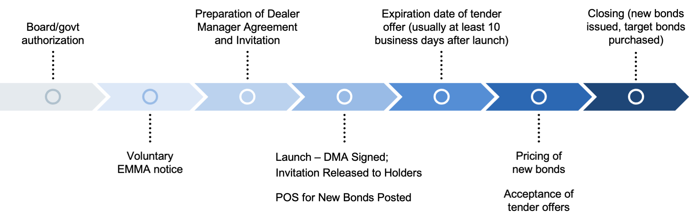

A tender offer is a proposal by an investor to purchase a substantial portion of a company's shares or bonds at a specified price and within a particular timeframe. Typically, this price is above the current market price, enticing shareholders to sell their holdings. Tender offers play a crucial role in investment finance as they can facilitate takeovers, allow companies to restructure, and serve as a strategy for influencing management or achieving investment returns. These offers are particularly significant in mergers and acquisitions, providing a mechanism to directly engage with shareholders.

Algorithmic trading, also known as algo-trading, involves using pre-programmed instructions to execute trading actions based on variables like time, price, or volume. With the advent of advanced computational technologies, algorithmic trading has gained prominence due to its ability to increase trading efficiency, reduce costs, and execute orders at a speed and frequency impractical for human traders. Today, it constitutes a significant portion of trading volumes in global financial markets, leveraging machine learning and artificial intelligence to analyze complex datasets and optimize trading strategies.



The intersection of tender offers and algorithmic trading is of growing importance for investors as it represents the convergence of strategic corporate finance maneuvers and advanced financial technology. Algorithmic trading can impact the outcome of tender offers by influencing the market price, identifying arbitrage opportunities, and offering insights into shareholder behavior. For investors, this intersection means that staying informed about algorithmic trading techniques and their implications on tender offers can present opportunities to capitalize on market movements more effectively and make informed decisions.

The primary objective of this article is to explore how algorithmic trading affects tender offers in investment finance. By understanding the dynamics involved, market participants can better navigate the complexities of modern trading environments. Additionally, as trading technologies continue to evolve, the importance of remaining updated on these advancements cannot be overstated. Staying informed about technological innovations not only aids in mitigating risks but also empowers investors to leverage these tools to enhance their investment strategies in the ever-evolving financial markets.

## Table of Contents

## Understanding Tender Offers

Tender offers are proposals whereby an investor, typically a corporation or a private equity fund, seeks to purchase some or all of shareholders’ shares in a corporation at a specified price. These offers are usually made public and can either be friendly or hostile, depending on the circumstances surrounding the offer. Tender offers play a significant role in corporate finance as they are often used as a mechanism for mergers and acquisitions, enabling companies to consolidate assets, expand their operations, or achieve synergies that can enhance their competitive position.

From a strategic perspective, tender offers provide a way for companies to efficiently acquire another entity without going through a potentially more challenging merger process. They allow the acquiring company to make a direct appeal to shareholders, often bypassing the target company’s board of directors if the board is opposed to the takeover. For shareholders, tender offers can be attractive if the offering price includes a premium over the current market price of the shares, thus presenting an immediate profit opportunity.

Tender offers can significantly impact stock prices, typically resulting in an increase in the target company's stock price due to the premium offered. Conversely, the share price might decrease or remain stagnant if investors perceive the offer as unfavorable or if it fails to materialize. For investors, the decision to participate in a tender offer involves analysing whether the premium justifies selling their shares, considering the company's long-term potential independently of the offer.

Common scenarios where tender offers are utilized include hostile takeovers, where a company attempts to acquire another company against the wishes of the target's management. They are also used in leveraged buyouts, where management or a private equity firm purchases outstanding shares to take the company private. Additionally, tender offers can be a strategic move for consolidations, where acquiring and target companies see a merger as beneficial for growth or market expansion.

Understanding these scenarios is crucial for market participants, as the outcomes of tender offers can lead to significant shifts in market dynamics, influence the competitive landscape, and affect shareholder value in profound ways. By grasping the basics of tender offers, investors can better navigate these shifting tides within the corporate finance sector.

## The Rise of Algorithmic Trading

Algorithmic trading has become an essential component of modern financial markets, transforming how trades are executed and influencing market dynamics significantly. Its origins can be traced back to the 1970s, when computerized systems began to be used for simple trade executions. However, it was not until the 1980s and 1990s that [algorithmic trading](/wiki/algorithmic-trading) gained [momentum](/wiki/momentum), aided by technological advancements and electronic exchanges. This evolution marked the transition from human-led trading to systems where algorithms determine trade decisions based on predefined criteria.

The benefits of algorithmic trading are manifold. Primarily, it allows for the execution of trades at speeds and volumes that are impossible for human traders. Algorithms can operate on multiple markets and instruments simultaneously, analyzing vast data sets and responding in microseconds. This high-frequency trading capability is a significant advantage, particularly in highly liquid markets, where trading opportunities can disappear in fractions of a second.

Moreover, algorithmic trading reduces the human tendency for emotional decision-making, relying instead on data-driven strategies. This impersonal approach minimizes errors and enhances the consistency of trading outcomes. Additionally, by optimizing execution strategies, algorithmic trading can reduce transaction costs through strategies such as best execution and minimizing market impact.

Algorithms employed in trading can be classified into several categories based on their purpose and strategy. Some of the most common types include:

1. **Market-Making Algorithms**: These algorithms facilitate liquidity in markets by providing continuous bid and ask prices. They are crucial for ensuring market efficiency and are programmed to profit from the bid-ask spread.

2. **Statistical Arbitrage Algorithms**: These are designed to exploit market inefficiencies through statistical methods. They analyze historical price data to identify patterns and relationships between different financial instruments, making trades that capitalize on mean-reversion scenarios or correlation breakdowns.

3. **Trend-Following Algorithms**: These algorithms identify and exploit trends in the market, going long in an upward trend and short in a downward trend. They typically use technical indicators such as moving averages and momentum oscillators to determine entry and exit points.

4. **Arbitrage Opportunities**: These algorithms look for price discrepancies across different markets or exchanges. For example, if a security is priced differently on two exchanges, an arbitrage algorithm can execute simultaneous buy and sell orders to exploit the price difference.

5. **Execution Algorithms**: Known for managing the timing, speed, and size of orders, these are crucial for institutional investors. Examples include VWAP (Volume-Weighted Average Price) and TWAP (Time-Weighted Average Price) algorithms, which help in executing large orders with minimal market disruption.

In summary, algorithmic trading represents a paradigm shift in the financial markets, driven by the need for speed, efficiency, and precision. As the field continues to advance alongside computational and data processing capabilities, its role in shaping market behavior and trading strategies is set to grow even further.

## Impact of Algorithmic Trading on Tender Offers

Algorithmic trading has significantly changed the landscape of tender offers by introducing speed, efficiency, and analytical depth, which were not possible in traditional trading approaches. By leveraging computational algorithms, traders can now thoroughly analyze tender offer situations and execute transactions more rapidly and strategically.

### Changes in Dynamics
Tender offers historically involved a more extended waiting period before completion, enabling investors to assess the offers and make informed decisions. With algorithmic trading, these dynamics have shifted as algorithms are capable of processing information rapidly and executing trades based on predictive analytics. Algorithms can evaluate vast amounts of market data, past transaction patterns, and the behaviors of involved parties, offering insights into the likelihood of the tender offer succeeding. This transformation has led to quicker market reactions and less [arbitrage](/wiki/arbitrage) opportunities for manual traders.

### Real-World Examples
A notable instance where algorithmic trading impacted a tender offer involved the acquisition of a publicly traded company by a larger conglomerate. Using high-frequency trading algorithms, institutional investors were able to instantly assess the initial responses to the tender offer and adjust their positions in a fraction of a second. This rapid assessment allowed them to capitalize on share price movements that conventional traders might miss. In some cases, algorithmic strategies were employed to accumulate shares just before an anticipated rise in acceptance due to favorable terms being speculated, thereby maximizing profit.

### Advantages for Investors
One of the primary advantages algorithmic trading brings to investors observing tender offers is the ability to monitor and respond to market signals in real-time. Algorithms can be programmed to identify specific market trends associated with tender offers or detect unusual trading volumes, often indicative of breaking developments. This capability ensures investors can strategically position themselves, maximizing potential gains or minimizing risks associated with tender offers.

Moreover, algorithms provide quantitative assessments of offer terms against market conditions, helping investors decide whether to accept, reject, or counter a tender offer. Machine learning techniques, especially those involving predictive analytics, have improved the accuracy with which investors can forecast the outcomes of tender offers. These tools allow a nuanced understanding that was previously unavailable without deep market expertise and time-intensive manual analysis.

### Institutional Leverage
Large financial institutions have significantly benefited from algorithmic trading during tender offers. These institutions use proprietary algorithms to parse through not only public sentiment and historical data but sentiment derived from news sentiment analysis and competitor positioning strategies. By utilizing algorithms, these institutions achieve an analytical edge, providing a clearer picture of the market reactions to tender offers.

Python, for instance, has become a popular language among trading firms for developing such algorithms due to its robust libraries for data analysis. A sample Python snippet to back-test trading strategies on tender offers could look like the following:

```python
import pandas as pd

def simulate_tender_offer_strategy(prices, offer_announcement_date, evaluation_period):
    # prices: a DataFrame with datetime index and 'price' column
    # offer_announcement_date: datetime object indicating when the tender offer was announced
    # evaluation_period: number of days after announcement to analyze

    prices_after_announcement = prices.loc[offer_announcement_date:]
    price_changes = prices_after_announcement.pct_change()

    return price_changes.head(evaluation_period).mean()

# Sample usage
historical_prices = pd.DataFrame({'price': [100, 102, 105, 103, 108, 110]}, index=pd.date_range(start='2023-01-01', periods=6))
offer_announcement_date = pd.Timestamp('2023-01-02')
avg_return = simulate_tender_offer_strategy(historical_prices, offer_announcement_date, 5)
print(f"Average return after offer: {avg_return:.2%}")
```

In conclusion, algorithmic trading has profoundly altered how tender offers are perceived and acted upon within financial markets. By allowing both individual and institutional investors to harness computational power and data analytics, algorithmic trading enhances the efficiency and precision of responses to tender offers, reshaping traditional investment strategies.

## Risks and Challenges

Algorithmic trading, while offering numerous advantages in trading efficiency and execution, also presents notable risks, particularly when interacting with tender offers in financial markets. One of the primary risks involves potential market manipulations. Algorithmic trading algorithms can be programmed to exploit price movements or create artificial [volatility](/wiki/volatility-trading-strategies), which may distort the natural market response to tender offers. This can result in stock price manipulation, where the prices are driven away from their true value, causing negative impacts on market integrity and investor confidence.

Ethical concerns further complicate the use of algorithms in tender offers. These include issues related to information asymmetry, where certain market participants, often large institutions with advanced technologies, may have access to more comprehensive data analysis tools and speed, giving them an unfair advantage over retail investors. This disparity can lead to unequal opportunities in capitalizing on tender offers, thereby questioning the fairness and transparency of financial markets.

Regulatory challenges emerge as a significant concern in the sphere of algorithmic trading. Current regulations often struggle to keep pace with rapid technological advancements. Regulators are attempting to address these issues by enforcing stricter compliance measures, transparency in algorithmic trading protocols, and demanding greater accountability from trading firms. For instance, surrounding regulations have focused on the need for detailed record-keeping of algorithmic strategies and continuous monitoring to prevent manipulative tactics.

Risk management and compliance are crucial components for mitigating the hazards attendant upon algorithmic trading. Firms engaged in algorithmic trading must adopt robust risk management frameworks to identify, assess, and mitigate the risks associated with their trading strategies. This includes implementing comprehensive checks and balances to ensure the integrity of their algorithms, real-time monitoring to detect and react to aberrant trading activities swiftly, and ensuring compliance with both domestic and international regulatory standards. Furthermore, thorough testing and validation of trading algorithms can prevent erroneous trades that might stem from coding errors or unforeseen market conditions.

In conclusion, while algorithmic trading offers substantial improvements in trading efficiency, the associated risks—particularly in the context of tender offers—necessitate diligent management and regulatory oversight to ensure fair and transparent market practices. Addressing these challenges is vital for maintaining market stability and protecting investor interests.

## Future Trends

Emerging trends in algorithmic trading continue to shape the landscape of investment finance, with significant implications for tender offers. As technology advances, the integration of [artificial intelligence](/wiki/ai-artificial-intelligence) (AI) and [machine learning](/wiki/machine-learning) (ML) in trading algorithms is set to revolutionize how market participants approach these strategic corporate actions.

AI and ML technologies are being increasingly adopted to enhance the efficiency and effectiveness of algorithmic trading strategies. These technologies enable algorithms to learn from vast datasets, identify patterns, and make predictive analyses. For instance, machine learning models can analyze historical data on tender offers and predict likely outcomes, aiding in more informed decision-making. AI's ability to process unstructured data, such as news articles and social media sentiment, further enhances its predictive power, potentially influencing market participants' responses to tender offers.

As algorithmic trading becomes more prevalent, investor behavior is likely to evolve. The speed and accuracy of AI-driven trading systems may lead to a shift in how investors approach market analysis and decision-making. Investors might increasingly rely on data-driven insights and predictive analytics provided by algorithms, potentially reducing the influence of traditional analysis techniques. This could result in faster market reactions to tender offer announcements and an increased emphasis on real-time data processing and analysis.

The evolution of markets with advancements in trading technologies also presents new possibilities. Enhanced computational power and improved algorithms could lead to more efficient price discovery, reducing the volatility often associated with tender offers. Additionally, the increased use of AI and ML may facilitate greater participation in tender offers, as investors can more accurately assess the fairness and potential profitability of such offers. As markets become more interconnected, algorithmic trading could drive more synchronized responses, leading to a harmonized global market reaction to tender offer announcements.

In conclusion, the future of algorithmic trading holds the promise of transformative impacts on tender offers. The integration of AI and machine learning enables more precise market analysis and faster reaction times, inevitably altering investor behavior and market dynamics. As these technologies continue to develop, staying informed and adapting to changes will be crucial for investors seeking to leverage the opportunities presented by the evolving trading landscape.

## Conclusion

In this article, we have explored the transformative influence of algorithmic trading on tender offers within investment finance. Algorithmic trading has revolutionized the way financial markets operate, with its ability to process vast amounts of data swiftly and execute trades with precision. This efficiency has significantly impacted tender offers, providing investors with tools to better analyze opportunities, predict outcomes, and strategically respond to corporate actions.

Understanding the intricacies of tender offers and the nuances of algorithmic trading is critical for investors and market participants. Tender offers are strategic financial maneuvers that can substantially alter stock prices and influence shareholder decisions. With the infusion of technology through algorithmic trading, these dynamics are further complicated, necessitating a deep understanding of both concepts.

Continuous learning and adaptation to technological advancements are essential for staying competitive in today's financial landscape. Algorithmic trading is rapidly evolving, with innovations in AI and machine learning likely to shape its future. Investors and institutions must remain vigilant, updating their knowledge and adapting their strategies to leverage new technologies effectively.

Finally, it is crucial to strike a balance between technology-driven strategies and traditional investment approaches. While algorithmic trading offers numerous advantages, foundational investment principles should not be neglected. Sound judgment, ethical considerations, and strategic thinking remain vital components of successful investment practice. By integrating technology with time-tested strategies, investors can navigate the complexities of modern finance with greater confidence.

## References & Further Reading

[1]: Bergstra, J., Bardenet, R., Bengio, Y., & Kégl, B. (2011). ["Algorithms for Hyper-Parameter Optimization."](https://papers.nips.cc/paper/4443-algorithms-for-hyper-parameter-optimization) Advances in Neural Information Processing Systems 24.

[2]: ["Advances in Financial Machine Learning"](https://www.amazon.com/Advances-Financial-Machine-Learning-Marcos/dp/1119482089) by Marcos Lopez de Prado

[3]: ["Evidence-Based Technical Analysis: Applying the Scientific Method and Statistical Inference to Trading Signals"](https://www.amazon.com/Evidence-Based-Technical-Analysis-Scientific-Statistical/dp/0470008741) by David Aronson

[4]: ["Machine Learning for Algorithmic Trading"](https://github.com/stefan-jansen/machine-learning-for-trading) by Stefan Jansen

[5]: ["Quantitative Trading: How to Build Your Own Algorithmic Trading Business"](https://books.google.com/books/about/Quantitative_Trading.html?id=j70yEAAAQBAJ) by Ernest P. Chan