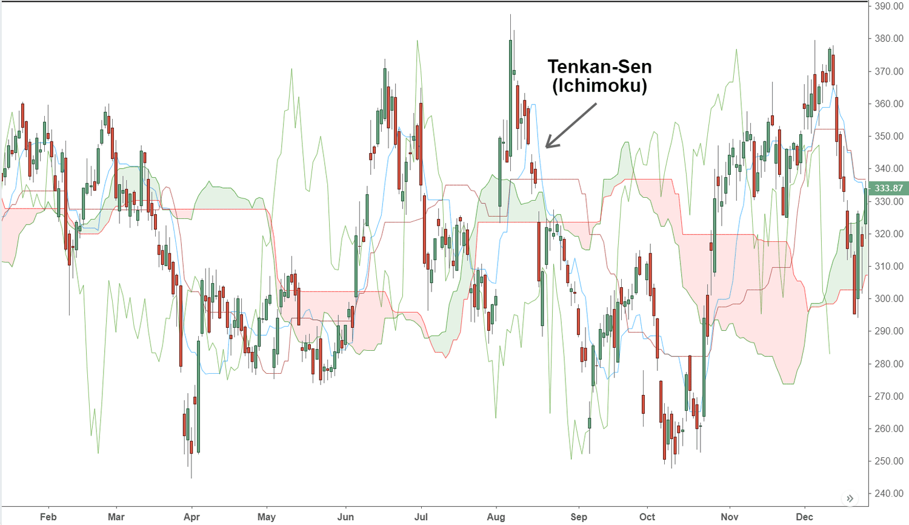

In today's dynamic financial markets, traders are constantly seeking effective tools and strategies to optimize their trading decisions. Among the myriad of technical analysis tools available, the Ichimoku Cloud, or Ichimoku Kinko Hyo, has emerged as a popular choice due to its comprehensive approach to analyzing market trends, momentum, and key support/resistance levels. A central feature of this system is the Tenkan-Sen, also known as the Conversion Line. This component provides traders with valuable insights into short-term price dynamics.

The Ichimoku Cloud distinguishes itself through its unique ability to present multiple facets of market information within a single view. This efficiency becomes particularly significant when developing algorithmic trading frameworks, where rapid decision-making is crucial. Within this setup, the Tenkan-Sen serves as a vital indicator, capturing the short-term price momentum through its calculation as a midpoint between the highest high and lowest low over a nine-period span. This characteristic makes it invaluable for traders aiming to identify potential entry and exit points with precision.



In this article, we investigate how the Tenkan-Sen can be effectively integrated within algorithmic trading strategies. Its rapid reaction to price changes and straightforward calculation make it an attractive tool for setting trading thresholds or trigger points. We will also address its role within the broader context of the Ichimoku Cloud system and how traders can leverage it alongside other Ichimoku components to enhance their trading performance. By understanding its intricacies and applications, traders can potentially improve their decision-making processes and, ultimately, optimize trading outcomes.

## Table of Contents

## Understanding the Ichimoku Cloud and Tenkan-Sen Line

The Ichimoku Cloud, known as Ichimoku Kinko Hyo in Japanese, is a versatile technical analysis tool that provides a multifaceted perspective on market trends, momentum, and critical support and resistance levels. This system was developed by journalist Goichi Hosoda and published in the late 1960s. Unlike many other indicators that focus exclusively on a single aspect of the market, the Ichimoku Cloud combines five different components, allowing traders to gauge potential price movement more accurately.

At the heart of the Ichimoku Cloud is the Tenkan-Sen line, frequently referred to as the Conversion Line. This line is pivotal because it reflects short-term market sentiment, responding quickly to price changes. The calculation of the Tenkan-Sen is straightforward, yet its implications for traders are profound. It is determined by taking the average of the highest high and the lowest low over the past nine periods:

$$
\text{Tenkan-Sen} = \frac{(\text{9-period high} + \text{9-period low})}{2}
$$

This method captures a balance point within a specified period, effectively smoothing price movements and making it easier to identify short-term trends.

The swiftness of the Tenkan-Sen makes it particularly critical for traders who focus on short-term price directions. When the market price crosses the Tenkan-Sen, it signals potential shifts in market direction, offering cues for traders to consider their entry or [exit](/wiki/exit-strategy) points. This line's responsiveness ensures that it highlights minor fluctuations, which can be pivotal in highly volatile trading environments.

Furthermore, the Tenkan-Sen serves as a precursor to broader trend formation when used in conjunction with other Ichimoku components. By observing where the Tenkan-Sen lies relative to other Ichimoku elements, such as the Kijun-Sen (Base Line) or the Kumo (Cloud), traders can gain insights into whether a trend might be firming or weakening. This aspect underscores the utility of the Tenkan-Sen not merely as an isolated indicator but as an integral part of the Ichimoku Cloud's holistic approach to chart analysis.

## Calculation and Significance of the Tenkan-Sen Line

The Tenkan-Sen, or Conversion Line, is fundamental within the Ichimoku Cloud trading system, primarily due to its straightforward calculation and rapid responsiveness to price fluctuations. This line is calculated using the formula:

$$
\text{Tenkan-Sen} = \frac{(\text{9-period high} + \text{9-period low})}{2}
$$

This calculation considers the highest high and the lowest low over the past nine trading periods, establishing the Tenkan-Sen as a mid-point indicator for this period. Its ability to swiftly reflect price changes makes it exceptionally beneficial for short-term traders aiming to identify shifts in market [momentum](/wiki/momentum) promptly.

The significance of the Tenkan-Sen extends beyond simple trend recognition; it is crucial in pinpointing potential entry and exit points in varying market conditions. In trending markets, the Tenkan-Sen can act as a dynamic support or resistance level, offering traders cues on maintaining or revising their positions. Conversely, in ranging markets, the line often oscillates, providing signals when prices reach potentially advantageous levels for reversals or continuations. 

By serving as an early indicator of price movements, the Tenkan-Sen enhances traders' ability to make timely decisions, thereby optimizing their trading outcomes. It is particularly favored for its capacity to offer insights into both trending and non-trending environments, thus broadening the applicability of trading strategies across different market scenarios.

## The Role of Tenkan-Sen in Algorithmic Trading

The Tenkan-Sen, or Conversion Line, is a key component of the Ichimoku Kinko Hyo system, celebrated for its utility in [algorithmic trading](/wiki/algorithmic-trading). Traders value the Tenkan-Sen for its simplicity and responsiveness to short-term price changes, which can effectively mirror market movements. This characteristic makes it an excellent tool for setting trading thresholds and trigger points, particularly through its interplay with other Ichimoku lines or price levels.

In algorithmic trading, the Tenkan-Sen is often used as a trigger for trade execution. Its crossovers with other lines, such as the Kijun-Sen or direct price levels, can signal entry or exit points. For instance, a crossover where the Tenkan-Sen moves above another line might trigger a buy signal, while moving below could indicate a sell signal. This use of crossovers helps automate trading decisions, reducing the emotional component of decision-making.

Moreover, the Tenkan-Sen is notably effective in mean-reversion strategies. These strategies are based on the assumption that prices will revert to their mean or average over time. The Tenkan-Sen, calculated as the average of the highest high and lowest low over a nine-period window, provides a dynamic mean price level. When market prices diverge significantly from this line, it may indicate that a reversal is likely. Algorithmic systems can capitalize on these divergence patterns by automatically executing trades that anticipate price reversion towards the Tenkan-Sen line.

For traders interested in leveraging the Tenkan-Sen in algorithmic systems, Python code can facilitate the integration. Here's a simple example of calculating the Tenkan-Sen line using Python:

```python
import pandas as pd

def calculate_tenkan_sen(highs, lows, period=9):
    high_rolling = highs.rolling(window=period).max()
    low_rolling = lows.rolling(window=period).min()
    tenkan_sen = (high_rolling + low_rolling) / 2
    return tenkan_sen

# Example usage
data = pd.DataFrame({
    'high': [120, 125, 130, 128, 132, 134, 136, 137, 136, 138],
    'low': [115, 118, 120, 121, 123, 125, 126, 127, 125, 126]
})

data['tenkan_sen'] = calculate_tenkan_sen(data['high'], data['low'])
```

This script calculates the Tenkan-Sen for a series of market highs and lows. Implementing such calculations within trading algorithms can help establish automated responses to market conditions reflective of short-term trends. Traders utilize these insights to refine their strategies, ensuring decisions are grounded in quantitative rigor and historical data patterns.

## Combining Tenkan-Sen with Other Ichimoku Elements

To enhance the precision and reliability of trading signals within the Ichimoku Kinko Hyo system, traders often combine the Tenkan-Sen with other integral components such as the Kijun-Sen, Senkou Span A, and Senkou Span B. Each of these elements plays a distinct role in forming a comprehensive view of market dynamics.

The interaction between the Tenkan-Sen and Kijun-Sen is particularly noteworthy. Crossovers between these two lines are significant trading signals. A crossover where the Tenkan-Sen moves above the Kijun-Sen indicates a bullish trend, suggesting that upward momentum is building. Conversely, when the Tenkan-Sen crosses below the Kijun-Sen, it signals a bearish trend, indicating potential downward momentum. This relationship is visually straightforward, providing traders with clear entry or exit cues based on the crossover's direction.

Further, the position of these lines relative to the Ichimoku Cloud—formed by Senkou Span A and Senkou Span B—offers additional context regarding overall market trends. When price levels are above the Cloud, the market is considered to be in a bullish phase, while prices below the Cloud suggest a bearish phase. Prices moving within the Cloud often indicate a period of consolidation or uncertainty.

Therefore, integrating the Tenkan-Sen's signals with the broader Ichimoku elements, such as considering the location and behavior of prices in relation to the Cloud, provides traders with enhanced insight into momentum and potential trend reversals. As such, the use of Tenkan-Sen in conjunction with other Ichimoku components enriches the trading strategy by offering multiple layers of verification, contributing to more informed and potentially profitable trading decisions.

## Common Mistakes to Avoid with Tenkan-Sen

The Tenkan-Sen line is a popular tool among traders, but misuse can lead to inaccurate trading decisions. One common mistake is over-relying on the Tenkan-Sen without considering other market elements, leading to false signals. The Tenkan-Sen quickly reacts to short-term market changes, which can cause traders to overlook broader, more stable trends, resulting in poorly timed trades. 

Another pitfall is ignoring longer-term trends and failing to combine the Tenkan-Sen with confirmation signals from other indicators. Relying solely on the Tenkan-Sen can mislead traders, especially in ranging markets where price frequently crosses the Tenkan-Sen without clear direction. To enhance reliability, it's important to use the Tenkan-Sen in conjunction with other components of the Ichimoku Cloud, like the Kijun-Sen and the market's overall trend, for confirmation. This helps filter out noise and avoid premature entries or exits.

Incorporating comprehensive analysis is crucial for effectively using the Tenkan-Sen. Proper risk management strategies should be in place, including stop-loss orders and position sizing, to mitigate potential losses from false signals. Consistent evaluation of trades, alongside systematic [backtesting](/wiki/backtesting), aids in refining strategies and achieving better trading outcomes. Using these practices ensures that the Tenkan-Sen enhances, rather than hinders, trading effectiveness.

## Practical Applications and Case Studies

In trading, the Tenkan-Sen plays a vital role, especially when integrated with algorithmic strategies. Its quick response to price changes makes it an attractive tool for traders aiming to capitalize on short-term market movements.

A practical example of the Tenkan-Sen's application can be seen in short-term trading algorithms, where traders use its crossovers with the Kijun-Sen to generate buy or sell signals. For instance, a trader might program an algorithm to initiate a buy trade when the Tenkan-Sen crosses above the Kijun-Sen, indicating a potential upward trend. Conversely, a sell trade might be triggered when the Tenkan-Sen crosses below the Kijun-Sen, signaling a downward trend.

Incorporating the Tenkan-Sen in swing trading involves leveraging its ability to capture short-term price momentum. Traders might combine it with other indicators, such as the Relative Strength Index (RSI), to confirm the strength of a trend. This dual approach allows traders to identify optimal entry and exit points, enhancing the overall efficacy of their swing trading strategies.

Backtesting using historical data is crucial for validating the robustness and profitability of strategies involving the Tenkan-Sen. For instance, a trader could backtest a strategy that triggers trades based on the Tenkan-Sen's position relative to a moving average. By analyzing past performance, traders can optimize parameters, such as the number of periods used in the moving average, to improve the strategy's reliability. Below is a simple Python snippet demonstrating how one might backtest a basic strategy using Tenkan-Sen crossovers:

```python
import pandas as pd
import numpy as np

# Load historical price data
data = pd.read_csv('historical_data.csv')

# Calculate Tenkan-Sen
data['Tenkan_Sen'] = (data['High'].rolling(window=9).max() + data['Low'].rolling(window=9).min()) / 2

# Dummy Kijun-Sen for demonstration (usually a 26-period calculated similarly)
data['Kijun_Sen'] = (data['High'].rolling(window=26).max() + data['Low'].rolling(window=26).min()) / 2

# Generate signals
data['Signal'] = np.where(data['Tenkan_Sen'] > data['Kijun_Sen'], 1, -1)

# Backtest performance
data['Returns'] = data['Close'].pct_change()
data['Strategy_Returns'] = data['Returns'] * data['Signal'].shift(1)

cumulative_return = (1 + data['Strategy_Returns']).cumprod()[-1]
print(f"Cumulative Return: {cumulative_return}")
```

This backtesting process helps traders assess the potential returns of their strategies, allowing for adjustments before live trading. Real-world applications and case studies affirm that integrating the Tenkan-Sen into algorithmic trading models can enhance strategy performance, making it a valuable component for traders focused on short-term gains and swing trading opportunities.

## Conclusion

The Tenkan-Sen line, as a component of the Ichimoku Cloud, provides substantial advantages for traders aiming to refine their algorithmic trading strategies. Its straightforward calculation as the midpoint of the highest high and lowest low over the last nine periods makes it a responsive indicator of short-term market momentum. By understanding this calculation, traders can better interpret shifts in market direction and identify potential entry and exit points.

The incorporation of the Tenkan-Sen within a broader trading strategy enables traders to enhance their decision-making processes. It serves as a dynamic tool that can be used in conjunction with other Ichimoku elements like the Kijun-Sen and the overall cloud to confirm trends and potential reversals. By setting trading thresholds or employing the Tenkan-Sen in crossover strategies, traders can develop more robust and responsive frameworks suited to various market conditions.

Moreover, consistent application and continuous evaluation of trading results are critical to leveraging the Tenkan-Sen's full potential effectively. Through regular backtesting and analysis, traders can fine-tune their approaches to accommodate evolving market behaviors, thereby optimizing their trading outcomes. This ongoing refinement ensures that the Tenkan-Sen remains a reliable indicator within both short-term trading tactics and comprehensive trading models.

## References & Further Reading

[1]: Patel, J. J., Shah, S., & Thakkar, P. (2015). ["Predicting Stock Market Index Using Fusion of Machine Learning Techniques."](https://www.sciencedirect.com/science/article/pii/S0957417414006551) Expert Systems with Applications.

[2]: Murphy, J. J. (1999). ["Technical Analysis of the Financial Markets: A Comprehensive Guide to Trading Methods and Applications."](https://archive.org/details/technicalanalysi0000murp) New York Institute of Finance.

[3]: Akash, M. & Shivam, K. (2010). ["Applying Ichimoku Kinko Hyo to Analyze Financial Markets."](https://www.markets.com/education-centre/ichimoku-kinko-hyo/) ResearchGate.

[4]: Nison, S. (1991). ["Japanese Candlestick Charting Techniques: A Contemporary Guide to the Ancient Investment Techniques of the Far East."](https://archive.org/details/japanesecandlest0000niso) New York Institute of Finance.

[5]: Lopez de Prado, M. (2018). ["Advances in Financial Machine Learning."](https://www.amazon.com/Advances-Financial-Machine-Learning-Marcos/dp/1119482089) Wiley.