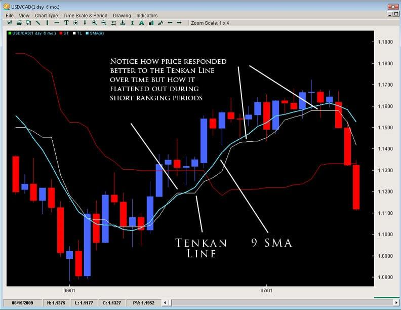

## Table of Contents

## What is Tenkan-Sen and its significance in technical analysis?

Tenkan-Sen, also known as the Conversion Line, is a component of the Ichimoku Kinko Hyo, a popular technical analysis tool used in trading. It is calculated by taking the average of the highest high and the lowest low over the past nine periods. This line helps traders identify short-term trends and potential reversal points in the market. When the Tenkan-Sen moves above the Kijun-Sen, another line in the Ichimoku system, it suggests a bullish trend, whereas a move below indicates a bearish trend.

The significance of the Tenkan-Sen lies in its ability to provide quick insights into market momentum and potential entry or exit points for trades. Traders often look for crossovers between the Tenkan-Sen and Kijun-Sen as signals for buying or selling. Additionally, the slope of the Tenkan-Sen can indicate the strength of the current trend; a steep slope suggests a strong trend, while a flat line might indicate a weakening trend or a potential reversal. By understanding and utilizing the Tenkan-Sen, traders can make more informed decisions and improve their trading strategies.

## How is Tenkan-Sen calculated?

Tenkan-Sen, also called the Conversion Line, is a part of the Ichimoku Kinko Hyo chart. To calculate it, you take the highest price and the lowest price over the last nine periods. Then, you add these two numbers together and divide by two. This gives you the Tenkan-Sen value for that point in time.

The Tenkan-Sen helps traders see short-term trends in the market. By looking at this line, traders can tell if prices are going up or down over the recent period. It's a quick way to understand what's happening in the market and can help decide when to buy or sell.

## What are the components needed to calculate Tenkan-Sen?

To calculate Tenkan-Sen, you need to know the highest price and the lowest price over the last nine periods. These two values are the only components you need. You take the highest price from those nine periods and the lowest price from those nine periods.

Once you have these two numbers, you add them together and then divide the total by two. This gives you the Tenkan-Sen value. It's a simple calculation that helps traders see short-term trends in the market.

## Can you explain the formula used for Tenkan-Sen?

The formula for calculating Tenkan-Sen is pretty straightforward. You need to look at the last nine periods and find the highest price and the lowest price during that time. Once you have those two numbers, you add them together and then divide by two. This gives you the Tenkan-Sen value for that point in time.

This line is useful because it helps traders see short-term trends in the market. If the Tenkan-Sen is going up, it means prices have been rising over the last nine periods. If it's going down, it means prices have been falling. By watching this line, traders can get a quick sense of what's happening in the market and make better decisions about when to buy or sell.

## What time periods are typically used for Tenkan-Sen calculation?

The Tenkan-Sen, or Conversion Line, is usually calculated using data from the last nine periods. These periods can be days, hours, or even minutes, depending on the timeframe of the chart you're looking at. For example, if you're using a daily chart, you'll look at the highest and lowest prices over the past nine days. If you're using an hourly chart, you'll look at the past nine hours.

This nine-period timeframe helps traders see short-term trends in the market. It's a quick way to understand if prices are going up or down over a recent period. By watching the Tenkan-Sen, traders can make better decisions about when to buy or sell, based on what's happening in the market right now.

## How does Tenkan-Sen differ from other technical indicators like Kijun-Sen?

Tenkan-Sen and Kijun-Sen are both parts of the Ichimoku Kinko Hyo chart, but they have different purposes and timeframes. Tenkan-Sen, also called the Conversion Line, is calculated by taking the highest and lowest prices over the last nine periods and averaging them. This line helps traders see short-term trends in the market. It's like a quick snapshot of what's happening right now. If the Tenkan-Sen is going up, it means prices have been rising over the last nine periods, and if it's going down, prices have been falling.

On the other hand, Kijun-Sen, known as the Base Line, looks at a longer timeframe. It's calculated by averaging the highest and lowest prices over the last 26 periods. This line gives traders a sense of the medium-term trend. It's slower to change direction than the Tenkan-Sen, so it's less sensitive to short-term price movements. When traders look at both lines together, they can see how the short-term trend (Tenkan-Sen) compares to the medium-term trend (Kijun-Sen), which can help them make better trading decisions.

## What does it mean when the price crosses the Tenkan-Sen line?

When the price of a stock or other asset crosses above the Tenkan-Sen line, it's a sign that things might be looking up in the short term. The Tenkan-Sen line is all about showing short-term trends, so if the price goes above it, it means the price is doing better than it has been over the last nine periods. Traders might see this as a good time to buy, thinking the price will keep going up.

On the other hand, if the price drops below the Tenkan-Sen line, it could mean the short-term trend is turning down. This tells traders that the price is not doing as well as it has been over the last nine periods. They might see this as a signal to sell or wait before buying, expecting the price to keep falling.

## How can traders use Tenkan-Sen to identify potential buy or sell signals?

Traders can use the Tenkan-Sen line to spot good times to buy or sell by watching how the price moves around it. When the price goes above the Tenkan-Sen, it's like a green light for buying. This means the price is doing better than it has been over the last nine periods, and traders might think it's going to keep going up. So, they might decide to buy the stock or asset at this point, hoping to make money as the price rises.

On the flip side, if the price falls below the Tenkan-Sen, it's like a warning sign that the short-term trend might be turning down. This tells traders that the price isn't doing as well as it has been, and it might keep falling. So, they might see this as a good time to sell what they have or hold off on buying until the price starts looking better. By keeping an eye on where the price is compared to the Tenkan-Sen, traders can make smarter choices about when to buy or sell.

## What are the limitations of using Tenkan-Sen as a standalone indicator?

Using Tenkan-Sen by itself can be tricky because it only looks at the last nine periods. This means it's good for seeing what's happening in the short term, but it might not tell you much about the bigger picture. If you're only looking at the Tenkan-Sen, you might miss out on important trends that are happening over longer periods of time. It's like trying to understand a whole movie by just watching a few minutes of it.

Another problem with using Tenkan-Sen alone is that it can give you false signals. Sometimes the price might cross above or below the Tenkan-Sen, making it seem like a good time to buy or sell, but then the price quickly changes direction. This can lead to making trades that don't work out well. That's why many traders use the Tenkan-Sen along with other indicators, like the Kijun-Sen, to get a clearer picture of what's going on in the market.

## How does Tenkan-Sen fit into the broader Ichimoku Kinko Hyo system?

Tenkan-Sen, or the Conversion Line, is just one part of the bigger Ichimoku Kinko Hyo system. This system is like a whole toolbox for traders, helping them see what's going on in the market from different angles. The Tenkan-Sen looks at the last nine periods to show short-term trends. It's like a quick snapshot of what's happening right now. Traders use it to see if prices are going up or down over these recent periods.

In the Ichimoku system, the Tenkan-Sen works together with other lines and areas to give a fuller picture of the market. For example, it's often used with the Kijun-Sen, which looks at a longer timeframe of 26 periods, to spot trends and potential trading opportunities. When the Tenkan-Sen crosses above the Kijun-Sen, it might be a sign to buy, and when it crosses below, it might be a sign to sell. The Ichimoku system also includes the Senkou Span A and B, which create the Kumo or cloud, and the Chikou Span, which shows where the price was 26 periods ago. All these parts together help traders make better decisions by showing them the short-term, medium-term, and long-term trends in the market.

## Can Tenkan-Sen be customized for different trading strategies, and if so, how?

Yes, Tenkan-Sen can be customized for different trading strategies. Traders can change the number of periods used to calculate the Tenkan-Sen. Instead of using the usual nine periods, they might choose a different number that fits their trading style better. For example, if a trader wants to focus on even shorter-term trends, they might use fewer periods, like five or seven. On the other hand, if they want to look at slightly longer trends, they might use more periods, like 11 or 13.

By adjusting the number of periods, traders can make the Tenkan-Sen more sensitive or less sensitive to price changes. A shorter period will make the Tenkan-Sen react faster to price movements, which can be good for traders who like to make quick trades. A longer period will make it slower to react, which might be better for traders who want to see more stable trends before making a move. This way, traders can tailor the Tenkan-Sen to match their own trading goals and strategies.

## What advanced techniques can be applied using Tenkan-Sen in algorithmic trading?

In algorithmic trading, traders can use Tenkan-Sen in some cool ways to make their trading strategies better. One way is to use it along with other parts of the Ichimoku system, like Kijun-Sen, to make decisions about when to buy or sell. For example, an algorithm might look for times when the Tenkan-Sen crosses above the Kijun-Sen as a signal to buy, and when it crosses below as a signal to sell. By using these signals in a computer program, traders can quickly spot these moments and act on them without having to watch the market all the time.

Another advanced technique is to change the number of periods used to calculate the Tenkan-Sen. Instead of using the usual nine periods, traders might try different numbers to see what works best for their strategy. For instance, using fewer periods can make the Tenkan-Sen more sensitive to price changes, which can be good for short-term trading. Using more periods can make it less sensitive, which might be better for longer-term trends. By testing different settings, traders can find the best way to use Tenkan-Sen for their specific goals.

## What is the understanding of the Ichimoku Cloud and Tenkan-Sen Line?

The Ichimoku Cloud, known as Ichimoku Kinko Hyo in Japanese, is a versatile technical analysis tool that provides a multifaceted perspective on market trends, momentum, and critical support and resistance levels. This system was developed by journalist Goichi Hosoda and published in the late 1960s. Unlike many other indicators that focus exclusively on a single aspect of the market, the Ichimoku Cloud combines five different components, allowing traders to gauge potential price movement more accurately.

At the heart of the Ichimoku Cloud is the Tenkan-Sen line, frequently referred to as the Conversion Line. This line is pivotal because it reflects short-term market sentiment, responding quickly to price changes. The calculation of the Tenkan-Sen is straightforward, yet its implications for traders are profound. It is determined by taking the average of the highest high and the lowest low over the past nine periods:

$$
\text{Tenkan-Sen} = \frac{(\text{9-period high} + \text{9-period low})}{2}
$$

This method captures a balance point within a specified period, effectively smoothing price movements and making it easier to identify short-term trends.

The swiftness of the Tenkan-Sen makes it particularly critical for traders who focus on short-term price directions. When the market price crosses the Tenkan-Sen, it signals potential shifts in market direction, offering cues for traders to consider their entry or [exit](/wiki/exit-strategy) points. This line's responsiveness ensures that it highlights minor fluctuations, which can be pivotal in highly volatile trading environments.

Furthermore, the Tenkan-Sen serves as a precursor to broader trend formation when used in conjunction with other Ichimoku components. By observing where the Tenkan-Sen lies relative to other Ichimoku elements, such as the Kijun-Sen (Base Line) or the Kumo (Cloud), traders can gain insights into whether a trend might be firming or weakening. This aspect underscores the utility of the Tenkan-Sen not merely as an isolated indicator but as an integral part of the Ichimoku Cloud's holistic approach to chart analysis.

## What is the Calculation and Significance of the Tenkan-Sen Line?

The Tenkan-Sen, or Conversion Line, is fundamental within the Ichimoku Cloud trading system, primarily due to its straightforward calculation and rapid responsiveness to price fluctuations. This line is calculated using the formula:

$$
\text{Tenkan-Sen} = \frac{(\text{9-period high} + \text{9-period low})}{2}
$$

This calculation considers the highest high and the lowest low over the past nine trading periods, establishing the Tenkan-Sen as a mid-point indicator for this period. Its ability to swiftly reflect price changes makes it exceptionally beneficial for short-term traders aiming to identify shifts in market [momentum](/wiki/momentum) promptly.

The significance of the Tenkan-Sen extends beyond simple trend recognition; it is crucial in pinpointing potential entry and exit points in varying market conditions. In trending markets, the Tenkan-Sen can act as a dynamic support or resistance level, offering traders cues on maintaining or revising their positions. Conversely, in ranging markets, the line often oscillates, providing signals when prices reach potentially advantageous levels for reversals or continuations. 

By serving as an early indicator of price movements, the Tenkan-Sen enhances traders' ability to make timely decisions, thereby optimizing their trading outcomes. It is particularly favored for its capacity to offer insights into both trending and non-trending environments, thus broadening the applicability of trading strategies across different market scenarios.

## References & Further Reading

[1]: Patel, J. J., Shah, S., & Thakkar, P. (2015). ["Predicting Stock Market Index Using Fusion of Machine Learning Techniques."](https://www.sciencedirect.com/science/article/pii/S0957417414006551) Expert Systems with Applications.

[2]: Murphy, J. J. (1999). ["Technical Analysis of the Financial Markets: A Comprehensive Guide to Trading Methods and Applications."](https://archive.org/details/technicalanalysi0000murp) New York Institute of Finance.

[3]: Akash, M. & Shivam, K. (2010). ["Applying Ichimoku Kinko Hyo to Analyze Financial Markets."](https://www.markets.com/education-centre/ichimoku-kinko-hyo/) ResearchGate.

[4]: Nison, S. (1991). ["Japanese Candlestick Charting Techniques: A Contemporary Guide to the Ancient Investment Techniques of the Far East."](https://archive.org/details/japanesecandlest0000niso) New York Institute of Finance.

[5]: Lopez de Prado, M. (2018). ["Advances in Financial Machine Learning."](https://www.amazon.com/Advances-Financial-Machine-Learning-Marcos/dp/1119482089) Wiley.