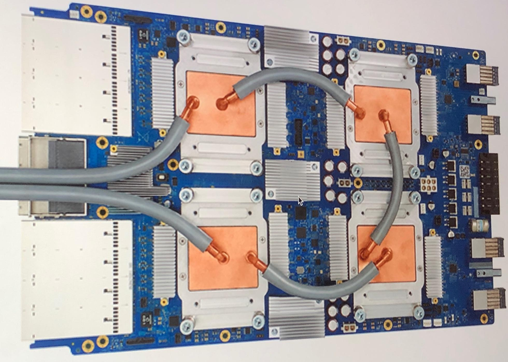

## Table of Contents

## What is a Tensor Processing Unit (TPU) and what is its primary function?

A Tensor Processing Unit (TPU) is a type of hardware accelerator designed by Google specifically to speed up the process of machine learning and artificial intelligence tasks. It's like a special computer chip that helps computers do math faster, especially the kind of math used in training and running big AI models. TPUs are good at handling the large amounts of data and complex calculations needed for things like image recognition, language translation, and other AI applications.

The primary function of a TPU is to perform matrix multiplications and other tensor operations much faster than traditional CPUs or GPUs. In simple terms, a tensor is a kind of data structure used in machine learning, and TPUs are built to work with these tensors very efficiently. By doing these calculations quickly, TPUs help AI systems learn and make decisions faster, making them a key tool for researchers and companies working on advanced AI projects.

## How does a TPU differ from a traditional CPU or GPU in terms of architecture?

A TPU has a different architecture compared to a traditional CPU or GPU. A CPU, or Central Processing Unit, is like the brain of a computer, designed to handle a wide variety of tasks. It has multiple cores that can work on different things at the same time, but each core is good at doing many different types of calculations. A GPU, or Graphics Processing Unit, is specialized for handling graphics and can do many simple calculations at once, making it good for tasks like video games or image processing. On the other hand, a TPU is built to focus on the specific math operations used in machine learning, like matrix multiplication. This makes it much faster at these tasks than a CPU or GPU.

The architecture of a TPU is designed to handle large amounts of data in a way that's optimized for AI and [machine learning](/wiki/machine-learning). TPUs use a lot of on-chip memory to store data close to where the calculations happen, which reduces the time it takes to move data around. They also have a special part called a systolic array, which is like a grid of tiny calculators that work together to do matrix multiplications very quickly. This is different from CPUs and GPUs, which might use more general-purpose parts to do the same job, but not as efficiently. So, while CPUs and GPUs are great for many types of tasks, TPUs are specialized to make AI and machine learning work faster and more efficiently.

## What are the main advantages of using TPUs for machine learning tasks?

TPUs are really good at making machine learning tasks faster and more efficient. They can do the math needed for machine learning, like matrix multiplication, much quicker than regular CPUs or GPUs. This is because TPUs have special parts, like a systolic array, that are built just for these types of calculations. So, when you're training a big AI model, TPUs can help you get results much faster. This is super helpful for researchers and companies who need to try out lots of different ideas quickly.

Another big advantage of TPUs is that they can handle a lot of data at once. They have a lot of memory built right into the chip, which means they can keep data close to where the calculations are happening. This makes everything run smoother and faster because the computer doesn't have to spend as much time moving data around. For people working on big AI projects, this means they can use more data to train their models, which can make the models better and more accurate.

## Can you explain how TPUs are integrated into the machine learning workflow?

TPUs are integrated into the machine learning workflow by being used as specialized hardware to speed up the training and inference phases of AI models. When a machine learning engineer wants to train a model, they can use a platform like Google's TensorFlow or PyTorch, which are designed to work well with TPUs. These platforms allow the engineer to write code that can be easily sent to a TPU for processing. The TPU then takes over, performing the complex calculations needed to train the model much faster than a regular CPU or GPU could. This means the engineer can experiment with different models and data sets more quickly, leading to faster progress in their research or project.

Once the model is trained, TPUs can also be used for inference, which is when the trained model is used to make predictions on new data. For example, if the model is for image recognition, it can be used to identify objects in new pictures. The TPU can handle these predictions very quickly, making it useful for real-time applications where speed is important. By using TPUs, companies and researchers can make their AI systems more efficient and powerful, helping them to develop better products and services.

Overall, TPUs are a key part of the machine learning workflow because they make both the training and inference stages faster and more efficient. This allows for quicker experimentation and deployment of AI models, which is crucial in the fast-paced world of technology and research.

## What types of machine learning models benefit most from TPUs?

Machine learning models that involve a lot of matrix multiplication and large datasets benefit the most from TPUs. These include [deep learning](/wiki/deep-learning) models like neural networks, especially convolutional neural networks (CNNs) used for image recognition and recurrent neural networks (RNNs) used for natural language processing. TPUs are really good at handling the kind of math these models need, so they can train these models much faster than CPUs or GPUs. For example, if you're trying to teach a computer to recognize different types of animals in photos, a TPU can help you get through the training process a lot quicker.

Another type of model that benefits from TPUs is large language models, like those used in AI chatbots or translation services. These models often have billions of parameters and need to process huge amounts of text data. TPUs can handle this kind of workload efficiently, making it easier to train these big models and get them working well. So, if you're building an AI system that needs to understand and generate human language, using a TPU can help you achieve better results in less time.

## How do TPUs handle the computational demands of deep learning?

TPUs handle the computational demands of deep learning by focusing on the types of math that these models need, like matrix multiplication. Deep learning models, especially big neural networks, use a lot of this kind of math to learn from data. TPUs have a special part called a systolic array that's really good at doing these calculations quickly. This means that when you're training a big model, like one for recognizing pictures or understanding language, the TPU can do the work much faster than a regular computer chip. This helps researchers and engineers try out lots of different ideas without waiting too long for the computer to finish its work.

Another way TPUs help with deep learning is by having a lot of memory right on the chip. This memory keeps data close to where the calculations happen, so the TPU doesn't have to spend time moving data around. This makes everything run smoother and faster. For example, if you're training a model to recognize different types of animals in photos, the TPU can handle all the data and calculations needed without slowing down. This is really important for big projects where you need to use a lot of data to make your model as good as possible.

## What is the role of TPUs in accelerating training times for neural networks?

TPUs help make training neural networks faster by focusing on the kind of math these models need, like matrix multiplication. When you train a [neural network](/wiki/neural-network), you're trying to teach it to recognize patterns in data, and this involves doing a lot of calculations. TPUs have a special part called a systolic array that's really good at these calculations. This means they can do the math needed to train a neural network much quicker than regular computer chips like CPUs or GPUs. So, if you're trying to teach a computer to recognize different animals in pictures, a TPU can help you get through all the training much faster.

Another way TPUs speed up training is by having a lot of memory right on the chip. This memory keeps data close to where the calculations happen, so the TPU doesn't have to waste time moving data around. This makes everything run smoother and faster. For example, if you're working on a big project where you need to use a lot of data to train your model, a TPU can handle all that data without slowing down. This is really helpful for researchers and engineers who need to try out lots of different ideas quickly and see which ones work best.

## How do TPUs optimize the performance of TensorFlow operations?

TPUs make TensorFlow operations faster by focusing on the types of math that TensorFlow needs, like matrix multiplication. TensorFlow is a tool used to build and train machine learning models, and it uses a lot of these calculations to do its job. TPUs have a special part called a systolic array that's really good at doing these calculations quickly. This means when you're using TensorFlow to train a model, the TPU can handle all the math much faster than a regular computer chip like a CPU or GPU. This helps researchers and engineers get through their work quicker and try out more ideas.

Another way TPUs help with TensorFlow is by having a lot of memory right on the chip. This memory keeps data close to where the calculations happen, so the TPU doesn't have to spend time moving data around. This makes everything run smoother and faster. For example, if you're using TensorFlow to train a big model, like one for recognizing pictures, the TPU can handle all the data and calculations needed without slowing down. This is really important for big projects where you need to use a lot of data to make your model as good as possible.

## What are the latest advancements in TPU technology and their impact on machine learning?

The latest advancements in TPU technology include the introduction of the fourth generation of TPUs, known as TPU v4. These new TPUs have even more processing power and memory than before, which means they can handle bigger and more complex machine learning models. They also have improved networking capabilities, allowing multiple TPUs to work together more efficiently. This is really helpful for researchers and companies who need to train very large models, like those used in natural language processing or image recognition. With TPU v4, these models can be trained faster and with more data, leading to better performance.

Another big advancement is the development of TPU v4 Pods, which are groups of TPUs that can be connected to work together on a single task. This allows for even faster training of huge models. For example, a TPU v4 Pod can train a model with billions of parameters much quicker than before. This is important for things like language translation or AI chatbots, where the models need to understand a lot of different languages and contexts. These advancements in TPU technology are making it easier and faster for people to develop and use advanced machine learning models, pushing the field forward and helping create new and better AI applications.

## How can developers access and utilize TPUs for their machine learning projects?

Developers can access TPUs through Google's cloud platform, called Google Cloud. To start using TPUs, developers need to sign up for a Google Cloud account and then they can use TPUs through services like Google Colab or by setting up a virtual machine with TPUs attached. Google Colab is a free service where you can write and run Python code, and it's easy to use TPUs there. You just need to select a TPU runtime when you start your notebook. For more advanced projects, developers can use Google Cloud's Compute Engine to set up a virtual machine with TPUs. This gives them more control over their environment and lets them work on bigger projects.

Once developers have access to TPUs, they can use them to speed up their machine learning projects. They need to make sure their code is compatible with TPUs, which means using libraries like TensorFlow or PyTorch that support TPUs. For example, in TensorFlow, you can use the `TPUStrategy` to tell TensorFlow to use the TPU for training your model. This can make the training process much faster, especially for big models. Developers can also use TPUs for running their trained models, which is called inference. This is useful for applications where you need quick responses, like real-time image recognition or language translation. By using TPUs, developers can make their machine learning projects run faster and handle more data, which can lead to better results.

## What are the cost implications of using TPUs compared to other hardware options?

Using TPUs can be more cost-effective than using other hardware options like CPUs or GPUs for certain machine learning tasks. TPUs are designed to handle the specific math needed for machine learning very quickly, which means you can train your models faster. This can save you money because you might not need to rent or buy as much computing power for the same amount of work. For example, if you're using Google Cloud, the cost of using a TPU might be less than using several GPUs to do the same job, especially for big projects where speed is important.

However, TPUs are not always the cheapest option. They are specialized hardware, so they might cost more per hour to use than a regular CPU or GPU. If your project doesn't need the extra speed that TPUs provide, you might end up spending more money than necessary. It's important to think about what your project needs and compare the costs of different options. For smaller projects or tasks that don't need a lot of matrix multiplication, a CPU or GPU might be a better and cheaper choice.

## What future developments can we expect in TPU technology for machine learning applications?

In the future, we can expect TPUs to become even more powerful and efficient for machine learning applications. As technology advances, TPUs will likely have more processing power and memory, allowing them to handle even bigger and more complex models. This could mean faster training times for huge models like those used in natural language processing or image recognition. Researchers and companies might be able to train models with billions or even trillions of parameters much quicker than they can now, leading to more advanced AI systems.

Another area of development could be in the networking capabilities of TPUs. As more TPUs are connected together in pods or other configurations, they can work together more efficiently on a single task. This could make it possible to train very large models across many TPUs at the same time, speeding up the process even more. These advancements will help push the field of machine learning forward, making it easier and faster to develop new and better AI applications.

## References & Further Reading

[1]: Jouppi, N. P., Young, C., Patil, N., Patterson, D., & Agrawal, G. (2017). ["In-Datacenter Performance Analysis of a Tensor Processing Unit."](https://ieeexplore.ieee.org/abstract/document/8192463) Proceedings of the 44th Annual International Symposium on Computer Architecture.

[2]: ["Domain Specific Architectures: The Fourth Paradigm"](https://en.wikipedia.org/wiki/Domain-specific_architecture) by David Patterson. IEEE Computer Society.

[3]: ["TensorFlow: Large-Scale Machine Learning on Heterogeneous Systems"](https://arxiv.org/abs/1603.04467) by Martín Abadi, Ashish Agarwal, Paul Barham, et al. This is the official documentation and research papers on TensorFlow, a popular machine learning framework compatible with TPUs.

[4]: ["Efficient Processing of Deep Neural Networks"](https://link.springer.com/book/10.1007/978-3-031-01766-7) by Vivienne Sze, Yu-Hsin Chen, Tien-Ju Yang, Joel Emer. This book discusses the hardware and architectural considerations for processing deep neural networks efficiently.

[5]: ["Google Cloud TPUs: better performance for smaller workloads, public notebook support"](https://cloud.google.com/tpu?hl=en) by Google Cloud Team. An overview of the practical implementation and use cases of TPUs in Google Cloud.