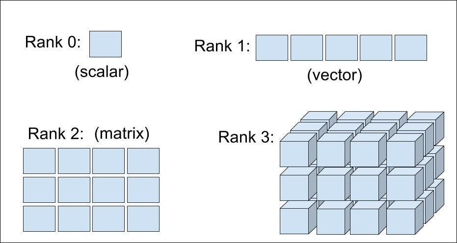

## Table of Contents

## What is a tensor in the context of machine learning?

In the context of machine learning, a tensor is a way to represent data in a structured format. Think of it as a container that can hold numbers arranged in different ways, like a single number, a list of numbers, or even a grid of numbers. In simple terms, a tensor is like a multi-dimensional array that can be used to represent complex data structures needed for machine learning algorithms. For example, a single number can be a 0-dimensional tensor, a list of numbers can be a 1-dimensional tensor, and a grid of numbers, like an image, can be a 2-dimensional tensor.

Tensors are crucial in machine learning because they allow algorithms to process and manipulate data efficiently. For instance, in neural networks, tensors are used to represent inputs, weights, and outputs. Operations on these tensors, like addition, multiplication, and more complex transformations, are fundamental to how neural networks learn and make predictions. By using tensors, machine learning models can handle large amounts of data and perform computations that would be difficult or impossible with simpler data structures.

## How is tensor rank defined in linear algebra?

In linear algebra, the rank of a tensor is a way to describe its complexity or the number of dimensions it effectively spans. For a matrix, which is a 2-dimensional tensor, the rank is the number of linearly independent rows or columns. This means if you have a matrix, its rank tells you the largest number of rows or columns you can pick that are not just multiples of each other. For example, if a matrix has a rank of 3, it means there are at least three rows or columns that are independent of each other.

When we move to higher-dimensional tensors, defining rank becomes more complicated. For a general tensor, the rank can be thought of as the minimum number of simple tensors (also called rank-1 tensors) that can be added together to recreate the original tensor. A simple tensor is one that can be expressed as the outer product of vectors. For instance, if you have a 3-dimensional tensor, its rank would be the smallest number of these outer products needed to build it. This concept is important in many areas of mathematics and [machine learning](/wiki/machine-learning), where understanding the structure and complexity of data is crucial.

## What is the significance of tensor rank in machine learning algorithms?

The rank of a tensor is important in machine learning because it helps us understand how complex our data is. In simple terms, if a tensor has a low rank, it means the data can be described using fewer pieces of information. This is useful because it can help us simplify our models and make them run faster. For example, if we find that an image tensor has a low rank, we might be able to compress it without losing much detail, which can save on storage and processing time.

In machine learning algorithms, especially those dealing with neural networks, knowing the rank of tensors can help in designing more efficient models. For instance, when we use techniques like matrix or tensor factorization, understanding the rank can guide us in choosing the right number of factors. This can lead to better performance and more accurate predictions. By keeping the rank in mind, we can balance the trade-off between model complexity and performance, making our machine learning algorithms more effective.

## How does tensor rank affect the complexity of a model?

The rank of a tensor can tell us how complex our data is, and this directly affects how complicated our machine learning model needs to be. If a tensor has a low rank, it means the data can be described with fewer pieces of information. This is good because it lets us build simpler models that still work well. For example, if we have an image and its tensor has a low rank, we might be able to use a smaller [neural network](/wiki/neural-network) to understand it. This makes the model easier to train and run, saving time and computer power.

On the other hand, if a tensor has a high rank, it means the data is more complex and needs a more detailed model to capture all the information. A high-rank tensor might require a bigger neural network with more layers and parameters to learn from the data accurately. This makes the model more complex and might take longer to train and use more computer resources. By understanding the rank of our tensors, we can choose the right level of complexity for our models, making them efficient and effective.

## Can you explain the difference between tensor rank and matrix rank?

In simple terms, the rank of a matrix and the rank of a tensor are similar ideas but they are used in different ways. For a matrix, which is a 2-dimensional tensor, the rank is the number of linearly independent rows or columns. Imagine you have a grid of numbers; the rank tells you the largest number of rows or columns you can pick that are not just multiples of each other. For example, if you have a matrix and its rank is 3, it means you can find at least three rows or columns that are independent of each other.

When we talk about a tensor, which can be more than 2-dimensional, the rank is a bit more complicated. The rank of a tensor is the minimum number of simple tensors (also called rank-1 tensors) that you need to add together to recreate the original tensor. A simple tensor is like one that can be made by multiplying vectors together. For example, if you have a 3-dimensional tensor, its rank is the smallest number of these multiplications needed to build it. So, while matrix rank is about how many independent rows or columns you can find, tensor rank is about how many simple pieces you need to put together to make the whole tensor.

## What methods are used to determine the rank of a tensor?

Determining the rank of a tensor can be done using different methods, depending on the type of tensor you're dealing with. For matrices, which are 2-dimensional tensors, you can find the rank by looking at the number of linearly independent rows or columns. This can be done using techniques like row reduction or singular value decomposition (SVD). In row reduction, you transform the matrix into a simpler form called row echelon form, and the rank is the number of non-zero rows. In SVD, you break down the matrix into three other matrices, and the rank is the number of non-zero singular values.

For higher-dimensional tensors, finding the rank is more complicated. One common method is tensor decomposition, like the CANDECOMP/PARAFAC (CP) decomposition or the Tucker decomposition. In CP decomposition, you try to express the tensor as a sum of rank-1 tensors, and the rank is the smallest number of these rank-1 tensors needed. In Tucker decomposition, you break down the tensor into a core tensor and several matrices, and the rank can be defined based on the dimensions of the core tensor. These methods help us understand how simple or complex our tensor is, which is important in many areas of math and machine learning.

## How can tensor rank be used to reduce overfitting in neural networks?

Tensor rank can help reduce overfitting in neural networks by guiding us to build simpler models. If a tensor representing our data has a low rank, it means the data can be described with fewer pieces of information. This tells us that we might not need a very complex model to understand the data well. By using techniques like tensor factorization, we can break down our data into its simpler parts and then build a model that focuses on these essential components. This approach helps prevent the model from learning too much about the noise in the training data, which is a common cause of overfitting.

For example, if we find that our image data has a low tensor rank, we might choose to use a smaller neural network with fewer layers and parameters. This smaller model will be less likely to memorize the training data, including any noise, and more likely to capture the general patterns that are important for making good predictions on new data. By keeping the model simple and aligned with the rank of the data, we can achieve better generalization and reduce the risk of overfitting, making our neural network more effective and reliable.

## What are the challenges in computing the exact rank of high-dimensional tensors?

Computing the exact rank of high-dimensional tensors is a tough problem because it gets really hard as the number of dimensions grows. When you have a matrix, which is a 2-dimensional tensor, you can use methods like row reduction or singular value decomposition (SVD) to find its rank. But when you move to higher dimensions, these methods don't work as well. The main challenge is that the number of calculations you need to do grows very quickly with the number of dimensions. This makes it hard to find the exact rank because it can take a lot of time and computer power.

Another challenge is that the concept of rank for high-dimensional tensors is not as straightforward as it is for matrices. For a matrix, rank is about the number of independent rows or columns. But for a tensor, rank is about the smallest number of simple tensors you need to add together to make the original tensor. This is a harder problem to solve because there are many more ways to combine simple tensors in higher dimensions. Methods like CANDECOMP/PARAFAC (CP) decomposition or Tucker decomposition can help, but they often give you an approximation of the rank rather than the exact value. This means you might not always get the perfect answer, but you can still learn a lot about the structure of your data.

## How does tensor decomposition relate to tensor rank, and what are its applications in machine learning?

Tensor decomposition is a way to break down a complex tensor into simpler parts. It's closely related to tensor rank because the rank tells us the smallest number of these simple parts, called rank-1 tensors, needed to rebuild the original tensor. Think of it like trying to make a big Lego structure; the rank is like knowing the least number of basic Lego pieces you need. By using tensor decomposition, we can find out the rank and also work with the data in a simpler form, which is easier for computers to handle. Methods like CANDECOMP/PARAFAC (CP) decomposition and Tucker decomposition are used for this. In CP decomposition, we try to express the tensor as a sum of rank-1 tensors, and the rank is the smallest number of these needed. In Tucker decomposition, we break the tensor into a core tensor and several matrices, and the rank can be based on the size of the core tensor.

In machine learning, tensor decomposition has many uses. It helps us understand the structure of our data better, which is important for building good models. For example, if we have image data, we can use tensor decomposition to find patterns and compress the data, making it easier to work with. This can help reduce the complexity of our models, which is good for avoiding overfitting. Also, tensor decomposition can be used in recommendation systems to find hidden patterns in user behavior, or in natural language processing to understand the relationships between words. By breaking down the data into simpler parts, we can make our machine learning algorithms more efficient and effective.

## What are some advanced techniques for tensor rank approximation?

Advanced techniques for tensor rank approximation help us find a good guess for the rank of a tensor when exact calculations are too hard. One popular method is the Alternating Least Squares (ALS) algorithm, which is often used with CP decomposition. In ALS, we take turns updating the different parts of the tensor to make it as close as possible to the original tensor. This method is good because it can handle big tensors and doesn't need too much computer power. Another technique is the Higher-Order Singular Value Decomposition (HOSVD), which is based on the idea of singular value decomposition for matrices but works for tensors. HOSVD breaks down the tensor into smaller parts and helps us understand its structure, giving us a way to estimate the rank.

Another advanced technique is the Tensor Train (TT) decomposition, which is especially useful for very high-dimensional tensors. In TT decomposition, the tensor is reshaped into a series of smaller tensors connected in a chain, making it easier to work with and understand. This method can help us find a good approximation of the tensor rank by looking at the sizes of these smaller tensors. All these techniques are important in machine learning because they help us simplify complex data, making our models more efficient and easier to train. By using these advanced methods, we can better understand our data and build better machine learning models.

## How do low-rank tensor methods contribute to efficiency in large-scale machine learning?

Low-rank tensor methods help make large-scale machine learning more efficient by simplifying the data we work with. When we have a lot of data, like images or user behavior in a recommendation system, it can be hard for our computers to handle it all. By using low-rank tensor methods, we can break down this complex data into simpler parts. This means we need less computer power and time to process the data. For example, if we use techniques like CP or Tucker decomposition, we can find the important patterns in the data and ignore the less important details. This helps us build models that are simpler and faster to train, making it easier to work with big datasets.

These methods also help us avoid overfitting, which is when a model learns too much about the training data and doesn't work well on new data. By focusing on the low-rank parts of the data, we can create models that capture the main patterns without getting distracted by noise. This is really important in large-scale machine learning because it lets us make predictions that are more accurate and reliable. Overall, low-rank tensor methods make it possible to handle big data more effectively, saving time and resources while improving the performance of our machine learning models.

## What are the current research trends and future directions in tensor rank for machine learning?

Current research trends in tensor rank for machine learning focus a lot on making models work better with big data. Scientists are trying to find new ways to use tensor decomposition to understand data better and make models simpler. One big trend is using low-rank tensor methods to improve how we process images, videos, and other complex data. Researchers are also looking into how these methods can help with recommendation systems, where understanding patterns in user behavior is key. Another exciting area is using tensor rank to make neural networks smaller and faster, which is important for putting machine learning on devices like phones and cars.

Future directions in this field are all about making these methods even better and easier to use. Researchers are working on new algorithms that can find the rank of tensors more accurately and quickly, even for very high-dimensional data. There's also a lot of interest in how tensor rank can help with other types of data, like text and sound. By understanding the rank of tensors, we might be able to build models that learn from data in new ways, making them more powerful and useful. The goal is to keep making machine learning more efficient and effective, so it can handle the huge amounts of data we have today and in the future.

## References & Further Reading

[1]: Kolda, T. G., & Bader, B. W. (2009). ["Tensor Decompositions and Applications."](http://www.kolda.net/publication/TensorReview.pdf) SIAM Review, 51(3), 455-500.

[2]: Sidiropoulos, N. D., De Lathauwer, L., Fu, X., Huang, K., Papalexakis, E. E., & Faloutsos, C. (2017). ["Tensor Decomposition for Signal Processing and Machine Learning."](https://ieeexplore.ieee.org/document/7891546) IEEE Transactions on Signal Processing, 65(13), 3551-3582.

[3]: Cichocki, A., Mamun, K., & Rahman, M. A. (2015). ["Tensor Networks for Dimensionality Reduction and Large-scale Optimization: Part 1 Low-Rank Tensor Decompositions."](https://ieeexplore.ieee.org/document/8187112) Foundations and Trends® in Machine Learning, 9(4-5), 249-429.

[4]: Zhang, Z., & Qi, J. (2018). ["Tensor Completion via Truncated Nuclear Norm Regularization."](https://www.sciencedirect.com/science/article/pii/S1047320320300419) SIAM Journal on Scientific Computing, 40(4), A2122-A2150.

[5]: Martinetz, T., & Strickert, M. (2004). ["Unsupervised Neural Network Models for Tensor Data Processing."](https://www.sciencedirect.com/science/article/pii/S0893608004001510) Proceedings of the 4th International ICSC Symposium on Soft Computing and Intelligent Systems for Industry.