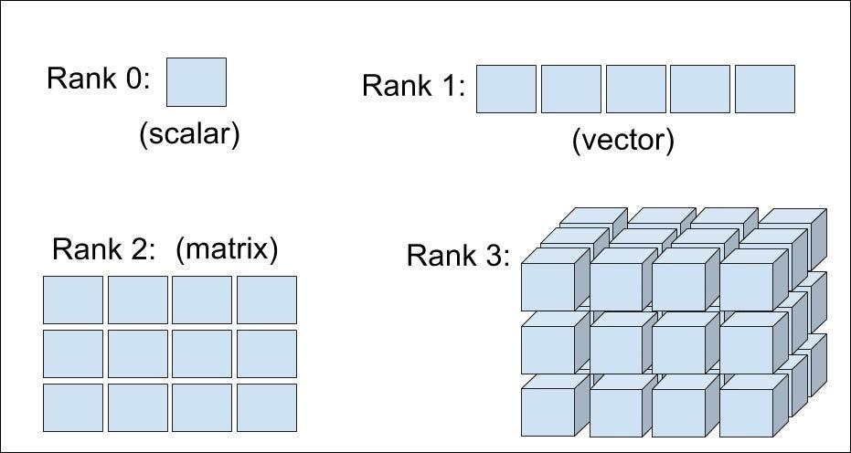

## Table of Contents

## What is a tensor in the context of machine learning?

In machine learning, a tensor is a way to represent data in a structured format. Think of it as a container that can hold numbers in different shapes and sizes, like a box that can be a single number, a list, a table, or even more complex structures. In simple terms, a tensor is just a generalization of vectors and matrices to potentially higher dimensions. For example, a single number is a 0-dimensional tensor, a list of numbers is a 1-dimensional tensor, and a table of numbers is a 2-dimensional tensor.

Tensors are important in machine learning because they can efficiently handle large amounts of data and perform complex calculations. Many machine learning algorithms, especially those used in deep learning, use tensors to process and transform data. For instance, in a neural network, the input data, weights, and outputs are all represented as tensors. This allows the algorithms to work with data in a way that's both flexible and powerful, making it easier to build and train models that can learn from and make predictions on complex datasets.

## How is the shape of a tensor defined?

The shape of a tensor tells you how its numbers are arranged. It's like describing the size of a box in terms of its length, width, and height. For a tensor, the shape is a list of numbers that show how many elements are in each dimension. If you have a 2-dimensional tensor, like a table, its shape might be something like (3, 4), meaning it has 3 rows and 4 columns. For a 3-dimensional tensor, the shape could be (2, 3, 4), which means it's like two tables, each with 3 rows and 4 columns.

You can think of the shape as a way to understand the structure of your data. For example, if you're working with images, a tensor's shape might be (height, width, channels), where channels could be the red, green, and blue values for each pixel. If you have an image that's 28 pixels high and 28 pixels wide with 3 color channels, the tensor's shape would be (28, 28, 3). Knowing the shape helps you work with the data correctly and perform operations like reshaping or slicing the tensor to get the information you need.

## Why is understanding tensor shape important in machine learning?

Understanding the shape of a tensor is really important in [machine learning](/wiki/machine-learning) because it helps you know how your data is organized. When you're working with machine learning models, especially [deep learning](/wiki/deep-learning) ones, your data comes in as tensors. The shape of these tensors tells you things like how many examples you have, how many features each example has, or in the case of images, the height, width, and number of color channels. If you don't know the shape, you might mix up your data or feed it into the model in the wrong way, which can mess up your results.

Also, many operations in machine learning, like reshaping, slicing, or combining tensors, depend on knowing their shapes. For example, if you want to flatten an image tensor to feed it into a [neural network](/wiki/neural-network), you need to know its original shape to do this correctly. If you get the shape wrong, the model might not work as expected, and you could end up with errors or poor performance. So, understanding tensor shapes is key to making sure your data is handled properly and your models work the way they should.

## What are the common dimensions of tensors used in neural networks?

In neural networks, tensors come in different shapes depending on what they're used for. For example, if you're working with images, a common tensor shape is (height, width, channels). This means each image has a certain height and width, and each pixel has several channels, like red, green, and blue for color images. For a grayscale image, you might see a shape like (28, 28, 1), where the image is 28 pixels high and 28 pixels wide with just one channel. For color images, the shape could be something like (224, 224, 3), which means the image is 224 pixels by 224 pixels with 3 color channels.

When you're dealing with batches of data, you add another dimension to the tensor to represent the number of examples. So, if you have a batch of 32 images, each 28 by 28 pixels and grayscale, the tensor shape would be (32, 28, 28, 1). This tells the neural network that it's processing 32 images at once, each with the same dimensions. In more complex models like those used in natural language processing, you might see tensors with shapes like (batch_size, sequence_length, embedding_dim), where sequence_length is the number of words in a sentence, and embedding_dim is the size of the vector representing each word. Understanding these shapes helps you set up your data correctly and make sure your neural network processes it the right way.

## How do you reshape a tensor, and why might you need to do this?

Reshaping a tensor means changing its shape without changing the actual data inside it. Imagine you have a box full of numbers arranged in a certain way, and you want to rearrange them into a different shape, like turning a long line of numbers into a square table. In machine learning, you can do this with a function called `reshape`. For example, if you have a tensor with shape (4, 4), you can reshape it into (2, 8) or (16,). The total number of elements stays the same, so you can only reshape it into shapes that have the same total number of elements.

You might need to reshape tensors for a few reasons. One common reason is to prepare your data for a neural network. Some layers in a neural network expect the data to be in a certain shape, so you might need to reshape your input data to match what the layer needs. For example, if you have a batch of images and you need to flatten them before feeding them into a fully connected layer, you would reshape the tensor from something like (batch_size, height, width, channels) to (batch_size, height * width * channels). Another reason is to make operations easier. Sometimes, reshaping can help you perform calculations more efficiently or make your code simpler to read and understand.

## What is the difference between a scalar, vector, matrix, and higher-dimensional tensor?

A scalar is the simplest type of tensor. It's just a single number, like 5 or 3.14. Think of it as a 0-dimensional tensor because it has no length, width, or height. A vector is a step up from a scalar. It's a list of numbers arranged in a line. For example, a vector could be [1, 2, 3]. Vectors are 1-dimensional tensors because they have length but no width or height. A matrix is like a table of numbers. It has rows and columns, so it's a 2-dimensional tensor. An example of a matrix would be:

$$
\begin{bmatrix}
1 & 2 \\
3 & 4
\end{bmatrix}
$$

Higher-dimensional tensors go beyond matrices. They can have three or more dimensions. For example, a 3-dimensional tensor could be thought of as a cube of numbers, like a stack of matrices. An example might be a tensor with shape (2, 3, 4), which means it has 2 "slices," each with 3 rows and 4 columns. These tensors are useful in machine learning for handling complex data like images or sequences. So, the main difference between these types of tensors is the number of dimensions they have, which determines how the data is organized and what kind of operations you can perform on them.

## How does tensor shape affect the performance of a neural network?

The shape of a tensor can really affect how well a neural network works. When you feed data into a neural network, the shape of the tensor tells the network how the data is set up. If the shape is right, the network can process the data correctly and learn from it. But if the shape is wrong, the network might get confused, and it could take longer to train or not work as well. For example, if you're working with images, you need to make sure the tensor's shape matches what the network expects, like (height, width, channels). If you mix up the dimensions, the network might see the image in a weird way and not learn the right patterns.

Reshaping tensors can also help make the network run faster or use less memory. Sometimes, you need to change the shape of a tensor to fit it into a certain layer of the network. For example, if you need to flatten an image before feeding it into a fully connected layer, you reshape the tensor from something like (batch_size, height, width, channels) to (batch_size, height * width * channels). This can make calculations easier and quicker. But, if you reshape it in a way that doesn't match what the network needs, it could slow things down or use more memory than necessary. So, getting the tensor shape right is important for making sure your neural network performs its best.

## What are broadcasting rules in tensor operations, and how do they relate to tensor shapes?

Broadcasting rules in tensor operations help you do math with tensors that have different shapes. Imagine you have a small tensor and a big tensor, and you want to add them together. Broadcasting lets you do this by making the small tensor bigger in a smart way, so it matches the big tensor's shape. For example, if you have a tensor with shape (3,) and another with shape (3, 3), broadcasting will make the first tensor look like it has shape (3, 3) by copying its values along the new dimension. This way, you can add them together without changing the actual data.

The rules for broadcasting are simple but important. When you want to do an operation with two tensors, you look at their shapes from right to left. If the sizes of the dimensions match, or if one of them is 1, you can broadcast. If a dimension is missing in one tensor, it's treated as if it has size 1. For example, if you have a tensor with shape (3, 1) and another with shape (3,), the second tensor will be broadcasted to (3, 3) to match the first tensor. This helps you do operations like adding a constant to every element of a tensor or multiplying a matrix by a vector. Understanding these rules helps you work with tensors of different shapes and makes your code more flexible and efficient.

## How do you handle tensors with different shapes during operations like addition or multiplication?

When you want to add or multiply tensors that have different shapes, you use something called broadcasting. Broadcasting helps you do these operations by making the smaller tensor bigger in a smart way, so it matches the shape of the bigger tensor. For example, if you have a tensor with shape (3,) and you want to add it to a tensor with shape (3, 3), broadcasting will make the first tensor look like it has shape (3, 3) by copying its values along the new dimension. This way, you can add them together without changing the actual data.

The rules for broadcasting are simple. You look at the shapes of the tensors from right to left. If the sizes of the dimensions match, or if one of them is 1, you can broadcast. If a dimension is missing in one tensor, it's treated as if it has size 1. For example, if you have a tensor with shape (3, 1) and another with shape (3,), the second tensor will be broadcasted to (3, 3) to match the first tensor. This helps you do operations like adding a constant to every element of a tensor or multiplying a matrix by a vector. Understanding these rules helps you work with tensors of different shapes and makes your code more flexible and efficient.

## What are some common errors related to tensor shapes and how can they be resolved?

One common error related to tensor shapes is the "shape mismatch" error. This happens when you try to do an operation with two tensors that have shapes that don't match up correctly. For example, if you try to add a tensor with shape (3, 4) to a tensor with shape (4, 3), you'll get an error because the dimensions don't line up. To fix this, you need to make sure the shapes of the tensors are compatible. You can do this by reshaping one or both tensors so they match, or by using broadcasting if it's possible. For instance, if you want to add a tensor with shape (3,) to a tensor with shape (3, 4), you can use broadcasting to make the first tensor look like it has shape (3, 4).

Another common error is when you try to feed data into a neural network layer that expects a certain shape, but the data's shape doesn't match. For example, if a layer expects input with shape (batch_size, 784) but you give it input with shape (batch_size, 28, 28), you'll get an error. To resolve this, you need to reshape the input data to match what the layer expects. You can use a reshape function to change the tensor from (batch_size, 28, 28) to (batch_size, 784). This is done by flattening the 28x28 image into a single vector of 784 elements. By understanding and correcting these shape-related errors, you can make sure your machine learning models work correctly and efficiently.

## How do tensor shapes impact memory usage and computational efficiency in deep learning models?

Tensor shapes can really affect how much memory a deep learning model uses. When you have a tensor, its shape tells you how the numbers inside it are arranged. If you have a big tensor with a lot of dimensions or a lot of elements, it will take up more memory. For example, if you have an image tensor with shape (1000, 224, 224, 3), it means you have 1000 images, each 224 pixels by 224 pixels with 3 color channels. This tensor will use a lot more memory than a smaller tensor with shape (10, 28, 28, 1), which has only 10 grayscale images, each 28 pixels by 28 pixels. So, choosing the right tensor shape can help you save memory and make your model run faster.

Tensor shapes also impact how quickly your model can do calculations. When you do operations on tensors, like adding or multiplying them, the shape of the tensor can make a big difference in how fast these operations happen. For example, if you can use broadcasting to do an operation without changing the actual data, it can make things run faster. Also, some operations work better with certain shapes. For instance, if you need to do a convolution on an image, having the tensor in the shape (batch_size, height, width, channels) can make it easier and quicker. By understanding how tensor shapes affect memory and speed, you can make your deep learning models more efficient and effective.

## Can you explain advanced tensor manipulation techniques like transposition and squeezing in the context of machine learning?

Transposition is a way to change the order of the dimensions in a tensor. It's like turning a table sideways. For example, if you have a tensor with shape (3, 4), transposing it will give you a tensor with shape (4, 3). This can be really helpful in machine learning because some operations need the data in a certain order. For instance, if you're working with images and you need to change the order of the dimensions from (height, width, channels) to (channels, height, width), you can use transposition. In code, you might see something like `tensor.transpose(1, 2, 0)` to change the order of the dimensions.

Squeezing is another useful technique. It's used to remove dimensions of size 1 from a tensor. Imagine you have a tensor with shape (1, 3, 1, 4). Squeezing it will get rid of those extra dimensions of size 1, leaving you with a tensor of shape (3, 4). This can help make your data more manageable and save memory. In machine learning, you might use squeezing after operations that add extra dimensions, like when you're reshaping data for a neural network. For example, if a layer outputs a tensor with an extra dimension of size 1, you can squeeze it to make it easier to work with. In code, you might see something like `tensor.squeeze()` to remove those extra dimensions.