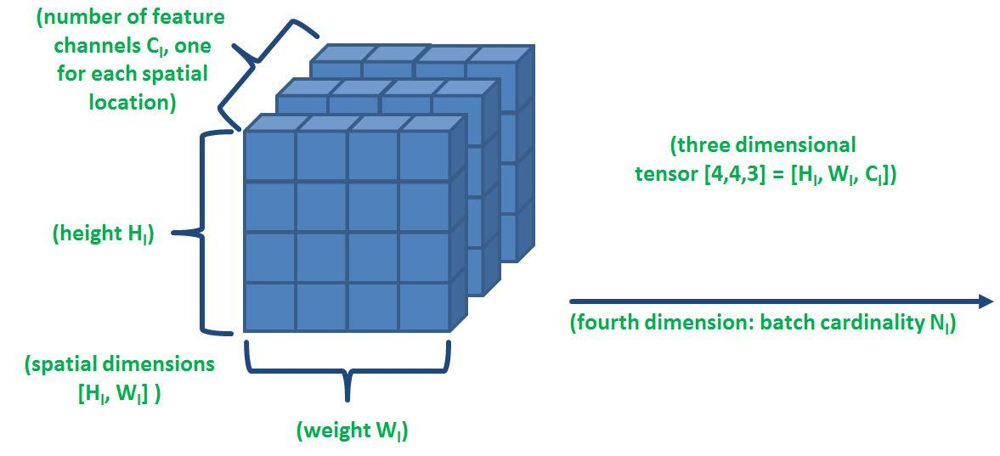

## Table of Contents

## What is a tensor in the context of machine learning?

In machine learning, a tensor is a way to represent data that can have any number of dimensions. Think of it like a container that can hold numbers arranged in different shapes. For example, a single number is a 0-dimensional tensor, a list of numbers is a 1-dimensional tensor, and a table of numbers is a 2-dimensional tensor. In more complex scenarios, like images or videos, tensors can have three or even more dimensions. Tensors are important because they allow machine learning models to process and understand data in various forms.

Tensors are used in many machine learning frameworks, such as TensorFlow and PyTorch, to perform operations on data. These operations can include simple arithmetic, like addition and multiplication, or more complex functions used in neural networks. For example, when training a neural network, tensors are used to represent the input data, the weights of the network, and the output predictions. This makes it easier for the computer to handle and manipulate the data efficiently. By using tensors, machine learning algorithms can work with data in a more flexible and powerful way.

## How does tensor size affect the performance of a neural network?

The size of a tensor can have a big impact on how well a neural network performs. When tensors are bigger, they can hold more data, which means the neural network can learn more complex patterns. For example, if you're working with images, using larger tensors means you can process higher resolution images, which can lead to better results because the network has more detailed information to work with. However, bigger tensors also mean more calculations for the computer to do, which can slow down the training process and require more memory.

On the other hand, smaller tensors can make the [neural network](/wiki/neural-network) faster and use less memory, but they might not capture all the important details in the data. If the tensors are too small, the network might miss out on important patterns and perform worse. It's all about finding the right balance. You want the tensors to be big enough to capture the necessary information but not so big that they make the training process too slow or impossible to handle with the available resources. Choosing the right tensor size is a key part of designing an effective neural network.

## What are the common dimensions of tensors used in image processing?

In image processing, tensors usually have three or four dimensions. A common type of tensor for images is a 3-dimensional tensor. This tensor has dimensions for height, width, and color channels. For example, a color image might have a size of $$32 \times 32 \times 3$$, where 32 is the height, 32 is the width, and 3 represents the red, green, and blue (RGB) color channels. If you're working with grayscale images, the tensor might be $$32 \times 32 \times 1$$, with just one channel for the intensity of the gray color.

Sometimes, you might use a 4-dimensional tensor in image processing. This extra dimension can represent a batch of images or a sequence of frames in a video. For instance, a batch of 10 color images, each with a size of $$32 \times 32 \times 3$$, would be represented as a tensor with dimensions $$10 \times 32 \times 32 \times 3$$. This allows the neural network to process multiple images at once, which can speed up training and improve performance.

## How can tensor size impact memory usage in deep learning models?

In [deep learning](/wiki/deep-learning) models, the size of tensors directly affects how much memory the computer needs to use. Bigger tensors mean more numbers to store, which takes up more memory. For example, if you have a tensor with dimensions $$100 \times 100 \times 3$$ for an image, it will use more memory than a tensor with dimensions $$50 \times 50 \times 3$$. This is because the larger tensor has more elements, and each element takes up space in the computer's memory. When you're training a model, you often need to keep many tensors in memory at the same time, like the input data, the weights of the network, and the intermediate results of calculations. If these tensors are too big, you might run out of memory, which can stop the training process or make it very slow.

To manage memory usage, you can try to use smaller tensors or process data in smaller batches. For instance, instead of loading all your images into memory at once, you can split them into smaller groups and process them one group at a time. This approach, called batch processing, can help keep memory usage under control. However, you need to find a balance because using very small tensors or very small batches might make the model less accurate or take longer to train. It's important to experiment and find the right tensor sizes that work well with the memory available on your computer while still allowing your model to learn effectively.

## What techniques can be used to manage large tensor sizes efficiently?

One way to handle large tensor sizes is by using a technique called batch processing. Instead of loading all your data into memory at once, you split it into smaller groups called batches. For example, if you have 1000 images, you might process them in batches of 32 images at a time. This means you only need to keep 32 images in memory at any given moment, which uses less memory than keeping all 1000 images. Batch processing can help you train your model even if you don't have a lot of memory, but you need to find the right batch size. If the batches are too small, it might take longer to train your model, but if they're too big, you might still run out of memory.

Another technique is to use model parallelism or data parallelism. In model parallelism, you split the neural network itself across multiple computers or GPUs. Each part of the network processes a piece of the tensor, and then the results are combined. In data parallelism, you copy the entire model onto multiple GPUs, and each GPU processes a different batch of data. This way, you can handle larger tensors because the workload is spread out. For example, if you have a tensor with dimensions $$100 \times 100 \times 3$$, you might split it across four GPUs, each handling a quarter of the data. These techniques can help manage large tensor sizes by using the combined memory and processing power of multiple devices.

## How does tensor size relate to model complexity and overfitting?

The size of tensors in a neural network can affect how complex the model is. When you use bigger tensors, you can make the model more complex because it can handle more detailed data. For example, if you increase the size of the input tensors from $$32 \times 32 \times 3$$ to $$64 \times 64 \times 3$$ for images, the model can see more details in the images. This can help the model learn more about the data, but it also means the model has more parameters to adjust during training. More parameters can make the model more powerful, but it also makes it easier for the model to overfit. Overfitting happens when the model learns the training data too well, including any noise or random patterns, and then doesn't work well on new data.

To manage overfitting, you can try to keep the tensor sizes smaller or use techniques like regularization. Regularization adds a penalty to the model's parameters to stop them from getting too big, which can help prevent overfitting. Another way to handle overfitting is to use dropout, where you randomly turn off some of the neurons during training. This makes the model more robust because it can't rely too much on any single part of the network. So, while bigger tensors can make the model more complex and potentially more powerful, you need to be careful to avoid overfitting by balancing the tensor sizes and using other techniques to keep the model in check.

## What is the role of tensor reshaping in machine learning algorithms?

Tensor reshaping is a useful tool in [machine learning](/wiki/machine-learning) because it lets you change the shape of your data without losing any information. Imagine you have a list of numbers arranged in a certain way, like a 2D grid. Reshaping can turn that grid into a single line of numbers or into a different grid shape. For example, if you have a tensor with dimensions $$4 \times 4$$, you can reshape it into a tensor with dimensions $$16 \times 1$$ without changing the actual numbers inside. This is helpful because different parts of a machine learning model might need the data in different shapes. For instance, a convolutional layer in a neural network might need the data in a 3D shape, while a fully connected layer might need it in a 1D shape.

Reshaping is often used to prepare data for different parts of a model or to make calculations easier. It's like rearranging the pieces of a puzzle to fit into different slots without changing the pieces themselves. For example, if you're working with images, you might need to reshape the data to fit into a specific format that the model expects. This can help the model process the data more efficiently and accurately. Reshaping is also useful when you're working with different types of data, like time series or text, where you might need to change the shape of the data to match the requirements of the algorithm you're using. By reshaping tensors, you can make sure your data is in the right form for your machine learning tasks.

## How do different tensor sizes affect the training time of machine learning models?

The size of tensors can really change how long it takes to train a machine learning model. Bigger tensors mean more numbers to process, which makes the computer work harder and take more time. For example, if you have an image tensor with dimensions $$100 \times 100 \times 3$$ instead of $$50 \times 50 \times 3$$, the computer has to do calculations on four times as many numbers. This can make training slower, especially if you're working with a lot of data or a complex model. Also, if the tensors are too big, they might not fit in the computer's memory, which can cause the training to stop or slow down even more as the computer tries to manage the memory.

On the other hand, using smaller tensors can make training faster because there are fewer numbers to process. But, if the tensors are too small, the model might not learn all the important details in the data, which can make it less accurate. Finding the right tensor size is like finding the perfect balance. You want the tensors to be big enough to capture the important information but not so big that they slow down the training too much. This balance can depend on the specific task, the amount of data you have, and the resources of your computer.

## What are the best practices for choosing the right tensor size for a specific task?

Choosing the right tensor size for a specific task depends on what you're trying to do and what resources you have. If you're working with images, for example, you need to think about how big the images should be. Bigger images, like those with dimensions $$224 \times 224 \times 3$$, can help the model see more details, but they also take more time to process and use more memory. If your computer doesn't have a lot of memory or if you need the model to train quickly, you might want to use smaller images, like those with dimensions $$32 \times 32 \times 3$$. It's important to experiment with different sizes to find what works best for your task and your computer.

Another thing to consider is how much data you have. If you have a lot of data, you can afford to use bigger tensors because the model can learn from more examples. But if you don't have much data, using smaller tensors might help prevent the model from overfitting, where it learns the training data too well and doesn't work well on new data. You can also use techniques like batch processing to handle bigger tensors more efficiently. For example, if you have 1000 images, you can process them in batches of 32 at a time, which helps manage memory usage. Finding the right tensor size is all about balancing the need for detail with the practical limits of your computer and data.

## How can tensor size optimization improve the inference speed of a model?

When you make the tensors smaller in a machine learning model, it can help the model work faster during inference. Inference is when the model uses what it learned to make predictions on new data. Smaller tensors mean fewer numbers to process, so the computer can do the calculations quicker. For example, if you have an image tensor with dimensions $$100 \times 100 \times 3$$ and you shrink it to $$50 \times 50 \times 3$$, the model has to work with four times fewer numbers. This can make a big difference, especially if you need the model to make predictions quickly, like in real-time applications.

However, you need to be careful not to make the tensors too small. If they are too small, the model might miss important details in the data and give less accurate predictions. So, finding the right tensor size is about balancing speed and accuracy. You might need to try different sizes and see how they affect the model's performance. By optimizing the tensor size, you can make your model run faster without losing too much accuracy, which is really helpful for practical use.

## What are the advanced methods for dynamically adjusting tensor sizes during training?

One advanced method for dynamically adjusting tensor sizes during training is called adaptive batch sizing. This technique changes the size of the batches of data that the model processes based on how well the model is doing. For example, if the model is learning quickly, you might increase the batch size to speed up training. But if the model starts to struggle or if there's not enough memory, you can decrease the batch size to help it learn better or to fit the data into memory. This way, the model can adapt to the training process and use the available resources more efficiently.

Another method is progressive resizing, which is often used in image processing tasks. In progressive resizing, you start training the model with smaller images, like those with dimensions $$32 \times 32 \times 3$$, and then gradually increase the size of the images as training goes on. For example, you might move to $$64 \times 64 \times 3$$ and then to $$128 \times 128 \times 3$$. This helps the model learn the basic patterns first with less data and then refine its understanding with more detailed images. By doing this, you can improve the model's accuracy without using too much memory or taking too long to train.

## How do tensor sizes in different layers of a neural network interact and influence each other?

In a neural network, the size of tensors in different layers can affect each other because the output of one layer becomes the input for the next layer. For example, if you start with an input tensor of size $$32 \times 32 \times 3$$ for an image, the first layer might process this and produce a tensor of size $$16 \times 16 \times 16$$. This new tensor then goes into the next layer, which might change its size again, like to $$8 \times 8 \times 32$$. Each layer's tensor size can impact how well the next layer can learn and process the data. If the tensors get too small, the network might lose important details, and if they get too big, it might become hard to train because of memory limits.

The interaction between tensor sizes in different layers also depends on the type of layers used. For instance, convolutional layers often reduce the spatial dimensions (like height and width) but increase the number of channels. This means that if you start with a tensor of size $$224 \times 224 \times 3$$, after a few convolutional layers, you might end up with a tensor like $$28 \times 28 \times 64$$. On the other hand, fully connected layers usually flatten the tensor into a 1D shape, which can change how the data is represented and processed. Balancing the sizes across layers is crucial to make sure the network can learn effectively without running into memory issues or losing important information.

## References & Further Reading

[1]: Goodfellow, I., Bengio, Y., & Courville, A. (2016). ["Deep Learning."](https://link.springer.com/article/10.1007/s10710-017-9314-z) MIT Press.

[2]: Chollet, F. (2018). ["Deep Learning with Python."](https://www.manning.com/books/deep-learning-with-python) Manning Publications.

[3]: Vaswani, A., Shazeer, N., Parmar, N., Uszkoreit, J., Jones, L., Gomez, A. N., Kaiser, Ł., & Polosukhin, I. (2017). ["Attention Is All You Need."](https://arxiv.org/abs/1706.03762) Advances in Neural Information Processing Systems 30.

[4]: He, K., Zhang, X., Ren, S., & Sun, J. (2016). ["Deep Residual Learning for Image Recognition."](https://arxiv.org/abs/1512.03385) Proceedings of the IEEE Conference on Computer Vision and Pattern Recognition (CVPR).

[5]: Kingma, D. P., & Ba, J. (2015). ["Adam: A Method for Stochastic Optimization."](https://arxiv.org/abs/1412.6980) International Conference on Learning Representations (ICLR).

[6]: Paszke, A., Gross, S., Massa, F., Lerer, A., Bradbury, J., Chanan, G., Killeen, T., Lin, Z., Gimelshein, N., Antiga, L., Desmaison, A., Kopf, A., Yang, E., DeVito, Z., Raffel, C., Dietrich, D., B., Hirzel, Evans, J., ... & Chintala, S. (2019). ["PyTorch: An Imperative Style, High-Performance Deep Learning Library."](https://arxiv.org/abs/1912.01703) Advances in Neural Information Processing Systems 32.

[7]: Abadi, M., Barham, P., Chen, J., Chen, Z., Davis, A., Dean, J., Devin, M., Ghemawat, S., Irving, G., Isard, M., Kudlur, M., Levenberg, J., Monga, R., Moore, S., Murray, D. G., Steiner, B., Tucker, P., Vasudevan, V., Warden, P., ... & Zheng, X. (2016). ["TensorFlow: A System for Large-Scale Machine Learning."](https://arxiv.org/abs/1603.04467) Proceedings of the 12th USENIX Symposium on Operating Systems Design and Implementation (OSDI).