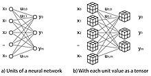

## Table of Contents

## What is a tensor in the context of machine learning?

In the context of machine learning, a tensor is a mathematical object used to represent data. Think of it as a container that can hold numbers arranged in various ways, like a single number, a list of numbers, or even a grid of numbers. In simpler terms, a tensor can be a scalar (a single number), a vector (a list of numbers), or a matrix (a table of numbers), but it can also be more complex structures with more dimensions.

Tensors are important in machine learning because they can efficiently handle large amounts of data and perform complex operations. For example, when you're training a neural network, the input data, the weights of the network, and the output predictions are all represented as tensors. This allows the computer to process and manipulate the data in a structured way, making it easier to perform calculations and apply algorithms. In popular machine learning libraries like TensorFlow and PyTorch, tensors are the fundamental building blocks for creating and training models.

## How do tensors differ from traditional data structures like arrays or matrices?

Tensors are like arrays and matrices but can have more dimensions. An array is a list of numbers, and a matrix is a table of numbers. A tensor can be a single number (scalar), a list of numbers (vector), a table of numbers (matrix), or even more complex structures with more dimensions. For example, a 3D tensor can be thought of as a cube of numbers, and a 4D tensor can be thought of as a collection of 3D cubes. This flexibility makes tensors very useful in machine learning, where data often comes in complex forms.

In programming, tensors are often used in libraries like TensorFlow and PyTorch. These libraries provide special functions to work with tensors, making it easier to perform operations like addition, multiplication, and more complex calculations needed for [machine learning](/wiki/machine-learning). While you can use regular arrays or matrices for these tasks, tensors are designed to handle large-scale data and perform operations more efficiently, especially on specialized hardware like GPUs. This efficiency is crucial for training large neural networks and processing big datasets.

## What are the basic operations that can be performed on tensors?

Tensors can do a lot of the same things as numbers, but in more dimensions. You can add tensors together, which means adding each number in one tensor to the corresponding number in another tensor. You can also multiply tensors by a number, which means multiplying each number in the tensor by that number. For example, if you have a tensor and you multiply it by 2, every number in the tensor gets doubled. Another common operation is the dot product, which combines tensors in a special way. If you have two vectors, their dot product is the sum of the products of their corresponding elements: $$ \mathbf{a} \cdot \mathbf{b} = \sum_{i=1}^n a_i b_i $$. This is used a lot in machine learning to figure out how similar two vectors are.

There are also more complex operations you can do with tensors. One of these is matrix multiplication, which is a way to combine two matrices to get a new matrix. If you have a matrix $$ A $$ and a matrix $$ B $$, their product $$ C = A \times B $$ is calculated by taking the dot product of the rows of $$ A $$ with the columns of $$ B $$. This operation is really important in neural networks because it's how the layers of the network process data. Another important operation is reshaping, which changes the layout of the tensor without changing its data. For example, you can take a 2D tensor and turn it into a 1D tensor, or vice versa. This is useful when you need to prepare data in a certain way for your machine learning model.

## How are tensors used in neural networks?

In neural networks, tensors are used to represent and process data. When you feed data into a [neural network](/wiki/neural-network), it's usually in the form of a tensor. For example, if you're trying to recognize pictures, each picture can be turned into a tensor where each number represents the color of a pixel. As the data moves through the layers of the neural network, it gets transformed by operations like matrix multiplication and addition. These operations are done on tensors, and the result is another tensor that gets passed to the next layer. This process continues until the final layer produces the network's prediction.

Tensors are also used to store the weights of the neural network. The weights are like the knobs that the network adjusts to learn from the data. They're stored in tensors, and during training, the network uses operations like gradient descent to update these weights. The goal is to find the best set of weights that makes the network's predictions as accurate as possible. For example, if you're trying to classify pictures, the weights will be adjusted to better recognize different objects in the pictures. By using tensors, the neural network can efficiently handle large amounts of data and perform complex calculations needed for learning.

## What is the role of tensors in deep learning frameworks like TensorFlow or PyTorch?

In [deep learning](/wiki/deep-learning) frameworks like TensorFlow and PyTorch, tensors are the basic building blocks for working with data and building neural networks. They are used to represent the input data, the weights of the network, and the output predictions. For example, when you load a picture into a model, it gets turned into a tensor where each number represents the color of a pixel. The model then uses operations like addition and multiplication on these tensors to process the data and make predictions. Tensors make it easy to handle large amounts of data and perform complex calculations needed for deep learning.

These frameworks also provide special functions to work with tensors, making it easier to build and train neural networks. For example, you can use functions to add tensors together or multiply them, which is important for updating the weights of the network during training. The weights are stored in tensors, and the network uses operations like gradient descent to adjust these weights and learn from the data. By using tensors, deep learning frameworks can efficiently process data and perform the calculations needed to train large and complex models.

## How can one create and manipulate tensors using Python?

To create and manipulate tensors in Python, you can use libraries like TensorFlow or PyTorch. Let's use PyTorch as an example. To create a tensor, you can use the `torch.tensor()` function. For example, to create a simple 2D tensor, you can do `tensor = torch.tensor([[1, 2], [3, 4]])`. This tensor has two rows and two columns, and it's filled with the numbers 1, 2, 3, and 4. You can also create tensors filled with zeros or ones using `torch.zeros()` and `torch.ones()`, or create random tensors with `torch.rand()`.

Once you have a tensor, you can manipulate it in many ways. For example, you can add two tensors together using the `+` operator, like `tensor1 + tensor2`. You can also multiply a tensor by a number using the `*` operator, like `tensor * 2`. If you want to perform more complex operations, like matrix multiplication, you can use the `torch.matmul()` function. For example, `result = torch.matmul(tensor1, tensor2)` will multiply two tensors together. You can also reshape a tensor using the `tensor.reshape()` method, which changes the layout of the tensor without changing its data. For example, `tensor.reshape(1, 4)` will turn a 2x2 tensor into a 1x4 tensor.

Here's a simple example of creating and manipulating tensors in PyTorch:

```python
import torch

# Create a 2D tensor
tensor = torch.tensor([[1, 2], [3, 4]])

# Add 2 to each element
tensor_plus_2 = tensor + 2
print("tensor + 2:", tensor_plus_2)

# Multiply by 3
tensor_times_3 = tensor * 3
print("tensor * 3:", tensor_times_3)

# Matrix multiplication
tensor2 = torch.tensor([[5, 6], [7, 8]])
result = torch.matmul(tensor, tensor2)
print("Matrix multiplication result:", result)

# Reshape the tensor
reshaped_tensor = tensor.reshape(1, 4)
print("Reshaped tensor:", reshaped_tensor)
```

This code shows how to create a tensor, add and multiply it by numbers, perform matrix multiplication, and reshape it. These operations are fundamental in working with tensors in deep learning.

## What are tensor dimensions and how do they affect machine learning models?

Tensor dimensions are like the size and shape of a tensor. Think of a tensor as a box that can hold numbers. The dimensions tell you how many numbers the box can hold and how they are arranged. For example, a 1D tensor is like a list of numbers, a 2D tensor is like a table of numbers, and a 3D tensor is like a cube of numbers. In machine learning, the dimensions of a tensor matter a lot because they determine how the data is organized and how it can be processed by the model. For instance, if you're working with images, you might use a 3D tensor where the dimensions represent the height, width, and color channels of the image.

The dimensions of tensors affect machine learning models in several ways. First, they determine what kind of operations can be performed on the data. For example, matrix multiplication, which is used a lot in neural networks, can only be done with tensors that have the right dimensions. If the dimensions don't match, the operation won't work. Second, the dimensions can affect how quickly the model can process the data. A model that can handle high-dimensional tensors might be able to capture more complex patterns in the data, but it might also take longer to train and use more memory. So, choosing the right dimensions for your tensors is important for making your machine learning model work well.

## How do tensor operations contribute to the efficiency of machine learning algorithms?

Tensor operations make machine learning algorithms more efficient by allowing them to handle large amounts of data quickly. When you're working with big datasets, like images or videos, tensors can store and process this data in a structured way. For example, in a neural network, each layer can take a tensor as input, do some calculations like adding or multiplying, and then pass the result as a tensor to the next layer. This process is fast because tensors are designed to work well with specialized hardware like GPUs, which can do many calculations at the same time. By using tensor operations, machine learning models can train faster and make predictions more quickly.

Tensor operations also help in optimizing the learning process. For example, when you're training a neural network, you need to adjust the weights to make the model's predictions more accurate. This is done using operations like gradient descent, which involves calculating gradients and updating the weights. These calculations are done on tensors, and because tensor operations are efficient, the model can learn from the data more quickly. This efficiency is crucial for big models with lots of parameters, like deep neural networks, because it makes the training process manageable and allows the model to reach good performance in a reasonable amount of time.

## What are some common tensor operations used in convolutional neural networks?

In convolutional neural networks (CNNs), tensors are used a lot to process images and other types of data. One common operation is convolution, which is like sliding a small window over the image to find patterns. This operation turns the input tensor into another tensor, where each number represents how well the window matches the part of the image it's looking at. Another important operation is pooling, which reduces the size of the tensor by taking the maximum or average value in small regions. This helps the network focus on the most important features and makes the model more efficient.

Another operation used in CNNs is the ReLU (Rectified Linear Unit) activation function, which applies a simple rule to each number in the tensor: if the number is less than zero, it becomes zero; otherwise, it stays the same. This helps the network learn better by making sure the output of each layer is positive. Finally, CNNs often use operations like batch normalization, which normalizes the values in the tensor to make the training process more stable. All these operations work together to help the network recognize patterns in the data and make accurate predictions.

## How does automatic differentiation work with tensors in machine learning?

Automatic differentiation is a way for computers to figure out how to make a machine learning model better by calculating how much each part of the model affects the final result. In machine learning, this is important because it helps the model learn from the data. When you use tensors in a model, automatic differentiation can work with them to find the best way to adjust the model's weights. For example, if you have a tensor that represents the weights of a neural network, automatic differentiation can calculate the gradient of the loss function with respect to these weights. This gradient tells the model which way to change the weights to make the predictions more accurate.

In practice, automatic differentiation is done using a method called backpropagation. This method works by going through the model backwards, starting from the output and moving towards the input. At each step, it calculates how much each tensor affects the final result. For example, if you have a tensor $$ W $$ representing the weights of a layer, and you want to find out how changing $$ W $$ affects the loss function $$ L $$, you can use the chain rule from calculus to calculate the gradient $$ \frac{\partial L}{\partial W} $$. Libraries like TensorFlow and PyTorch do this automatically, making it easy to train complex models. By using automatic differentiation with tensors, machine learning models can learn from large amounts of data efficiently and accurately.

## What advanced techniques involve tensors in areas like natural language processing or computer vision?

In natural language processing (NLP), tensors are used to represent words and sentences in a way that computers can understand. For example, a word can be turned into a vector, which is a 1D tensor, using techniques like word embeddings. These vectors capture the meaning of words, so words with similar meanings have similar vectors. When you want to process a whole sentence, you can use a 2D tensor where each row is a word vector. Advanced techniques like transformers use these tensors to understand the context of words in a sentence. For example, the attention mechanism in transformers calculates how much each word should pay attention to other words, which is done using tensor operations like matrix multiplication. This helps the model understand complex relationships in the text and make better predictions.

In computer vision, tensors are used to represent images and perform operations to recognize objects or patterns. An image can be turned into a 3D tensor where the dimensions represent the height, width, and color channels of the image. Convolutional neural networks (CNNs) use tensor operations like convolution to find patterns in the image. For example, a convolution operation slides a small window over the image to detect features like edges or textures. Another technique, called transfer learning, uses pre-trained models to extract features from images. These features are represented as tensors, and they can be used to train new models for different tasks. By using tensors, computer vision models can efficiently process large amounts of image data and make accurate predictions.

## How can one optimize tensor operations for performance in large-scale machine learning tasks?

To optimize tensor operations for performance in large-scale machine learning tasks, using the right hardware is key. Graphics Processing Units (GPUs) and Tensor Processing Units (TPUs) are designed to handle the complex calculations needed for tensor operations much faster than regular computers. Libraries like TensorFlow and PyTorch can take advantage of these devices, making it easier to speed up your model's training and predictions. For example, you can move your tensors to a GPU using `tensor = tensor.to('cuda')` in PyTorch. This simple step can make a big difference in how quickly your model processes data.

Another way to optimize tensor operations is by using techniques like batching and quantization. Batching means processing multiple examples at once, which can make the calculations more efficient. For example, instead of processing one image at a time, you can process a whole batch of images together. This can be done by reshaping your data into a 4D tensor where the first dimension represents the batch size. Quantization, on the other hand, reduces the precision of the numbers in your tensors, like using 8-bit integers instead of 32-bit floating-point numbers. This can save memory and speed up calculations. For instance, in PyTorch, you can use `torch.quantization.quantize_dynamic` to convert your model to a quantized version. By using these techniques, you can make your large-scale machine learning tasks run faster and use less memory.