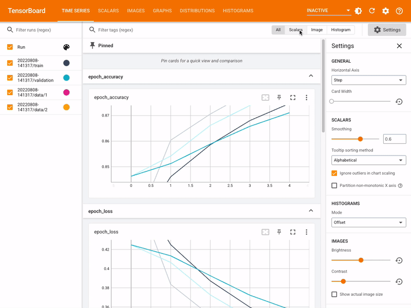

## Table of Contents

## What is TensorBoard and what is its primary purpose in machine learning?

TensorBoard is a tool that comes with TensorFlow, a popular machine learning library. Its main job is to help you see what's happening inside your machine learning models as they train. Imagine you're cooking a complex dish; TensorBoard is like a window into your kitchen, showing you how each ingredient is being mixed and cooked over time. It does this by displaying graphs and charts that represent your model's performance and behavior.

The primary purpose of TensorBoard in machine learning is to make the training process easier to understand and manage. When you're training a model, you want to know if it's learning correctly and improving over time. TensorBoard helps by showing you things like how the model's accuracy is changing, how quickly it's learning, and where it might be making mistakes. This way, you can tweak your model to make it better, kind of like adjusting the recipe in your cooking example. By using TensorBoard, you can see these changes in real-time, which makes it a very useful tool for anyone working on machine learning projects.

## How do you install and set up TensorBoard for a new project?

To install TensorBoard for a new project, you first need to make sure you have Python installed on your computer. Once you have Python, you can install TensorBoard using pip, which is a package installer for Python. Open your command line or terminal and type ```pip install tensorboard```. This command will download and install TensorBoard on your computer. After the installation is complete, you're ready to set it up for your project.

Setting up TensorBoard for your project involves a few simple steps. First, you need to make sure your [machine learning](/wiki/machine-learning) code is set up to log data that TensorBoard can read. In your Python script, you'll need to import TensorFlow and use its summary operations to log data like loss and accuracy. For example, you might use ```tf.summary.scalar('loss', loss)``` to log the loss value during training. Once your code is set up to log data, you run your script and tell it to save the logs in a specific directory. After your script runs and generates logs, you can start TensorBoard by typing ```tensorboard --logdir=path/to/log-directory``` in your command line. This will start a local server, and you can view your TensorBoard dashboard by opening a web browser and going to the URL it provides, usually something like ```localhost:6006```.

## Can you explain the basic components of TensorBoard and their functions?

TensorBoard is like a dashboard that helps you see what's going on inside your machine learning model. The main part of TensorBoard is the **Scalars** section, which shows you how things like loss and accuracy change over time. Imagine you're trying to teach a dog new tricks; the Scalars section would show you if the dog is getting better at the tricks or if it's still making the same mistakes. This helps you know if your model is learning the right way or if you need to change something.

Another important part is the **Graphs** section, which shows you the structure of your model. It's like a map that shows all the different parts of your model and how they connect. This can help you see if there's a part of your model that's not working well or if you need to add or remove something. The **Histograms** and **Distributions** sections let you see how the values inside your model are spread out, which can help you understand if your model is using its data in a good way. Finally, the **Images** and **Audio** sections let you see or hear the data your model is working with, which can be really helpful if you're working with pictures or sounds.

Setting up TensorBoard is easy. In your Python code, you use TensorFlow to log data. For example, you might use ```tf.summary.scalar('loss', loss)``` to log the loss value. After running your script, you start TensorBoard with a command like ```tensorboard --logdir=path/to/log-directory```. Then, you open a web browser and go to the URL TensorBoard gives you, usually something like ```localhost:6006```. This way, you can see all the different parts of TensorBoard and use them to make your model better.

## How does TensorBoard help in visualizing the training process of a machine learning model?

TensorBoard helps you see how your machine learning model is learning by showing you graphs and charts that update as your model trains. Imagine you're teaching a kid to ride a bike. TensorBoard is like watching the kid get better over time. You can see if they're falling less often or if they're getting faster. In the same way, TensorBoard shows you if your model's loss is going down or if its accuracy is going up. This helps you know if your model is learning the right way or if you need to change something to help it learn better.

For example, in the Scalars section of TensorBoard, you can see how the loss and accuracy of your model change with each training step. If you're using a model to recognize pictures of cats and dogs, you might use ```tf.summary.scalar('loss', loss)``` in your code to log the loss value. As your model trains, TensorBoard will show you a graph of this loss over time, helping you see if the model is getting better at telling cats from dogs. If the loss goes down, that's a good sign! You can also look at the Graphs section to see the structure of your model, which is like looking at the blueprint of a building to see how all the parts fit together.

## What types of data can be visualized using TensorBoard?

TensorBoard can show you many different kinds of data that help you understand how your machine learning model is doing. You can see how numbers like loss and accuracy change over time in the Scalars section. For example, if you're teaching a computer to tell the difference between pictures of cats and dogs, you might use ```tf.summary.scalar('loss', loss)``` to keep track of how well the computer is learning. This helps you see if the model is getting better at its job or if it needs more help.

In addition to numbers, TensorBoard can also show you the structure of your model in the Graphs section. This is like looking at a map of all the parts of your model and how they connect. It helps you see if there's a part that's not working well or if you need to change something. You can also look at how data is spread out in the Histograms and Distributions sections, which can tell you if your model is using its data in a good way. If you're working with pictures or sounds, the Images and Audio sections let you see or hear the data your model is working with, which can be really helpful for understanding what's going on.

## How can TensorBoard be used to track and compare different model runs?

TensorBoard helps you keep track of different model runs by letting you save the results of each run in separate folders. Imagine you're trying different ways to teach a dog new tricks. You can use ```tf.summary.scalar('loss', loss)``` in your code to log the loss for each method. By saving these logs in different folders, TensorBoard can show you how each method is working over time. This way, you can easily compare which method helps the dog learn the tricks faster and better.

Once you have your logs saved in different folders, you can start TensorBoard with a command like ```tensorboard --logdir=path/to/log-directory```. TensorBoard will then show you graphs for each folder, letting you see how the loss and accuracy change for each run. This makes it easy to see which model is doing better. For example, if one model's loss is going down faster than another's, you know that model is learning more quickly. By looking at these comparisons, you can pick the best way to train your model, just like choosing the best way to teach your dog.

## What are some advanced features of TensorBoard that enhance model debugging and optimization?

TensorBoard has some cool advanced features that help you find problems in your model and make it better. One of these is the **Profiler** section, which lets you see how your model is using the computer's resources. It shows you where your model might be slowing down or using too much memory. This is like looking under the hood of a car to see if something's wrong with the engine. If you find a part that's not working well, you can fix it to make your model run faster and use less power.

Another great feature is the **Projector**, which helps you see how your data is organized in a way that's easy to understand. It uses something called t-SNE to show your data in a 2D or 3D space. This can help you see if your model is grouping similar things together, like cats and dogs, or if it's mixing them up. By looking at the Projector, you can figure out if you need to change your model to make it better at telling things apart. For example, if you see that cats and dogs are mixed up, you might need to give your model more examples to learn from.

TensorBoard also has the **HParams** dashboard, which lets you try different settings for your model and see how they affect its performance. You can change things like the learning rate or the number of layers in your model and see how these changes make the loss and accuracy change over time. This is like trying different recipes to see which one makes the best cake. By using HParams, you can find the best settings for your model to make it learn as well as possible.

## How can custom scalars and histograms be implemented in TensorBoard?

To implement custom scalars in TensorBoard, you need to use TensorFlow's summary operations in your code. You can log any number you want to track, like loss or accuracy, by using ```tf.summary.scalar('custom_scalar_name', value)```. For example, if you want to track a custom metric called 'my_metric', you would use ```tf.summary.scalar('my_metric', my_metric_value)```. When you run your model, these custom scalars will show up in the Scalars section of TensorBoard, letting you see how they change over time. This is helpful if you want to keep an eye on special numbers that are important for your model.

For custom histograms, you can use ```tf.summary.histogram('custom_histogram_name', values)``` to log the distribution of a set of values. For instance, if you want to see how the weights in a layer of your model are spread out, you could use ```tf.summary.histogram('layer_weights', layer_weights)```. When you look at the Histograms section in TensorBoard, you'll see how these values are distributed over time. This can help you understand if your model is using its data in a good way and if you need to make any changes to improve it.

## What is the process for embedding custom visualizations in TensorBoard?

To embed custom visualizations in TensorBoard, you first need to create a custom plugin. This involves writing some code to define how your visualization will look and work. You can use TensorFlow's API to make this plugin. For example, you might use ```tf.summary.image('my_custom_image', image_tensor)``` to log an image that you want to show in TensorBoard. Once you've written the code for your plugin, you need to package it so that TensorBoard can use it. This usually means creating a Python package and installing it in your environment.

After your custom plugin is set up, you can start using it in your machine learning project. In your training script, you'll add code to log the data that your custom visualization needs. For instance, if you're making a custom chart, you might log the data points with ```tf.summary.scalar('custom_chart_data', data_point)```. When you run your script, it will save this data in the log directory. Then, when you start TensorBoard with ```tensorboard --logdir=path/to/log-directory```, your custom visualization will show up in the TensorBoard dashboard. This way, you can see your special charts and images right alongside the standard TensorBoard views.

## How does TensorBoard integrate with TensorFlow and other machine learning frameworks?

TensorBoard integrates smoothly with TensorFlow, which is a popular machine learning library. When you're using TensorFlow to build and train your model, you can easily add logging code like ```tf.summary.scalar('loss', loss)``` to track things like loss and accuracy. These logs are saved in a directory, and when you start TensorBoard with the command ```tensorboard --logdir=path/to/log-directory```, it reads these logs and shows you graphs and charts that help you understand how your model is doing. This integration makes it easy to keep an eye on your model's performance without needing to switch between different tools.

TensorBoard can also work with other machine learning frameworks, although it might take a bit more setup. For example, if you're using PyTorch, you can use a library called ```torch.utils.tensorboard``` to log data in a way that TensorBoard can understand. You would use code like ```from torch.utils.tensorboard import SummaryWriter writer = SummaryWriter() writer.add_scalar('loss', loss, global_step)``` to log your data. Once you've saved these logs, you can start TensorBoard in the same way as with TensorFlow, and it will show you the same kind of useful visualizations. This flexibility means you can use TensorBoard to help with your machine learning projects no matter which framework you're using.

## Can you describe a case study where TensorBoard significantly improved a machine learning project?

In a project focused on image classification, a team was trying to teach a computer to recognize different types of flowers. They used a [deep learning](/wiki/deep-learning) model, but they were having trouble figuring out why the model wasn't getting better as quickly as they hoped. That's when they started using TensorBoard. By logging the loss and accuracy with ```tf.summary.scalar('loss', loss)``` and ```tf.summary.scalar('accuracy', accuracy)```, they could see how these numbers changed over time in the Scalars section of TensorBoard. This helped them spot that the model's learning rate was too high, causing it to miss the best solution. They lowered the learning rate and saw the loss go down smoothly, which meant the model was learning better.

Another example is a project where a team was working on natural language processing to understand customer reviews. They used TensorBoard's HParams dashboard to try different settings for their model, like changing the number of layers and the learning rate. By using ```tf.summary.scalar('loss', loss)``` and ```tf.summary.scalar('accuracy', accuracy)``` for each set of parameters, they could compare how each setting affected the model's performance. The HParams dashboard showed them that a certain combination of settings worked best, leading to a big jump in accuracy. Thanks to TensorBoard, they could find the best way to set up their model quickly and make their project a success.

## What are the limitations of TensorBoard and how can they be mitigated?

TensorBoard is a great tool for looking at how your machine learning model is doing, but it has some limits. One big limit is that it can slow down if you're logging a lot of data. If you're working on a big project with lots of numbers to keep track of, TensorBoard might take a while to show everything. Also, TensorBoard works best with TensorFlow, so if you're using a different machine learning tool like PyTorch, you might need to do some extra work to make it work with TensorBoard. Another thing is that TensorBoard can be tricky to set up for custom visualizations. If you want to show something special in TensorBoard, you might need to write some code to make it happen.

To make these problems smaller, you can try a few things. If TensorBoard is slow because of too much data, you can log less often or only log the most important numbers. This can help TensorBoard run faster. If you're using a different tool like PyTorch, you can use libraries like ```torch.utils.tensorboard``` to make it easier to log data that TensorBoard can read. For custom visualizations, you can learn how to make a custom plugin for TensorBoard. This might take some time to learn, but it lets you show exactly what you need to see. By doing these things, you can use TensorBoard better and make your machine learning projects easier to understand.

## References & Further Reading

[1]: M. Abadi, P. Barham, J. Chen, Z. Chen, A. Davis, J. Dean, M. Devin et al., "TensorFlow: A system for large-scale machine learning," Proceedings of the 12th USENIX Conference on Operating Systems Design and Implementation, Savannah, GA, USA, 265-283, 2016.

[2]: ["TensorBoard: Visualizing Learning"](https://www.tensorflow.org/tensorboard) on TensorFlow's Official Site

[3]: Olivier Michel and Andreas Mueller, "Building Machine Learning Powered Applications: Going from Idea to Product," O'Reilly Media, 2020.

[4]: R. Zhao, "An Overview of TensorBoard for Deep Learning Applications," Journal of Machine Learning Research, vol. 18, no. 1, pp. 1-5, 2017. 

[5]: ["Machine Learning with TensorFlow, Second Edition"](https://www.manning.com/books/machine-learning-with-tensorflow-second-edition) by Nishant Shukla, Manning Publications.