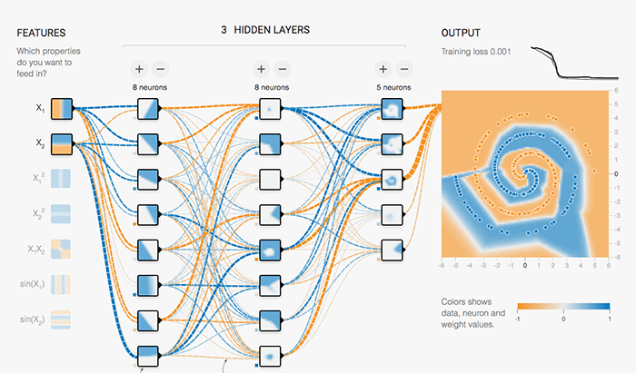

## Table of Contents

## What is TensorFlow Playground and what is its purpose?

TensorFlow Playground is a web-based tool that helps people learn about neural networks in a fun and interactive way. It lets you build and experiment with different neural networks right in your browser. You can change things like the number of layers, the type of activation functions, and even the data you're using. This makes it easier to see how these changes affect the network's performance.

The main purpose of TensorFlow Playground is to make the complex ideas behind neural networks easier to understand. By playing around with the tool, you can see how different settings affect how well the network can learn from data. This hands-on approach helps people, especially beginners, get a better grasp of machine learning concepts without needing to write any code. It's a great way to start learning about neural networks and how they work.

## How can beginners start using TensorFlow Playground?

To start using TensorFlow Playground, beginners should first visit the TensorFlow website and find the Playground section. Once there, they will see a simple interface with a grid where they can draw lines to represent data. On the left side, there are controls to adjust the neural network's settings like the number of layers and the type of activation function. Beginners can start by leaving the settings at their default values and clicking the "Play" button to see the network learn from the data.

As they get more comfortable, beginners can start experimenting with different settings. For example, they can change the number of neurons in each layer or try different activation functions like ReLU or tanh. They can also switch the data set to see how the network performs with different types of data. By watching how these changes affect the network's ability to learn, beginners can start to understand the basics of neural networks without needing to write any code.

## What are the basic concepts of neural networks demonstrated in TensorFlow Playground?

TensorFlow Playground shows how neural networks learn from data. It starts with input data, which is like the information you give to the network. This data goes through layers of neurons, which are like tiny decision-makers. Each neuron takes in data, does a simple calculation, and passes the result to the next layer. The goal is to make the network's final output match the correct answer as closely as possible. You can see this learning process happen as the network adjusts its internal settings, called weights and biases, to get better at predicting the right answer.

One key idea you can see in action is the activation function. This function decides if a neuron should "fire" or not. Common ones you can play with in TensorFlow Playground are ReLU, which means "Rectified Linear Unit," and tanh, or "hyperbolic tangent." ReLU helps the network learn quickly, while tanh can be better for certain types of data. You can switch between these functions and see how they change the network's performance. This helps you understand how different parts of the [neural network](/wiki/neural-network) affect its ability to learn.

Another concept is the cost or loss function, which measures how wrong the network's predictions are. In TensorFlow Playground, you can see this as a number that gets smaller as the network learns. The network tries to minimize this number by adjusting its weights and biases. You can also change the learning rate, which controls how big these adjustments are. A higher learning rate can make the network learn faster, but if it's too high, the network might miss the best solution. By playing with these settings, you get a feel for how neural networks balance speed and accuracy to learn from data.

## How does TensorFlow Playground help in understanding the impact of different activation functions?

TensorFlow Playground makes it easy to see how different activation functions affect a neural network. You can choose from several activation functions like ReLU, tanh, sigmoid, and linear. When you switch between them, you watch the network learn and see how the performance changes. For example, if you pick ReLU, which stands for Rectified Linear Unit, you'll notice the network might learn faster. ReLU keeps positive values the same but turns negative values into zero, which can help the network focus on important features in the data.

On the other hand, if you choose tanh, or hyperbolic tangent, you'll see a different pattern. Tanh squashes the values between -1 and 1, which can be useful for certain types of data. You might find that the network takes a bit longer to learn but can sometimes give more accurate results. By trying out these different functions and watching how the network's performance changes, you get a clear picture of how each activation function impacts the learning process. This hands-on approach helps you understand the strengths and weaknesses of each function without needing to dive into complex math or code.

## What are the different types of regularization available in TensorFlow Playground and how do they affect the model?

TensorFlow Playground lets you see how regularization affects a neural network. Regularization is a way to stop the network from overfitting, which means it learns the training data too well and doesn't work well with new data. You can choose between L1 and L2 regularization. L1 regularization, also called Lasso, adds a penalty to the weights of the neurons based on their absolute value. This can make some weights become zero, which simplifies the network. L2 regularization, also called Ridge, adds a penalty based on the square of the weights. This tends to make all the weights smaller but doesn't make them zero.

When you use L1 regularization in TensorFlow Playground, you'll notice that some connections between neurons might disappear as the network learns. This happens because L1 can set some weights to zero, making the network simpler and sometimes better at generalizing to new data. On the other hand, L2 regularization will make the weights smaller overall, which can also help prevent overfitting but in a different way. By switching between these regularization methods, you can see how they change the network's performance and understand which one might work better for different types of data.

## How can one experiment with different network architectures in TensorFlow Playground?

To experiment with different network architectures in TensorFlow Playground, start by adjusting the number of layers and neurons in each layer. On the left side of the screen, you'll see options to change the number of hidden layers and the number of neurons in each layer. Try adding more layers or increasing the number of neurons to see how it affects the network's ability to learn from the data. You can also change the connections between layers by clicking on the nodes and dragging lines to connect or disconnect them. This lets you build different shapes of networks, like fully connected networks or networks with skipped connections.

As you change the architecture, watch the performance of the network on the right side of the screen. The cost or loss function will show you how well the network is learning. If you add too many layers or neurons, the network might start to overfit, meaning it learns the training data too well but doesn't work well with new data. You can use regularization options like L1 or L2 to help prevent overfitting. By trying out different combinations of layers, neurons, and connections, you can see which architectures work best for different types of data and understand how the structure of a neural network affects its performance.

## What insights can be gained about overfitting and underfitting using TensorFlow Playground?

In TensorFlow Playground, you can see overfitting and underfitting by watching how the network learns. Overfitting happens when the network learns the training data too well but doesn't do well with new data. You can spot this when the network's performance on the training data gets really good, but its performance on the test data, shown by the orange line, stays bad or gets worse. To see this, try adding more layers or neurons. The network might start to fit the training data perfectly, but the test data performance will show it's not learning the right things. You can use regularization like L1 or L2 to help stop overfitting. L1 might make some connections disappear, while L2 makes all weights smaller, both helping the network generalize better.

Underfitting is when the network can't learn the data well enough. You'll see this if the network's performance on both the training and test data stays bad, no matter how long you let it train. This can happen if the network is too simple, like having too few layers or neurons. To experiment with underfitting, try using a very simple network with just one layer and a few neurons. You'll see the network struggle to fit even the training data. By playing with the network's complexity, you can find the right balance between too simple and too complex, helping you understand how to build networks that learn just the right amount from the data.

## How does the learning rate affect the training process in TensorFlow Playground?

In TensorFlow Playground, the learning rate controls how big the steps the neural network takes are when it's trying to learn from the data. If you set the learning rate too high, the network might jump around a lot and miss the best solution. It's like trying to find your way in the dark with big steps; you might overshoot where you need to go. On the other hand, if the learning rate is too low, the network will take very small steps, making the learning process slow. It's like trying to find your way with tiny steps; it'll take a long time to get where you're going.

By adjusting the learning rate in TensorFlow Playground, you can see how it affects how fast and well the network learns. If you start with a high learning rate, you might see the network's performance improve quickly at first, but then it might start to get worse as it overshoots the best solution. If you lower the learning rate, the network's performance might improve more slowly, but it could end up finding a better solution because it's taking smaller, more careful steps. Playing with the learning rate helps you understand how to balance speed and accuracy in training a neural network.

## What are the effects of different feature combinations and data sets on model performance in TensorFlow Playground?

In TensorFlow Playground, you can see how different feature combinations and data sets affect how well a neural network learns. The features are the lines you can draw on the grid, like circles, spirals, or straight lines. Each feature represents different types of data the network can learn from. When you change the features, you're changing what the network needs to figure out. For example, if you use a simple data set with just one feature, like a single line, the network might learn quickly because it's an easy pattern to find. But if you add more features or switch to a more complex data set, like spirals, the network might take longer to learn or might not learn as well because the pattern is harder to understand.

You can also switch between different data sets in TensorFlow Playground, like the XOR, Gaussian, or Circle data sets. Each data set has its own unique pattern that the network has to learn. For example, the XOR data set is tricky because it's not a simple line or curve; it's a pattern that switches between two values. When you switch to this data set, you might need to adjust the network's layers or neurons to help it learn better. By trying out different feature combinations and data sets, you can see what makes the network's job easier or harder, helping you understand how to pick the right data and features for your own [machine learning](/wiki/machine-learning) projects.

## How can advanced users utilize TensorFlow Playground to test complex neural network configurations?

Advanced users can use TensorFlow Playground to test complex neural network configurations by experimenting with different combinations of layers, neurons, and activation functions. They can start by adding multiple hidden layers and adjusting the number of neurons in each layer to see how these changes affect the network's ability to learn from the data. For instance, adding more layers might help the network learn more complex patterns, but it could also lead to overfitting if not managed properly. By playing with the regularization options like L1 and L2, advanced users can see how these techniques help prevent overfitting and improve the network's generalization to new data. They can also experiment with different activation functions like ReLU, tanh, and sigmoid to understand which one works best for specific types of data.

Another way advanced users can test complex configurations is by changing the data sets and feature combinations. They can switch between data sets like XOR, Gaussian, and Circle to see how the network performs with different types of data. For example, the XOR data set is particularly challenging because it requires the network to learn a non-linear pattern. Advanced users can adjust the network's architecture, such as adding more layers or changing the connections between neurons, to see if they can improve the network's performance on this data set. By trying out different learning rates and watching how the network's performance changes over time, users can gain insights into how to balance speed and accuracy in training complex neural networks.

## What are some limitations of TensorFlow Playground when compared to full-scale TensorFlow implementations?

TensorFlow Playground is a great tool for learning about neural networks, but it has some limitations when compared to full-scale TensorFlow implementations. One big limitation is that it only works with small, simple data sets. In real TensorFlow projects, you can use much bigger and more complex data sets. This means TensorFlow Playground can't show you how neural networks work with the kind of data you might use in real life. Also, TensorFlow Playground doesn't let you use all the advanced features that full TensorFlow offers. For example, you can't use things like convolutional neural networks (CNNs) or recurrent neural networks (RNNs), which are important for tasks like image recognition or language processing.

Another limitation is that TensorFlow Playground doesn't let you save or load models. In real TensorFlow projects, you can save your trained models and use them later or share them with others. This is important for building and using neural networks in real applications. TensorFlow Playground also doesn't let you write custom code. In full TensorFlow, you can write your own code to build and train neural networks in any way you want. This means you can't experiment with new ideas or techniques in TensorFlow Playground the way you can in a full TensorFlow environment.

## How can the knowledge gained from TensorFlow Playground be applied to real-world machine learning projects?

The knowledge gained from TensorFlow Playground can be applied to real-world machine learning projects by helping you understand the basics of how neural networks work. For example, you learn about different activation functions like ReLU and tanh, and how they affect the network's learning. This understanding can guide you in choosing the right activation function for your specific problem when you're building a real neural network. You also learn about the importance of the learning rate and how it affects the training process. In a real project, you can use this knowledge to set an appropriate learning rate that helps your network learn quickly without overshooting the best solution.

Moreover, TensorFlow Playground teaches you about overfitting and underfitting, which are common challenges in machine learning. By experimenting with different network architectures and regularization techniques, you get a feel for how to balance the complexity of your network to avoid these issues. In real-world projects, you can apply these lessons to design networks that generalize well to new data, using techniques like L1 and L2 regularization to prevent overfitting. Overall, the hands-on experience with TensorFlow Playground provides a solid foundation that you can build upon when working with more complex data sets and advanced neural network models in full-scale TensorFlow environments.

## References & Further Reading

[1]: Smilkov, D., Thorat, N., Nicholson, C., Reif, E., Viégas, F. B., & Wattenberg, M. (2017). ["TensorFlow.js: Machine Learning for the Web."](https://arxiv.org/abs/1611.05469) Proceedings of the 24th International Conference on Intelligent User Interfaces (IUI '19), 437-438.

[2]: Chollet, F. (2017). ["Deep Learning with Python."](https://www.manning.com/books/deep-learning-with-python) Manning Publications.

[3]: Nielsen, M. A. (2015). ["Neural Networks and Deep Learning."](http://neuralnetworksanddeeplearning.com/) Determination Press.

[4]: Geron, A. (2017). ["Hands-On Machine Learning with Scikit-Learn and TensorFlow: Concepts, Tools, and Techniques to Build Intelligent Systems."](https://www.amazon.com/Hands-Machine-Learning-Scikit-Learn-TensorFlow/dp/1098125975) O'Reilly Media.

[5]: ["CS231n: Convolutional Neural Networks for Visual Recognition"](https://cs231n.github.io/convolutional-networks/) - Stanford University Course offering a comprehensive introduction to neural networks, including practical applications with TensorFlow.