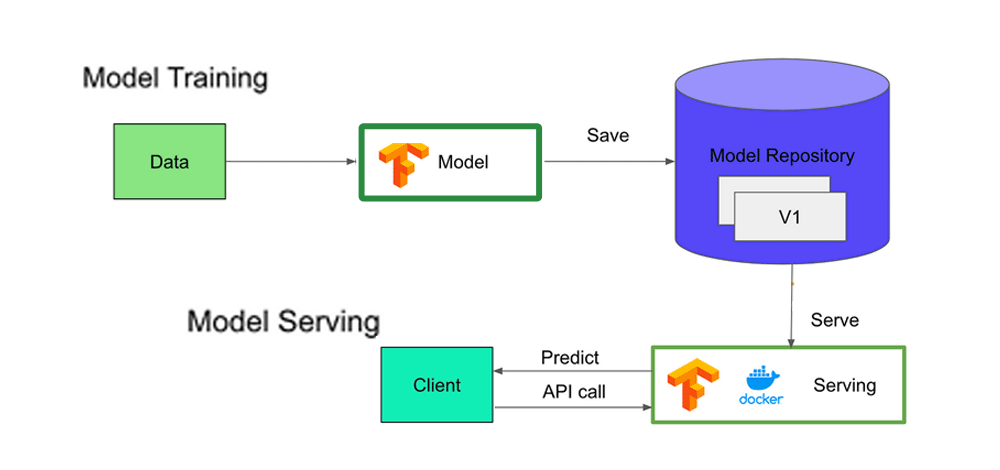

## Table of Contents

## What is TensorFlow Serving and why is it used in machine learning?

TensorFlow Serving is a flexible, high-performance system for serving machine learning models. It's designed to help developers easily deploy their trained models into production environments where they can be used to make predictions on new data. Think of it as a bridge between the model you've trained and the application that needs to use that model. It can handle different versions of models, so you can update your model without disrupting the service.

People use TensorFlow Serving in machine learning because it makes the process of deploying and managing models much simpler and more efficient. Once you've trained a model using TensorFlow, you can use TensorFlow Serving to load it and serve it over a network. This means your applications can send data to the server, get predictions back, and use them in real-time. It's especially useful for companies that need to update their models frequently, as it allows them to switch between different versions of a model smoothly without any downtime.

## How does TensorFlow Serving integrate with the TensorFlow ecosystem?

TensorFlow Serving is a part of the TensorFlow ecosystem, which means it works well with other tools and libraries in TensorFlow. It is designed to take models that you have trained using TensorFlow and make them available for use in real-world applications. When you train a model using TensorFlow, you save it in a specific format. TensorFlow Serving can then load this saved model and use it to make predictions. This integration makes it easy to move from training a model to using it in production without needing to change the model's format or rewrite your code.

The connection between TensorFlow and TensorFlow Serving is made smoother by tools like TensorFlow SavedModel. When you save your model using SavedModel, it includes everything TensorFlow Serving needs to load and serve the model. This includes the model's architecture, weights, and any necessary preprocessing steps. By using SavedModel, you can ensure that your model works seamlessly from training to serving. This integration helps developers focus more on improving their models and less on the technical details of deployment.

## What are the key components of TensorFlow Serving?

TensorFlow Serving has several important parts that work together to make it useful for serving [machine learning](/wiki/machine-learning) models. The main part is the core server, which is responsible for loading, managing, and serving the models. It can handle multiple versions of the same model, which means you can update your model without stopping the service. This is done through a system called model versioning, where each version of the model is given a unique number, making it easy to switch between them.

Another key component is the API, which allows your applications to talk to the server. There are different types of APIs, like the RESTful API and the gRPC API, which you can choose from based on what works best for your application. The APIs make it easy for your app to send data to the server and get predictions back quickly. Lastly, there are tools for managing the models, like the model server configuration, which helps you set up how the server should work with your models. All these parts together make TensorFlow Serving a powerful tool for deploying machine learning models in real-world applications.

## How do you set up and install TensorFlow Serving?

To set up and install TensorFlow Serving, you first need to make sure your computer has the right tools. You'll need to have Python and pip installed. Once you have these, you can install TensorFlow Serving using pip by running the command ```pip install [tensorflow](/wiki/tensorflow)-serving-api```. This will install the API part that your applications will use to talk to the server. Next, you'll need to download the TensorFlow Serving server itself. You can do this by visiting the TensorFlow Serving GitHub page and downloading the latest release that matches your operating system.

After downloading the server, you'll need to unpack it and set it up. On a Unix-like system, you can use a command like ```tar -xvf tensorflow_model_server.tar.gz``` to unpack the file. Once unpacked, you can start the server by running a command like ```./tensorflow_model_server --port=9000 --model_name=my_model --model_base_path=/path/to/my_model```. This command tells the server to start on port 9000, use a model named "my_model", and look for the model files in the specified path. With the server running, your applications can now send data to it and get predictions back using the API you installed earlier.

## What are the steps to deploy a machine learning model using TensorFlow Serving?

First, you need to get your machine learning model ready. After training your model using TensorFlow, you save it in a format called SavedModel. This format includes everything TensorFlow Serving needs, like the model's structure and its weights. You can save your model using a command like ```saved_model_cli save --dir /path/to/save --tag_set serve --signature_def serving_default --inputs input_tensor --outputs output_tensor```. Once saved, you place the model in a directory where TensorFlow Serving can find it. Make sure to organize your models into different versions by using folders with numbers, like 0001, 0002, etc., so you can update your model without stopping the service.

Next, you start TensorFlow Serving. You can do this by running a command like ```tensorflow_model_server --port=9000 --model_name=my_model --model_base_path=/path/to/my_model```. This command tells the server to start on port 9000 and serve a model named "my_model" from the specified path. Once the server is up and running, your applications can send data to it and get predictions back using the TensorFlow Serving API. You can use either the RESTful API or the gRPC API, depending on what works best for your application. With everything set up, your model is now deployed and ready to use in real-world scenarios.

## How can you manage multiple versions of models with TensorFlow Serving?

Managing multiple versions of models with TensorFlow Serving is easy. When you save your models, you put them in folders with numbers like 0001, 0002, etc. This way, TensorFlow Serving knows which version is which. When you start the server, you tell it where to find these folders. The server can then switch between different versions without stopping, so your application can keep running smoothly even when you update the model.

To switch between versions, you can use the server's API. For example, if you want to use version 0002 of your model, you can send a request to the server telling it to use that version. This is helpful if you want to test a new version of your model before using it for everyone. By managing versions this way, you can make sure your model stays up-to-date and works well for your users.

## What are the best practices for scaling TensorFlow Serving in a production environment?

When scaling TensorFlow Serving in a production environment, it's important to think about how to handle more requests without slowing down. One way to do this is by using load balancing. Load balancing means spreading the requests across multiple servers so no single server gets too busy. This way, your application can handle more users at the same time. You can also use auto-scaling, which means adding more servers when there are a lot of requests and removing them when things are quiet. This helps keep your service running smoothly without wasting resources.

Another good practice is to use caching. Caching means keeping the results of common requests so you don't have to do the same work over and over. This can make your service faster because it can give quick answers to requests it has seen before. Also, make sure to monitor your system. Monitoring means keeping an eye on how your servers are doing, like how busy they are and if they are working correctly. If you see problems, you can fix them before they affect your users. By following these practices, you can make sure your TensorFlow Serving setup works well even when it gets busy.

## How does TensorFlow Serving handle model updates and rollbacks?

TensorFlow Serving makes it easy to update and roll back your models. When you want to update your model, you save the new version in a folder with a higher number than the old version. For example, if your current model is in a folder named 0001, you would save the new version in a folder named 0002. Then, you tell TensorFlow Serving to use the new version by sending a request to the server. This way, you can update your model without stopping the service, so your application keeps running smoothly.

If you need to roll back to an older version of your model, you can do that just as easily. You simply tell TensorFlow Serving to use an earlier version by sending a request to switch back to a folder with a lower number, like 0001. This means you can quickly go back to a version that worked well if the new version has problems. By managing versions this way, TensorFlow Serving helps you keep your model up-to-date and reliable.

## What are the performance optimization techniques available in TensorFlow Serving?

TensorFlow Serving has several ways to make your models work faster and better. One way is by using batching. Batching means grouping several requests together and processing them all at once. This can make things faster because it reduces the time spent on starting and stopping the model for each request. Another way is to use caching. Caching means keeping the results of common requests so you don't have to do the same work over and over. This can make your service faster because it can give quick answers to requests it has seen before.

You can also use model parallelism to speed things up. Model parallelism means splitting your model across different parts of your computer or even different computers. This way, different parts of your model can work at the same time, making everything faster. Another technique is to use hardware acceleration, like GPUs or TPUs, which are designed to handle the heavy math work of machine learning models much faster than regular computer chips. By using these techniques, TensorFlow Serving can help your models run more efficiently and handle more requests without slowing down.

## How can you monitor and log the performance of models served by TensorFlow Serving?

Monitoring and logging the performance of models served by TensorFlow Serving is important to make sure your models are working well. You can use tools like Prometheus and Grafana to keep an eye on how your models are doing. These tools can show you things like how fast your models are answering requests, how many requests they are handling, and if they are making any mistakes. You set up these tools to collect data from TensorFlow Serving and then display it in easy-to-read graphs and charts. This way, you can see if your models are getting too slow or if they need to be updated.

Logging is also a big part of keeping track of your models. TensorFlow Serving can log information about what it's doing, like when it starts serving a new version of a model or if it runs into any problems. You can use tools like ELK Stack (Elasticsearch, Logstash, and Kibana) to gather these logs and look at them later. This helps you understand what's happening with your models over time and fix any issues that come up. By monitoring and logging, you can make sure your models are working as they should and keep your service running smoothly.

## What are the security considerations when deploying TensorFlow Serving?

When deploying TensorFlow Serving, it's important to think about security to keep your models and data safe. One big thing to do is to use strong authentication and authorization. This means making sure only the right people can access your server and models. You can do this by setting up secure ways for users to log in, like using passwords or even better, using keys that are hard to copy. Also, you should encrypt the data that goes between your application and the server. This means turning the data into a secret code so no one can read it if they try to steal it. By doing these things, you can help keep your TensorFlow Serving setup secure.

Another important security consideration is to keep your server and models up to date. Just like you update your phone to fix bugs and keep it safe, you should update TensorFlow Serving and your models to protect them from new security threats. Also, make sure to monitor your server for anything strange, like someone trying to break in. If you see something odd, you can stop it before it causes problems. By staying up to date and watching for trouble, you can keep your TensorFlow Serving deployment running safely and smoothly.

## How does TensorFlow Serving compare to other model serving frameworks like ONNX Runtime or TorchServe?

TensorFlow Serving is a popular choice for serving machine learning models, especially if you're already using TensorFlow for training. It's good at handling multiple versions of models, so you can update them without stopping the service. This makes it easy to keep your models fresh and working well. It also works well with other TensorFlow tools, so you don't need to change much when moving your model from training to serving. However, TensorFlow Serving is mainly for TensorFlow models, which might not be the best if you're using other frameworks like PyTorch.

ONNX Runtime is another option that stands out because it can serve models from many different frameworks, not just one. This means you can use ONNX Runtime if your team uses different tools like TensorFlow, PyTorch, or others. It's also known for being fast and good at using hardware like GPUs to make your models run quickly. But, setting up ONNX Runtime might take a bit more work if you're used to sticking with one framework.

TorchServe, on the other hand, is designed specifically for PyTorch models. If you're using PyTorch, TorchServe can make it easy to get your models into production. It's good at handling lots of requests and can scale up to handle more users. Like TensorFlow Serving, it supports model versioning, so you can update your models smoothly. But, if you're not using PyTorch, TorchServe might not be the best fit for you. Each of these frameworks has its strengths, so the best choice depends on what you're already using and what you need your model serving system to do.

## References & Further Reading

[1]: Olston, C., Fiedel, N., Gorbenko, A., Harmsen, J., Lao, L., Ramesh, S., & Soyke, J. (2017). ["TensorFlow-Serving: Flexible, High-Performance ML Serving."](https://arxiv.org/abs/1712.06139) USENIX Association.

[2]: ["TensorFlow Serving Documentation"](https://www.tensorflow.org/tfx/guide/serving) - Official TensorFlow Serving Guide

[3]: Kraska, T., Wang, Z., Franklin, M. J., Feng, J., & Rasiwasia, N. (2013). ["MLbase: A Distributed Machine-learning System."](https://www.cidrdb.org/cidr2013/Papers/CIDR13_Paper118.pdf) Proceedings of the 6th Biennial Conference on Innovative Data Systems Research.

[4]: Pattnaik, M., & Pattanayak, B. (2019). ["TensorFlow Machine Learning Projects: Implement real-world machine learning projects to unlock the power of data and build self-learning models using TensorFlow."](https://www.academia.edu/128847419/Comparative_review_of_business_group_affiliates_and_firms_performance) Packt Publishing.

[5]: Krasnopolsky, V. M., Fox-Rabinovitz, M. S., & Belochitski, A. A. (2010). ["Using ensemble of neural networks to learn stochastic convection parameterizations for climate and numerical weather prediction models from data simulated by a cloud resolving model."](https://onlinelibrary.wiley.com/doi/10.1155/2013/485913) Neural Networks.