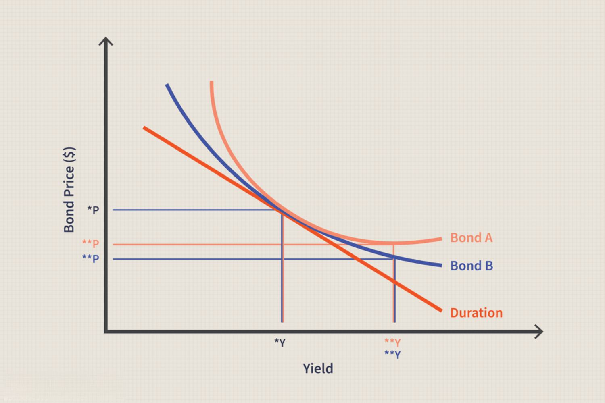

In the rapidly evolving financial landscape, understanding different financial instruments is crucial for optimizing your investment strategy. This article focuses on term bonds, bond types, and the impact of algorithmic trading on these financial securities. Term bonds, like other bonds, represent a loan made by an investor to a borrower, with the distinction of having a fixed maturity date at which the principal amount is repaid in one lump sum. Recognizing the specific role these bonds play within an investment portfolio is essential for achieving targeted financial outcomes.

Moreover, bonds are increasingly being influenced by modern technological advancements, particularly algorithmic trading. This form of trading employs complex algorithms to analyze data and execute trades at high speeds, significantly altering traditional bond trading dynamics. Understanding how these technological shifts interact with conventional securities like bonds not only helps in making informed investment decisions but also positions investors to better leverage opportunities in this constantly changing market. Our goal is to provide insights that enable informed investment decisions amidst this dynamic environment, equipping investors with the knowledge needed to navigate the complexities of both traditional and modern trading paradigms.



## Table of Contents

## What Are Financial Instruments?

Financial instruments are foundational components of the financial system, acting as contracts that hold and transfer financial value. These instruments play a pivotal role in the management and transfer of risk among investors, enhancing the flexibility and functionality of financial markets. They are primarily categorized into equity instruments and debt instruments, each serving different functions and exhibiting unique characteristics.

**Equity Instruments:** Equity instruments represent ownership interests in companies. Common examples include stocks, which grant shareholders a claim on a portion of the company’s assets and profits. Equity investors benefit from potential appreciation in stock value and dividends. However, equities come with higher risk, as returns are contingent on the company's performance.

**Debt Instruments:** Debt instruments are essential for capital raising, enabling both corporations and governments to fund operations and growth initiatives. Bonds are the most prevalent form of debt instruments. They are essentially loans made by investors to an issuer (such as a corporation or government), which obliges the issuer to pay back the principal along with interest over a specified period. There are various types of bonds, each with distinctive features, such as corporate bonds, government bonds, and municipal bonds. 

The efficacy of financial instruments as a risk management tool lies in their ability to balance potential risks and returns within investment portfolios. Investors use them to implement diversified strategies that align with their financial goals and risk tolerance. A well-constructed portfolio often includes a mix of equity and debt instruments to optimize returns while managing exposure to [volatility](/wiki/volatility-trading-strategies) and market downturns.

Understanding these financial instruments is crucial for investors who aim to optimize their investment strategies. Mastery of the nuances of different instruments enables investors to better assess the potential impacts on their portfolios, thus fostering informed decision-making and effective risk management.

## Exploring Term Bonds and Bond Types

Term bonds represent a category of debt securities that are defined by their fixed maturity date, at which point the principal is repaid to the bondholder in a lump sum. This characteristic distinguishes term bonds from serial bonds, where portions of the principal mature and are repaid at regular intervals over the life of the bond.

**Bond Types and Their Characteristics:**

1. **Corporate Bonds:**
   Corporate bonds are issued by companies in need of capital to finance business activities. They typically offer higher yields than government bonds due to increased risk, as repayment depends on the issuing corporation's financial health. Corporate bonds can be further classified into investment-grade bonds, which [carry](/wiki/carry-trading) lower risk, and high-yield (junk) bonds, which offer higher returns at higher risk.

2. **Government Bonds:**
   Issued by national governments, government bonds are generally considered low-risk investments, depending on the issuing country's creditworthiness. U.S. Treasury bonds, for instance, are widely regarded as some of the safest investments. Government bonds can be used to fund public projects and manage national debt.

3. **Municipal Bonds:**
   Municipal bonds are issued by state and local governments or agencies to fund public projects like infrastructure, schools, or utilities. They often provide tax advantages to investors, as many are exempt from federal income taxes, and in some cases, state and local taxes, leading to potentially higher effective yields compared to taxable bonds.

4. **Secured and Unsecured Bonds:**
   Secured bonds are backed by specific collateral, reducing risk for bondholders. Examples include mortgage bonds and collateral trust bonds. In contrast, unsecured bonds, known as debentures, are not backed by collateral and rely solely on the issuer's creditworthiness. This makes unsecured bonds riskier, often resulting in higher interest rates compared to secured bonds.

Each bond type presents a unique set of risks and benefits, influencing investors' strategies based on their risk tolerance and investment goals. Evaluating factors such as issuer creditworthiness, tax considerations, and interest rates is vital in making informed investment decisions.

## The Role of Algorithmic Trading in Bond Markets

Algorithmic trading employs complex computer algorithms to conduct trades at rapid speeds, aiming to optimize performance while minimizing costs. Its widespread adoption in equities and foreign exchange markets has paved the way for its integration into bond markets. This integration, although gradual, has been transformative, altering the dynamics of bond trading. 

Algorithmic trading in bond markets improves several key areas. First, it enhances market accessibility. By automating the trading process, it allows a broader range of investors to participate in bond markets, eliminating many of the traditional entry barriers. This automation means that transactions, which previously required manual intervention, can now be executed seamlessly through sophisticated algorithms. 

Moreover, algorithms significantly increase transparency within the bond trading landscape. They provide real-time data analytics and insights, enabling traders to make informed decisions based on current market conditions. This real-time access to information reduces asymmetries that often characterize traditional bond trading, where information dissemination can be inconsistent and delayed.

Another critical benefit is the improvement in pricing efficiency. Algorithms are capable of analyzing vast datasets to capture pricing anomalies and [arbitrage](/wiki/arbitrage) opportunities, leading to more competitive and accurate pricing of bonds. By swiftly processing and responding to market data, these algorithms tighten bid-ask spreads and align bond prices with market realities.

Python's versatility makes it an excellent choice for developing [algorithmic trading](/wiki/algorithmic-trading) programs due to its robust libraries and ease of handling financial data. For instance:

```python
import numpy as np
import pandas as pd
from sklearn.linear_model import LinearRegression

# Sample function to predict bond prices using historical data
def predict_bond_prices(historical_data):
    model = LinearRegression()

    # Assume historical_data is a DataFrame with 'features' and 'prices'
    features = historical_data['features']
    prices = historical_data['prices']

    # Train the model
    model.fit(features, prices)

    # Predict future prices
    predicted_prices = model.predict(features)
    return predicted_prices

# Fake historical data for illustration
historical_data = pd.DataFrame({
    'features': np.random.rand(100, 5),  # Replace with actual features
    'prices': np.random.rand(100)  # Replace with actual prices
})

predicted_prices = predict_bond_prices(historical_data)
print(predicted_prices)
```

This example utilizes linear regression to forecast bond prices based on historical features and prices, demonstrating how algorithmic trading tools optimize financial outcomes by leveraging data-driven models.

In summary, the integration of algorithmic trading into bond markets is boosting accessibility, transparency, and pricing efficiency. Through sophisticated computational algorithms, the bond market is becoming more dynamic and competitive, aligning closely with the efficiencies seen in other highly algorithmic trading environments.

## Challenges in Automating Fixed Income Trading

Fixed income trading automation encounters significant challenges arising primarily from the fragmented nature of bond data and the diverse trading environments. Bonds, unlike stocks, trade over-the-counter (OTC) rather than on centralized exchanges, leading to a lack of uniformity in data access and quality. This fragmentation results in data inconsistency which complicates the application of algorithmic strategies.

The absence of centralized platforms in bond trading further exacerbates these challenges. Inconsistent data across various trading platforms makes it difficult for algorithmic systems to accurately assess market conditions, leading to suboptimal trading decisions. The disparity in data standards among trading platforms calls for significant resources to normalize data before it can be effectively utilized in algorithmic frameworks.

Addressing these challenges necessitates innovative solutions, particularly in improving data availability and standardization. Establishing industry-wide data standards could harmonize the way bond data is processed, making it easier for trading algorithms to execute trades efficiently. Initiatives to create more centralized data hubs might also reduce the current fragmentation.

Moreover, leveraging technological advancements like [artificial intelligence](/wiki/ai-artificial-intelligence) and [machine learning](/wiki/machine-learning) can aid in synthesizing disparate data sources. By deploying sophisticated algorithms that learn and adapt to market anomalies, firms can potentially enhance the accuracy of their trading models. These efforts must focus on improving the transparency and reliability of data, which are crucial for the seamless functioning of automated bond trading systems.

Overall, overcoming these hurdles is essential for the full integration of algorithmic trading in bond markets. Improvements in data quality and standardization will not only facilitate better decision-making but also enhance the overall efficiency and transparency of fixed income trading.

## Technological Innovations and their Impact

Technological advancements, particularly in cloud computing and artificial intelligence (AI), play a pivotal role in enhancing the efficiency of bond trading. Cloud computing provides scalable and flexible infrastructure, allowing firms to handle vast amounts of data with reduced costs compared to traditional on-premises systems. This adaptability is particularly valuable in bond markets where real-time data processing is crucial for effective decision-making.

AI and machine learning algorithms enable firms to analyze complex datasets rapidly, identifying trends and patterns that may not be apparent through conventional analysis. These technologies support predictive analytics, which assist traders in anticipating market movements and making informed trading decisions. For instance, machine learning models can be utilized to predict bond price changes based on historical data and economic indicators.

The integration of these technologies democratizes access to sophisticated trading tools. Smaller firms, which previously faced barriers due to the high cost of advanced trading infrastructure, can now leverage cloud-based platforms and AI solutions to compete with larger institutions. This democratization fosters a more dynamic market environment, as a broader range of participants contributes to market [liquidity](/wiki/liquidity-risk-premium) and innovation.

Python, due to its rich libraries and simplicity, is frequently employed in developing AI applications for bond trading. A sample code for implementing a basic predictive model using Python's scikit-learn library might look like this:

```python
from sklearn.model_selection import train_test_split
from sklearn.ensemble import RandomForestRegressor
from sklearn.metrics import mean_squared_error
import pandas as pd

# Load dataset (example)
data = pd.read_csv('bond_market_data.csv')  
features = data.drop('BondPrice', axis=1)  
target = data['BondPrice']

# Split data into training and testing sets
X_train, X_test, y_train, y_test = train_test_split(features, target, test_size=0.2, random_state=42)

# Instantiate and train model
model = RandomForestRegressor(n_estimators=100, random_state=42)
model.fit(X_train, y_train)

# Predict and evaluate
predictions = model.predict(X_test)
mse = mean_squared_error(y_test, predictions)
print(f'Mean Squared Error: {mse}')
```

This code provides a foundation for developing models that forecast bond prices, thereby assisting traders in executing more efficient and profitable trades. As technology continues to evolve, the capacity to harness such innovations will likely become an essential [factor](/wiki/factor-investing) in the success of firms operating within bond markets.

## Future of Fixed Income Markets

As technology continues to integrate into fixed-income markets, it ushers in transformative possibilities for how these markets function. Improving technological infrastructure is crucial for firms seeking to remain competitive. Investment in modern infrastructure, such as high-performance computing, is imperative. These technologies process vast datasets efficiently, enabling real-time analysis and decision-making in trading environments where milliseconds can define successful trades.

Furthermore, firms must invest in acquiring and training talent capable of navigating and maximizing these technological advances. The shift towards data-driven strategies demands a workforce proficient in technical skills such as programming, data analytics, and machine learning. This ensures that firms can fully harness the power of technology to optimize trading strategies and improve risk management practices.

Regulatory frameworks will significantly influence the future trajectory of fixed-income markets. As technology introduces new methodologies for trading and data management, regulators must adapt to ensure these innovations do not compromise market integrity. Effective regulation is essential to address potential risks such as market manipulation or systemic instability. Regulations should focus on establishing transparency and accountability, particularly in algorithmic trading, where automated decisions can have far-reaching consequences.

Additionally, consistent regulatory guidelines across jurisdictions can facilitate smoother cross-border trading, benefiting global market integration. However, regulatory bodies must strike a delicate balance; while safeguarding market stability, they should not stifle innovation. Encouraging dialogues between technology firms, trading companies, and regulators can promote mutually beneficial outcomes that support both technological progress and robust regulatory environments.

In conclusion, the future of fixed-income markets hinges on a symbiotic relationship between technological innovation and regulatory oversight. Firms that skillfully navigate this landscape will likely realize enhanced operational efficiencies and competitive advantages. However, they must do so with a keen awareness of evolving regulations designed to maintain market fairness and stability.

## Conclusion

Algorithmic trading is significantly transforming the bond markets by optimizing trading processes and enhancing market efficiency. This approach leverages advanced technologies and data analysis to execute trades at high speeds, reducing transaction costs and increasing precision in trading strategies. The integration of algorithmic trading into the bond market, although more complex and gradual compared to equities, brings substantial benefits by improving liquidity, price discovery, and market access.

Investors and firms involved in bond trading must remain informed and adaptable to capitalize on these technological advancements. Understanding and developing expertise in algorithmic trading tools and techniques is crucial, as these innovations continue to influence market dynamics. Being adaptable also implies being prepared to navigate the challenges of integrating new technologies, including the need for improved data handling and the mitigation of potential risks associated with increased automation.

Successfully balancing innovation with risk management is essential for sustainable progress in bond trading. This requires a vigilant approach to the governance and oversight of algorithmic trading systems to ensure they enhance market integrity and do not inadvertently introduce systemic risks. By responsibly leveraging these technological advancements, firms and investors can optimize their engagement with the bond market, potentially achieving improved outcomes in their investment strategies.

## References & Further Reading

For more information and detailed studies on financial instruments, bond types, and algorithmic trading, refer to the following resources:

- Lopez de Prado, M., *Advances in Financial Machine Learning*: This book provides a comprehensive exploration of the applications of machine learning techniques in financial markets, focusing on advanced methods to analyze market data and assist in decision-making for trading strategies.

- Aronson, D. R., *Evidence-Based Technical Analysis*: Aronson's work emphasizes a systematic, quantitative approach to technical analysis. It challenges traditional assumptions and provides methodologies rooted in statistically rigorous testing to evaluate technical indicators and trading signals.

- Jansen, S., *Machine Learning for Algorithmic Trading*: Jansen introduces machine learning concepts tailored to developing, testing, and executing algorithmic trading strategies. It combines data science with trading expertise, highlighting practical implementations that enhance algorithmic trading tools.

- Chan, E. P., *Quantitative Trading: How to Build Your Own Algorithmic Trading Business*: This book is a practical guide for developing quantitative trading strategies. It covers everything from idea generation to risk management and execution, providing insights into creating a successful trading business.

These resources offer valuable insights and methodologies for investors and traders interested in leveraging technology to optimize trading strategies in the context of financial instruments.