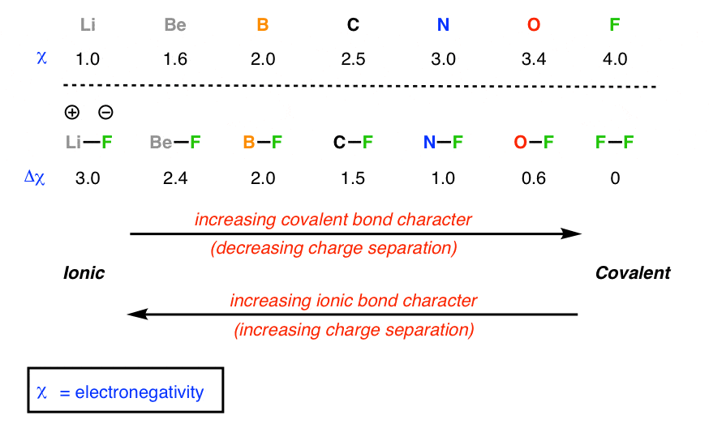

## Table of Contents

## What are term bonds?

Term bonds are a type of bond that has a single maturity date. This means that all the bonds in the issue must be paid back on the same day. They are different from serial bonds, which have multiple maturity dates. Investors like term bonds because they know exactly when they will get their money back. This can be helpful for planning finances.

Governments and companies issue term bonds to raise money. They promise to pay back the money on the maturity date and usually pay interest along the way. The interest payments can be made yearly or every six months. If the issuer cannot pay back the money on time, it can cause problems for them and the investors. That's why it's important to check the credit rating of the issuer before buying term bonds.

## How do term bonds differ from serial bonds?

Term bonds and serial bonds are two types of bonds that companies or governments can issue to borrow money. The main difference between them is when they need to pay back the money they borrowed. Term bonds have just one big due date, called the maturity date. This means that everyone who bought the bond gets their money back all at once on that date. On the other hand, serial bonds have many smaller due dates spread out over time. So, the issuer pays back parts of the money at different times.

This difference can affect how people choose to invest. If you need your money back at a certain time, term bonds might be better because you know exactly when you'll get it. But if you want to get some money back sooner, serial bonds could be a better choice because they give you payments over time. Both types of bonds usually pay interest, but the way the principal (the money borrowed) is paid back is what makes them different.

## What are the key features of term bonds?

Term bonds are a type of bond that has one big due date, called the maturity date. This means that everyone who bought the bond gets their money back all at once on that date. This can be good for people who want to know exactly when they will get their money back. It helps them plan their finances better. Governments and companies use term bonds to borrow money. They promise to pay back the money on the maturity date and usually pay interest along the way. The interest can be paid yearly or every six months.

If the issuer of the term bond can't pay back the money on time, it can cause problems for them and the investors. That's why it's important to check the credit rating of the issuer before buying term bonds. A good credit rating means the issuer is more likely to pay back the money on time. Term bonds are different from serial bonds, which have many smaller due dates spread out over time. So, if you need your money back at a certain time, term bonds might be a better choice for you.

## How are term bonds structured?

Term bonds are a type of bond that has one big due date, called the maturity date. This means that everyone who bought the bond gets their money back all at once on that date. This can be good for people who want to know exactly when they will get their money back. It helps them plan their finances better. Governments and companies use term bonds to borrow money. They promise to pay back the money on the maturity date and usually pay interest along the way. The interest can be paid yearly or every six months.

If the issuer of the term bond can't pay back the money on time, it can cause problems for them and the investors. That's why it's important to check the credit rating of the issuer before buying term bonds. A good credit rating means the issuer is more likely to pay back the money on time. Term bonds are different from serial bonds, which have many smaller due dates spread out over time. So, if you need your money back at a certain time, term bonds might be a better choice for you.

## What are the advantages of investing in term bonds?

Investing in term bonds can be a good choice for people who like to know exactly when they will get their money back. Term bonds have one big due date, called the maturity date. This means that everyone who bought the bond gets their money back all at once on that date. This can help people plan their finances better because they know when they will get their money. It's like setting a reminder for a big payment that you can count on.

Another advantage of term bonds is that they usually pay interest along the way. This interest can be paid yearly or every six months, which gives investors a steady income. This can be helpful for people who need regular money coming in, like retirees. Also, if the issuer of the bond has a good credit rating, it means they are more likely to pay back the money on time. This makes term bonds a safer choice for people who want to avoid big risks with their money.

## What are the risks associated with term bonds?

Term bonds can be risky if the issuer can't pay back the money on the maturity date. This is called default risk. If the issuer has a low credit rating, it means they might have trouble paying back the money. This can be a big problem for investors because they might not get their money back when they need it. It's important to check the credit rating of the issuer before buying term bonds to see how likely they are to pay back the money on time.

Another risk with term bonds is [interest rate](/wiki/interest-rate-trading-strategies) risk. If interest rates go up after you buy a term bond, the value of your bond might go down. This is because new bonds will be issued with higher interest rates, making your bond less attractive to other investors. If you need to sell your bond before the maturity date, you might have to sell it for less than you paid for it. This can be a problem if you need your money back sooner than expected.

Lastly, there's reinvestment risk. When your term bond matures, you might have to reinvest the money at a lower interest rate if rates have gone down. This means you might not be able to earn as much money on your investment as you did before. This can affect your overall returns and your financial plans.

## How do term bonds work in the context of municipal bonds?

Municipal term bonds are a type of bond issued by cities, towns, or states to raise money for public projects like building schools or fixing roads. These bonds have one big due date, called the maturity date, when all the money borrowed needs to be paid back. Investors who buy these bonds know exactly when they will get their money back, which can help them plan their finances. The issuer usually pays interest to the investors every year or every six months, which can be a steady source of income.

The risks with municipal term bonds are similar to other term bonds. If the city or state can't pay back the money on time, it's called default risk. This can be a problem for investors because they might not get their money back when they need it. It's important to check the credit rating of the city or state before buying these bonds to see how likely they are to pay back the money on time. Also, if interest rates go up after you buy a municipal term bond, the value of your bond might go down. This is called interest rate risk. If you need to sell your bond before the maturity date, you might have to sell it for less than you paid for it.

## What is the process of issuing term bonds?

Issuing term bonds starts when a government or company decides they need to borrow money for a project or to pay for something. They work with a bank or a financial advisor to figure out how much money they need and how long they want to borrow it for. They then create a bond document that explains all the details, like how much money they are borrowing, the interest rate they will pay, and the date when they will pay back all the money, which is called the maturity date. This document is called a bond prospectus, and it's shared with investors so they can decide if they want to buy the bonds.

Once the bond prospectus is ready, the issuer usually hires an underwriter, which is a company that helps sell the bonds to investors. The underwriter might buy all the bonds from the issuer and then sell them to investors, or they might help the issuer sell the bonds directly to investors. The underwriter also helps set the price of the bonds based on how much interest investors want and how much risk they think there is. After the bonds are sold, the issuer gets the money they need, and they start paying interest to the investors until the maturity date, when they pay back all the money they borrowed.

## How are term bonds priced and what factors influence their pricing?

Term bonds are priced based on how much interest they pay and how risky they are. When a company or government wants to issue term bonds, they work with a bank or financial advisor to figure out the interest rate. This rate is influenced by the current interest rates in the market and how much investors want to earn. If the bond is seen as risky, the issuer might have to offer a higher interest rate to attract investors. The price of the bond is then set so that the total interest paid over time matches what investors expect to earn.

Several factors can influence the pricing of term bonds. One big [factor](/wiki/factor-investing) is the credit rating of the issuer. If the issuer has a good credit rating, it means they are more likely to pay back the money on time, so they can offer a lower interest rate. Another factor is the overall economy. If the economy is doing well, interest rates might be higher, which can affect the price of new bonds. Also, if interest rates in the market change after the bond is issued, the value of the bond can go up or down. This is because investors might want to buy or sell the bond based on what they can earn from other investments.

## What are sinking fund provisions in term bonds and how do they work?

Sinking fund provisions are a way for the issuer of term bonds to make sure they can pay back the money they borrowed when the bond matures. It's like setting aside a little bit of money each year into a special savings account, called a sinking fund. This way, when the big due date comes, the issuer has enough money to pay back all the investors at once. This can make investors feel safer because they know the issuer is planning ahead to make sure they can pay back the money.

The way sinking funds work is that the issuer puts money into the fund regularly, usually every year. Sometimes, they might use this money to buy back some of the bonds before they mature. This can help reduce the total amount of money they need to pay back at the end. If the issuer can't put money into the fund or can't buy back the bonds, it might mean they are having financial problems. This can be a warning sign for investors to be careful.

## How do callable term bonds function and what are their implications for investors?

Callable term bonds are a type of bond that the issuer can pay back before the maturity date. This means the issuer can decide to give the money back to investors early if they want to. They usually do this if interest rates go down because they can borrow money again at a lower rate. When a bond is called, investors get their money back, but they might not get to keep [earning](/wiki/earning-announcement) the interest they were expecting. This can be a problem if they were counting on that money.

For investors, callable term bonds can be risky because they might not know when they will get their money back. If the bond is called early, they have to find a new place to invest their money, which might not pay as much interest. On the other hand, callable bonds often offer a higher interest rate to start with because of this risk. So, if the bond isn't called early, investors can earn more money. It's important for investors to think about these risks and rewards before buying callable term bonds.

## What are some advanced strategies for managing a portfolio that includes term bonds?

One advanced strategy for managing a portfolio with term bonds is to use a laddering approach. This means buying term bonds that mature at different times. For example, you might buy some bonds that mature in one year, some in three years, and some in five years. This way, you get your money back at different times, which can help you plan your finances better. It also reduces the risk of having to reinvest all your money at once if interest rates are low. By spreading out the maturity dates, you can take advantage of different interest rates over time and keep a steady flow of income coming in.

Another strategy is to pay attention to the credit ratings of the issuers of the term bonds. If you think the economy might get worse, you might want to buy bonds from issuers with very good credit ratings. These bonds are less likely to default, which means the issuer is more likely to pay back the money on time. On the other hand, if you think the economy will do well, you might be willing to take more risk and buy bonds from issuers with lower credit ratings. These bonds usually offer higher interest rates, but they are riskier. By balancing the credit quality of the bonds in your portfolio, you can manage the risk and potential reward of your investments.

## References & Further Reading

For more information and detailed studies on financial instruments, bond types, and [algorithmic trading](/wiki/algorithmic-trading), refer to the following resources:

- Lopez de Prado, M., *Advances in Financial Machine Learning*: This book provides a comprehensive exploration of the applications of machine learning techniques in financial markets, focusing on advanced methods to analyze market data and assist in decision-making for trading strategies.

- Aronson, D. R., *Evidence-Based Technical Analysis*: Aronson's work emphasizes a systematic, quantitative approach to technical analysis. It challenges traditional assumptions and provides methodologies rooted in statistically rigorous testing to evaluate technical indicators and trading signals.

- Jansen, S., *Machine Learning for Algorithmic Trading*: Jansen introduces machine learning concepts tailored to developing, testing, and executing algorithmic trading strategies. It combines data science with trading expertise, highlighting practical implementations that enhance algorithmic trading tools.

- Chan, E. P., *Quantitative Trading: How to Build Your Own Algorithmic Trading Business*: This book is a practical guide for developing quantitative trading strategies. It covers everything from idea generation to risk management and execution, providing insights into creating a successful trading business.

These resources offer valuable insights and methodologies for investors and traders interested in leveraging technology to optimize trading strategies in the context of financial instruments.

