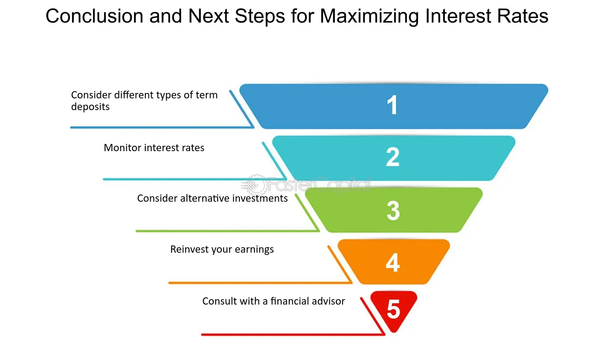

## Table of Contents

## What is a term deposit and how does it work?

A term deposit is a type of savings account where you put your money in a bank for a certain period of time, like a few months or years. You cannot take the money out during this time. In return, the bank gives you a higher interest rate than a regular savings account. This means you earn more money on your savings.

When you open a term deposit, you choose how long you want to keep your money in the bank. This could be 6 months, 1 year, or even longer. Once you decide on the time, you cannot change it or take your money out until the time is up. At the end of the term, you get your original money back plus the interest the bank has added. This can be a good way to save money if you don't need to use it right away.

## What are the benefits of investing in a term deposit?

One of the main benefits of investing in a term deposit is that it offers a fixed interest rate. This means you know exactly how much money you will earn at the end of the term. This can be helpful if you want to plan your finances and know how much money you will have in the future. It also means that even if the interest rates in the market go down, your rate will stay the same.

Another benefit is that term deposits are very safe. Banks are usually insured, so even if something bad happens to the bank, your money is protected. This makes term deposits a low-risk way to save money. If you don't want to take big risks with your money, a term deposit can be a good choice.

Lastly, term deposits can help you save money without being tempted to spend it. Since you can't take your money out until the term is over, it encourages you to leave your savings alone. This can be a good way to build up your savings over time, especially if you have a goal like buying a house or going on a big trip.

## How do interest rates on term deposits compare to other savings options?

Interest rates on term deposits are usually higher than those on regular savings accounts. This is because you agree to keep your money in the bank for a set time, and the bank rewards you with a higher rate. For example, if a regular savings account might give you 0.5% interest per year, a term deposit might offer 2% or more, depending on the length of the term and the bank.

Compared to other savings options like money market accounts or certificates of deposit (CDs), term deposits often have similar interest rates. Money market accounts might offer slightly lower rates but allow you to access your money more easily. CDs are very similar to term deposits and might offer the same or slightly different rates, depending on the financial institution and the terms of the deposit. Overall, term deposits provide a good balance of higher interest rates and safety, making them a popular choice for people looking to save money without taking on much risk.

## What are the typical term lengths available for term deposits?

Term deposits come in different lengths, usually from a few months to several years. Common term lengths include 3 months, 6 months, 1 year, 2 years, and 5 years. Some banks might offer even shorter or longer terms, like 1 month or 10 years, but these are less common.

The length of the term you choose can affect the [interest rate](/wiki/interest-rate-trading-strategies) you get. Generally, longer terms offer higher interest rates because you are agreeing to leave your money in the bank for a longer time. So, if you can afford to keep your money locked away for a few years, you might earn more interest than if you choose a shorter term.

## How is the interest on a term deposit calculated and paid out?

The interest on a term deposit is calculated using the principal amount, the interest rate, and the term length. The principal is the amount of money you put into the term deposit. The interest rate is the percentage the bank gives you for keeping your money with them. The term length is how long you agree to leave your money in the bank. For example, if you put $1,000 in a term deposit with a 2% annual interest rate for 1 year, you would earn $20 in interest by the end of the term.

The interest can be paid out in different ways depending on the bank and the terms of the deposit. Some banks will add the interest to your account at the end of the term, so you get your original money back plus the interest all at once. Other banks might pay the interest out more often, like every month or every quarter. This means you could get a little bit of money added to your account regularly, but you would still have to wait until the end of the term to take out your original money.

## What are the minimum and maximum investment amounts for term deposits?

The minimum amount you need to put into a term deposit can be different depending on the bank. Some banks might let you start with as little as $100, while others might need at least $1,000 or more. It's a good idea to check with the bank to see what their minimum is before you decide to open a term deposit.

The maximum amount you can put into a term deposit can also vary. Some banks might not have a limit at all, so you can put in as much money as you want. Other banks might have a maximum amount, like $250,000, because of rules about how much money they can insure. If you have a lot of money to save, it's important to ask the bank about their maximum amount and any rules they have.

## Can you withdraw money from a term deposit before it matures, and what are the penalties?

Yes, you can usually take money out of a term deposit before it matures, but there might be penalties. Banks call this an early withdrawal, and it means you are breaking your agreement to keep the money in the bank for the full term. Because of this, the bank might charge you a fee or give you a lower interest rate on the money you take out early.

The penalties can be different depending on the bank and the terms of your deposit. Some banks might take away some or all of the interest you have earned so far. Others might charge you a fee, like a percentage of the amount you are taking out. It's important to read the terms and conditions of your term deposit carefully so you know what the penalties are before you decide to take your money out early.

## How do economic conditions affect term deposit rates?

Economic conditions can change the interest rates on term deposits. When the economy is doing well, and people are spending a lot of money, the central bank might raise interest rates to slow things down a bit. This means banks will offer higher rates on term deposits to attract more money from people who want to save. On the other hand, if the economy is not doing well, and people are not spending much, the central bank might lower interest rates to encourage spending. This can lead to lower rates on term deposits because banks don't need to attract as much money.

Inflation also plays a big role in term deposit rates. When prices are going up a lot, banks might offer higher interest rates to make sure people's savings keep up with inflation. If inflation is low, the rates might not be as high because there's less need to protect the value of the money. So, the rates on term deposits can go up and down based on what's happening in the economy and with inflation.

## What strategies can be used to maximize returns from term deposits?

To get the most out of your term deposits, you can use a strategy called laddering. This means you split your money into different term deposits with different lengths. For example, instead of putting all your money into one 5-year term deposit, you could put some into a 1-year term, some into a 2-year term, and some into a 5-year term. When each term ends, you can take the money out or put it into a new term deposit. This way, you can take advantage of higher interest rates if they go up, and you always have some money becoming available if you need it.

Another strategy is to shop around for the best rates. Different banks offer different interest rates on term deposits, so it's a good idea to compare them before you decide where to put your money. You can use online tools or talk to a financial advisor to find the best rates. Also, keep an eye on economic conditions. If you think interest rates might go up soon, you might want to choose shorter terms so you can reinvest your money at a higher rate later. If you think rates will go down, longer terms might be better because you can lock in the current higher rate for a longer time.

## How can term deposits be used as part of a diversified investment portfolio?

Term deposits can be a good part of a diversified investment portfolio because they are safe and give you a fixed interest rate. When you have a mix of different types of investments, like stocks, bonds, and real estate, adding term deposits can help balance out the risk. If the stock market goes down, your term deposits will still be safe and [earning](/wiki/earning-announcement) interest. This can give you peace of mind and help protect your money.

You can use term deposits to save for specific goals, like buying a house or paying for a big trip. While you might have other investments that could grow faster, term deposits give you a steady return without the risk. By putting some of your money into term deposits, you can make sure you have a solid base in your portfolio that won't lose value, even if other parts of your investments go up and down.

## What are the tax implications of earning interest from term deposits?

When you earn interest from a term deposit, you have to pay taxes on that interest. The interest you earn is considered taxable income, just like money you earn from a job. The amount of tax you pay depends on your total income and the tax laws in your country. In many places, banks will report the interest you earn to the tax authorities, so you need to include it when you file your taxes.

You can usually find out how much interest you earned from your bank statements or the tax forms the bank sends you. It's important to keep track of this because if you don't report all your interest income, you might have to pay extra taxes and penalties later. If you're not sure how to handle the taxes on your term deposit interest, it's a good idea to talk to a tax professional who can help you understand the rules and make sure you're doing everything right.

## How do term deposit rates and conditions vary internationally?

Term deposit rates and conditions can be very different from one country to another. In some countries, like Australia and New Zealand, term deposit rates might be higher because their central banks set higher interest rates. In other places, like Japan and some European countries, rates might be very low or even negative because their central banks want to encourage people to spend money instead of saving it. The length of the term can also vary; some countries might offer terms as short as one month, while others might go up to ten years or more.

The rules for taking money out early can also be different around the world. In some countries, you might be able to take your money out early without a big penalty, while in others, the penalties could be very high. For example, in the United States, you might lose some or all of the interest you've earned if you take your money out early from a certificate of deposit, which is similar to a term deposit. It's important to check the rules in your country and with your bank to understand what you're agreeing to when you put your money into a term deposit.

## References & Further Reading

[1]: Bergstra, J., Bardenet, R., Bengio, Y., & Kégl, B. (2011). ["Algorithms for Hyper-Parameter Optimization."](https://papers.nips.cc/paper/4443-algorithms-for-hyper-parameter-optimization) Advances in Neural Information Processing Systems 24.

[2]: ["Advances in Financial Machine Learning"](https://www.amazon.com/Advances-Financial-Machine-Learning-Marcos/dp/1119482089) by Marcos Lopez de Prado

[3]: ["Evidence-Based Technical Analysis: Applying the Scientific Method and Statistical Inference to Trading Signals"](https://www.amazon.com/Evidence-Based-Technical-Analysis-Scientific-Statistical/dp/0470008741) by David Aronson

[4]: ["Machine Learning for Algorithmic Trading"](https://github.com/stefan-jansen/machine-learning-for-trading) by Stefan Jansen

[5]: ["Quantitative Trading: How to Build Your Own Algorithmic Trading Business"](https://www.amazon.com/Quantitative-Trading-Build-Algorithmic-Business/dp/1119800064) by Ernest P. Chan