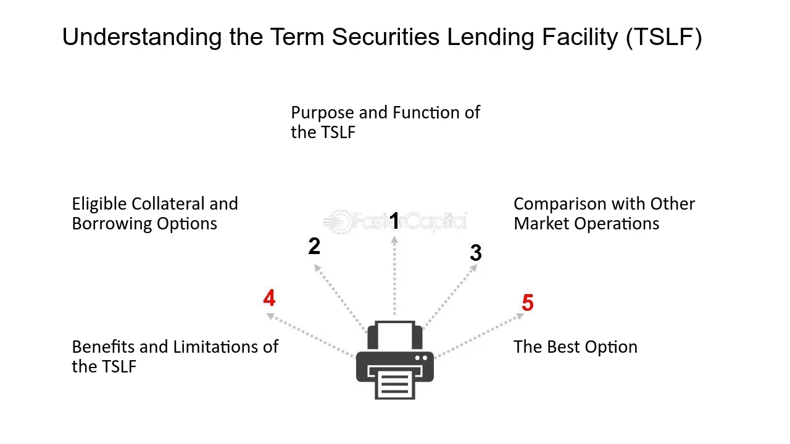

## Table of Contents

## What is the Term Securities Lending Facility (TSLF)?

The Term Securities Lending Facility (TSLF) was a program started by the Federal Reserve during the 2008 financial crisis. It was designed to help banks and other financial institutions that were having trouble getting cash. The TSLF worked by letting these institutions borrow safe, easy-to-sell securities from the Federal Reserve. In return, they had to give the Federal Reserve other securities that were harder to sell as collateral.

The main goal of the TSLF was to make sure that financial institutions had enough cash to keep operating smoothly. By lending out safe securities, the Federal Reserve helped these institutions get the money they needed. This was important because during the financial crisis, many banks were struggling and needed help to stay afloat. The TSLF was one of several programs the Federal Reserve used to try to stabilize the financial system during this difficult time.

## When was the TSLF established and by whom?

The Term Securities Lending Facility (TSLF) was established by the Federal Reserve in March 2008. The Federal Reserve is the central bank of the United States, and it created the TSLF to help banks and other financial institutions during the 2008 financial crisis.

The TSLF was one of the ways the Federal Reserve tried to help the financial system. It let banks borrow safe securities from the Federal Reserve and give back other securities as collateral. This helped banks get the cash they needed to keep operating during a tough time.

## What was the primary purpose of the TSLF?

The main goal of the Term Securities Lending Facility (TSLF) was to help banks and other financial institutions during the 2008 financial crisis. The TSLF let these institutions borrow safe, easy-to-sell securities from the Federal Reserve. In return, they had to give the Federal Reserve other securities that were harder to sell as collateral. This helped the banks get the cash they needed to keep running smoothly.

During the financial crisis, many banks were struggling and needed help to stay afloat. The TSLF was one of the ways the Federal Reserve tried to stabilize the financial system. By lending out safe securities, the Federal Reserve made sure that financial institutions had enough cash to keep operating. This was important because it helped prevent more problems in the financial system during a very difficult time.

## How did the TSLF operate during the financial crisis?

During the 2008 financial crisis, the Term Securities Lending Facility (TSLF) helped banks and other financial institutions by letting them borrow safe securities from the Federal Reserve. In return, these institutions had to give the Federal Reserve other securities that were harder to sell as collateral. This helped the banks get the cash they needed because they could sell the safe securities they borrowed.

The TSLF was important because it helped keep the financial system stable during a tough time. Many banks were struggling and needed help to stay afloat. By lending out safe securities, the Federal Reserve made sure that these institutions had enough cash to keep operating. This was a key part of the Federal Reserve's efforts to prevent more problems in the financial system during the crisis.

## What types of securities were eligible for lending under the TSLF?

The Term Securities Lending Facility (TSLF) let banks borrow safe securities from the Federal Reserve. These safe securities were mainly U.S. Treasury securities. U.S. Treasury securities are considered very safe because they are backed by the U.S. government. Banks could borrow these securities for 28 days and then had to give them back.

In return for borrowing the safe securities, banks had to give the Federal Reserve other securities as collateral. These other securities were usually less safe and harder to sell. They included things like mortgage-backed securities and other types of bonds. By letting banks borrow safe securities and giving less safe securities as collateral, the TSLF helped banks get the cash they needed during the 2008 financial crisis.

## Who were the eligible borrowers under the TSLF?

The Term Securities Lending Facility (TSLF) was set up to help banks and other financial institutions during the 2008 financial crisis. The main borrowers under the TSLF were primary dealers. Primary dealers are big financial firms that work directly with the Federal Reserve to buy and sell government securities. These firms were the ones who could borrow safe securities from the Federal Reserve.

The TSLF let these primary dealers borrow U.S. Treasury securities, which are very safe because they are backed by the U.S. government. In return, the primary dealers had to give the Federal Reserve other securities as collateral. These other securities were usually less safe and harder to sell, like mortgage-backed securities. By letting primary dealers borrow safe securities, the TSLF helped them get the cash they needed to keep operating during the crisis.

## How did the TSLF help stabilize the financial markets?

The Term Securities Lending Facility (TSLF) helped keep the financial markets stable during the 2008 financial crisis by giving banks and other big financial firms a way to get cash. These firms, called primary dealers, could borrow safe securities like U.S. Treasury securities from the Federal Reserve. They would then use these safe securities to get cash, which they needed to keep running their businesses. By letting these firms borrow safe securities and giving less safe securities as collateral, the TSLF made sure they had enough money to keep going during a tough time.

This was important because many banks were struggling during the crisis and needed help to stay afloat. The TSLF helped prevent more problems in the financial system by making sure these big firms had enough cash. When banks have enough money, they can keep lending to businesses and people, which helps the whole economy. So, by helping these firms, the TSLF played a big part in keeping the financial markets stable and preventing a bigger crisis.

## What were the terms and conditions of the loans provided by the TSLF?

The Term Securities Lending Facility (TSLF) let big financial firms borrow safe securities from the Federal Reserve for 28 days. These safe securities were mainly U.S. Treasury securities, which are backed by the U.S. government. The firms had to give the Federal Reserve other securities as collateral, like mortgage-backed securities, which were harder to sell. This helped the firms get cash because they could sell the safe securities they borrowed.

The TSLF was set up to help these firms during the 2008 financial crisis. The firms that could borrow were called primary dealers, and they worked directly with the Federal Reserve. By borrowing safe securities and giving less safe ones as collateral, the firms could keep running their businesses and lending money to others. This helped keep the financial system stable during a tough time.

## How was the TSLF different from other Federal Reserve facilities?

The Term Securities Lending Facility (TSLF) was different from other Federal Reserve facilities because it focused on helping big financial firms, called primary dealers, get cash by borrowing safe securities. These safe securities were mainly U.S. Treasury securities, which are backed by the U.S. government. The firms had to give the Federal Reserve other, less safe securities as collateral, like mortgage-backed securities. This was important because it let the firms sell the safe securities they borrowed to get the cash they needed during the 2008 financial crisis.

Other Federal Reserve facilities, like the Term Auction Facility (TAF) and the Primary Dealer Credit Facility (PDCF), worked differently. The TAF let banks borrow cash directly from the Federal Reserve for a short time, usually 28 or 84 days, to help them meet their short-term needs. The PDCF, on the other hand, let primary dealers borrow cash directly from the Federal Reserve using a wide range of securities as collateral. Unlike the TSLF, which focused on lending securities, these facilities focused on lending cash. By using different methods, the Federal Reserve tried to help the financial system in different ways during the crisis.

## What impact did the TSLF have on the broader economy?

The Term Securities Lending Facility (TSLF) helped the broader economy by making sure big financial firms had enough cash during the 2008 financial crisis. These firms, called primary dealers, could borrow safe securities from the Federal Reserve and use them to get cash. This was important because many banks were struggling and needed help to keep running. By helping these firms, the TSLF made sure they could keep lending money to businesses and people. When banks can lend money, it helps the whole economy because businesses can grow and people can buy things they need.

The TSLF also helped prevent the financial crisis from getting worse. During the crisis, many banks were in trouble and could have failed without help. The TSLF was one of the ways the Federal Reserve tried to keep the financial system stable. By letting big firms borrow safe securities and giving less safe ones as collateral, the TSLF made sure these firms had enough money to keep going. This helped stop more problems in the financial system and kept the economy from getting even worse.

## How was the effectiveness of the TSLF measured?

The effectiveness of the Term Securities Lending Facility (TSLF) was measured by looking at how well it helped big financial firms during the 2008 financial crisis. The TSLF let these firms borrow safe securities from the Federal Reserve and use them to get cash. By doing this, the TSLF helped make sure these firms had enough money to keep running. If the firms could keep lending money to businesses and people, it was a sign that the TSLF was working well.

Another way to measure the effectiveness of the TSLF was by seeing if it helped keep the financial system stable. During the crisis, many banks were struggling and could have failed without help. The TSLF was one of the ways the Federal Reserve tried to stop the crisis from getting worse. If the TSLF helped prevent more problems in the financial system and kept the economy from getting even worse, it was considered effective.

## What lessons were learned from the implementation of the TSLF that could be applied to future financial crises?

One big lesson from the TSLF is that it's important to help big financial firms get cash during a crisis. The TSLF let these firms borrow safe securities from the Federal Reserve and use them to get the money they needed. This helped the firms keep lending to businesses and people, which kept the economy going. In future crises, it might be a good idea to have a similar program ready to go. This way, the government can help big firms quickly and stop the crisis from getting worse.

Another lesson is that using safe securities as a way to help firms get cash can be very effective. The TSLF used U.S. Treasury securities, which are backed by the U.S. government and are very safe. By letting firms borrow these securities and give less safe ones as collateral, the TSLF made sure they had enough money to keep going. In the future, using safe securities could be a good way to help firms during a crisis. It can make sure they have the cash they need without causing more problems in the financial system.

## References & Further Reading

[1]: Adrian, T., Burke, C., & McAndrews, J. (2009). ["The Federal Reserve's Primary Dealer Credit Facility"](https://papers.ssrn.com/sol3/papers.cfm?abstract_id=1473444). Federal Reserve Bank of New York Current Issues in Economics and Finance, 15(4).

[2]: Fleming, M. J., Hrung, W. B., & Keane, F. M. (2009). ["The Term Securities Lending Facility: Origin, Design, and Effects."](https://papers.ssrn.com/sol3/papers.cfm?abstract_id=1349904) Federal Reserve Bank of New York Staff Reports, No. 426.

[3]: Gagnon, J., Raskin, M., Remache, J., & Sack, B. (2010). ["Large-Scale Asset Purchases by the Federal Reserve: Did They Work?"](https://www.ijcb.org/journal/ijcb11q1a1.pdf) Federal Reserve Bank of New York Staff Reports, No. 441.

[4]: Krishnamurthy, A., & Vissing-Jorgensen, A. (2011). ["The Effects of Quantitative Easing on Interest Rates: Channels and Implications for Policy."](https://www.brookings.edu/wp-content/uploads/2016/07/2011b_bpea_krishnamurthy.pdf) Brookings Papers on Economic Activity, Fall 2011.

[5]: Bernanke, B. S. (2009). ["The Federal Reserve's Balance Sheet: An Update."](https://www.federalreserve.gov/newsevents/speech/bernanke20091008a.htm) Testimony before the Committee on Financial Services, U.S. House of Representatives.