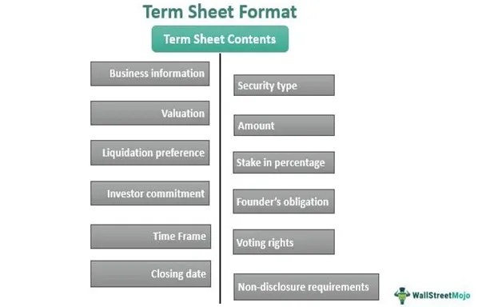

A term sheet is a critical document in business finance and investment agreements, serving as a non-binding precursor to a formalized contract, such as a shareholder agreement or investment deal. This document outlines the fundamental terms and conditions between parties in a financial transaction. It typically includes key elements such as valuation, investment amount, and the types of securities to be purchased. The significance of a term sheet lies in its ability to set the groundwork for negotiations, providing both parties with a clear framework that facilitates dialogue and consensus-building before committing to legally binding contracts.

The utility of term sheets extends beyond just laying the foundational terms; they help identify any potential misalignments between involved parties early on in the investment process. By involving crucial aspects like voting rights, board composition, and liquidation preferences, term sheets ensure that all parties are on the same page, minimizing the likelihood of disputes later on. The non-binding nature of these documents allows both investors and companies to negotiate flexibly, knowing that adjustments can be made without legal repercussions.

In modern finance, algorithmic trading has emerged as a dominant force, transforming how investments are analyzed and executed. An algorithm in this context refers to a precise set of instructions or rules designed to complete tasks successfully. Algorithmic trading employs computer algorithms to automate trading, making high-speed decisions based on complex mathematical models and big data analytics. This approach significantly increases efficiency and accuracy, allowing traders to execute large volumes of transactions at speeds no human could match.

The role of algorithmic trading in finance is increasingly relevant to the formulation of term sheets. With the ability to process vast quantities of financial data and recognize patterns far beyond human capacity, algorithms provide investors with elevated insights into market trends and potential investment outcomes. This tech-driven analysis can influence the terms set forth in a term sheet, such as determining a company's fair valuation or assessing associated risks and returns. 

As financial markets continue to evolve, the integration of algorithmic trading and investment agreements like term sheets will likely deepen. This convergence promises more dynamic and data-informed negotiations, aligning traditional finance principles with cutting-edge technology to optimize investment strategies. As such, both investors and companies must adapt, using technological insights to craft term sheets that reflect the complexities and opportunities of the modern financial landscape.

## Table of Contents

## Understanding Term Sheets in Business Finance

A term sheet serves as a critical instrument in the landscape of business finance, particularly within investment agreements. It acts as an initial, yet pivotal, document that sets forth the foundational terms and conditions under which a potential investment may be executed. The primary purpose of a term sheet is to ensure that both the investor and the company involved have a mutual understanding of the key aspects of the proposed investment before moving towards a more formalized contract like a shareholder agreement or a securities purchase agreement.

Term sheets typically include several essential elements. These generally encompass the valuation of the company, which lays the groundwork for determining the investment terms. Valuation is crucial as it directly influences the equity stake that investors will receive in exchange for their monetary input. Moreover, a term sheet delineates the amount of investment, clarifying the financial commitment expected from the investor. Securities to be purchased, such as equity, convertible notes, or preferred shares, are also outlined within the document.

Additionally, the term sheet may specify deal-specific aspects such as voting rights, liquidation preferences, and anti-dilution provisions. Voting rights indicate the level of influence an investor may exert in corporate decision-making processes, while liquidation preferences establish the order in which investors are paid in the event of a [liquidity](/wiki/liquidity-risk-premium) event, such as a sale or liquidation of the company. Anti-dilution clauses protect investors from losses in the event of future funding rounds that may occur at a lower valuation.

The non-binding nature of term sheets stands as a defining characteristic. Typically, the majority of a term sheet is non-binding, meaning that the provisions outlined within it are preliminary and are not legally enforceable until they become part of a definitive agreement. This characteristic enables the parties involved to freely negotiate and alter terms as further due diligence is conducted and as more detailed financial, operational, and strategic information is disclosed. The non-binding terms, therefore, provide flexibility, allowing parties to explore the feasibility of the investment without the immediate binding legal obligations that a formal contract would impose.

Ultimately, the utilization of a term sheet is instrumental in facilitating a clear, initial understanding between investors and companies, serving as a foundational step towards structured investment agreements. By delineating key terms and establishing a preliminary framework, term sheets help manage expectations and foster a smoother progression towards closing an investment deal.

## Key Components of a Term Sheet

A term sheet is a critical document in business finance and investment agreements, serving as a blueprint for the terms and conditions that govern an investment. At its core, a term sheet outlines key components such as valuation, investment amount, and the type of securities to be acquired. These elements provide a foundation for negotiations, ensuring that all parties are aligned on the essential terms of the investment.

**Valuation and Investment Amount**

Valuation is the estimated worth of a company at the time of investment. It plays a pivotal role in determining the percentage of ownership that an investor will receive. The higher the valuation, the smaller the equity stake an investor receives for a given amount of investment. Accurate valuation is crucial as it impacts future funding rounds and the company’s overall trajectory.

The investment amount specifies the capital that the investor will inject into the company. This figure influences not only the extent of control an investor might have but also the resources available to the company for growth and operations. A clear specification of the investment amount helps prevent future disputes and ensures transparency during negotiations.

**Type of Securities**

Term sheets also delineate the type of securities to be purchased, which may include common stock, preferred stock, or convertible debt. Preferred stock often comes with additional rights and privileges over common stock, such as dividend preferences or additional voting rights. Convertible debt provides the flexibility to convert into equity at a later stage, offering potential upside if the company's value increases.

**Voting Rights and Liquidation Preferences**

Voting rights are a crucial aspect of governance within a company. Investors often negotiate for specific voting rights to have influence over major corporate decisions. These rights can affect strategic directions, mergers, acquisitions, or changes in the company’s capital structure.

Liquidation preferences determine the order in which investors are paid in the event of a company liquidation. For example, if a company is sold or goes bankrupt, investors with liquidation preferences will typically be repaid before common shareholders receive any distribution. This provision safeguards investors, ensuring a degree of protection for their capital.

**Common Terms in Investment and Loan Term Sheets**

Both investment and loan term sheets often include clauses like anti-dilution provisions, which protect investors from equity dilution by adjusting the conversion rate of convertible securities. Additionally, terms may cover drag-along rights, allowing majority shareholders to force minority shareholders to sell under certain conditions, and tag-along rights, which enable minority investors to participate in sale opportunities under the same conditions as majority shareholders.

Other commonly included terms involve board composition, indicating the extent of investor involvement in decision-making processes, and lock-up periods, which restrict the sale of securities for a specified time post-investment.

In summary, the components specified within a term sheet form the backbone of an investment agreement by establishing clear terms that are crucial for informed decision-making. This transparency helps in fortifying the relationship between investors and the company, paving the way for successful and strategic financial ventures.

## Algorithmic Trading and Its Role in Investment Decisions

Algorithmic trading is a method of executing orders using automated, pre-programmed trading instructions accounting for variables such as time, price, and [volume](/wiki/volume-trading-strategy). This practice allows traders to manage a large number of trades swiftly and efficiently without human intervention, significantly enhancing the speed and efficiency of the financial markets. Algorithmic trading executes trades based on a set of defined parameters and strategies, which can include statistical [arbitrage](/wiki/arbitrage), [market making](/wiki/market-making), and [trend following](/wiki/trend-following), among others.

By automating the decision-making process, [algorithmic trading](/wiki/algorithmic-trading) reduces the impact of human emotions and errors in trading. It leverages complex algorithms and vast datasets to analyze market conditions and make informed predictions about future movements. This computational approach enhances the accuracy of trade execution by exploiting small price discrepancies within different markets or ensuring optimal trade execution based on predetermined benchmarks.

In the context of investment agreements, algorithmic trading plays an integral role by providing data-driven insights that can influence the structuring and negotiation of term sheets. Algorithmically generated market insights inform investors and companies about current valuation trends, liquidity aspects, and potential risks associated with particular investment agreements. This information can significantly affect the valuation terms and conditions embedded within a term sheet, leading to better-aligned expectations between parties involved.

The negotiation of term sheets can also be influenced by algorithmic trading through the dynamic adjustment of terms to reflect real-time market sentiment and conditions. For instance, if algorithmic analyses forecast an imminent downturn in the market, investors may negotiate for more favorable liquidation preferences or protective provisions in the term sheet. Conversely, in bullish market conditions detected by algorithms, founders may have stronger negotiating leverage to secure better terms.

Moreover, algorithmic trading impacts the execution of term sheets by optimizing the timing of capital deployment. When an investment decision is reached, algorithms can determine optimal entry points for capital injection based on market fluctuations, thus enhancing the return on investment. By ensuring that funding is disbursed under favorable conditions, both investors and companies can maximize the potential benefits of the agreement.

In summary, algorithmic trading enhances the rationality and timeliness of investment decisions that underpin term sheet negotiations and executions. By harnessing the power of technology, stakeholders can make more calculated and strategic decisions, ensuring that the terms agreed upon reflect the most accurate and beneficial conditions achievable in a dynamic financial landscape.

## Crafting a Term Sheet in the Age of Algorithmic Trading

In the age of algorithmic trading, drafting an effective term sheet requires a nuanced understanding of both financial principles and technological advancements. An efficient term sheet not only provides clarity on the investment parameters but also incorporates data-driven insights to enhance negotiation outcomes.

Firstly, leveraging technology-driven insights can significantly aid in the negotiation process. Machine learning algorithms and advanced analytics can process vast datasets to identify market trends, optimal pricing strategies, and investor behavior patterns. For instance, predictive analytics can forecast market conditions, allowing negotiators to structure terms that mitigate potential risks. Such insights help in aligning the investment proposal with current market realities and investor expectations. By employing these tools, negotiators can advocate for terms that maximize value, such as optimal valuation figures and liquidation preferences reflective of real-time market intelligence.

Moreover, incorporating algorithmic insights allows for personalized term sheets tailored to specific investor profiles. By analyzing historical investment patterns, preferences, and risk tolerances, negotiators can customize terms to appeal directly to the target investors, increasing the likelihood of acceptance and successful closure.

Nevertheless, while technology provides substantial advantages, potential pitfalls in the drafting process must be acknowledged. One primary concern is the over-reliance on algorithmic outputs without adequate human oversight. Algorithms, though powerful, are ultimately reliant on the data they are fed. Poor data quality or biases present in the dataset can lead to suboptimal or even detrimental recommendations. Therefore, it is vital to ensure data sources are comprehensive and representative of the current market scenarios.

Additionally, the complexity of algorithmic models can sometimes obscure the rationale behind specific recommendations, leading to misunderstandings or mistrust among stakeholders. To counter this, maintaining transparency in how insights are derived can build confidence in the term sheet proposals. Providing clear explanations and justifications for the terms based on algorithmic insights helps stakeholders appreciate the rationale behind decisions.

To avoid these pitfalls, balance between automated insights and human expertise is essential. Traders and negotiators should use algorithms as tools to inform their decisions while applying their judgment and market understanding to validate and adjust the proposed terms accordingly.

In summary, crafting a term sheet in today's technologically advanced trading landscape involves integrating robust algorithmic insights while maintaining vigilant oversight to ensure accuracy and relevance. Such a balanced approach is crucial for successful negotiations and effective investment agreements.

## Case Studies and Examples

Term sheets are critical documents in the investment landscape, providing a blueprint of fundamental terms for potential deals. Prominent venture capital firms like Sequoia Capital and Y Combinator have mastered the art of structuring effective term sheets, which has played a significant role in their success.

Sequoia Capital is renowned for its meticulous approach in negotiating and crafting term sheets that not only protect its interests but also foster alignment with startup founders. A typical Sequoia term sheet includes valuation metrics, investment amount, type of securities, voting rights, and liquidation preferences. Their term sheets are known for emphasizing founder-friendly terms while maintaining stringent financial controls.

Y Combinator, on the other hand, employs term sheets that are straightforward and standardized to accommodate the rapid pace of startup accelerations. The simplicity of Y Combinator's term sheets helps in minimizing negotiation times and streamlining investments with consistent terms across diverse startups. These term sheets generally include essential elements like safe agreements, which simplify the investment process and protect entrepreneurs from complex negotiation pitfalls.

Algorithmic trading has influenced the evolution of term sheets by incorporating data-driven insights into the negotiation process. This technology allows firms to tap into vast datasets for better evaluation and pricing of investment opportunities. For instance, an algorithm could analyze market trends, historical data, and competitive landscapes to assist in determining optimal valuation metrics and potential risks.

Consider a hypothetical scenario where algorithmic insights were employed in a Sequoia Capital investment decision. Suppose Sequoia was considering an investment in a fintech startup. By utilizing an automated trading algorithm, they could simulate potential market responses and competitive reactions to the startup's launch. These insights might reveal optimal entry and [exit](/wiki/exit-strategy) strategies, enabling Sequoia to draft a term sheet that buffers against anticipated market [volatility](/wiki/volatility-trading-strategies), thus securing a more favorable investment position. 

In another example, Y Combinator's investment strategy could benefit from algorithmic inputs by employing predictive modeling to ascertain a startup’s future growth trajectory. Access to predictive analytics might reveal key inflection points for scalability, thus allowing Y Combinator to craft safer agreements that include performance milestones or convertible notes that could provide more advantageous conversion terms.

These examples underscore how algorithmic trading has not only impacted investment strategy but also revolutionized the structuring of term sheets. By enhancing the evaluation process, algorithmic insights enable more refined investment terms, ultimately fostering mutually beneficial agreements between investors and startups. As algorithmic sophistication grows, its influence on term sheet precision and investment efficacy is only expected to deepen.

## Conclusion

In modern finance, term sheets serve as crucial documents that lay the groundwork for investment agreements. They provide a structured framework that outlines the essential terms and conditions, facilitating clear communication between parties and minimizing potential disputes. Their presence is indispensable, as they help ensure that all involved parties understand the expectations and obligations before finalizing legal contracts.

Algorithmic trading plays a significant role in shaping these term sheet agreements. By automating trading decisions, algorithmic systems deliver enhanced speed, precision, and analysis capabilities. This technological advancement enables investors and firms to negotiate and execute term sheets with greater efficiency. Algorithms can rapidly analyze market data and investment trends, offering insights that influence key terms within the agreement, such as valuation metrics and investment amounts. This integration augments the decision-making process by providing a data-driven approach that enhances the strategic assessment of investment opportunities.

Looking forward, the landscape of investment agreements and algorithmic trading is expected to continue evolving. As technology advances, algorithms will likely become even more sophisticated, incorporating [artificial intelligence](/wiki/ai-artificial-intelligence) and [machine learning](/wiki/machine-learning) to further refine investment analyses and predictive capabilities. This evolution may lead to more dynamic and personalized term sheet agreements, with real-time data analytics continually informing negotiation strategies.

Furthermore, the increased use of blockchain and smart contracts could introduce additional efficiencies and transparency into the drafting and execution of term sheets. These technologies have the potential to automate verification processes and reduce the need for intermediaries, ensuring greater security and trust between investors and investees.

In summary, while term sheets remain foundational in securing investment agreements, the influence of algorithmic trading and emerging technologies promises to enhance their relevance and effectiveness in the future finance landscape.

## References & Further Reading

[1]: Bergstra, J., Bardenet, R., Bengio, Y., & Kégl, B. (2011). ["Algorithms for Hyper-Parameter Optimization."](https://papers.nips.cc/paper/4443-algorithms-for-hyper-parameter-optimization) Advances in Neural Information Processing Systems 24.

[2]: ["Advances in Financial Machine Learning"](https://www.amazon.com/Advances-Financial-Machine-Learning-Marcos/dp/1119482089) by Marcos Lopez de Prado

[3]: ["Evidence-Based Technical Analysis: Applying the Scientific Method and Statistical Inference to Trading Signals"](https://www.amazon.com/Evidence-Based-Technical-Analysis-Scientific-Statistical/dp/0470008741) by David Aronson

[4]: ["Machine Learning for Algorithmic Trading"](https://github.com/stefan-jansen/machine-learning-for-trading) by Stefan Jansen

[5]: ["Quantitative Trading: How to Build Your Own Algorithmic Trading Business"](https://www.amazon.com/Quantitative-Trading-Build-Algorithmic-Business/dp/1119800064) by Ernest P. Chan