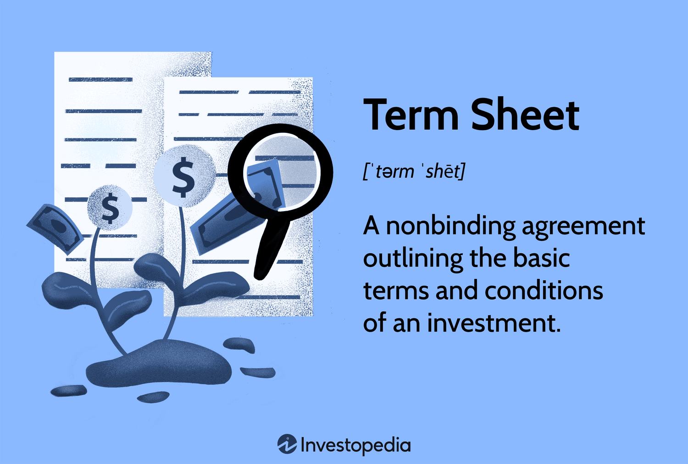

## Table of Contents

## What is a term sheet?

A term sheet is a document that outlines the key terms and conditions of a business agreement. It is often used in investments, mergers, and acquisitions to summarize the main points before the final contracts are written. Think of it as a blueprint or a summary that helps everyone understand the deal before they spend time and money on detailed legal documents.

The term sheet is not a legally binding document, except for certain parts like confidentiality or exclusivity agreements. This means that while it sets the stage for negotiations, it doesn't force anyone to go through with the deal. It's a helpful tool because it allows all parties to see if they are on the same page and agree on the basic terms before moving forward with more formal and complex legal paperwork.

## Why are term sheets important in business transactions?

Term sheets are important in business transactions because they help everyone understand the deal before they spend a lot of time and money on detailed legal documents. They act like a roadmap, showing the main points of the agreement in a simple way. This helps all parties see if they agree on the basic terms before moving forward. It saves time and reduces confusion by making sure everyone is on the same page from the start.

Another reason term sheets are important is that they make the negotiation process easier. Since they are not usually legally binding, except for certain parts like confidentiality, people can discuss and change terms without worrying about breaking a contract. This flexibility helps in reaching a final agreement that works for everyone. By using a term sheet, businesses can avoid misunderstandings and focus on creating a solid deal.

## What are the key components of a term sheet?

A term sheet usually includes information about the money part of the deal. This can be things like how much money is being invested, the price of the shares, and how the ownership will be split. It also talks about any special rights the investors might get, like being able to have a say in big decisions or getting their money back first if the company is sold. These details help everyone understand the financial side of the agreement.

Another important part of a term sheet is the rules and conditions of the deal. This includes how long the agreement will last, any special conditions that need to be met before the deal can go through, and what happens if someone wants to back out. It might also talk about who gets to see the company's private information and how disagreements will be solved. These parts make sure everyone knows what they are agreeing to and what to expect.

Sometimes, a term sheet will also have a section on the people involved in the deal. This can include who is leading the investment, who the main people in the company are, and any special roles or responsibilities they have. This helps everyone know who they will be working with and what their roles will be in making the deal happen.

## How do term sheets differ between industries, such as tech startups versus real estate?

Term sheets can look different depending on the industry. For tech startups, term sheets often focus a lot on things like how much the company is worth, how the money will be used to grow the business, and special rights for investors. This is because tech startups usually need a lot of money to develop their products and grow quickly. Investors might want to have a say in big decisions or get their money back first if the company is sold. These details help make sure everyone understands how the money will be used and what the investors get in return.

In real estate, term sheets are more about the property itself. They talk about things like the price of the property, how the buyer will pay for it, and any special conditions that need to be met before the deal can go through. Real estate deals often involve loans and mortgages, so the term sheet might also include details about the financing. The focus here is on making sure the property transaction goes smoothly and that everyone knows what they are getting into with the property and the money involved.

Even though term sheets can be different in tech startups and real estate, they both serve the same main purpose. They help everyone understand the basic terms of the deal before they spend a lot of time and money on detailed legal documents. This makes the negotiation process easier and helps avoid misunderstandings later on.

## What are some common terms found in a term sheet for a startup?

A term sheet for a startup usually includes details about how much money the investors are putting in and how much the company is worth. This is called the valuation. The term sheet will say how many shares the investors will get for their money and how the ownership of the company will be split. It might also talk about the price per share, which helps everyone understand how much each part of the company is worth. Another important part is the type of investment, like whether it's a simple agreement for future equity (SAFE) or a convertible note, which can change into shares later.

The term sheet also covers special rights for the investors. These can include things like the right to have a say in big decisions, called board seats or voting rights. Investors might also want to get their money back first if the company is sold, which is called liquidation preference. There might be rules about what happens if the company wants to raise more money in the future, known as anti-dilution provisions, to protect the investors' share of the company. These terms help make sure the investors feel safe about putting their money into the startup and understand what they get in return.

## Can you explain the difference between binding and non-binding terms in a term sheet?

A term sheet usually has two types of terms: binding and non-binding. Binding terms are the parts of the term sheet that everyone has to follow, even if they decide not to go through with the whole deal. These are like promises that can't be broken. For example, if the term sheet says that the company has to keep the investors' information secret, that's a binding term. If the company shares the information anyway, they could get in trouble, even if the deal falls apart.

Non-binding terms, on the other hand, are more like suggestions or plans. They are the main points of the deal that everyone agrees to work towards, but they don't have to stick to them if they change their minds. Most of the term sheet is non-binding, like how much money is being invested or how the company will be valued. These terms help everyone understand the deal and start negotiating, but they can be changed or ignored if the deal doesn't go through. This flexibility makes it easier for everyone to talk and agree on the final details.

## How should one negotiate the terms of a term sheet?

When you negotiate the terms of a term sheet, it's important to start by understanding what each term means and how it will affect your business. Take time to read the term sheet carefully and ask questions if there's anything you don't understand. It's helpful to have a lawyer or someone who knows about business deals look it over, too. They can help you see if the terms are fair and suggest changes that could be better for you. Remember, the term sheet is just the starting point, so don't be afraid to ask for what you need.

Once you know what you want to change, talk to the other side and explain why those changes are important. Be clear about your goals and try to find a solution that works for everyone. It's okay to go back and forth a few times to get the terms right. Keep the conversation friendly and professional, even if you disagree on some points. The goal is to reach an agreement that everyone feels good about, so be willing to compromise but also stand firm on the things that are most important to you.

## What are the potential pitfalls to watch out for when reviewing a term sheet?

When you're looking at a term sheet, one thing to watch out for is terms that might give too much control to the investors. For example, if they want a lot of board seats or the right to veto big decisions, it could make it hard for you to run your business the way you want. Another pitfall is not understanding the financial terms well. If the valuation is too low or the liquidation preference is too high, it might mean you get less money than you expect if the company does well or gets sold. It's important to make sure you understand all the numbers and how they affect your share of the company.

Another thing to be careful about is any terms that could limit your future options. For instance, if there are strict rules about raising more money later, it might make it hard to grow your business. Also, watch out for any clauses that could let investors pull out of the deal easily, leaving you in a tough spot. It's a good idea to have a lawyer or someone who knows about business deals look over the term sheet to help you spot these potential problems and negotiate better terms.

## How does a term sheet evolve into a final agreement?

A term sheet is like a starting point for a business deal. It lays out the main ideas and terms that everyone agrees to work towards. Once everyone is happy with the term sheet, they start working on the final agreement. This is where lawyers come in to write up all the details in a legal document. They take the simple terms from the term sheet and turn them into a long, detailed contract that covers everything about the deal.

During this process, there might be more talks and changes. The term sheet helps guide these discussions, but the final agreement can still be different. Everyone looks at the legal document carefully to make sure it matches what they agreed to in the term sheet. Once everyone is okay with the final agreement, they sign it, and the deal is official. The term sheet was just the first step, but the final agreement is what really makes the deal happen.

## What role do lawyers play in the creation and review of term sheets?

Lawyers play a big role in making and checking term sheets. They help write the term sheet in a way that is clear and covers all the important points. They use their knowledge of the law to make sure the terms are fair and legal. Lawyers also explain what each part of the term sheet means, so everyone understands what they are agreeing to. This is important because the term sheet sets the stage for the final agreement.

When it comes to reviewing term sheets, lawyers look for any problems or risks. They check to see if any terms might cause trouble later on, like giving too much control to investors or not protecting the company enough. Lawyers can suggest changes to make the term sheet better for their client. They also make sure that the term sheet matches the final agreement, so there are no surprises when the deal is done.

## Can you provide examples of term sheets from successful deals?

One example of a term sheet from a successful deal is the one used in the early funding round of Airbnb. In 2009, Airbnb raised $600,000 from Sequoia Capital. The term sheet outlined that Sequoia would invest this amount in exchange for a certain percentage of the company. It included details like the valuation of Airbnb at the time, which was around $2.4 million, and the type of shares Sequoia would receive. The term sheet also had provisions for investor rights, such as board seats and the right to participate in future funding rounds. This term sheet helped Airbnb secure the funding it needed to grow, and it set the stage for the company's later success.

Another example is the term sheet for the acquisition of WhatsApp by Facebook in 2014. The term sheet for this deal outlined that Facebook would buy WhatsApp for $19 billion, with $4 billion in cash and the rest in Facebook shares. It included details about how the payment would be structured and any conditions that needed to be met before the deal could close. The term sheet also covered what would happen to WhatsApp's employees and their stock options after the acquisition. This term sheet was crucial in making sure both companies understood the terms of the deal, and it paved the way for one of the biggest tech acquisitions in history.

## What advanced strategies can be used to optimize term sheet negotiations for better outcomes?

One advanced strategy to optimize term sheet negotiations is to focus on building a strong relationship with the other side. When you treat the negotiation as a partnership rather than a battle, you can create a more open and honest conversation. This means listening to what the other side wants and being willing to share your own goals and concerns. By understanding each other's needs, you can find creative solutions that work for everyone. For example, if an investor wants more control, you might offer them a board seat instead of veto power over decisions. This way, you keep more control while still making the investor feel involved.

Another strategy is to use data and market insights to back up your position. If you can show that similar deals in your industry have certain terms, it can help you argue for those terms in your term sheet. For instance, if other startups in your field have raised money at a higher valuation, you can use that information to negotiate a better valuation for your company. Also, knowing the market well can help you understand what terms are standard and which ones you can push back on. This knowledge gives you more power in the negotiation and helps you get a better deal.

## References & Further Reading

[1]: Bergstra, J., Bardenet, R., Bengio, Y., & Kégl, B. (2011). ["Algorithms for Hyper-Parameter Optimization."](https://papers.nips.cc/paper/4443-algorithms-for-hyper-parameter-optimization) Advances in Neural Information Processing Systems 24.

[2]: ["Advances in Financial Machine Learning"](https://www.amazon.com/Advances-Financial-Machine-Learning-Marcos/dp/1119482089) by Marcos Lopez de Prado

[3]: ["Evidence-Based Technical Analysis: Applying the Scientific Method and Statistical Inference to Trading Signals"](https://www.amazon.com/Evidence-Based-Technical-Analysis-Scientific-Statistical/dp/0470008741) by David Aronson

[4]: ["Machine Learning for Algorithmic Trading"](https://github.com/stefan-jansen/machine-learning-for-trading) by Stefan Jansen

[5]: ["Quantitative Trading: How to Build Your Own Algorithmic Trading Business"](https://www.amazon.com/Quantitative-Trading-Build-Algorithmic-Business/dp/1119800064) by Ernest P. Chan