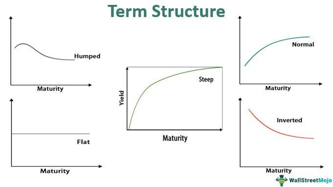

Term spread, often referred to as the yield curve, is a key concept in financial markets, highlighting the difference between short-term and long-term interest rates. At its core, term spread is calculated as:

$$
\text{Term Spread} = \text{Long-term Interest Rate} - \text{Short-term Interest Rate}
$$



This metric serves as a barometer of economic sentiment, where a positive spread generally indicates economic growth, while a negative spread can signal a looming recession. The logic behind this is straightforward: in healthy economies, investors expect higher returns for long-term bonds compared to short-term bonds, reflecting confidence in future growth and inflation. 

Algorithmic trading, on the other hand, represents a transformative force in modern finance. Leveraging computer algorithms and high-speed data analysis, this trading method allows for precise and rapid execution of trading strategies, minimizing human error and optimizing returns. Algorithms can process vast quantities of data, identify patterns or trends, and execute trades in microseconds, capabilities far beyond human traders.

The aim of this article is to explore how term spread, as a critical economic indicator, can be integrated into algorithmic trading strategies to inform decision-making and enhance financial market analysis. Understanding the interplay between term spread and algorithmic trading offers traders and financial analysts insights into predicting market trends and improving trading outcomes, thereby underlining the strategic importance of incorporating economic indicators into algorithmic trading models. This knowledge is invaluable for those looking to capitalize on economic signals and develop more sophisticated and responsive trading systems.

## Table of Contents

## Understanding Term Spread

Term spread, a crucial concept in finance, refers to the difference between long-term and short-term [interest rate](/wiki/interest-rate-trading-strategies)s. This spread is an essential indicator of the market's expectation of future economic conditions and interest rate changes. Typically, it is represented as the yield differential between some standard long-term securities, like a 10-year U.S. Treasury bond, and short-term securities, such as a 3-month Treasury bill.

### Components of Term Spread

- **Short-term Interest Rates**: These are the rates on financial instruments or loans that mature in a short period, often within a year. Central banks, like the Federal Reserve, directly influence short-term rates through monetary policy tools, including setting the discount rate or conducting open market operations.

- **Long-term Interest Rates**: These rates apply to financial instruments or loans with longer maturities, usually ten years or more. Unlike short-term rates, long-term rates are primarily influenced by market forces, including demand and supply for credit, inflation expectations, and overall economic growth projections.

### Factors Influencing Term Spread

Term spreads are influenced by a myriad of [factor](/wiki/factor-investing)s, ranging from economic indicators to monetary policy:

1. **Economic Indicators**: Several indicators like GDP growth rates, inflation levels, and unemployment figures can impact expectations of future economic conditions and thus influence term spreads. For example, strong GDP growth may lead to expectations of higher future inflation, causing a steepening of the yield curve as investors demand higher yields on long-term bonds.

2. **Monetary Policy**: Central banks play a significant role in shaping the term spread through their manipulation of short-term interest rates. For example, an increase in the federal funds rate typically narrows the term spread, assuming constant long-term rates. Similarly, unconventional monetary policies like quantitative easing can affect long-term interest rates, thereby impacting the spread.

3. **Market Sentiment and Risk Perception**: Investors' risk appetite and expectations of future economic performance drive shifts in the demand for various maturities, influencing term spreads. For instance, in times of economic uncertainty, investors might flock to long-term government securities perceived as safe-havens, narrowing the term spread.

### Economic Trends and Market Signals

Changes in term spread serve as valuable signals for economic trends and potential market movements. A commonly observed phenomenon is the "yield curve inversion," where short-term rates exceed long-term rates, resulting in a negative term spread. Historically, such inversions have been precursors to economic recessions. They occur when investors anticipate a downturn, leading to expectations of lower future interest rates on long-term securities.

Conversely, a widening term spread, where long-term rates increase relative to short-term rates, may indicate expectations of strong economic growth or rising inflation in the future. This steepening often leads to shifts in investment strategy, as investors adjust portfolios in anticipation of higher future interest rates.

Understanding the dynamics of term spread is vital for financial analysts and traders, as it offers insights into future interest rate movements and overall economic conditions, aiding in strategic decision-making and risk management.

## The Role of Term Spread in Algorithmic Trading

Term spread, defined as the difference between long-term and short-term interest rates, plays a significant role in [algorithmic trading](/wiki/algorithmic-trading) by serving as a critical signal or input. Its utility in predictive modeling helps traders identify potential interest rate movements, informing strategies that make trading operations more precise and profitable. 

Algorithmic trading, known for executing trades at speeds and frequencies beyond human capabilities, benefits from incorporating term spread data. This data can enhance the predictive accuracy of trading algorithms, thus optimizing decision-making processes. By using term spread as an input, algorithms can better anticipate shifts in economic trends, enabling traders to adjust quickly to evolving market conditions.

One of the primary benefits of employing term spread in trading algorithms is its ability to predict interest rate movements. When the spread widens—indicating higher long-term rates relative to short-term rates—it often signals economic expansion or inflationary pressures, prompting central banks to consider tightening monetary policy. Conversely, a narrowing spread may suggest economic slowdown, leading to potential rate cuts. Algorithms armed with such insights can adjust trading positions to profit from these anticipated changes.

Historically, term spread has influenced trading decisions by signaling market turns. For example, the inverted yield curve, a situation where short-term rates exceed long-term rates, has been a reliable predictor of economic recession. In past instances, algorithmic models that included term spread data effectively hedged portfolios by shorting equities in anticipation of economic downturns. Such strategies have underscored the term spread's predictive power and its strategic importance in trading decisions.

Incorporating term spread into algorithmic models typically involves the integration of real-time data feeds and historical data analysis, allowing for dynamic adjustment to market conditions. This integration can stimulate the development of robust trading systems capable of executing trades based on the spread's changes.

Case studies have further elaborated on the term spread's impact. For instance, during the 2007-2008 financial crisis, several leading [hedge fund](/wiki/hedge-fund-trading-strategies)s that utilized term spread data in their trading algorithms succeeded in reducing losses by shifting their strategies based on spread inversions. These examples highlight how understanding and predicting shifts in term spread can substantially impact trading outcomes, creating opportunities for significant returns or loss mitigation.

In conclusion, term spread offers rich, actionable insights for algorithmic trading. By leveraging this data, traders can develop algorithms that not only capitalize on expected interest rate changes but also respond swiftly to broader economic indicators. As financial technologies continue to evolve, the integration and utilization of term spread data within algorithms will likely remain a cornerstone of sophisticated trading strategies.

## Building Algorithms with Term Spread Data

Integrating term spread data into algorithmic trading models involves a systematic approach that ensures the data is effectively used to improve trading strategies. Here are the steps:

1. **Data Collection**: The first step is to gather reliable term spread data, which typically involves the difference between long-term and short-term interest rates, such as the yield spread between 10-year and 2-year Treasury bonds. It's essential to source this data from reputable providers to ensure accuracy and reliability.

2. **Data Preprocessing**: After collecting the data, it needs preprocessing, which includes handling missing values, normalizing the data for consistency, and possibly transforming the spreads into stationary series if required by the chosen algorithmic models. This step ensures the data is ready for efficient input into modeling processes.

3. **Feature Engineering**: This involves creating features from the term spread data that can be fed into the algorithm. For example, calculating moving averages, rate of change, or integrating the data with other macroeconomic indicators could enhance predictive performance.

4. **Algorithm Selection**: The choice of algorithm is crucial and depends on the trading strategy. Trend-following algorithms can benefit from identifying the direction suggested by changing spreads, while mean-reversion strategies might use spread anomalies to predict reversals. For instance, a simple moving average crossover strategy could be implemented to signal trades when short-term averages cross long-term averages, adjusted for the term spread data.

5. **Model Development and Backtesting**: Once the features and algorithms are established, developing the model involves implementing the algorithm and backtesting it against historical data to evaluate its performance. This process helps in adjusting model parameters and assessing its viability under different market conditions.

```python
import numpy as np
import pandas as pd

# Sample code for a simple moving average crossover strategy
def moving_average(data, window_size):
    return data.rolling(window=window_size).mean()

# Example data
spread_data = pd.Series([1.5, 1.7, 1.6, 1.8, 2.0, 1.9, 2.1])

# Calculate short-term and long-term moving averages
short_ma = moving_average(spread_data, 3)
long_ma = moving_average(spread_data, 5)

# Signal where short-term MA crosses long-term MA
signals = np.where(short_ma > long_ma, 1, 0)
```

6. **Evaluation and Optimization**: Post-model development, evaluating the performance metrics of the trades executed using the algorithm is important. Metrics such as Sharpe ratio, maximum drawdown, and annualized return help in assessing the risk-adjusted performance. Optimization techniques might involve adjusting features or hyperparameters to enhance outcomes.

7. **Deployment and Monitoring**: After successful evaluation, the algorithm is deployed in live trading. Continuous monitoring is essential, allowing for real-time adjustments given dynamic market conditions.

**Challenges and Considerations:**

- **Data Accuracy**: Ensuring data integrity is paramount, as faulty data can lead to erroneous signals. Consistent validation against known benchmarks can mitigate this risk.

- **Model Complexity**: Balancing complexity is key. Overly complex models may offer enhanced short-term predictions but risk overfitting and poor generalization to unseen data.

- **Market Volatility**: Algorithms must be robust to withstand different market conditions; thus, stress testing against volatile scenarios is advisable.

By following these structured steps and addressing the challenges, traders can effectively use term spread data to build and optimize algorithmic trading models.

## Tools and Platforms for Term Spread Analysis

When it comes to analyzing term spread data for algorithmic trading, the choice of tools and platforms can significantly influence the effectiveness of trades. Here, we explore some prevalent tools and platforms alongside the importance of real-time and historical data in term spread analysis.

### Popular Tools and Platforms

**1. Bloomberg Terminal:**
A staple in financial markets, the Bloomberg Terminal provides comprehensive access to real-time financial data, including term spreads. Its powerful analytics allow traders to assess historical data trends and execute trades based on current market conditions.

**2. Reuters Eikon:**
Reuters Eikon delivers high-quality data feeds essential for term spread analysis. Its robust platform offers modeling capabilities and real-time market analysis, making it ideal for traders who rely on term spread signals for their trading strategies.

**3. Python Libraries (e.g., Pandas, NumPy, and SciPy):**
For those who prefer a customizable approach, Python offers libraries like Pandas for data manipulation, NumPy for numerical analysis, and SciPy for scientific computing. These can be used to build customized models and algorithms for analyzing term spreads.

**4. QuantConnect:**
This platform provides tools for quantitative research and [backtesting](/wiki/backtesting) algorithms on historical data. With a focus on algorithmic trading, QuantConnect supports the integration of term spread data into custom algorithms.

**5. TradingView:**
Known for its user-friendly interface, TradingView provides real-time data and extensive charting capabilities, making it accessible for traders aiming to incorporate term spread analysis into their trading strategies.

### Importance of Real-Time and Historical Data

Real-time data feeds are crucial in algorithmic trading as they enable traders to make informed decisions based on current market conditions. For term spread analysis, up-to-date information on interest rate movements allows traders to anticipate market trends and adjust their strategies promptly. Historical data, on the other hand, is indispensable for backtesting algorithms and understanding long-term trends in term spreads. By analyzing past data, traders can identify patterns and optimize their strategies for future trades.

### Selecting the Right Software or Platform

Choosing the appropriate tool or platform depends largely on the trader's goals and expertise level:

- **For Beginners:** Platforms like TradingView offer an intuitive interface and essential tools for basic analysis, making them suitable for newcomers.

- **For Advanced Traders:** Those with a solid understanding of market dynamics may benefit from comprehensive platforms like Bloomberg Terminal or Reuters Eikon, which provide a wealth of data and sophisticated analytical tools.

- **For Developers:** Traders with a programming background might prefer Python libraries or QuantConnect for greater flexibility in developing customized trading models that incorporate term spread data.

Ultimately, the ideal choice of platform should align with the trader's specific needs, providing the right mix of accessibility, data quality, and analytical capabilities. By integrating both real-time and historical data, traders can leverage term spread analysis to enhance their algorithmic trading strategies effectively.

## Risk Management and Optimization

In algorithmic trading, using term spread data can be a double-edged sword. While it offers valuable insights into market conditions, relying solely on term spread can introduce risks such as model overfitting and susceptibility to market [volatility](/wiki/volatility-trading-strategies). Understanding and addressing these risks are crucial for optimizing portfolio performance and ensuring robust trading strategies.

One primary risk is model overfitting, which occurs when a trading model is excessively complex and captures noise rather than genuine market trends. When a model is overfitted, it may perform well on historical data but fail to generalize to unseen data. To mitigate this risk, traders should employ techniques such as cross-validation and regularization in their model development processes. Cross-validation helps assess the model’s predictive power by dividing the data into training and validation sets, while regularization techniques like L1 (Lasso) and L2 (Ridge) can prevent the model from becoming unnecessarily complex.

Additionally, market volatility poses a risk when using term spread in trading algorithms. During periods of high volatility, the relationship between short-term and long-term interest rates can be disrupted, affecting the reliability of term spread as a predictive indicator. Portfolio optimization strategies, such as diversification and dynamic asset allocation, can help reduce the impact of market volatility. For instance, incorporating a variety of uncorrelated signals alongside term spread can enhance diversification and improve risk-adjusted returns.

A proactive approach to risk management is crucial, with continuous monitoring and adaptive strategies being essential components. Implementing real-time monitoring systems allows traders to track the performance of algorithms and detect any deviations from expected behavior promptly. Moreover, trading algorithms should be designed to adapt to changing market conditions. This can be achieved through machine learning models that update dynamically as new data becomes available, ensuring that the strategies remain relevant and effective.

For example, a simple way to track changes in market conditions and adjust your trading algorithm accordingly could be implemented in Python as follows:

```python
# Sample Python code for adaptive strategy adjustment
import numpy as np
from sklearn.linear_model import LinearRegression
from sklearn.model_selection import TimeSeriesSplit

def adaptive_strategy(data):
    # Set up time-series cross-validator
    tscv = TimeSeriesSplit(n_splits=5)
    X = data.drop('target', axis=1)
    y = data['target']

    for train_index, test_index in tscv.split(X):
        X_train, X_test = X.iloc[train_index], X.iloc[test_index]
        y_train, y_test = y.iloc[train_index], y.iloc[test_index]

        model = LinearRegression()
        model.fit(X_train, y_train)

        # Adjust strategy based on model performance
        if model.score(X_test, y_test) < 0.7:
            print("Strategy adjustment needed")
            # Code for adjusting the strategy goes here

# Assuming 'data' is a DataFrame containing relevant financial indicators
```

Ultimately, combining these strategies provides a foundation for effective risk management and portfolio optimization when leveraging term spread signals in algorithmic trading. By maintaining a vigilant approach and continuously refining algorithms, traders can better navigate the challenges posed by market dynamics and enhance their trading outcomes.

## Future Trends and Innovations

The future of term spread analysis looks promising, particularly with the advancements in financial technologies and data analytics. The integration of [machine learning](/wiki/machine-learning) (ML) and [artificial intelligence](/wiki/ai-artificial-intelligence) (AI) into trading strategies is revolutionizing how traders analyze and utilize term spread data. Machine learning algorithms can handle vast datasets and identify complex patterns that may not be evident through traditional analytical methods. For instance, ML models can enhance term spread strategies by predicting interest rate shifts with greater accuracy, which is valuable for constructing predictive trading algorithms.

AI's ability to automate and improve decision-making processes will likely further optimize the use of term spread in financial trading. By leveraging AI, traders can develop adaptive models that learn from historical and real-time data, adjusting strategies promptly in response to market fluctuations. An example of innovation in this sphere could involve the use of [neural network](/wiki/neural-network)s to process and interpret term spread data, identifying historical correlations and future permutations that are invisible to linear models.

Moreover, as algorithmic trading evolves, we can expect significant developments that could impact how term spread data is employed. For instance, the increased computational power and speed of modern processors will allow for more sophisticated simulations and back-testing of trading algorithms that utilize term spread. The potential integration with blockchain technology could also introduce new levels of transparency and security in trading systems that rely on term spread data.

Additionally, the advancement of quantum computing might soon provide traders with unprecedented processing capabilities, enabling the analysis of term spread at scales and speeds previously thought impossible. Quantum algorithms could identify new statistical relationships within term spread data, potentially uncovering novel trading opportunities.

In sum, the continued integration of cutting-edge technologies like AI, ML, and quantum computing into financial trading promises to not only enhance the practical applications of term spread data but also to transform the broader landscape of algorithmic trading. Traders and analysts who capitalize on these innovations may gain substantial competitive advantages in the market.

## Conclusion

In conclusion, term spread serves as a crucial element in the sphere of algorithmic trading, offering valuable insights into interest rate movements and economic trends. By analyzing the difference between long-term and short-term interest rates, traders can gauge market sentiment and potentially forecast economic cycles. The strategic incorporation of term spread data into algorithmic models not only enhances the prediction capabilities of trading strategies but also adds a layer of robustness to trading decisions.

The use of term spread as a signal in trading algorithms can lead to improved trade accuracy and better timing, assisting traders in navigating volatile markets. Moreover, the evolution of technologies such as machine learning and AI promises further refinement and innovative applications of term spread analysis, potentially unlocking new dimensions in trading strategy development.

Therefore, it is imperative for traders and analysts to embrace term spread data as part of their analytical arsenal. By integrating this data, one can better understand the macroeconomic forces at play, thereby crafting strategies that are not only informed by historical patterns but also geared towards future market developments. As financial markets continue to evolve, leveraging term spread signals may offer a competitive edge in algorithmic trading, paving the way for more informed and profitable trading outcomes.

## References & Further Reading

[1]: Estrella, A., & Mishkin, F. S. (1996). ["The Yield Curve as a Predictor of U.S. Recessions."](https://www.newyorkfed.org/medialibrary/media/research/current_issues/ci2-7.pdf) Federal Reserve Bank of New York.

[2]: Lopez de Prado, M. (2018). ["Advances in Financial Machine Learning"](https://www.amazon.com/Advances-Financial-Machine-Learning-Marcos/dp/1119482089). Wiley.

[3]: Chan, E. P. (2008). ["Quantitative Trading: How to Build Your Own Algorithmic Trading Business"](https://www.amazon.com/Quantitative-Trading-Build-Algorithmic-Business/dp/0470284889). Wiley.

[4]: Aronson, D. R. (2007). ["Evidence-Based Technical Analysis: Applying the Scientific Method and Statistical Inference to Trading Signals"](https://www.wiley.com/en-gb/Evidence+Based+Technical+Analysis:+Applying+the+Scientific+Method+and+Statistical+Inference+to+Trading+Signals-p-9780470008744). Wiley.

[5]: Balduzzi, P., Das, S. R., & Foresi, S. (1998). ["The Central Tendency: A Second Factor in Bond Yields."](https://www.jstor.org/stable/2646729) The Review of Economics and Statistics, 80(1), 62-72.

[6]: Jansen, S. (2018). ["Machine Learning for Algorithmic Trading: Predictive models to extract signals from market and alternative data for systematic trading strategies with Python."](https://www.amazon.com/Machine-Learning-Algorithmic-Trading-intelligence/dp/9918608013) Packt Publishing.

[7]: Fama, E. F. (1984). ["The Information in the Term Structure."](https://www.sciencedirect.com/science/article/abs/pii/0304405X84900138) Journal of Financial Economics, 13(4), 509-528.