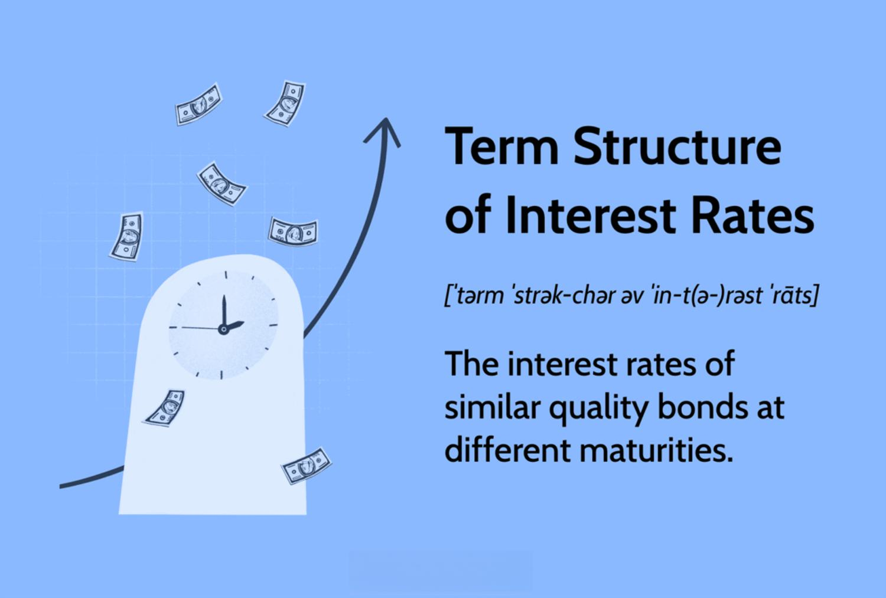

Understanding the interplay between the term structure of interest rates and algorithmic trading is crucial for financial market participants. This article explores how these two components are related to modern finance, assessing their implications for trading strategies and economic forecasting. At the heart of this analysis is the term structure of interest rates, commonly visualized through the yield curve, which provides significant insights into future economic conditions. The yield curve plots the interest rates of bonds of equal credit quality but differing maturities, offering a snapshot of market expectations and economic vigor.

Algorithmic trading, or algo-trading, has emerged as a dominant force in today's financial markets, utilizing complex algorithms and data analysis to automate trading decisions. This innovation has transformed the landscape of trading, providing advantages such as low latency, precision in trade execution, and reduced emotional bias, contributing to more efficient market operations.



This article aims to integrate these two components by demonstrating how the yield curve can influence algorithmic trading strategies. By analyzing the relationship between these elements, traders can better understand how movements in the yield curve signal potential trading opportunities or risks. The integration of yield curve information into algorithmic models enhances decision-making processes and strategy optimization, providing market participants with a robust framework for navigating complex financial environments.

The exploration of this interplay is not just academic but directly applicable, offering practical strategies for traders. Algorithmic systems can employ yield curve shifts to refine investment strategies, responding swiftly to interest rate changes and shaping more resilient trading approaches. As we proceed, the insights garnered from this convergence will highlight the sophisticated nature of modern financial markets and guide readers through leveraging these insights for strategic advantage.

## Table of Contents

## Understanding the Term Structure of Interest Rates

The term structure of interest rates, often visualized through the yield curve, is a fundamental concept in fixed income markets, representing the relationship between interest rates or bond yields and different maturities. Essentially, it indicates how the interest rate (or yield) changes with varying lengths of time until maturity for bonds with the same credit quality. The yield curve is crucial for investors as it provides insights into future economic conditions, inflation expectations, and monetary policy shifts.

The term structure can manifest in several distinct shapes: 

1. **Normal Yield Curve**: This is the most common shape, characterized by a curve that slopes upwards, indicating that longer-term bonds have higher yields than shorter-term ones. It suggests that investors expect future economic growth and possibly higher inflation rates, warranting a premium for holding longer-term securities.

2. **Inverted Yield Curve**: Contrary to the normal curve, an inverted curve slopes downward, signifying that short-term interest rates are higher than long-term rates. This shape is often perceived as a potential prelude to an economic recession, as investors expect lower future interest rates due to slowing economic activity.

3. **Flat Yield Curve**: This occurs when short-term and long-term yields are very close, signaling uncertainty in economic conditions. It may suggest a transition in the economic cycle, either towards growth or recession.

4. **Humped Yield Curve**: A less common occurrence, the humped curve shows intermediate-term yields that are higher than those for both short- and long-term securities. This can indicate temporary factors affecting specific maturities.

Several factors influence the shape of the yield curve:

- **Inflation Expectations**: Anticipated inflation influences interest rates, as higher expected inflation usually leads to higher long-term yields.

- **Economic Growth Projections**: If robust economic growth is expected, long-term rates often increase in anticipation of higher demand for capital and subsequent inflation rises.

- **Monetary Policy**: Central banks, such as the Federal Reserve, impact the yield curve through their control over short-term interest rates and policy outlook.

Various theories attempt to explain the term structure of interest rates. Notable among these are the Expectations Theory and the Liquidity Premium Theory:

- **Expectations Theory** posits that long-term interest rates are an average of current and expected future short-term rates. Thus, a normal yield curve reflects expectations of rising future short-term rates.

- **Liquidity Premium Theory** suggests that longer-term securities are inherently riskier and must offer a premium (higher yield) over shorter-term securities. This includes compensation for potential interest rate fluctuations and imperfect liquidity in long-term bond markets.

Understanding the term structure is essential for interpreting market signals and making informed investment decisions. The yield curve remains a vital tool for traders, economists, and policymakers aiming to gauge economic dynamics and potential [interest rate](/wiki/interest-rate-trading-strategies) movements.

## The Role of US Treasury Yield Curve

The US Treasury yield curve is a critical indicator for evaluating broader credit market conditions. Representing the relationship between various maturities of US Treasury securities, it is frequently employed as a benchmark for gauging economic sentiment and predicting future economic activity. The yield curve’s shape, which can be normal, inverted, or flat, offers insights into market expectations for growth, inflation, and interest rate changes. 

Traditionally, an upward-sloping, or normal, yield curve implies economic expansion. In this scenario, longer-term interest rates are higher than short-term rates, reflecting expectations of faster growth and higher inflation in the future. Short-term financial instruments offer lower yields due to lower risk and [volatility](/wiki/volatility-trading-strategies) expectations. Conversely, an inverted yield curve, where long-term rates fall below short-term rates, is often a precursor to economic recessions. Historically, the inversion suggests that investors expect a slowdown in growth and possibly lower interest rates in the future, as they are willing to accept lower yields on long-term securities.

Recent decades have challenged conventional interpretations of the yield curve. In several instances, unexpected variations in the yield curve’s shape have occurred due to factors such as unconventional monetary policies, including quantitative easing and forward guidance, which have altered interest rate dynamics. For instance, extensive bond-buying programs by central banks can depress long-term interest rates irrespective of traditional economic signals, leading to flatter or even inverted yield curves without immediate recessionary implications.

These developments underscore the importance of a nuanced understanding of the yield curve, beyond traditional rules of thumb, for accurate economic forecasting and investment decisions. As the yield curve continues to evolve, it remains a vital tool for financial analysts and policymakers striving to decode the complexities of the modern economic landscape.

## Algorithmic Trading: Mechanics and Benefits

Algorithmic trading, or algo-trading, automates trading processes, relying on predetermined criteria and advanced algorithms to make decisions with minimal human intervention. This technological advancement allows traders and institutions to execute trades at speeds and frequencies that would be impossible for a human trader. A significant advantage of [algorithmic trading](/wiki/algorithmic-trading) is its ability to process and act on information much faster than a human could, resulting in low latency and high precision in trade execution. This rapid execution minimizes the difference between the desired and actual executed prices, reducing slippage and increasing the efficiency of market operations.

Furthermore, algorithmic trading removes emotional bias from trading decisions. Emotional trading can lead to irrational decisions, particularly in volatile markets where fear and greed may influence judgment. By adhering to pre-set rules and strategies, algorithmic systems can maintain objective decision-making, contributing to more disciplined and consistent trading outcomes.

Various strategies employed in algorithmic trading encompass diverse approaches such as trend-following, [arbitrage](/wiki/arbitrage), and high-frequency trading. Trend-following strategies aim to capitalize on market trends and patterns, utilizing algorithms to identify and exploit these movements systematically. Arbitrage strategies, on the other hand, leverage price differentials across different markets or instruments, executing a series of transactions to profit from these discrepancies. High-frequency trading ([HFT](/wiki/high-frequency-trading-strategies)) involves executing a large number of orders at extremely high speeds, often taking advantage of small price differences over short time horizons. HFT requires advanced technologies and infrastructures to handle vast volumes of orders and data efficiently.

The implementation of these strategies often necessitates programming skills and expertise in quantitative analysis. Algorithms can be developed using languages such as Python, which provide libraries and frameworks to facilitate quantitative analysis and [backtesting](/wiki/backtesting) of trading strategies. For example, using the pandas and numpy libraries, traders can efficiently handle and process financial data to identify trade opportunities based on statistical patterns and models.

In summary, algorithmic trading leverages technology and quantitative analysis to enhance trading efficiency, precision, and objectivity, contributing to more robust and scalable trading operations. Through sophisticated algorithms and strategies, traders can exploit market inefficiencies and adjust to rapidly changing market conditions with speed and accuracy.

## Integrating Term Structure with Algorithmic Trading

Algorithmic systems have revolutionized the way financial markets operate by using advanced technologies to execute trades based on pre-defined strategies. One key element that traders can incorporate into these algorithms is the term structure of interest rates, often represented by the yield curve. The yield curve acts as a barometer, signaling shifts in economic conditions that can influence interest rate risks and investment strategies. 

By integrating yield curve data, algorithms can assess interest rate-related risks more efficiently. The shape and movements of the yield curve, whether upward-sloping, downward-sloping, or flat, provide insights into market expectations regarding economic growth and inflation. For instance, an upward-sloping curve typically signals a healthy economy with expectations of rising interest rates, whereas an inverted curve could indicate a potential recession. Algorithms equipped with this data can adjust trading positions accordingly, enhancing decision-making processes.

Yield curve signals can identify optimal entry and [exit](/wiki/exit-strategy) points in trading strategies. Suppose an algorithm detects a flattening of the yield curve, which could suggest weakening economic growth. In that case, it might trigger the liquidation of long positions in equities and initiate bond purchases to capitalize on expected interest rate cuts by the central bank. Such strategic decisions are vital for managing portfolios and mitigating risks tied to unpredictable market conditions.

Python, a popular language for developing trading algorithms, can be effectively utilized to incorporate yield curve analysis. With libraries like Pandas for data manipulation and NumPy for numerical computations, developers can easily create complex models to automate trading decisions. Here's a simplified example of how one might use Python to adjust a trading strategy based on yield curve changes:

```python
import numpy as np
import pandas as pd

def adjust_portfolio_based_on_yield_curve(yield_curve_data):
    # Check the yield curve shape
    if yield_curve_data.iloc[-1] < yield_curve_data.iloc[0]:
        # Inverted curve - potential recession indicator
        return "Increase bond holdings, reduce equities"
    elif yield_curve_data.iloc[-1] > yield_curve_data.iloc[0]:
        # Normal upward-sloping curve - indicates economic growth
        return "Increase equity holdings, reduce bonds"
    else:
        # Flat or humped curve
        return "Maintain current portfolio allocation"

# Example yield curve data (yield percentages for different maturities)
yield_curve_data = pd.Series([1.0, 1.5, 2.0, 2.5, 3.0, 3.5])

action = adjust_portfolio_based_on_yield_curve(yield_curve_data)
print(action)
```

By automating these adjustments, trading algorithms enhance the responsiveness to market changes, potentially optimizing portfolio management. The integration of yield curve data represents a fusion of economic insight with technological precision, offering a potent tool for navigating complex financial landscapes. 

As technology advances, algorithms will increasingly incorporate [machine learning](/wiki/machine-learning) to refine yield curve analysis, making strategies even more robust. However, this requires continuous refinement and understanding of the underlying economic implications captured within the yield curves to stay ahead in volatile markets.

## Implications and Future of Algo-Trading with Yield Curves

The future of algorithmic trading, when integrated with yield curve analysis, is expected to advance through the adoption of [artificial intelligence](/wiki/ai-artificial-intelligence) (AI) and machine learning technologies. These sophisticated models are designed to interpret complex financial data, recognize patterns, and make predictions which could significantly enhance trading strategies. AI-driven systems can automatically adjust to yield curve dynamics, offering the potential to better anticipate market changes.

Traders are increasingly focusing on refining these models to leverage the predictive power of the yield curve. By iteratively improving algorithms, institutions aim to enhance their ability to navigate shifts in interest rates and economic conditions. For example, machine learning algorithms can be trained using historical yield curve data to forecast future interest rate movements, potentially guiding more informed trading decisions.

However, leveraging yield curve information through algorithmic trading faces several challenges. Regulatory constraints present a considerable hurdle, as financial authorities continue to develop stringent rules to ensure market stability and fairness. These regulations may limit certain trading activities, necessitating that algorithms be continuously updated to remain compliant.

Additionally, maintaining an agile technological infrastructure is essential for the effective implementation of these advanced trading models. High-frequency trading environments demand robust and scalable systems capable of processing large volumes of data at rapid speeds. This requires significant investment in technology and continuous upgrades to handle the evolving landscape of financial markets.

In summary, the integration of yield curve analysis with algorithmic trading heralds a new era of financial innovation, driven by AI and machine learning. Although challenges exist, particularly in regulatory compliance and technological demands, the potential benefits of sophisticated predictive models promise to reshape trading strategies and outcomes.

## Conclusion

The integration of the term structure of interest rates and algorithmic trading serves as a testament to the synergy between economic insight and technological advancement. This convergence enables market participants to leverage sophisticated strategies that blend the predictive power of yield curves with the precision of algorithmic systems. Traders who adeptly combine an understanding of the term structure with algorithmic prowess are better positioned to navigate the nuanced landscape of financial markets.

The yield curve, an essential barometer of economic conditions, offers critical signals that can optimize algorithmic trading strategies. By interpreting changes in the slope and shape of the yield curve, traders can inform their trading decisions, adapting to shifts in economic expectations. This understanding aids in anticipating interest rate movements, mitigating risks, and identifying potential opportunities.

As technology continues to advance, the relationship between yield curves and algorithmic trading is expected to grow richer. Emerging technologies such as artificial intelligence and machine learning hold the potential to further refine these strategies, enabling the development of more predictive models. Such advancements can enhance decision-making capabilities, offering new avenues for in-depth market analysis and increased trading efficacy. The future likely holds a more profound integration of these domains, driven by continuous innovation and increasing computational power, which will empower traders to better forecast and respond to market dynamics.

## References & Further Reading

[1]: Fabozzi, F. J. (2005). ["Fixed Income Analysis."](https://books.google.com/books/about/Fixed_Income_Analysis.html?id=lujLawVLS3YC) John Wiley & Sons.

[2]: Campbell, J. Y., Lo, A. W., & MacKinlay, A. C. (1996). ["The Econometrics of Financial Markets."](https://www.jstor.org/stable/1344712) Princeton University Press.

[3]: Cox, J. C., Ingersoll, J. E., & Ross, S. A. (1985). ["A Theory of the Term Structure of Interest Rates."](https://pages.stern.nyu.edu/~dbackus/BCZ/discrete_time/CIR_Econometrica_85.pdf) Econometrica, 53(2), 385-407.

[4]: Treynor, J. (1987). ["Market efficiency and the yield curve"](https://www.studocu.com/en-us/document/university-of-pittsburgh/efficiency-of-capital-markets/market-efficiency-and-the-bean-jar-experiment/81287283). Financial Analysts Journal, 43(4), 10-13.

[5]: Hasbrouck, J. (1995). ["One Security, Many Markets: Determining the Contributions to Price Discovery."](https://www.bauer.uh.edu/rsusmel/phd/hasbrouck95.pdf) Journal of Finance, 50(4), 1175-1199.

[6]: Narasimhan, J., & Wang, J. (2005). ["The Information Content of the Yield Curve: Evidence from the U.S. and U.K."](https://scholar.google.com/citations?user=QZ-Ucx0AAAAJ) Review of Financial Studies, 18(3), 1343-1375.