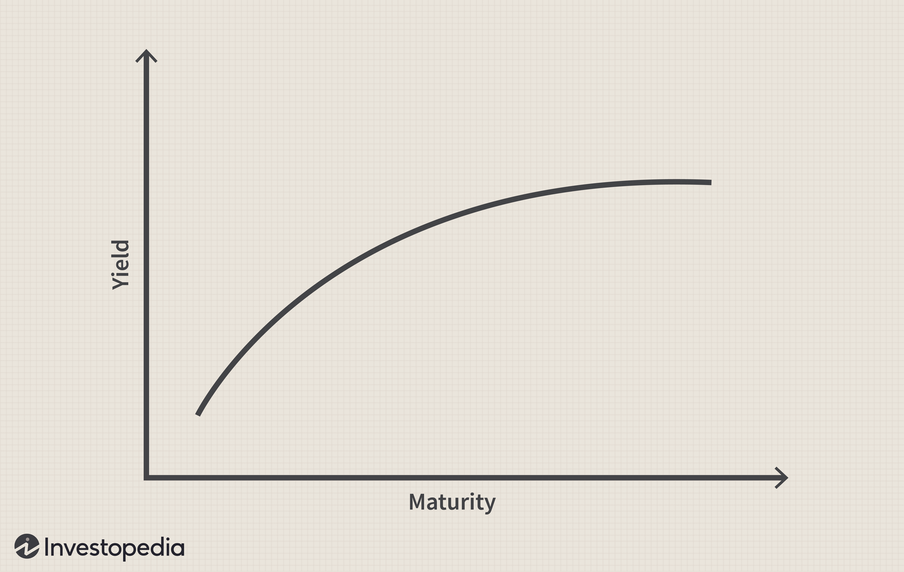

The landscape of financial markets has undergone significant evolution due to technological advancements, with algorithmic trading playing a central role in this transformation. One essential aspect essential for understanding these markets is the term structure of interest rates, typically illustrated using the yield curve. This article investigates the interconnectedness of algorithmic trading and the yield curve, highlighting how they collectively shape contemporary trading strategies. 

The term structure of interest rates provides insight into the relationship between interest rates or bond yields of different maturities. The associated yield curve offers critical economic signals regarding expectations of future interest rates, economic activity, and inflation. Its various shapes—normal, inverted, flat, and humped—indicate unique economic conditions and investor expectations.



Algorithmic trading, as an application of computer algorithms in trading decisions, has revolutionized financial markets by offering faster and more efficient trade execution. The integration of yield curve analysis into these trading systems has further empowered market participants, allowing them to better manage risk and capitalize on market inefficiencies.

The interconnected dynamics of the yield curve and algorithmic trading underscore the importance of understanding their interaction for market participants seeking to enhance their trading models and accurately forecast economic trends. As technology continues to advance, the ability to effectively integrate these elements is becoming increasingly crucial for trading strategies that aim to harness economic insights with algorithmic precision.

## Table of Contents

## Understanding the Term Structure of Interest Rates

The term structure of interest rates is a critical concept in fixed income markets, illustrated through the yield curve. The yield curve represents the relationship between bond yields and their maturities, offering vital insights into future economic conditions. By analyzing the shape of the yield curve, economists and investors can glean information about market expectations regarding interest rates, inflation, and overall economic health.

The yield curve typically assumes four primary shapes: normal, inverted, flat, and humped. A normal yield curve, which slopes upward, is indicative of economic growth expectations, as longer-term bonds usually offer higher yields than short-term ones due to the risks associated with time. An inverted yield curve often serves as a predictor of recession, as it suggests that short-term borrowing costs are higher than long-term ones, potentially reflecting anticipated declines in interest rates and economic activity. A flat yield curve signals uncertainty, with minimal differences between short and long-term interest rates. A humped yield curve, less common, indicates a peak in yields at a certain maturity, possibly reflecting specific market conditions or uncertainties.

Several factors influence the yield curve, including but not limited to inflation expectations, projections for economic growth, and monetary policy decisions. For example, if investors expect inflation to rise, they will demand higher yields for long-term bonds, thereby affecting the yield curve's shape. Similarly, central bank policies, such as altering interest rates or engaging in quantitative easing, can significantly impact the yield curve by influencing borrowing costs and economic outlooks.

Two prominent theories that explain the term structure of interest rates are the Expectations Theory and Liquidity Premium Theory. The Expectations Theory posits that long-term interest rates are a reflection of expected future short-term rates, suggesting that the shape of the yield curve is determined by investors' outlooks on interest rates over time. Mathematically, if $E(r_n)$ is the expected future short-term rate for period $n$, the long-term rate ($r_L$) can be expressed as:

$$
r_L = \frac{r_1 + E(r_2) + E(r_3) + \cdots + E(r_n)}{n}
$$

In contrast, the Liquidity Premium Theory adds a risk premium to account for uncertainties and [liquidity](/wiki/liquidity-risk-premium) differences between short and long-term bonds. This theory suggests that investors require extra compensation for holding longer-term securities, resulting in an upward slope of the yield curve even if future short-term rates are expected to remain constant.

In conclusion, the term structure of interest rates, as visualized through the yield curve, is a powerful tool for understanding and forecasting economic trends. Its interpretation requires carefully analyzing factors such as inflation, growth projections, and monetary policy, while applying theoretical frameworks like the Expectations and Liquidity Premium Theories.

## The Role of US Treasury Yield Curve

The US Treasury yield curve serves as a pivotal economic indicator, frequently employed to forecast future economic trends and assess market sentiment. It graphically represents the relationship between the yields of Treasury securities and their maturities. The yield curve typically assumes several shapes, each with distinct economic implications.

A traditionally upward-sloping (or normal) yield curve is indicative of economic expansion. This shape suggests that long-term interest rates are higher than short-term rates, reflecting investors' expectations of rising future interest rates correlated with anticipated economic growth. On the flip side, an inverted yield curve, where short-term rates exceed long-term rates, is often a harbinger of an impending recession. This inversion indicates that investors expect future interest rates to decrease, typically due to a forecast of economic slowdown.

In recent times, unconventional monetary policies, such as quantitative easing implemented by central banks, have introduced complexities into the interpretation of the yield curve. Quantitative easing, involving the large-scale purchase of securities, can suppress long-term interest rates and thus flatten or invert the yield curve without signaling an economic downturn. This necessitates a more nuanced interpretation, particularly when distinguishing between market-driven signals and those artificially influenced by monetary policy interventions.

For financial analysts and policymakers, a refined comprehension of these yield curve dynamics is vital for economic forecasting and making informed investment decisions. The evolving behaviors of the yield curve continue to provide crucial insights, necessitating that analysts assimilate both traditional and modern factors influencing these changes. Understanding these forces can help in adjusting financial strategies accordingly, given the stiff interplay between market actions and policy decisions. Thus, as an instrument of economic analysis, the US Treasury yield curve remains indispensable, offering foresight into potential economic trajectories and shaping strategic financial planning.

## Algorithmic Trading: Mechanics and Benefits

Algorithmic trading utilizes sophisticated algorithms to automate the execution of trades, capitalizing on speed, precision, and data-driven decision-making. This approach leverages computational power to streamline processes, reducing human error and emotional bias, which are common in manual trading. By minimizing these biases, [algorithmic trading](/wiki/algorithmic-trading) enhances market efficiency and allows for trades to be executed with low latency, a crucial advantage in high-speed financial markets.

One of the primary benefits of algorithmic trading is its ability to operate seamlessly at high frequencies, executing large volumes of trades at speeds beyond human capability. This is essential for strategies such as high-frequency trading ([HFT](/wiki/high-frequency-trading-strategies)), which requires trades to be conducted in fractions of a second to capitalize on minimal price discrepancies. Another popular strategy is [arbitrage](/wiki/arbitrage), which involves exploiting price differences across different markets or financial instruments, thus ensuring that the market prices remain aligned and consistent.

Trend-following strategies, which identify and capitalize on the continuance of current market trends, also form a significant part of algorithmic trading. These strategies require complex calculations and data analysis, areas where modern algorithms excel. Consequently, the implementation of these strategies depends heavily on cutting-edge technological infrastructure, along with robust data analytics and fast processing speed.

The development and implementation of trading algorithms require a strong programming foundation, with Python being one of the most widely used languages in this domain. Python offers a rich ecosystem of libraries and tools that facilitate data analysis, [machine learning](/wiki/machine-learning), and the rapid development of trading algorithms. Here is a simple Python script to illustrate a basic moving average crossover strategy, a popular technique in algorithmic trading:

```python
import numpy as np
import pandas as pd

def moving_average_crossover(prices, short_window=40, long_window=100):
    signals = pd.DataFrame(index=prices.index)
    signals['price'] = prices
    signals['short_mavg'] = prices.rolling(window=short_window, min_periods=1, center=False).mean()
    signals['long_mavg'] = prices.rolling(window=long_window, min_periods=1, center=False).mean()

    signals['signal'] = 0.0
    signals['signal'][short_window:] = np.where(
        signals['short_mavg'][short_window:] > signals['long_mavg'][short_window:], 1.0, 0.0)

    signals['positions'] = signals['signal'].diff()

    return signals

# Example usage:
# Assume 'data' is a DataFrame with a DateTime index and a column 'Close' representing closing prices
# signals = moving_average_crossover(data['Close'])
```

This algorithm evaluates moving averages over different periods and generates trade signals. It illustrates how computational techniques can automate decision-making and adapt strategically to market dynamics, exploiting inefficiencies and trends with minimal delay.

Algorithmic trading's ability to systematically exploit market inefficiencies lies at the core of its appeal. Rapid shifts in market conditions can be quickly analyzed and responded to by well-designed algorithms. This adaptability is critical in an environment where speed and accuracy directly influence profitability and where every millisecond counts. 

As technological capabilities advance, algorithmic trading systems become increasingly sophisticated, allowing for more complex strategies to be implemented and optimized continuously, enabling traders to navigate complex market structures effectively.

## Integrating Term Structure with Algorithmic Trading

Algorithmic trading leverages quantitative models to execute trades at speeds and efficiency levels superior to human traders. Integrating yield curve data into these models enhances their ability to assess [interest rate](/wiki/interest-rate-trading-strategies)-related risks, crucial for effective trading in fixed-income markets. The yield curve, which maps bond yields against maturities, provides predictions of future economic growth and inflation. By utilizing these predictions, algorithmic trading systems can adjust trading positions dynamically.

Python programming is integral to automating such strategy adjustments. For example, libraries like NumPy and Pandas enable efficient manipulation and analysis of large datasets, while machine learning libraries such as Scikit-learn and TensorFlow facilitate the development of predictive models. An algorithm might leverage gradient boosting trees (a potent machine learning technique) to predict yield curve shifts based on historical data:

```python
from sklearn.ensemble import GradientBoostingRegressor
import numpy as np
import pandas as pd

# Assume data contains features from historical financial market data
# and target is the yield data
data = pd.read_csv('financial_data.csv')
X = data.drop('yield', axis=1)
y = data['yield']

# Initialize the model
model = GradientBoostingRegressor(n_estimators=100, learning_rate=0.1, max_depth=3)

# Fit the model
model.fit(X, y)

# Predict future yields
predicted_yield = model.predict(X)
```

By analyzing the predicted yield outcomes, algorithms can identify optimal trading opportunities. These opportunities often manifest as alterations in trading positions to anticipate shifts in economic indicators suggested by the changing shapes of the yield curve—be it normal, inverted, or flat.

Advanced machine learning techniques, such as neural networks and [deep learning](/wiki/deep-learning) models, are now being applied to yield curve analysis. These techniques improve the refinement of trading models by allowing systems to identify complex patterns within yield curve data that traditional analytics might overlook. This capability is pivotal in high-frequency trading environments, where response times and accuracy significantly impact profitability.

In conclusion, integrating yield curve data within algorithmic trading systems provides a sophisticated approach for optimizing portfolio management. By predicting economic trends and adjusting trading strategies accordingly, these systems can exploit market inefficiencies with greater precision, ultimately leading to more informed trading decisions.

## Implications and Future of Algo-Trading with Yield Curves

The integration of yield curve analysis with algorithmic trading is undergoing significant evolution, primarily driven by advancements in [artificial intelligence](/wiki/ai-artificial-intelligence) (AI) and machine learning technologies. These innovations are poised to elevate the precision and adaptability of algorithmic trading strategies. AI-driven systems are now capable of enhancing predictive models, thereby improving the anticipation of market changes. By leveraging complex algorithms, these systems can process vast amounts of data, including historical yield curve patterns, to identify trends and anomalies that may signal future economic shifts.

The capabilities of machine learning models such as neural networks and deep learning are particularly promising in refining the analysis of yield curves. These models can uncover intricate patterns and correlations that traditional statistical methods might miss. For instance, a [neural network](/wiki/neural-network) trained on yield curve data can adapt its predictions based on ongoing market dynamics, potentially outperforming static models.

However, the implementation of these advanced technologies faces significant regulatory and technological challenges. Financial regulators are increasingly focused on the impact of algorithmic trading on market stability and the potential for systemic risks, necessitating stringent compliance and monitoring mechanisms. Moreover, the technological demands for maintaining agile and scalable infrastructures are nontrivial. Algo-trading platforms require robust and low-latency networks, high-frequency data feeds, and secure trading algorithms to fully leverage yield curve insights.

The future of trading strategies will be shaped by these sophisticated predictive models, which utilize yield curves as inputs to drive decision-making processes. Traders and financial institutions that effectively integrate these technologies are likely to gain a competitive edge, as they can respond more accurately and swiftly to market developments. As AI and machine learning models continue to evolve, they will further enhance the ability to extract actionable insights from yield curve data, paving the way for more resilient and adaptive trading strategies.

## Conclusion

The convergence of the term structure of interest rates and algorithmic trading in finance offers a notable synergy, enhancing trading strategies and decision-making processes. Yield curves serve as critical economic indicators, enabling traders to interpret market signals and anticipate economic trends. These curves, through their shapes and movements, provide insights into future interest rates, economic growth, and inflation expectations. Traders who adeptly interpret these curves can optimize their trading models to align with market conditions.

Technological advancements, particularly in artificial intelligence (AI) and machine learning, are at the forefront of refining these strategies. These technologies enhance the ability to analyze vast amounts of financial data, offering predictions with greater accuracy and speed. For instance, AI algorithms can identify patterns in yield curve data, directly impacting trading decisions by signaling potential economic shifts. The adaptability of AI systems allows for the continuous improvement of trading models, incorporating the latest data and adapting to changing market conditions.

Traders that effectively integrate yield curve insights with algorithmic trading are better positioned to navigate the complexities of modern financial markets. By leveraging the dual strengths of economic theory and technological innovation, they can exploit market inefficiencies and adapt strategies in real-time. This integration not only optimizes returns but also mitigates risk, offering a competitive edge in increasingly volatile markets.

Looking ahead, the fusion of economic insights with algorithmic precision is set to deepen, unlocking new opportunities in trading. The potential for more sophisticated predictive models will enable a more nuanced understanding of market dynamics, fostering a more informed and strategic approach to investment. As technology continues to evolve, the synergy between yield curves and algorithmic trading will likely play a pivotal role in shaping the future landscape of financial markets.

## References & Further Reading

Fabozzi, F. J. (2005). Fixed Income Analysis. John Wiley & Sons.  
This comprehensive guide investigates into the complexities of fixed income markets, offering insights into pricing, risk management, and the various instruments involved. It is an essential resource for understanding the mechanics underlying the yield curve and its applications in algorithmic trading.

Campbell, J. Y., Lo, A. W., & MacKinlay, A. C. (1996). The Econometrics of Financial Markets. Princeton University Press.  
This book provides an in-depth examination of econometric models applied to financial data, including the analysis of yield curves. It equips readers with the statistical tools necessary to interpret market trends and optimize trading strategies based on quantitative insights.

Cox, J. C., Ingersoll, J. E., & Ross, S. A. (1985). A Theory of the Term Structure of Interest Rates. Econometrica, 53(2), 385-407.  
This seminal paper presents a theoretical framework for understanding the term structure of interest rates, introducing the CIR model. The model explains how interest rates evolve over time, essential for developing algorithms that incorporate yield curve dynamics into trading strategies.

Treynor, J. (1987). Market efficiency and the yield curve. Financial Analysts Journal, 43(4), 10-13.  
Treynor's article offers a concise analysis of market efficiency, focusing on how the yield curve reflects information about future economic conditions. This work is crucial for traders seeking to harness yield curve data within algorithmic systems to enhance market predictions.

Hasbrouck, J. (1995). One Security, Many Markets: Determining the Contributions to Price Discovery. Journal of Finance, 50(4), 1175-1199.  
This paper explores the concept of price discovery across different markets, a fundamental aspect of algorithmic trading. The insights provided are valuable for understanding how yield curve variations can signal trading opportunities and contribute to more effective market strategies.

