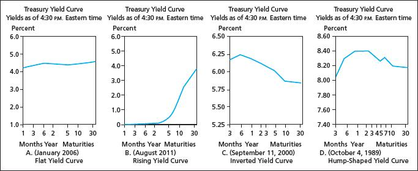

## Table of Contents

## What is the term structure of interest rates?

The term structure of interest rates, often referred to as the yield curve, shows the relationship between interest rates and the time to maturity of debt securities. It's like a graph where the horizontal axis represents the time until the debt matures, and the vertical axis shows the interest rate or yield. By looking at this graph, you can see how interest rates change over different time periods.

This structure is important because it helps investors and policymakers understand future interest rate expectations and economic conditions. For example, if short-term interest rates are lower than long-term rates, the yield curve is said to be upward sloping, which usually means the economy is expected to grow. On the other hand, if long-term rates are lower than short-term rates, creating an inverted yield curve, it might signal that people expect economic slowdown or even a recession.

## What is a yield curve?

A yield curve is a graph that shows how much interest people can earn from different types of loans or bonds over time. It compares the interest rates, or yields, of these loans based on how long they last before they need to be paid back. The horizontal line on the graph shows the time until the loan matures, and the vertical line shows the interest rate. By looking at the yield curve, you can see if short-term loans have higher or lower interest rates than long-term loans.

The shape of the yield curve can tell us a lot about what people think will happen with the economy. If the curve goes up from left to right, it means that long-term loans have higher interest rates than short-term loans. This is called an upward sloping yield curve, and it usually means people expect the economy to grow. But if the curve goes down, with long-term rates lower than short-term rates, it's called an inverted yield curve. This can be a warning sign that people expect the economy might slow down or even go into a recession.

## How are the term structure and the yield curve related?

The term structure of interest rates and the yield curve are basically the same thing, just described in different ways. The term structure is all about how interest rates change over time for different lengths of loans or bonds. It's like a plan that shows what interest rates will be in the future for short, medium, and long-term loans. The yield curve, on the other hand, is a picture of this plan. It's a graph that plots these interest rates against the time until the loans mature, making it easy to see how rates change over different time periods.

Both the term structure and the yield curve help people understand what might happen with the economy. If the yield curve goes up, showing that long-term loans have higher interest rates than short-term loans, it usually means people think the economy will grow. But if the curve goes down, with long-term rates lower than short-term rates, it might mean people are worried about the economy slowing down or even going into a recession. So, by looking at the yield curve, which is a visual representation of the term structure, people can make guesses about future economic conditions.

## What are the different types of yield curves?

There are different types of yield curves that show how interest rates change over time for different lengths of loans or bonds. The most common type is the normal yield curve, which goes up from left to right. This means that long-term loans have higher interest rates than short-term loans. People usually see a normal yield curve when they think the economy will keep growing because they expect higher inflation and interest rates in the future.

Another type is the inverted yield curve, which goes down from left to right. This happens when long-term loans have lower interest rates than short-term loans. An inverted yield curve can be a warning sign because it might mean people think the economy will slow down or go into a recession. They expect lower inflation and interest rates in the future, so they want to lock in the higher short-term rates.

There's also the flat yield curve, where the interest rates for short-term and long-term loans are about the same. This can happen when people are not sure about what will happen with the economy. It might be a sign that the economy is moving from growing to slowing down, or the other way around. Each type of yield curve gives clues about what people think will happen with the economy in the future.

## What factors influence the shape of the yield curve?

The shape of the yield curve is influenced by many things, like what people think will happen with the economy and inflation. If people expect the economy to grow and inflation to go up, they might want higher interest rates for long-term loans. This makes the yield curve go up, which is called a normal yield curve. But if people think the economy might slow down or even go into a recession, they might want lower interest rates for long-term loans. This makes the yield curve go down, creating an inverted yield curve.

Another thing that affects the yield curve is what the government and central banks do with interest rates. For example, if the central bank raises short-term interest rates to control inflation, it can make the yield curve flatter or even inverted. On the other hand, if they lower short-term rates to help the economy grow, it can make the yield curve steeper. Also, the demand for loans and bonds can change the shape of the yield curve. If a lot of people want to buy long-term bonds, it can push their interest rates down and make the yield curve flatter or inverted.

## How can the term structure be used to predict economic conditions?

The term structure, or the yield curve, helps us guess what might happen with the economy. When the yield curve goes up, with long-term loans having higher interest rates than short-term loans, it usually means people think the economy will keep growing. They expect more inflation and higher interest rates in the future, so they want more money for lending their money for a long time. This is called a normal yield curve, and it's a good sign for the economy.

But if the yield curve goes down, with long-term loans having lower interest rates than short-term loans, it's called an inverted yield curve. This can be a warning sign because it might mean people think the economy will slow down or even go into a recession. They expect less inflation and lower interest rates in the future, so they're okay with lending their money for a long time at lower rates. By looking at the shape of the yield curve, people can make guesses about what might happen with the economy and plan accordingly.

## What is the difference between a spot rate curve and a forward rate curve?

A spot rate curve shows the interest rates you can get right now for loans or bonds that last different amounts of time. It's like a snapshot of what interest rates are today for short, medium, and long-term loans. If you want to know what [interest rate](/wiki/interest-rate-trading-strategies) you would get if you borrowed money for one year, two years, or ten years starting today, you would look at the spot rate curve. It helps people see how interest rates change over different time periods at the current moment.

A forward rate curve, on the other hand, shows what interest rates are expected to be in the future for loans or bonds that start at a later date. It's like a prediction of what interest rates will be if you wait to borrow or lend money. For example, if you want to know what interest rate you might get for a loan that starts in one year and lasts for another year, you would look at the forward rate curve. It helps people plan for the future by showing what interest rates might be at different times ahead.

## How do shifts in the yield curve affect bond pricing?

Shifts in the yield curve can change how much a bond is worth. When the yield curve moves up, meaning interest rates go up for all time periods, the price of bonds usually goes down. This happens because new bonds will be issued with higher interest rates, making older bonds with lower rates less attractive. People who want to sell their old bonds have to lower the price to make them more appealing to buyers. On the other hand, when the yield curve moves down and interest rates drop, the price of bonds goes up. Old bonds with higher interest rates become more valuable because new bonds will have lower rates.

The shape of the yield curve also matters for bond pricing. If the yield curve gets steeper, with long-term rates going up more than short-term rates, the prices of long-term bonds will drop more than short-term bonds. This is because the higher long-term rates make those bonds less attractive compared to new ones. But if the yield curve flattens, with long-term rates not going up as much as short-term rates, long-term bonds might not lose as much value. And if the yield curve inverts, with long-term rates lower than short-term rates, it can make long-term bonds more valuable because they offer higher rates than new bonds being issued.

## What is the significance of an inverted yield curve?

An inverted yield curve happens when the interest rates for long-term loans are lower than the interest rates for short-term loans. This is a big deal because it can be a warning sign that the economy might be heading into a recession. When people see an inverted yield curve, it means they think the economy will slow down in the future. They expect less inflation and lower interest rates, so they're okay with lending their money for a long time at lower rates.

This is important for people who invest money and for people who make decisions about the economy. An inverted yield curve has often happened before recessions in the past, so it's something people watch closely. If the yield curve inverts, it can make people more careful with their money and might lead businesses to cut back on spending and hiring. This can make the economy slow down even more, turning the warning sign into a real problem.

## How do central bank policies impact the term structure?

Central bank policies can change the term structure of interest rates a lot. When a central bank decides to raise short-term interest rates, it can make the yield curve flatter or even inverted. This happens because short-term rates go up, but long-term rates might not change as much. People might think the economy will slow down, so they want lower long-term rates. On the other hand, if the central bank lowers short-term rates to help the economy grow, it can make the yield curve steeper. This is because short-term rates go down, but long-term rates might stay the same or go up a little, showing that people expect the economy to get better.

The central bank can also use other tools to affect the term structure. For example, they might buy or sell long-term bonds to change long-term interest rates. If they buy a lot of long-term bonds, it can push long-term rates down and make the yield curve flatter. If they sell a lot of long-term bonds, it can push long-term rates up and make the yield curve steeper. By doing these things, the central bank can try to control what happens with the economy and help it grow or slow down as needed.

## What advanced models are used to analyze the term structure of interest rates?

To understand how interest rates change over time, people use fancy math models called the term structure models. One popular model is the Nelson-Siegel model. This model helps break down the yield curve into three simple parts: the level, the slope, and the curvature. The level shows the overall interest rate, the slope tells us if short-term rates are different from long-term rates, and the curvature shows how the yield curve bends. By looking at these parts, people can guess what might happen with interest rates and the economy in the future.

Another model people use is the Cox-Ingersoll-Ross (CIR) model. This model is good at showing how interest rates move around over time. It says that interest rates can go up or down, but they can't go below zero. The CIR model helps people figure out how much risk there is in the economy and what might happen with bond prices. Both the Nelson-Siegel and CIR models help people make smart choices about investing money and planning for the future.

## How can investors use the term structure to optimize their investment strategies?

Investors can use the term structure of interest rates, or the yield curve, to make smarter choices about where to put their money. By looking at the shape of the yield curve, investors can guess what might happen with the economy and interest rates in the future. If the yield curve is going up, with long-term rates higher than short-term rates, it usually means people think the economy will keep growing. Investors might want to buy long-term bonds to lock in those higher rates. But if the yield curve is going down, with long-term rates lower than short-term rates, it might be a warning sign that the economy could slow down. In this case, investors might want to be careful and put their money into short-term bonds or other safe investments.

The term structure also helps investors see how much risk they are taking with their money. If the yield curve is flat, it means short-term and long-term rates are about the same, and people might be unsure about what will happen with the economy. In this situation, investors might want to spread their money around in different types of investments to lower their risk. By understanding the term structure, investors can make better decisions about when to buy or sell bonds and how to balance their investments between short-term and long-term options. This way, they can try to make more money while keeping their investments safe.

## What is the Term Structure of Interest Rates and How Can We Understand It?

The term structure of interest rates is a critical concept in fixed income markets, illustrated through the yield curve. The yield curve represents the relationship between bond yields and their maturities, offering vital insights into future economic conditions. By analyzing the shape of the yield curve, economists and investors can glean information about market expectations regarding interest rates, inflation, and overall economic health.

The yield curve typically assumes four primary shapes: normal, inverted, flat, and humped. A normal yield curve, which slopes upward, is indicative of economic growth expectations, as longer-term bonds usually offer higher yields than short-term ones due to the risks associated with time. An inverted yield curve often serves as a predictor of recession, as it suggests that short-term borrowing costs are higher than long-term ones, potentially reflecting anticipated declines in interest rates and economic activity. A flat yield curve signals uncertainty, with minimal differences between short and long-term interest rates. A humped yield curve, less common, indicates a peak in yields at a certain maturity, possibly reflecting specific market conditions or uncertainties.

Several factors influence the yield curve, including but not limited to inflation expectations, projections for economic growth, and monetary policy decisions. For example, if investors expect inflation to rise, they will demand higher yields for long-term bonds, thereby affecting the yield curve's shape. Similarly, central bank policies, such as altering interest rates or engaging in quantitative easing, can significantly impact the yield curve by influencing borrowing costs and economic outlooks.

Two prominent theories that explain the term structure of interest rates are the Expectations Theory and Liquidity Premium Theory. The Expectations Theory posits that long-term interest rates are a reflection of expected future short-term rates, suggesting that the shape of the yield curve is determined by investors' outlooks on interest rates over time. Mathematically, if $E(r_n)$ is the expected future short-term rate for period $n$, the long-term rate ($r_L$) can be expressed as:

$$
r_L = \frac{r_1 + E(r_2) + E(r_3) + \cdots + E(r_n)}{n}
$$

In contrast, the Liquidity Premium Theory adds a risk premium to account for uncertainties and [liquidity](/wiki/liquidity-risk-premium) differences between short and long-term bonds. This theory suggests that investors require extra compensation for holding longer-term securities, resulting in an upward slope of the yield curve even if future short-term rates are expected to remain constant.

In conclusion, the term structure of interest rates, as visualized through the yield curve, is a powerful tool for understanding and forecasting economic trends. Its interpretation requires carefully analyzing factors such as inflation, growth projections, and monetary policy, while applying theoretical frameworks like the Expectations and Liquidity Premium Theories.

## References & Further Reading

Fabozzi, F. J. (2005). Fixed Income Analysis. John Wiley & Sons.  
This comprehensive guide investigates into the complexities of fixed income markets, offering insights into pricing, risk management, and the various instruments involved. It is an essential resource for understanding the mechanics underlying the yield curve and its applications in [algorithmic trading](/wiki/algorithmic-trading).

Campbell, J. Y., Lo, A. W., & MacKinlay, A. C. (1996). The Econometrics of Financial Markets. Princeton University Press.  
This book provides an in-depth examination of econometric models applied to financial data, including the analysis of yield curves. It equips readers with the statistical tools necessary to interpret market trends and optimize trading strategies based on quantitative insights.

Cox, J. C., Ingersoll, J. E., & Ross, S. A. (1985). A Theory of the Term Structure of Interest Rates. Econometrica, 53(2), 385-407.  
This seminal paper presents a theoretical framework for understanding the term structure of interest rates, introducing the CIR model. The model explains how interest rates evolve over time, essential for developing algorithms that incorporate yield curve dynamics into trading strategies.

Treynor, J. (1987). Market efficiency and the yield curve. Financial Analysts Journal, 43(4), 10-13.  
Treynor's article offers a concise analysis of market efficiency, focusing on how the yield curve reflects information about future economic conditions. This work is crucial for traders seeking to harness yield curve data within algorithmic systems to enhance market predictions.

Hasbrouck, J. (1995). One Security, Many Markets: Determining the Contributions to Price Discovery. Journal of Finance, 50(4), 1175-1199.  
This paper explores the concept of price discovery across different markets, a fundamental aspect of algorithmic trading. The insights provided are valuable for understanding how yield curve variations can signal trading opportunities and contribute to more effective market strategies.

