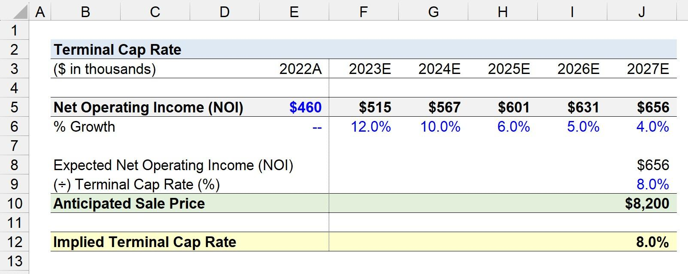

## Table of Contents

## What is the Terminal Capitalization Rate?

The Terminal Capitalization Rate, often called the "terminal cap rate," is a term used in real estate and finance. It helps figure out the value of a property at the end of a certain period. This rate is used when someone wants to know what a property might be worth in the future, after a set number of years.

To find the terminal value of a property, you take the expected net operating income at the end of the holding period and divide it by the terminal cap rate. This gives you an idea of how much the property could be sold for at that time. The terminal cap rate is important because it affects the overall return on investment for real estate projects.

## Why is the Terminal Capitalization Rate important in real estate valuation?

The Terminal Capitalization Rate is important in real estate valuation because it helps investors figure out what a property might be worth at the end of their investment period. When people buy a property, they often plan to hold onto it for a certain number of years before selling it. The terminal cap rate is used to estimate the future value of the property at the time of sale. This is crucial because it affects the overall return on investment. If the terminal cap rate is low, the property's value at the end of the holding period will be higher, making the investment more attractive.

Understanding the terminal cap rate also helps investors make better decisions about whether to buy, hold, or sell a property. It gives them a way to compare different investment opportunities. For example, if one property has a lower terminal cap rate than another, it might be a better long-term investment because it could be sold for more money in the future. By using the terminal cap rate, investors can plan their strategies more effectively and aim for the best possible returns on their real estate investments.

## How does the Terminal Capitalization Rate differ from the Going-In Cap Rate?

The Terminal Capitalization Rate and the Going-In Cap Rate are two different rates used in real estate to help figure out how much a property is worth. The Going-In Cap Rate, also called the initial cap rate, is used when you first buy a property. It helps you understand the property's value right away by taking the first year's net operating income and dividing it by the purchase price. This rate is important because it shows you how much money you can expect to make from the property in the first year.

On the other hand, the Terminal Capitalization Rate is used to figure out what the property might be worth at the end of your investment period. This rate is used to calculate the terminal value, which is how much you could sell the property for after holding it for a certain number of years. You use the expected net operating income at the end of that period and divide it by the terminal cap rate. This helps you plan for the future and see if the property will be a good long-term investment.

## What are the key components needed to calculate the Terminal Capitalization Rate?

To calculate the Terminal Capitalization Rate, you need to know two main things: the expected net operating income at the end of your investment period and a good guess at what the market cap rate will be at that time. The expected net operating income is how much money you think the property will make after all the costs are paid, like maintenance and taxes, but before paying back any loans. This is important because it shows how profitable the property will be in the future.

The other part is guessing what the market cap rate will be when you plan to sell the property. The market cap rate can change over time because of things like the economy, interest rates, and how much people want to buy properties in that area. To make a good guess, you need to look at what's happening in the real estate market now and what might happen in the future. Once you have these two pieces of information, you can divide the expected net operating income by the guessed market cap rate to find the terminal value of the property.

## Can you explain the formula used to calculate the Terminal Capitalization Rate?

The formula to calculate the Terminal Capitalization Rate is pretty straightforward. You take the expected net operating income at the end of your investment period and divide it by the guessed market cap rate at that time. The expected net operating income is how much money you think the property will make after paying all the costs, like maintenance and taxes, but before paying back any loans. This number helps you see how profitable the property will be in the future.

The guessed market cap rate is your best guess about what the market cap rate will be when you plan to sell the property. This rate can change because of things like the economy, interest rates, and how much people want to buy properties in that area. To make a good guess, you need to look at what's happening in the real estate market now and what might happen in the future. Once you have these two numbers, you can divide the expected net operating income by the guessed market cap rate to find out what the property might be worth at the end of your investment period.

## What assumptions are typically made when calculating the Terminal Capitalization Rate?

When calculating the Terminal Capitalization Rate, people usually make some guesses about the future. One big guess is about the net operating income at the end of the investment period. This means they try to figure out how much money the property will make after paying all the costs, like maintenance and taxes, but before paying back any loans. They look at how the property has been doing and what might change in the future to come up with this number.

Another important guess is about the market cap rate at the time they plan to sell the property. The market cap rate can go up or down because of things like the economy, interest rates, and how much people want to buy properties in that area. To make a good guess, people look at what's happening in the real estate market now and what might happen in the future. These guesses are important because they help figure out what the property might be worth at the end of the investment period.

## How do market conditions affect the Terminal Capitalization Rate?

Market conditions have a big impact on the Terminal Capitalization Rate because they affect both the net operating income and the market cap rate at the end of the investment period. When the economy is doing well, people might be willing to pay more for properties, which can make the market cap rate go down. This means the terminal value of the property goes up, making it a better investment. On the other hand, if the economy is not doing well, people might not want to buy as much, and the market cap rate could go up, making the property's terminal value go down.

Interest rates also play a big role in the Terminal Capitalization Rate. When interest rates are low, borrowing money is cheaper, which can lead to more people wanting to buy properties. This demand can push the market cap rate down, increasing the terminal value of the property. But if interest rates go up, borrowing becomes more expensive, and fewer people might want to buy, which can push the market cap rate up and lower the terminal value. So, keeping an eye on market conditions is really important for figuring out the Terminal Capitalization Rate and planning real estate investments.

## What are common mistakes to avoid when calculating the Terminal Capitalization Rate?

One common mistake people make when calculating the Terminal Capitalization Rate is not updating their guesses about the future. They might use old information about the net operating income or the market cap rate, which can lead to wrong numbers. It's important to keep looking at what's happening in the real estate market and the economy to make better guesses. If you don't, you might think a property will be worth more than it really will be at the end of your investment period.

Another mistake is not thinking about how things like interest rates and the economy can change over time. These things can make the market cap rate go up or down, which changes the terminal value of the property. If you don't consider these changes, your calculations might be off. It's a good idea to look at different scenarios and see how they might affect your investment to avoid surprises later on.

## Can you provide a basic example of how to calculate the Terminal Capitalization Rate?

Let's say you own a rental property and you plan to sell it in 10 years. You think that in 10 years, the property will make $100,000 a year after paying all the costs like maintenance and taxes. This is the expected net operating income. Now, you need to guess what the market cap rate will be in 10 years. After looking at what's happening in the real estate market and what might happen in the future, you guess that the market cap rate will be 5%.

To find out what the property might be worth in 10 years, you divide the expected net operating income by the guessed market cap rate. So, you take $100,000 and divide it by 5%, which is the same as dividing by 0.05. This gives you $2,000,000. That means, if everything goes as you guessed, you could sell the property for $2,000,000 at the end of 10 years. This helps you plan your investment and see if it's a good idea to keep the property for that long.

## How does the Terminal Capitalization Rate impact the overall valuation of a property?

The Terminal Capitalization Rate is really important when figuring out how much a property is worth at the end of your investment time. It helps you guess what the property might sell for in the future. You do this by taking the money the property will make after all costs are paid, which is called the net operating income, and dividing it by the Terminal Capitalization Rate. If the rate is low, the property's value at the end of your investment time will be higher, which makes the investment look better. But if the rate is high, the property won't be worth as much when you sell it, which might make the investment less attractive.

Market conditions play a big role in the Terminal Capitalization Rate. Things like the economy, interest rates, and how much people want to buy properties can change the rate. If the economy is doing well and interest rates are low, people might be willing to pay more for properties, which can make the Terminal Capitalization Rate go down. This means the property's value at the end of your investment time could be higher. But if the economy is not doing well or interest rates go up, the rate might go up too, making the property's value lower when you sell it. So, understanding and guessing the Terminal Capitalization Rate right is key to figuring out if a property is a good long-term investment.

## What advanced techniques can be used to refine the calculation of the Terminal Capitalization Rate?

One advanced way to make the Terminal Capitalization Rate calculation better is by using something called "sensitivity analysis." This means you look at how different guesses about the future can change the value of the property. For example, you can see what happens if the net operating income goes up or down, or if the market cap rate changes. By doing this, you get a better idea of how risky your investment might be and can plan for different situations. It's like playing "what if" to see how your guesses might affect the final number.

Another technique is to use "Monte Carlo simulation." This is a bit more complicated, but it helps by running many different scenarios to see how likely different outcomes are. You put in a bunch of different guesses about the future, like different net operating incomes and market cap rates, and the computer figures out what the property might be worth in each case. This can give you a range of possible values instead of just one number, which helps you understand the risks and rewards better. It's like looking at many different futures to see what might happen with your investment.

## How do different investment strategies influence the choice of Terminal Capitalization Rate?

Different investment strategies can change how you pick the Terminal Capitalization Rate. If you're going for a long-term investment, you might want a lower rate because it means the property could be worth more when you sell it. You might also be okay with taking more risks, so you could guess a lower rate based on what you think the market will be like in the future. But if you're going for a short-term investment, you might pick a higher rate to be safe, because you don't want to be too far off if the market changes quickly.

On the other hand, if your strategy is to focus on income, you might care more about the net operating income than the Terminal Capitalization Rate. You'd want to make sure the property keeps making good money each year, so you might pick a rate that matches what you think the market will be like when you plan to sell. But if you're looking to flip the property for a quick profit, you might choose a rate that's more in line with current market conditions, because you're not holding onto it for long. So, your strategy really shapes how you think about the Terminal Capitalization Rate and what you guess it will be.

## What is Understanding Capitalization Rates?

Capitalization rates, often referred to as cap rates, play a crucial role in real estate valuation by providing a simple yet powerful metric for evaluating potential returns on investment properties. The cap rate is defined as the ratio of a property's net operating income (NOI) to its current market value or purchase price. Mathematically, it is expressed as:

$$
\text{Cap Rate} = \frac{\text{Net Operating Income (NOI)}}{\text{Property Value}} \times 100\%
$$

This metric is significant because it allows investors to quickly assess the profitability and risk associated with real estate investments. A higher cap rate indicates a potentially higher return on investment but may also suggest higher risk, while a lower cap rate typically signifies a more stable investment with lower returns.

Several factors influence capitalization rates, including the type of property, its location, and prevailing economic conditions. 

1. **Property Type**: Different types of properties typically carry different cap rates. For instance, commercial properties, such as office buildings and retail spaces, often have different risk profiles and cash flow expectations compared to residential properties. Consequently, their cap rates vary. Generally, commercial properties may have higher cap rates due to higher risks and management complexities.

2. **Location**: The location of a property significantly impacts its cap rate. Properties in prime locations, such as urban centers with high demand and limited availability, typically have lower cap rates. This is because they are perceived as less risky and more likely to generate consistent income. Conversely, properties in less desirable or emerging neighborhoods may command higher cap rates to compensate for increased risk.

3. **Economic Conditions**: Broader economic conditions, including interest rates, inflation, and market volatility, also affect cap rates. In a low-interest-rate environment, investors might accept lower cap rates due to reduced borrowing costs and seek properties as safe investment havens. Conversely, rising interest rates could lead to higher cap rates as borrowing becomes more expensive and investors demand higher returns to offset increased financing costs.

Typical cap rates can vary significantly based on these factors. For example, in major urban centers, prime office buildings might have cap rates between 3% to 5%, reflecting their stable income and high demand. In contrast, retail properties in smaller or economically unstable areas might exhibit cap rates ranging from 7% to 10%, reflecting the higher risk and variability in income.

Understanding and analyzing cap rates aid investors in making informed decisions by providing insights into the relative value and risk of different properties. This analysis is integral to devising investment strategies and managing portfolios effectively.

## How do you calculate the Terminal Capitalization Rate?

The terminal capitalization rate is a key concept in real estate valuation, representing the anticipated rate of return on a property at the end of an investment horizon. It contrasts with the going-in cap rate, which is calculated at the acquisition or initial investment phase. While the going-in cap rate helps investors assess the initial yield of a property, the terminal cap rate is crucial for forecasting the property's future resale value. It aids in estimating the property's worth once it exits the current ownership cycle, typically at the conclusion of a pre-defined holding period.

The terminal cap rate plays an integral role in calculating the property's future value. This estimation impacts decision-making related to long-term investment strategies and financial planning. It factors into the discounted cash flow (DCF) analysis, which is widely used to ascertain a property's value based on projected income streams over the investment period. In practice, the terminal value is often calculated using the formula:

$$
\text{Terminal Value} = \frac{\text{Net Operating Income}_{\text{end}}}{\text{Terminal Cap Rate}}
$$

Here, $\text{Net Operating Income}_{\text{end}}$ represents the anticipated income at the conclusion of the holding period.

Estimating terminal cap rates involves methodologies that consider a range of influences. Analysts often start by reviewing historical cap rate trends and current market conditions to derive an initial estimate. Economic indicators, such as interest rates and inflation forecasts, are integrated into these calculations to refine accuracy. Industry reports and comparable property transactions offer additional insight, serving as benchmarks for assessing the reasonableness of the estimated terminal cap rate.

When determining terminal cap rates, several assumptions and considerations are typically addressed. Foremost is the expectation of market stability or change over the investment horizon, as significant economic shifts can dramatically affect cap rates. Analysts must also consider the property's anticipated future condition and marketability, as depreciation or significant improvements can alter its attractiveness to future buyers. Furthermore, the choice of cap rate often encapsulates assumptions about future risk perceptions, [liquidity](/wiki/liquidity-risk-premium) conditions in the real estate market, and potential changes in regulatory environments.

Overall, accurately estimating terminal capitalization rates requires a balance between historical data analysis, current market conditions, and forward-looking economic predictions. Given its critical role in determining future property values, a precise estimate of the terminal cap rate can significantly influence the overall success of a real estate investment strategy.

## What is the role of cap rates in real estate valuation?

Capitalization rates, commonly referred to as cap rates, play a crucial role in real estate valuation. They serve as a metric to evaluate the potential returns from an investment property. The relationship between cap rates and net operating income (NOI) is fundamental to this assessment process. Mathematically, the cap rate is defined as the ratio of the NOI to the current market value or purchase price of the property:

$$
\text{Cap Rate} = \frac{\text{NOI}}{\text{Property Value}}
$$

Where:
- **NOI** (Net Operating Income) is the annual income generated by the property after deducting all operational expenses, excluding financing costs and taxes.
- **Property Value** is the current market price or the acquisition cost of the real estate asset.

The primary utility of the cap rate is to provide a standardized measure for comparing the profitability of different properties. A higher cap rate indicates a potentially higher return on investment, assuming all other factors remain constant.

**Fluctuations in Cap Rates and Property Valuations**

Fluctuations in cap rates can significantly impact property valuations. For instance, when cap rates decrease, it often signals a rise in property values. This is because a lower cap rate implies a higher valuation for a given NOI, reflecting a competitive market where investors are willing to accept lower returns due to perceived lower risks associated with the asset. Conversely, an increase in cap rates usually suggests declining property valuations, as investors demand higher returns, possibly due to increased risk or changes in market conditions.

The sensitivity of property valuations to changes in cap rates highlights their importance in real estate investment decisions. Investors must consider economic factors, such as interest rates and regional economic health, which can influence cap rate movements. For example, rising interest rates often lead to increasing cap rates, negatively affecting property values as borrowing costs climb and investment becomes riskier.

**Investor Utilization of Cap Rate Data**

Investors rely heavily on cap rate data when assessing potential real estate investments. Cap rates assist investors in determining whether a property is priced appropriately compared to similar properties in a given market. They also offer insights into expected cash flows relative to the purchase price, aiding investors in making informed decisions about their investment strategies.

Investors might adjust their expectations based on cap rate trends. In thriving markets with robust economic growth, cap rates may compress as property values surge, prompting strategic decisions such as acquiring properties with lower initial yields but higher potential for appreciation. Conversely, in markets showing signs of distress or increased uncertainty, investors might seek properties with higher cap rates to cushion against potential valuation declines.

In conclusion, understanding the role of cap rates in real estate valuation is key for investors looking to maximize returns while managing risk. Cap rates not only offer a window into the current investment landscape but also enable investors to anticipate market shifts and adapt their investment strategies accordingly.

## How can algorithmic trading be integrated into real estate valuation?

Algorithmic trading, commonly associated with stock and financial markets, has found increasing relevance within the real estate sector due to its ability to process large volumes of data with precision and speed. By employing algorithmic models, real estate professionals can significantly enhance the accuracy and speed of capitalization (cap) rate forecasting. These algorithmic models leverage a multitude of data points, including historical market data, economic indicators, and property-specific information, to develop more precise predictions of cap rates. 

Algorithmic models can apply statistical techniques such as regression analysis, [machine learning](/wiki/machine-learning) algorithms, and [artificial intelligence](/wiki/ai-artificial-intelligence) to identify patterns and trends that may not be apparent through traditional analysis methods. For instance, linear regression can be used to predict cap rates by considering variables like interest rates, GDP growth, and vacancy rates. A regression model for cap rate prediction might take the following form:

$$

 Cap\_Rate = \beta_0 + \beta_1 \times Interest\_Rate + \beta_2 \times GDP\_Growth + \beta_3 \times Vacancy\_Rate + \epsilon
$$

where $\beta_0$ is the intercept, $\beta_1, \beta_2, \beta_3$ are coefficients of the predictors, and $\epsilon$ is the error term.

The application of [algorithmic trading](/wiki/algorithmic-trading) in real estate valuation confers multiple benefits, particularly in terms of real-time market analysis and informed decision-making. Algorithms can continuously ingest and process live data feeds, enabling investors to respond instantly to market changes. For example, if a sudden economic shift impacts interest rates, an algorithmic model can quickly recalibrate cap rate forecasts, aiding investors in reevaluating their portfolios accordingly.

Case studies illustrate the transformative impact of algorithmic trading on real estate investments. For example, certain hedge funds have successfully integrated algorithmic strategies to optimize their property portfolios, achieving higher returns by swiftly adjusting their exposure based on real-time cap rate forecasts. In another instance, real estate investment trusts (REITs) have utilized algorithmic models to balance asset allocation by simulating various market scenarios and identifying optimal investment strategies.

In summary, the integration of algorithmic trading within real estate valuation is revolutionizing how market participants forecast cap rates and make investment decisions. By harnessing advanced computational techniques, investors and developers can gain a competitive edge through more accurate data analysis and faster response times to market dynamics.

## References & Further Reading

[1]: Geltner, D., Miller, N., Clayton, J., & Eichholtz, P. (2007). ["Commercial Real Estate Analysis and Investments,"](https://www.researchgate.net/publication/245702364_Commercial_Real_Estate_Analysis_and_Investments) 2nd Edition. South-Western Educational Publishing.

[2]: Damodaran, Aswath. (2002). ["Investment Valuation: Tools and Techniques for Determining the Value of Any Asset,"](https://www.amazon.com/Investment-Valuation-Tools-Techniques-Determining/dp/111801152X) 2nd Edition. Wiley Finance.

[3]: Fabozzi, Frank J. (2012). ["Bond Markets, Analysis, and Strategies,"](https://books.google.com/books/about/Bond_Markets_Analysis_and_Strategies_ten.html?id=bQpNEAAAQBAJ) 8th Edition. Pearson.

[4]: ["Algorithmic Trading: Winning Strategies and Their Rationale"](https://www.wiley.com/en-us/Algorithmic+Trading%3A+Winning+Strategies+and+Their+Rationale-p-9781118460146) by Ernest P. Chan

[5]: Lopez de Prado, Marcos. (2018). ["Advances in Financial Machine Learning."](https://www.amazon.com/Advances-Financial-Machine-Learning-Marcos/dp/1119482089) Wiley Finance.