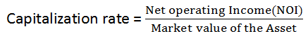

Understanding real estate valuation is crucial for investors, developers, and other stakeholders in the property market. It forms the basis for making informed financial decisions, assessing risks, and maximizing returns on investment. A key component in this valuation process is the capitalization rate, or cap rate, which measures the expected return on a real estate investment property relative to its purchase price. This is calculated by dividing the property's net operating income (NOI) by its current market value. The cap rate provides a snapshot of a property's potential profitability and helps investors compare different investment opportunities.

Recent advancements in technology have introduced algorithmic trading methods to the calculation of cap rates, adding a layer of precision and efficiency to traditional approaches. Innovations in algorithmic trading allow for real-time analysis and adjustments to cap rate estimations based on market dynamics and historical data trends. These techniques employ complex mathematical models and computational power to predict shifts in cap rates with enhanced accuracy, offering investors a competitive edge in decision-making.



The primary aim of this article is to explore the interplay between terminal capitalization rates, real estate valuation, and algorithmic trading. We will examine how terminal cap rates — which estimate a property's value at the end of a holding period — differ from initial cap rates and how they are critical for long-term investment strategy. Additionally, we will discuss the broader implications of cap rates on real estate valuation, delve into the integration of algorithmic trading methodologies, and address the challenges and future opportunities these innovations present.

This article is structured to first provide an understanding of capitalization rates and their significance in real estate. We will then move on to explain the process of calculating terminal capitalization rates and their role in property assessments. Following that, the article will discuss the impact of cap rates on real estate valuation and how investors utilize them. The integration of algorithmic trading within this context will be explored, highlighting its benefits and limitations. Finally, we will consider future trends in cap rate calculations and the role of emerging technologies in shaping real estate markets.

## Table of Contents

## Understanding Capitalization Rates

Capitalization rates, often referred to as cap rates, play a crucial role in real estate valuation by providing a simple yet powerful metric for evaluating potential returns on investment properties. The cap rate is defined as the ratio of a property's net operating income (NOI) to its current market value or purchase price. Mathematically, it is expressed as:

$$
\text{Cap Rate} = \frac{\text{Net Operating Income (NOI)}}{\text{Property Value}} \times 100\%
$$

This metric is significant because it allows investors to quickly assess the profitability and risk associated with real estate investments. A higher cap rate indicates a potentially higher return on investment but may also suggest higher risk, while a lower cap rate typically signifies a more stable investment with lower returns.

Several factors influence capitalization rates, including the type of property, its location, and prevailing economic conditions. 

1. **Property Type**: Different types of properties typically carry different cap rates. For instance, commercial properties, such as office buildings and retail spaces, often have different risk profiles and cash flow expectations compared to residential properties. Consequently, their cap rates vary. Generally, commercial properties may have higher cap rates due to higher risks and management complexities.

2. **Location**: The location of a property significantly impacts its cap rate. Properties in prime locations, such as urban centers with high demand and limited availability, typically have lower cap rates. This is because they are perceived as less risky and more likely to generate consistent income. Conversely, properties in less desirable or emerging neighborhoods may command higher cap rates to compensate for increased risk.

3. **Economic Conditions**: Broader economic conditions, including interest rates, inflation, and market volatility, also affect cap rates. In a low-interest-rate environment, investors might accept lower cap rates due to reduced borrowing costs and seek properties as safe investment havens. Conversely, rising interest rates could lead to higher cap rates as borrowing becomes more expensive and investors demand higher returns to offset increased financing costs.

Typical cap rates can vary significantly based on these factors. For example, in major urban centers, prime office buildings might have cap rates between 3% to 5%, reflecting their stable income and high demand. In contrast, retail properties in smaller or economically unstable areas might exhibit cap rates ranging from 7% to 10%, reflecting the higher risk and variability in income.

Understanding and analyzing cap rates aid investors in making informed decisions by providing insights into the relative value and risk of different properties. This analysis is integral to devising investment strategies and managing portfolios effectively.

## Calculating Terminal Capitalization Rate

The terminal capitalization rate is a key concept in real estate valuation, representing the anticipated rate of return on a property at the end of an investment horizon. It contrasts with the going-in cap rate, which is calculated at the acquisition or initial investment phase. While the going-in cap rate helps investors assess the initial yield of a property, the terminal cap rate is crucial for forecasting the property's future resale value. It aids in estimating the property's worth once it exits the current ownership cycle, typically at the conclusion of a pre-defined holding period.

The terminal cap rate plays an integral role in calculating the property's future value. This estimation impacts decision-making related to long-term investment strategies and financial planning. It factors into the discounted cash flow (DCF) analysis, which is widely used to ascertain a property's value based on projected income streams over the investment period. In practice, the terminal value is often calculated using the formula:

$$
\text{Terminal Value} = \frac{\text{Net Operating Income}_{\text{end}}}{\text{Terminal Cap Rate}}
$$

Here, $\text{Net Operating Income}_{\text{end}}$ represents the anticipated income at the conclusion of the holding period.

Estimating terminal cap rates involves methodologies that consider a range of influences. Analysts often start by reviewing historical cap rate trends and current market conditions to derive an initial estimate. Economic indicators, such as interest rates and inflation forecasts, are integrated into these calculations to refine accuracy. Industry reports and comparable property transactions offer additional insight, serving as benchmarks for assessing the reasonableness of the estimated terminal cap rate.

When determining terminal cap rates, several assumptions and considerations are typically addressed. Foremost is the expectation of market stability or change over the investment horizon, as significant economic shifts can dramatically affect cap rates. Analysts must also consider the property's anticipated future condition and marketability, as depreciation or significant improvements can alter its attractiveness to future buyers. Furthermore, the choice of cap rate often encapsulates assumptions about future risk perceptions, [liquidity](/wiki/liquidity-risk-premium) conditions in the real estate market, and potential changes in regulatory environments.

Overall, accurately estimating terminal capitalization rates requires a balance between historical data analysis, current market conditions, and forward-looking economic predictions. Given its critical role in determining future property values, a precise estimate of the terminal cap rate can significantly influence the overall success of a real estate investment strategy.

## Real Estate Valuation: The Role of Cap Rates

Capitalization rates, commonly referred to as cap rates, play a crucial role in real estate valuation. They serve as a metric to evaluate the potential returns from an investment property. The relationship between cap rates and net operating income (NOI) is fundamental to this assessment process. Mathematically, the cap rate is defined as the ratio of the NOI to the current market value or purchase price of the property:

$$
\text{Cap Rate} = \frac{\text{NOI}}{\text{Property Value}}
$$

Where:
- **NOI** (Net Operating Income) is the annual income generated by the property after deducting all operational expenses, excluding financing costs and taxes.
- **Property Value** is the current market price or the acquisition cost of the real estate asset.

The primary utility of the cap rate is to provide a standardized measure for comparing the profitability of different properties. A higher cap rate indicates a potentially higher return on investment, assuming all other factors remain constant.

**Fluctuations in Cap Rates and Property Valuations**

Fluctuations in cap rates can significantly impact property valuations. For instance, when cap rates decrease, it often signals a rise in property values. This is because a lower cap rate implies a higher valuation for a given NOI, reflecting a competitive market where investors are willing to accept lower returns due to perceived lower risks associated with the asset. Conversely, an increase in cap rates usually suggests declining property valuations, as investors demand higher returns, possibly due to increased risk or changes in market conditions.

The sensitivity of property valuations to changes in cap rates highlights their importance in real estate investment decisions. Investors must consider economic factors, such as interest rates and regional economic health, which can influence cap rate movements. For example, rising interest rates often lead to increasing cap rates, negatively affecting property values as borrowing costs climb and investment becomes riskier.

**Investor Utilization of Cap Rate Data**

Investors rely heavily on cap rate data when assessing potential real estate investments. Cap rates assist investors in determining whether a property is priced appropriately compared to similar properties in a given market. They also offer insights into expected cash flows relative to the purchase price, aiding investors in making informed decisions about their investment strategies.

Investors might adjust their expectations based on cap rate trends. In thriving markets with robust economic growth, cap rates may compress as property values surge, prompting strategic decisions such as acquiring properties with lower initial yields but higher potential for appreciation. Conversely, in markets showing signs of distress or increased uncertainty, investors might seek properties with higher cap rates to cushion against potential valuation declines.

In conclusion, understanding the role of cap rates in real estate valuation is key for investors looking to maximize returns while managing risk. Cap rates not only offer a window into the current investment landscape but also enable investors to anticipate market shifts and adapt their investment strategies accordingly.

## Integration of Algorithmic Trading in Real Estate Valuation

Algorithmic trading, commonly associated with stock and financial markets, has found increasing relevance within the real estate sector due to its ability to process large volumes of data with precision and speed. By employing algorithmic models, real estate professionals can significantly enhance the accuracy and speed of capitalization (cap) rate forecasting. These algorithmic models leverage a multitude of data points, including historical market data, economic indicators, and property-specific information, to develop more precise predictions of cap rates. 

Algorithmic models can apply statistical techniques such as regression analysis, [machine learning](/wiki/machine-learning) algorithms, and [artificial intelligence](/wiki/ai-artificial-intelligence) to identify patterns and trends that may not be apparent through traditional analysis methods. For instance, linear regression can be used to predict cap rates by considering variables like interest rates, GDP growth, and vacancy rates. A regression model for cap rate prediction might take the following form:

$$

 Cap\_Rate = \beta_0 + \beta_1 \times Interest\_Rate + \beta_2 \times GDP\_Growth + \beta_3 \times Vacancy\_Rate + \epsilon
$$

where $\beta_0$ is the intercept, $\beta_1, \beta_2, \beta_3$ are coefficients of the predictors, and $\epsilon$ is the error term.

The application of [algorithmic trading](/wiki/algorithmic-trading) in real estate valuation confers multiple benefits, particularly in terms of real-time market analysis and informed decision-making. Algorithms can continuously ingest and process live data feeds, enabling investors to respond instantly to market changes. For example, if a sudden economic shift impacts interest rates, an algorithmic model can quickly recalibrate cap rate forecasts, aiding investors in reevaluating their portfolios accordingly.

Case studies illustrate the transformative impact of algorithmic trading on real estate investments. For example, certain hedge funds have successfully integrated algorithmic strategies to optimize their property portfolios, achieving higher returns by swiftly adjusting their exposure based on real-time cap rate forecasts. In another instance, real estate investment trusts (REITs) have utilized algorithmic models to balance asset allocation by simulating various market scenarios and identifying optimal investment strategies.

In summary, the integration of algorithmic trading within real estate valuation is revolutionizing how market participants forecast cap rates and make investment decisions. By harnessing advanced computational techniques, investors and developers can gain a competitive edge through more accurate data analysis and faster response times to market dynamics.

## Challenges and Considerations

Predicting terminal capitalization rates (cap rates) poses several challenges, largely due to inherent market complexities and the dynamic nature of the economic environment. Terminal cap rates, which estimate property value at the end of a holding period, depend on future market conditions that are often unpredictable. The inability to accurately forecast these conditions makes it difficult to predict terminal cap rates with precision.

### Algorithmic Trading in Real Estate: Potential Limitations

Algorithmic trading, while revolutionizing various aspects of financial markets, faces distinctive limitations when applied to real estate valuation. One major limitation surrounds data quality. Real estate markets are not as liquid as stock markets and often lack the breadth of historical data available for predictive analytics. This paucity of high-quality, reliable data can undermine the effectiveness of algorithmic models, leading to inaccurate forecasts.

Moreover, the real estate market is influenced by numerous unpredictable factors, including changes in economic policy, interest rates, and zoning laws. Algorithmic models may struggle to accommodate these idiosyncratic influences due to the complexity and variability of their impact. For instance, sudden policy shifts or economic events can render previous models obsolete or inaccurate, presenting considerable risk to investors relying solely on algorithmic predictions.

### Ethical Considerations and Need for Transparency

The deployment of algorithmic trading in real estate also raises ethical concerns. Transparency in algorithmic models is essential to foster trust and ensure that predictions are free from bias. Without transparency, there is a risk that algorithms may inadvertently perpetuate existing biases or inequities present in the data.

Furthermore, ethical considerations involve the potential misuse of algorithms in manipulating market prices or exploiting information asymmetries. The opacity of advanced algorithms means that few individuals fully understand their decision-making processes, potentially leading to skepticism and resistance from industry stakeholders.

To mitigate these ethical concerns, stakeholders must ensure that algorithmic models are transparent, interpretable, and subject to regular audits. Additionally, implementing standardized frameworks for evaluating the ethical implications of algorithmic decisions can help maintain integrity and trust in their application within the real estate sector.

In summary, while algorithmic trading offers promising advancements for real estate valuation, significant challenges regarding data quality, market unpredictability, and ethical transparency must be addressed. The ongoing integration of these technologies necessitates a careful balancing act between innovation and reliability to enhance decision-making processes in real estate markets.

## Future Trends and Opportunities

As technological advancements continue to reshape the real estate industry, the calculation of capitalization rates (cap rates) and real estate valuation processes are undergoing significant transformations. Emerging technologies, especially artificial intelligence (AI) and machine learning, are poised to revolutionize algorithmic trading and real estate valuations. These innovations offer the potential to enhance precision, efficiency, and adaptability in market assessments, creating a dynamic shift in how valuations are approached.

AI and machine learning can process vast datasets rapidly, providing more accurate predictions and in-depth market insights. For instance, machine learning algorithms can analyze historical data to detect trends and predict future cap rates with precision. By incorporating variables such as economic indicators, regional developments, and historical trends, AI models can forecast changes in cap rates and market conditions. A simple example of a machine learning model used for predicting cap rates could be a Python script utilizing linear regression:

```python
import numpy as np
from sklearn.linear_model import LinearRegression

# Example data: historical cap rates and influencing factors
X = np.array([[2.5, 3.0, 4.1], [2.7, 3.2, 4.0], [3.0, 3.5, 4.2]])  # features like interest rates, inflation, GDP growth
y = np.array([5.0, 5.1, 5.3])  # cap rates

# Create a model and train it
model = LinearRegression().fit(X, y)

# Predict future cap rates
future_data = np.array([[2.9, 3.3, 4.3]])
predicted_cap_rate = model.predict(future_data)

print(f"Predicted Cap Rate: {predicted_cap_rate[0]:.2f}")
```

The integration of AI also facilitates real-time market analysis. Algorithmic trading systems, driven by AI, can execute trades and provide investment recommendations at speeds unmatched by human traders. This rapid adaptation allows investors to respond to market fluctuations swiftly, optimizing their investment strategies based on the latest data.

For investors and developers, the evolving landscape presents several opportunities. Enhanced data analytics enables more informed decision-making, reducing risks and identifying profitable investments with higher confidence. Developers can leverage predictive models to understand future demands and optimize their projects accordingly. Moreover, AI-driven models can assist in evaluating environmental impacts and sustainability considerations, crucial for long-term asset valuation and development viability.

In conclusion, as AI and machine learning continue to advance, the real estate sector can expect more accurate and efficient valuation methods. These technologies offer a competitive edge to investors and developers who embrace them, opening up new possibilities for growth and innovation in an ever-evolving market. By harnessing these tools, stakeholders can adapt to changing conditions, aligning their strategies with future trends to capitalize on emerging opportunities.

## Conclusion

In summarizing the discussion, it is essential to recognize the interconnectedness of terminal capitalization rates and algorithmic trading within contemporary real estate markets. Terminal cap rates serve as pivotal indicators in estimating the potential future value of properties, enabling investors to make informed decisions about the longevity of their investments. Accurate prediction of these rates can significantly influence market valuations and investor strategies, highlighting their critical role in financial forecasting and planning.

Furthermore, the integration of algorithmic trading has transformed how cap rates are analyzed and applied, allowing for enhanced precision and real-time data processing. By embracing such technological advancements, stakeholders in the real estate sector can gain a competitive edge through more agile decision-making processes and the ability to swiftly adapt to market changes. This integration enhances the quality of forecasts and reduces the latency inherent in traditional analytical approaches.

To remain competitive, it is imperative for investors and industry professionals to stay abreast of ongoing innovations and trends in real estate valuation practices. Emerging technologies such as artificial intelligence and machine learning promise to further refine these processes, offering new opportunities for efficiency and insight.

Finally, while embracing technological innovations, it is crucial to maintain a balance with established valuation practices. Traditional methodologies provide a foundational understanding of market dynamics and have stood the test of time. A harmonious approach, combining the strengths of both traditional and advanced methods, ensures a robust, adaptable strategy in an ever-evolving market landscape. This balance will help navigate the complexities of valuation with confidence and foresight, fostering sustainable growth and informed investment decisions.

## References & Further Reading

[1]: Geltner, D., Miller, N., Clayton, J., & Eichholtz, P. (2007). ["Commercial Real Estate Analysis and Investments,"](https://www.researchgate.net/publication/245702364_Commercial_Real_Estate_Analysis_and_Investments) 2nd Edition. South-Western Educational Publishing.

[2]: Damodaran, Aswath. (2002). ["Investment Valuation: Tools and Techniques for Determining the Value of Any Asset,"](https://www.amazon.com/Investment-Valuation-Tools-Techniques-Determining/dp/111801152X) 2nd Edition. Wiley Finance.

[3]: Fabozzi, Frank J. (2012). ["Bond Markets, Analysis, and Strategies,"](https://books.google.com/books/about/Bond_Markets_Analysis_and_Strategies_ten.html?id=bQpNEAAAQBAJ) 8th Edition. Pearson.

[4]: ["Algorithmic Trading: Winning Strategies and Their Rationale"](https://www.wiley.com/en-us/Algorithmic+Trading%3A+Winning+Strategies+and+Their+Rationale-p-9781118460146) by Ernest P. Chan

[5]: Lopez de Prado, Marcos. (2018). ["Advances in Financial Machine Learning."](https://www.amazon.com/Advances-Financial-Machine-Learning-Marcos/dp/1119482089) Wiley Finance.